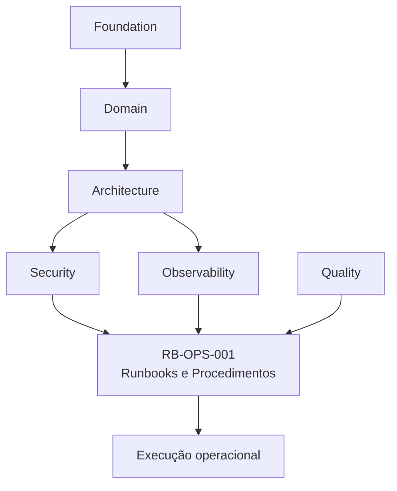
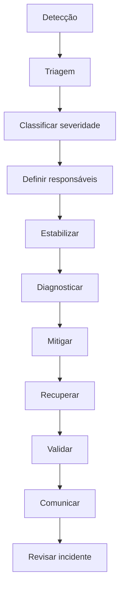

---

id: RB-OPS-001

title: Runbooks e Procedimentos Operacionais
description: Define os runbooks, procedimentos operacionais, fluxos de resposta a incidentes, mitigação, recuperação, replay, rollback, comunicação, escalonamento e validação operacional do RouteBook.

document_type: operations
owner: Platform

status: Draft
version: "0.1.0"

created: "2026-07-19"
last_updated: null

authors:

- RouteBook Team

tags:

- operations
- runbooks
- incident-response
- recovery
- rollback
- outbox
- inbox
- dead-letter
- jobs
- integrations
- database
- backups
- artificial-intelligence
- security
- observability
- diagrams
- mermaid

related_documents:

- RB-CORE-0001
- RB-CORE-0002
- RB-CORE-0003
- RB-CORE-0004
- RB-DOM-001
- RB-DOM-002
- RB-DOM-003
- RB-DOM-004
- RB-ARC-001
- RB-ARC-002
- RB-ARC-003
- RB-ARC-004
- RB-ARC-005
- RB-DATA-001
- RB-API-001
- RB-SEC-001
- RB-OBS-001
- RB-QA-001

prerequisites:

- RB-CORE-0004
- RB-ARC-001
- RB-ARC-002
- RB-ARC-003
- RB-ARC-004
- RB-ARC-005
- RB-SEC-001
- RB-OBS-001
- RB-QA-001

next_documents:

- RB-SRE-001
- RB-AI-001
- RB-QA-002
- RB-OPS-002

ai_context:
priority: critical
index: true
---

# RouteBook — Runbooks e Procedimentos Operacionais

## Parte I — Fundamentos

### 1. Propósito deste documento

Este documento define os procedimentos operacionais oficiais do RouteBook.

Seu objetivo é transformar os princípios de observabilidade, segurança, confiabilidade e qualidade em ações executáveis para:

* detectar incidentes;
* realizar triagem;
* classificar impacto;
* estabilizar o sistema;
* mitigar falhas;
* restaurar capacidades;
* executar rollback;
* reprocessar mensagens;
* recuperar jobs;
* restaurar dados;
* responder a falhas de integrações;
* responder a falhas de inteligência artificial;
* responder a incidentes de segurança;
* validar recuperação;
* comunicar o estado operacional;
* registrar decisões;
* aprender com incidentes.

Este documento deverá orientar:

* Platform;
* Site Reliability Engineering;
* Backend;
* Frontend;
* Data;
* Security;
* Artificial Intelligence;
* Quality Engineering;
* Product;
* Support;
* agentes operacionais;
* agentes de engenharia.

Este documento não substitui:

* documentação de arquitetura;
* políticas de segurança;
* plano de continuidade;
* playbooks jurídicos;
* contratos de SLA;
* documentação específica de fornecedores;
* procedimentos internos de recursos humanos;
* planos de resposta externos ao RouteBook.

---

### 2. Autoridade documental

Os procedimentos deverão respeitar:

* RouteBook Bible;
* Linguagem Ubíqua;
* Modelo de Domínio;
* Regras e Invariantes;
* Arquitetura de Módulos;
* Arquitetura de Integrações;
* Arquitetura de Dados;
* Arquitetura de IA e Agentes;
* políticas de segurança;
* estratégia de observabilidade;
* estratégia de qualidade.



Nenhum runbook poderá:

* redefinir regras;
* alterar ownership;
* contornar autorização;
* contornar auditoria;
* transformar projeção em fonte canônica;
* ignorar idempotência;
* ignorar restrições;
* aplicar ações destrutivas sem proteção.

---

### 3. Princípio central

A resposta operacional deverá priorizar segurança, redução de impacto e recuperação verificável.

```text
Detectar
→ compreender impacto
→ estabilizar
→ mitigar
→ recuperar
→ validar
→ comunicar
→ aprender
```

---

### 4. Runbook

Runbook é um procedimento operacional prescritivo para tratar uma condição conhecida.

Um runbook deverá responder:

* qual sintoma foi detectado;
* qual impacto é esperado;
* quais evidências consultar;
* quais ações são seguras;
* quais ações exigem aprovação;
* como mitigar;
* como recuperar;
* como validar;
* como escalar;
* como encerrar.

---

### 5. Procedimento operacional

Procedimento operacional é uma sequência controlada de ações que pode existir independentemente de um incidente.

Exemplos:

* replay de mensagens;
* restauração de backup;
* rollback de deployment;
* rotação de secret;
* rebuild de projeção;
* reexecução de job;
* desativação de integração;
* ativação de fallback.

---

### 6. Playbook

Playbook é um conjunto mais amplo de procedimentos para uma classe de incidente.

Exemplo:

```text
Playbook de indisponibilidade
├── API
├── banco
├── fila
├── integração externa
└── AI Provider
```

---

### 7. Objetivos

Os runbooks deverão:

1. reduzir tempo de diagnóstico;
2. reduzir tempo de mitigação;
3. reduzir dependência de conhecimento informal;
4. evitar ações perigosas;
5. preservar evidências;
6. manter rastreabilidade;
7. proteger dados;
8. padronizar comunicação;
9. permitir automação segura;
10. apoiar treinamento;
11. permitir validação periódica;
12. reduzir recorrência.

---

## Parte II — Princípios operacionais

### 8. Segurança antes da velocidade

A recuperação não deverá ampliar o impacto.

Antes de executar uma ação, avaliar:

* reversibilidade;
* escopo;
* autorização;
* impacto em dados;
* impacto entre Accounts;
* dependências;
* capacidade de rollback;
* evidências disponíveis.

---

### 9. Mitigação antes da causa raiz

Durante incidente ativo, a prioridade deverá ser:

1. proteger dados;
2. reduzir impacto;
3. restaurar capacidade;
4. preservar evidência;
5. investigar causa raiz.

---

### 10. Menor mudança possível

A ação inicial deverá utilizar o menor escopo capaz de reduzir o impacto.

Preferir:

* desativar uma capacidade;
* reduzir tráfego;
* ativar fallback;
* interromper um consumer;
* pausar um job;
* reverter um deployment.

Evitar mudanças amplas sem diagnóstico.

---

### 11. Reversibilidade

Ações operacionais deverão ser reversíveis sempre que possível.

---

### 12. Evidência antes da ação

Ação crítica deverá ser sustentada por sinais como:

* métrica;
* trace;
* log;
* Audit Entry;
* evento;
* dashboard;
* health check;
* correlação;
* reprodução controlada.

---

### 13. Um responsável por coordenação

Todo incidente relevante deverá possuir um coordenador identificável.

---

### 14. Comunicação factual

Não comunicar causa como confirmada enquanto for apenas hipótese.

Utilizar:

* fato observado;
* impacto conhecido;
* ação em andamento;
* próxima atualização.

---

### 15. Ações destrutivas

Ações destrutivas deverão exigir:

* autorização explícita;
* confirmação;
* escopo;
* backup ou evidência de recuperação;
* registro de auditoria;
* segundo revisor quando aplicável.

---

### 16. Idempotência

Reexecuções deverão preservar idempotência.

---

### 17. Isolamento

Ações deverão ser limitadas por:

* Account;
* Trip;
* módulo;
* consumer;
* job;
* intervalo temporal;
* eventId;
* correlationId.

---

### 18. Automação supervisionada

Automação poderá executar ações de baixo risco.

Ações críticas deverão manter supervisão humana.

---

## Parte III — Estrutura padrão de runbook

### 19. Template obrigatório

Todo runbook deverá possuir:

```text
Identificação
Objetivo
Owner
Escopo
Severidade potencial
Pré-requisitos
Sinais e sintomas
Impacto
Dependências
Diagnóstico
Mitigação
Recuperação
Validação
Rollback
Escalonamento
Comunicação
Riscos
Auditoria
Referências
Histórico de testes
```

---

### 20. Identificação

Campos mínimos:

```text
runbookId
title
owner
version
status
lastTestedAt
reviewFrequency
```

---

### 21. Pré-requisitos

Podem incluir:

* acesso a dashboards;
* acesso a logs;
* permissão de operação;
* credenciais emergenciais;
* conhecimento do ambiente;
* backup disponível;
* feature flag;
* ferramenta de replay;
* procedimento de aprovação.

---

### 22. Sinais e sintomas

Deverão descrever sinais observáveis.

Exemplo:

```text
- p95 da API acima do SLO;
- taxa de erro superior ao limite;
- conexões do banco saturadas;
- backlog da Outbox crescente;
- AI Provider retornando timeout;
- Projection lag acima de 10 minutos.
```

---

### 23. Diagnóstico

Deverá seguir uma sequência do mais seguro para o mais invasivo.

---

### 24. Mitigação

Mitigação reduz impacto sem necessariamente corrigir a causa.

---

### 25. Recuperação

Recuperação restaura o estado esperado.

---

### 26. Validação

Toda recuperação deverá possuir critérios objetivos.

---

### 27. Rollback

O runbook deverá declarar como desfazer a ação ou quando rollback não é possível.

---

### 28. Escalonamento

Deverá indicar:

* quando escalar;
* para quem;
* quais evidências anexar;
* qual severidade;
* qual decisão precisa ser tomada.

---

### 29. Comunicação

Deverá definir:

* público;
* frequência;
* canal;
* template;
* responsável.

---

### 30. Histórico de testes

Todo runbook crítico deverá registrar:

* data do teste;
* ambiente;
* resultado;
* falhas encontradas;
* melhorias;
* responsável.

---

## Parte IV — Classificação de incidentes

### 31. Incidente operacional

Incidente operacional é uma condição não planejada que afeta:

* disponibilidade;
* desempenho;
* segurança;
* integridade;
* privacidade;
* experiência;
* custo;
* operação.

---

### 32. Severidades

#### SEV-1 — Crítico

Exemplos:

* indisponibilidade ampla;
* exposição de dados;
* acesso entre Accounts;
* corrupção de dados;
* perda significativa;
* credencial crítica exposta;
* impossibilidade de recuperar operação essencial.

#### SEV-2 — Alto

Exemplos:

* jornada principal degradada;
* API com alta falha;
* Proposal não aplicável em larga escala;
* fila crítica parada;
* banco em saturação severa;
* Provider essencial indisponível sem fallback adequado.

#### SEV-3 — Moderado

Exemplos:

* falha parcial;
* impacto limitado;
* workaround disponível;
* integração opcional indisponível;
* job atrasado sem impacto imediato.

#### SEV-4 — Baixo

Exemplos:

* condição não urgente;
* degradação pequena;
* alerta preventivo;
* melhoria operacional.

---

### 33. Dimensões de classificação

Considerar:

* número de Accounts afetadas;
* duração;
* tipo de dado;
* criticidade da jornada;
* reversibilidade;
* risco de expansão;
* segurança;
* impacto financeiro;
* impacto reputacional.

---

### 34. Matriz inicial

| Condição                                  | Severidade inicial |
| ----------------------------------------- | ------------------ |
| acesso cross-account confirmado           | SEV-1              |
| perda ou corrupção de dados               | SEV-1              |
| API totalmente indisponível               | SEV-1              |
| banco indisponível                        | SEV-1              |
| fila crítica parada com backlog crescente | SEV-2              |
| AI Provider indisponível com fallback     | SEV-3              |
| AI Provider indisponível sem fallback     | SEV-2              |
| Projection lag sem impacto canônico       | SEV-3              |
| job não crítico atrasado                  | SEV-4              |
| backup falhou uma vez                     | SEV-3              |
| múltiplos backups falhando                | SEV-2              |

---

### 35. Reclassificação

A severidade deverá ser revista conforme novas evidências.

---

## Parte V — Papéis na resposta

### 36. Incident Commander

Responsável por:

* coordenar;
* definir prioridades;
* distribuir tarefas;
* evitar ações conflitantes;
* aprovar mudanças de risco;
* garantir comunicação;
* decidir encerramento.

---

### 37. Technical Lead

Responsável por:

* diagnóstico técnico;
* hipóteses;
* plano de mitigação;
* execução técnica;
* validação.

---

### 38. Communications Lead

Responsável por:

* comunicação interna;
* comunicação externa;
* registro de atualizações;
* consistência da mensagem.

---

### 39. Scribe

Responsável por:

* linha do tempo;
* decisões;
* evidências;
* ações;
* mudanças de severidade.

---

### 40. Security Lead

Obrigatório quando houver:

* possível vazamento;
* acesso indevido;
* secret exposto;
* abuso;
* alteração não autorizada.

---

### 41. Data Lead

Obrigatório quando houver:

* corrupção;
* perda;
* migração falha;
* restauração;
* inconsistência;
* backfill de risco.

---

### 42. Acúmulo de papéis

Em equipe pequena, uma pessoa poderá assumir múltiplos papéis, desde que a coordenação permaneça clara.

---

## Parte VI — Fluxo de resposta a incidentes

### 43. Fluxo geral



---

### 44. Detecção

Fontes:

* alerta;
* suporte;
* Product;
* synthetic monitoring;
* métrica;
* log;
* trace;
* segurança;
* fornecedor;
* Usuário.

---

### 45. Triagem inicial

Confirmar:

* o sinal é real;
* qual ambiente;
* qual serviço;
* qual versão;
* quando começou;
* qual impacto;
* qual escopo;
* se há mudança recente;
* se existe runbook.

---

### 46. Estabilização

Possíveis ações:

* congelar deployments;
* pausar jobs;
* limitar tráfego;
* desativar feature;
* ativar fallback;
* retirar instância;
* interromper consumer;
* bloquear credencial;
* revogar secret.

---

### 47. Diagnóstico

Deverá utilizar:

* dashboards;
* traces;
* logs;
* deployments;
* métricas;
* banco;
* fila;
* dependências;
* correlationId.

---

### 48. Hipóteses

Cada hipótese deverá possuir:

* evidência;
* teste;
* risco;
* resultado;
* status.

---

### 49. Mitigação

Deverá ser escolhida pela relação:

```text
redução de impacto
÷
risco da ação
```

---

### 50. Recuperação

Deverá incluir estado funcional e não apenas técnico.

---

### 51. Validação

Confirmar:

* SLI recuperado;
* backlog diminuindo;
* erros normalizados;
* jornadas funcionando;
* dados consistentes;
* segurança preservada;
* sem efeitos colaterais.

---

### 52. Encerramento

Somente após:

* impacto encerrado;
* estabilidade observada;
* comunicação concluída;
* ações registradas;
* owner do postmortem definido.

---

## Parte VII — Comunicação operacional

### 53. Princípios

Comunicação deverá ser:

* factual;
* clara;
* curta;
* atualizada;
* sem especulação;
* adequada ao público.

---

### 54. Atualização inicial

Template:

```text
Estamos investigando uma degradação em [capacidade].
Impacto conhecido: [descrição].
Início estimado: [horário].
Ações em andamento: [resumo].
Próxima atualização: [horário].
```

---

### 55. Atualização intermediária

```text
O incidente permanece ativo.
Impacto atual: [descrição].
Causa: [confirmada ou ainda em investigação].
Mitigação aplicada: [ação].
Resultado observado: [resultado].
Próxima atualização: [horário].
```

---

### 56. Recuperação

```text
A capacidade foi restaurada em [horário].
Estamos monitorando a estabilidade e validando possíveis efeitos residuais.
Impacto total conhecido: [descrição].
Uma revisão será realizada.
```

---

### 57. Comunicação externa

Deverá evitar:

* detalhes sensíveis;
* hipóteses não confirmadas;
* culpabilização;
* promessas sem evidência;
* termos internos sem explicação.

---

## Parte VIII — Runbook: API indisponível

### 58. Identificação

```text
runbookId: RB-RUN-API-001
owner: Platform
severidade potencial: SEV-1
```

---

### 59. Sinais

* health check falhando;
* erro 5xx elevado;
* tráfego sem resposta;
* latência extrema;
* instâncias reiniciando;
* erro de startup.

---

### 60. Diagnóstico

1. confirmar ambiente;
2. verificar deployment recente;
3. verificar liveness e readiness;
4. verificar saturação;
5. verificar banco;
6. verificar configuração;
7. verificar secrets;
8. verificar dependências críticas;
9. consultar traces;
10. identificar versão afetada.

---

### 61. Mitigação

Opções:

* rollback;
* retirar instância defeituosa;
* aumentar capacidade;
* desativar feature;
* ativar modo degradado;
* bloquear rota problemática.

---

### 62. Recuperação

* restaurar versão estável;
* validar migrations;
* reativar tráfego gradualmente;
* executar smoke;
* observar SLO.

---

### 63. Validação

* readiness saudável;
* taxa de erro normal;
* p95 dentro do esperado;
* jornadas críticas aprovadas;
* sem backlog crescente.

---

### 64. Escalonamento

Escalar imediatamente para:

* Platform;
* Backend;
* Database;
* Security, se houver suspeita de acesso indevido.

---

## Parte IX — Runbook: latência elevada

### 65. Identificação

```text
runbookId: RB-RUN-PERF-001
owner: Platform
severidade potencial: SEV-2
```

---

### 66. Sinais

* p95 ou p99 acima do SLO;
* timeouts;
* pool saturado;
* fila crescendo;
* consultas lentas;
* Provider externo degradado.

---

### 67. Diagnóstico

Separar latência em:

* frontend;
* API;
* Application;
* banco;
* cache;
* integração;
* IA;
* fila;
* job.

---

### 68. Ações

1. analisar trace lento;
2. verificar mudança recente;
3. verificar saturação;
4. identificar rota;
5. identificar query;
6. verificar cache;
7. verificar retries;
8. verificar Provider.

---

### 69. Mitigação

* limitar operação custosa;
* ativar cache;
* reduzir timeout em cascata;
* desativar feature;
* escalar worker;
* ativar fallback;
* interromper job concorrente.

---

### 70. Validação

* percentis recuperados;
* erro reduzido;
* backlog estável;
* recursos abaixo do limite seguro.

---

## Parte X — Runbook: banco de dados saturado

### 71. Identificação

```text
runbookId: RB-RUN-DB-001
owner: Platform e Data
severidade potencial: SEV-1
```

---

### 72. Sinais

* conexões esgotadas;
* CPU elevada;
* lock contention;
* replica lag;
* disk pressure;
* consultas lentas;
* transações longas;
* deadlocks.

---

### 73. Diagnóstico

1. verificar conexões;
2. verificar queries ativas;
3. identificar locks;
4. verificar transações longas;
5. verificar deployment;
6. verificar job pesado;
7. verificar migration;
8. verificar storage;
9. verificar replica;
10. verificar pool.

---

### 74. Mitigação

* pausar job;
* interromper query conhecida;
* reduzir concorrência;
* limitar tráfego;
* aumentar capacidade;
* reverter deployment;
* ajustar pool temporariamente;
* encaminhar leitura para réplica.

---

### 75. Ações proibidas sem aprovação

* matar transações desconhecidas;
* remover constraint;
* desativar integridade;
* executar delete amplo;
* alterar schema em emergência sem plano;
* restaurar backup sobre banco ativo.

---

### 76. Recuperação

* normalizar carga;
* validar integridade;
* verificar Outbox;
* verificar versões;
* reconstruir projeções se necessário.

---

## Parte XI — Runbook: migration falhou

### 77. Identificação

```text
runbookId: RB-RUN-DB-002
owner: Data e Backend
severidade potencial: SEV-1 ou SEV-2
```

---

### 78. Sinais

* deployment interrompido;
* erro de schema;
* aplicação não inicia;
* lock prolongado;
* migration parcial;
* incompatibilidade entre versões.

---

### 79. Diagnóstico

Confirmar:

* migration aplicada;
* migration parcial;
* transação aberta;
* versão do schema;
* compatibilidade da aplicação;
* existência de backup;
* impacto em dados.

---

### 80. Mitigação

* interromper deployment;
* impedir novas instâncias;
* manter versão anterior;
* finalizar ou reverter migration conforme plano;
* ativar compatibilidade temporária.

---

### 81. Recuperação

Preferir estratégias:

* expand and contract;
* forward fix;
* rollback apenas quando seguro;
* backfill separado;
* rebuild de índices.

---

### 82. Validação

* schema correto;
* aplicação inicia;
* leituras e escritas funcionam;
* constraints válidas;
* integridade preservada;
* tempo de resposta normal.

---

## Parte XII — Runbook: Outbox acumulada

### 83. Identificação

```text
runbookId: RB-RUN-MSG-001
owner: Platform
severidade potencial: SEV-2
```

---

### 84. Sinais

* pending messages crescente;
* oldest pending elevado;
* falhas de publicação;
* publisher parado;
* broker indisponível.

---

### 85. Diagnóstico

1. verificar publisher;
2. verificar broker;
3. verificar credenciais;
4. verificar rate limit;
5. verificar payload inválido;
6. verificar schema;
7. verificar lock;
8. verificar volume;
9. verificar erro recorrente.

---

### 86. Mitigação

* reiniciar publisher;
* aumentar workers;
* pausar origem de alto volume;
* isolar mensagem inválida;
* ativar broker alternativo quando previsto;
* corrigir credencial.

---

### 87. Recuperação

* retomar publicação;
* observar redução do backlog;
* validar ordem quando necessária;
* verificar duplicidade;
* validar consumers.

---

### 88. Replay

Replay deverá ser limitado por:

* eventId;
* intervalo;
* aggregateId;
* eventType;
* status.

---

## Parte XIII — Runbook: Consumer parado

### 89. Identificação

```text
runbookId: RB-RUN-MSG-002
owner: Platform e módulo consumidor
severidade potencial: SEV-2
```

---

### 90. Sinais

* consumer lag crescente;
* ausência de heartbeat;
* mensagens não processadas;
* retries elevados;
* erros repetidos.

---

### 91. Diagnóstico

* consumer ativo;
* versão;
* credenciais;
* schema;
* mensagem problemática;
* dependência interna;
* lock;
* Inbox;
* capacidade.

---

### 92. Mitigação

* reiniciar consumer;
* reduzir concorrência;
* pausar partição problemática;
* enviar poison message para DLQ;
* reverter versão;
* aumentar workers.

---

### 93. Validação

* consumo retomado;
* lag diminuindo;
* Inbox consistente;
* sem duplicidade de efeito;
* projeções atualizando.

---

## Parte XIV — Runbook: Dead-letter queue crescendo

### 94. Identificação

```text
runbookId: RB-RUN-MSG-003
owner: Platform
severidade potencial: SEV-2 ou SEV-3
```

---

### 95. Diagnóstico

Classificar falhas:

* schema incompatível;
* referência ausente;
* bug de consumer;
* dependência indisponível;
* regra rejeitada;
* dado corrompido;
* mensagem duplicada.

---

### 96. Procedimento

1. congelar replay automático;
2. coletar amostra;
3. agrupar por errorCode;
4. identificar versão;
5. definir correção;
6. testar em ambiente controlado;
7. selecionar escopo;
8. executar replay;
9. monitorar.

---

### 97. Replay seguro

Deverá:

* preservar EventId;
* preservar correlationId;
* utilizar Inbox;
* respeitar idempotência;
* gerar Audit Entry;
* permitir interrupção.

---

### 98. Proibições

Não reprocessar toda a DLQ sem:

* classificação;
* correção;
* escopo;
* validação;
* aprovação.

---

## Parte XV — Procedimento: replay de mensagens

### 99. Pré-condições

* incidente estabilizado;
* causa corrigida;
* consumer validado;
* idempotência confirmada;
* escopo definido;
* autorização obtida.

---

### 100. Etapas

1. selecionar mensagens;
2. registrar filtro;
3. calcular volume;
4. simular quando possível;
5. definir taxa;
6. iniciar lote pequeno;
7. validar efeitos;
8. aumentar gradualmente;
9. monitorar;
10. registrar conclusão.

---

### 101. Critérios de interrupção

Interromper se:

* erro aumentar;
* duplicidade aparecer;
* latência degradar;
* banco saturar;
* regra falhar;
* inconsistência surgir.

---

### 102. Evidência

Registrar:

* operador;
* horário;
* filtro;
* volume;
* taxa;
* resultado;
* falhas;
* eventIds de referência.

---

## Parte XVI — Runbook: job crítico falhando

### 103. Identificação

```text
runbookId: RB-RUN-JOB-001
owner: Platform e módulo proprietário
severidade potencial: SEV-2
```

---

### 104. Sinais

* falha repetida;
* atraso;
* checkpoint parado;
* timeout;
* lock não liberado;
* volume inesperado;
* custo elevado.

---

### 105. Diagnóstico

Verificar:

* jobType;
* jobExecutionId;
* última execução válida;
* checkpoint;
* lock;
* dependências;
* dados problemáticos;
* versão;
* duração;
* tentativas.

---

### 106. Mitigação

* pausar schedule;
* impedir concorrência;
* corrigir dado inválido;
* reduzir lote;
* aumentar timeout com justificativa;
* reverter versão;
* executar manualmente em escopo limitado.

---

### 107. Recuperação

* retomar do checkpoint;
* reexecutar lote;
* validar idempotência;
* confirmar conclusão;
* verificar efeitos.

---

## Parte XVII — Runbook: Projection lag elevado

### 108. Identificação

```text
runbookId: RB-RUN-PROJ-001
owner: Platform e módulo consumidor
severidade potencial: SEV-3
```

---

### 109. Sinais

* read model atrasado;
* interface exibindo estado stale;
* consumer lag;
* eventos não aplicados;
* erro de projector.

---

### 110. Diagnóstico

* Outbox publicada;
* broker entregue;
* consumer processou;
* Inbox;
* projector;
* schema;
* storage;
* versão da projeção.

---

### 111. Mitigação

* exibir estado stale;
* ocultar ação dependente;
* redirecionar para leitura canônica quando seguro;
* reiniciar projector;
* aumentar workers;
* pausar rebuild concorrente.

---

### 112. Rebuild

Rebuild deverá:

* possuir versão;
* usar checkpoint;
* ser idempotente;
* evitar escrita canônica;
* permitir swap controlado;
* validar contagens.

---

## Parte XVIII — Runbook: integração externa indisponível

### 113. Identificação

```text
runbookId: RB-RUN-INT-001
owner: Integrations e Platform
severidade potencial: SEV-2 ou SEV-3
```

---

### 114. Sinais

* timeout;
* erro 5xx;
* circuit breaker aberto;
* rate limit;
* quota esgotada;
* dados stale;
* credencial inválida.

---

### 115. Diagnóstico

* escopo do Provider;
* status externo;
* credenciais;
* quota;
* versão do adapter;
* mudança de contrato;
* rede;
* fallback.

---

### 116. Mitigação

* ativar fallback;
* utilizar cache stale permitido;
* reduzir frequência;
* limitar capacidade;
* desativar função dependente;
* alterar Provider quando autorizado.

---

### 117. Comunicação ao Usuário

Deverá indicar:

* capacidade temporariamente limitada;
* dado possivelmente desatualizado;
* alternativa disponível;
* ausência de confirmação.

---

### 118. Recuperação

* testar Provider;
* fechar circuit breaker gradualmente;
* atualizar dados;
* invalidar cache incorreto;
* monitorar retorno.

---

## Parte XIX — Runbook: AI Provider indisponível

### 119. Identificação

```text
runbookId: RB-RUN-AI-001
owner: Artificial Intelligence e Platform
severidade potencial: SEV-2 ou SEV-3
```

---

### 120. Sinais

* timeout;
* rate limit;
* erro do Provider;
* latência extrema;
* schema inválido em massa;
* autenticação falhando;
* modelo indisponível.

---

### 121. Diagnóstico

Verificar:

* capabilityId;
* Provider;
* modelFamily;
* promptVersion;
* schemaVersion;
* taxa de erro;
* quota;
* credencial;
* mudança recente;
* fallback disponível.

---

### 122. Mitigação

Ordem sugerida:

1. retry controlado;
2. modelo alternativo compatível;
3. Provider alternativo;
4. fallback determinístico;
5. fluxo manual;
6. desativação temporária.

---

### 123. Restrições

Não:

* remover validação;
* aceitar saída sem schema;
* contornar regras;
* elevar autonomia;
* registrar Decision automaticamente;
* aplicar Proposal automaticamente.

---

### 124. Validação

* saída estruturada válida;
* referências válidas;
* regras válidas;
* custo controlado;
* latência aceitável;
* Provenance preservada.

---

## Parte XX — Runbook: custo anormal de IA

### 125. Identificação

```text
runbookId: RB-RUN-AI-002
owner: Artificial Intelligence e Platform
severidade potencial: SEV-2 ou SEV-3
```

---

### 126. Sinais

* custo por capacidade elevado;
* tokens crescendo;
* loop de agente;
* retries excessivos;
* modelo caro sendo usado;
* volume anormal.

---

### 127. Diagnóstico

* capabilityId;
* agentId;
* promptVersion;
* modelFamily;
* toolCallCount;
* contexto;
* retries;
* tráfego;
* possível abuso.

---

### 128. Mitigação

* limitar capacidade;
* reduzir contexto;
* trocar modelo;
* desativar agente;
* reduzir número de etapas;
* aplicar quota;
* ativar fallback;
* bloquear origem abusiva.

---

### 129. Validação

* custo estabilizado;
* qualidade preservada;
* latência aceitável;
* sem impacto em segurança.

---

## Parte XXI — Runbook: saída inválida de IA

### 130. Identificação

```text
runbookId: RB-RUN-AI-003
owner: Artificial Intelligence
severidade potencial: SEV-2 ou SEV-3
```

---

### 131. Sinais

* schema rejection elevada;
* IDs inventados;
* regras violadas;
* tool calls proibidas;
* conteúdo inseguro;
* Proposal inválida.

---

### 132. Diagnóstico

* promptVersion;
* modelFamily;
* schemaVersion;
* contexto;
* validator;
* dataset de regressão;
* mudança recente.

---

### 133. Mitigação

* reverter prompt;
* reverter modelo;
* bloquear capability;
* usar fallback;
* reforçar schema;
* corrigir Context Builder;
* desativar Tool.

---

### 134. Recuperação

* executar Golden Dataset;
* validar segurança;
* validar regras;
* testar múltiplas execuções;
* retomar gradualmente.

---

## Parte XXII — Runbook: backup falhou

### 135. Identificação

```text
runbookId: RB-RUN-BKP-001
owner: Platform e Data
severidade potencial: SEV-2 ou SEV-3
```

---

### 136. Sinais

* job de backup falhou;
* backup incompleto;
* retenção não aplicada;
* criptografia falhou;
* storage indisponível.

---

### 137. Diagnóstico

* último backup válido;
* RPO;
* storage;
* credencial;
* espaço;
* duração;
* logs;
* alteração recente.

---

### 138. Mitigação

* executar backup manual;
* utilizar destino alternativo;
* liberar espaço com segurança;
* corrigir credencial;
* suspender mudanças de alto risco.

---

### 139. Escalonamento

Escalar para SEV-2 se:

* múltiplos backups falharem;
* RPO estiver ameaçado;
* último backup válido estiver fora da janela;
* houver risco de perda.

---

### 140. Validação

* backup concluído;
* integridade verificada;
* criptografia confirmada;
* inventário atualizado;
* teste de leitura executado.

---

## Parte XXIII — Procedimento: restauração de backup

### 141. Pré-condições

* aprovação;
* backup identificado;
* checksum;
* ambiente de destino;
* janela;
* plano de rollback;
* comunicação;
* RPO e RTO conhecidos.

---

### 142. Etapas

1. validar backup;
2. restaurar em ambiente isolado;
3. verificar schema;
4. verificar integridade;
5. validar dados críticos;
6. medir perda temporal;
7. preparar corte;
8. interromper escritas;
9. executar restauração;
10. validar;
11. reabrir tráfego.

---

### 143. Validação mínima

* Account;
* Trip;
* Itinerary;
* Decision;
* Proposal;
* Planning Conflict;
* Outbox;
* Inbox;
* versões;
* constraints;
* autenticação.

---

### 144. Proibição

Não restaurar diretamente sobre produção ativa sem procedimento aprovado.

---

## Parte XXIV — Runbook: secret exposto

### 145. Identificação

```text
runbookId: RB-RUN-SEC-001
owner: Security
severidade potencial: SEV-1
```

---

### 146. Sinais

* secret em log;
* secret em repositório;
* alerta de scanner;
* uso não reconhecido;
* credencial publicada;
* token em artefato.

---

### 147. Ações imediatas

1. revogar;
2. rotacionar;
3. bloquear origem;
4. preservar evidência;
5. identificar escopo;
6. verificar uso;
7. remover exposição;
8. abrir incidente de segurança.

---

### 148. Diagnóstico

Identificar:

* qual secret;
* onde apareceu;
* quando;
* quem acessou;
* quais permissões;
* quais sistemas;
* uso indevido;
* dados afetados.

---

### 149. Recuperação

* atualizar dependências;
* validar serviços;
* remover do histórico quando aplicável;
* corrigir scanner;
* revisar logs;
* revisar permissões.

---

### 150. Comunicação

Seguir protocolo de segurança e privacidade.

---

## Parte XXV — Runbook: acesso cross-account

### 151. Identificação

```text
runbookId: RB-RUN-SEC-002
owner: Security e Backend
severidade potencial: SEV-1
```

---

### 152. Sinais

* recurso de outra Account retornado;
* alerta de autorização;
* denúncia;
* teste detectando IDOR;
* Audit Entry inconsistente.

---

### 153. Ações imediatas

1. bloquear capacidade afetada;
2. preservar logs e traces;
3. identificar versão;
4. limitar tráfego;
5. revogar sessão quando necessário;
6. acionar Security Lead;
7. impedir exclusão de evidência.

---

### 154. Diagnóstico

* endpoint;
* query;
* repository;
* filtro por accountId;
* cache;
* projeção;
* tool;
* agente;
* extensão do acesso;
* período.

---

### 155. Recuperação

* corrigir autorização;
* corrigir query;
* invalidar cache;
* reprocessar projeção;
* executar testes;
* realizar revisão de segurança;
* validar outras rotas semelhantes.

---

### 156. Validação

Executar testes de:

* owner;
* editor;
* viewer;
* outra Account;
* User sem acesso;
* agente;
* integração;
* cache.

---

## Parte XXVI — Runbook: corrupção de dados

### 157. Identificação

```text
runbookId: RB-RUN-DATA-001
owner: Data e Backend
severidade potencial: SEV-1
```

---

### 158. Sinais

* constraint violada;
* versões inconsistentes;
* dados órfãos;
* estado impossível;
* perda de relações;
* divergência canônica;
* restauração incorreta.

---

### 159. Ações imediatas

* impedir novas escritas afetadas;
* preservar snapshot;
* identificar escopo;
* interromper jobs;
* congelar replay;
* evitar correções manuais amplas.

---

### 160. Diagnóstico

* entidade;
* módulo proprietário;
* período;
* versão;
* migration;
* deployment;
* eventId;
* aggregateVersion;
* audit;
* origem.

---

### 161. Recuperação

Opções:

* forward fix;
* backfill;
* reconstrução por eventos;
* restore;
* correção individual;
* rebuild de projeção.

---

### 162. Regras

Correção deverá respeitar:

* owner;
* invariantes;
* eventos;
* auditoria;
* versões;
* Provenance;
* idempotência.

---

## Parte XXVII — Runbook: deployment com regressão

### 163. Identificação

```text
runbookId: RB-RUN-DEP-001
owner: Platform
severidade potencial: variável
```

---

### 164. Sinais

* erro após deployment;
* latência;
* falha de startup;
* SLO degradado;
* mudança de comportamento;
* migration incompatível.

---

### 165. Diagnóstico

* versão;
* commit;
* feature flags;
* migration;
* métricas antes e depois;
* traces;
* logs;
* escopo.

---

### 166. Mitigação

* rollback;
* desativar flag;
* reduzir rollout;
* restaurar configuração;
* interromper deployment.

---

### 167. Critérios para rollback imediato

* segurança;
* dados;
* indisponibilidade;
* erro crescente;
* impacto amplo;
* ausência de mitigação mais segura.

---

### 168. Validação

* versão anterior ativa;
* métricas recuperadas;
* schema compatível;
* smoke aprovado;
* backlog controlado.

---

## Parte XXVIII — Procedimento: rollback

### 169. Pré-condições

* versão alvo conhecida;
* compatibilidade de schema;
* artefato disponível;
* owner;
* aprovação;
* impacto conhecido.

---

### 170. Etapas

1. interromper rollout;
2. registrar decisão;
3. validar versão alvo;
4. verificar migrations;
5. executar rollback;
6. validar health;
7. executar smoke;
8. observar SLI;
9. comunicar.

---

### 171. Rollback incompatível

Quando schema impedir rollback, utilizar:

* forward fix;
* feature flag;
* compatibilidade temporária;
* nova versão corretiva.

---

## Parte XXIX — Procedimento: rotação de credenciais

### 172. Escopo

Aplicável a:

* banco;
* Provider;
* fila;
* storage;
* identity provider;
* IA;
* observabilidade.

---

### 173. Etapas

1. gerar nova credencial;
2. aplicar em consumidor secundário;
3. validar;
4. atualizar consumidores;
5. monitorar;
6. revogar anterior;
7. confirmar ausência de uso;
8. registrar auditoria.

---

### 174. Rotação emergencial

Em incidente, priorizar revogação e restauração rápida, mantendo rastreabilidade.

---

## Parte XXX — Procedimento: ativação de modo degradado

### 175. Objetivo

Manter capacidades essenciais quando dependências opcionais falharem.

---

### 176. Exemplos

* utilizar dados stale identificados;
* desativar IA;
* ocultar imagens;
* suspender mapas;
* permitir edição manual;
* usar cálculo simplificado;
* limitar Recommendations.

---

### 177. Requisitos

Modo degradado deverá:

* ser explícito;
* ser observável;
* preservar regras;
* não inventar dados;
* informar limitações;
* possuir critério de saída.

---

## Parte XXXI — Validação pós-recuperação

### 178. Princípio

Recuperação técnica não garante recuperação funcional.

---

### 179. Checklist geral

* health checks;
* SLI;
* taxa de erro;
* latência;
* banco;
* fila;
* jobs;
* integrações;
* logs;
* segurança;
* jornadas;
* dados;
* custos.

---

### 180. Jornadas mínimas

Validar, conforme impacto:

* autenticar;
* listar Trips;
* abrir Trip;
* buscar Place;
* salvar Place;
* carregar Itinerary;
* editar Activity;
* gerar Recommendation;
* gerar Proposal;
* revisar Planning Conflict.

---

### 181. Período de observação

Incidentes relevantes deverão possuir janela de observação antes do encerramento.

---

### 182. Efeitos residuais

Verificar:

* backlog;
* cache stale;
* projeção atrasada;
* Recommendations inválidas;
* Proposals expiradas;
* jobs perdidos;
* retries;
* custo.

---

## Parte XXXII — Escalonamento

### 183. Critérios

Escalar quando:

* impacto cresce;
* causa não identificada;
* ação necessária excede permissão;
* dados podem estar corrompidos;
* segurança está envolvida;
* RPO ou RTO estão ameaçados;
* Provider não responde;
* runbook falha.

---

### 184. Pacote de escalonamento

Deverá conter:

```text
Severidade
Ambiente
Início
Impacto
Escopo
Versão
Correlation IDs
Sinais
Hipóteses
Ações executadas
Resultado
Decisão necessária
```

---

### 185. Escalonamento externo

Ao fornecedor, enviar somente dados necessários e sanitizados.

---

## Parte XXXIII — Automação operacional

### 186. Candidatos à automação

* restart de worker;
* escala automática;
* bloqueio de deployment;
* criação de ticket;
* coleta de diagnóstico;
* rotação programada;
* rebuild de projeção não crítica;
* reexecução de job idempotente.

---

### 187. Ações que exigem supervisão

* restore;
* delete;
* replay amplo;
* rollback com migration;
* transferência de tráfego;
* mudança de autorização;
* rotação emergencial;
* bloqueio de Account;
* alteração de dados canônicos.

---

### 188. Guardrails

Automação deverá possuir:

* limite;
* timeout;
* escopo;
* autorização;
* auditoria;
* rollback;
* circuit breaker;
* dry-run;
* observabilidade.

---

### 189. Agentes operacionais

Agentes poderão:

* resumir evidências;
* correlacionar sinais;
* sugerir runbook;
* preparar comandos;
* acompanhar métricas;
* gerar timeline.

Não poderão autonomamente:

* excluir dados;
* restaurar backup;
* ignorar segurança;
* executar replay amplo;
* alterar autorização;
* aplicar correção canônica.

---

## Parte XXXIV — Testes de runbooks

### 190. Princípio

Runbook não testado é apenas hipótese.

---

### 191. Frequência

Definir por criticidade:

| Criticidade | Frequência sugerida |
| ----------- | ------------------- |
| crítica     | trimestral          |
| alta        | semestral           |
| moderada    | anual               |
| baixa       | quando alterado     |

---

### 192. Formas de teste

* walkthrough;
* tabletop exercise;
* simulação;
* staging;
* game day;
* chaos test;
* restauração real controlada.

---

### 193. Evidência

Registrar:

* duração;
* passos executados;
* passos inválidos;
* acessos ausentes;
* comandos incorretos;
* dependências;
* melhorias.

---

### 194. Critério de aprovação

Um runbook crítico deverá demonstrar:

* clareza;
* segurança;
* execução possível;
* rollback;
* validação;
* escalonamento;
* comunicação.

---

## Parte XXXV — Manutenção dos runbooks

### 195. Revisão obrigatória

Revisar quando:

* arquitetura mudar;
* Provider mudar;
* ferramenta mudar;
* incidente ocorrer;
* teste falhar;
* owner mudar;
* acesso mudar;
* SLO mudar.

---

### 196. Versionamento

Runbooks deverão possuir versão.

Mudanças relevantes deverão registrar:

* motivo;
* autor;
* data;
* impacto;
* teste.

---

### 197. Depreciação

Runbook obsoleto deverá ser marcado e removido após substituição.

---

### 198. Ownership

Nenhum runbook poderá ficar sem owner.

---

## Parte XXXVI — Postmortem

### 199. Quando criar

Obrigatório para:

* SEV-1;
* SEV-2 relevante;
* perda de dados;
* segurança;
* falha recorrente;
* runbook inadequado;
* quase-incidente crítico.

---

### 200. Estrutura

```text
Resumo
Impacto
Duração
Detecção
Linha do tempo
Causa raiz
Fatores contribuintes
Mitigação
Recuperação
O que funcionou
O que falhou
Lacunas
Ações
Owners
Prazos
```

---

### 201. Princípio sem culpa

O objetivo é melhorar sistema, processo e proteção.

---

### 202. Ações corretivas

Podem incluir:

* código;
* testes;
* alerta;
* dashboard;
* runbook;
* arquitetura;
* documentação;
* treinamento;
* capacidade;
* segurança.

---

### 203. Acompanhamento

Ações deverão permanecer rastreáveis até conclusão.

---

## Parte XXXVII — Governança

### 204. Owner

O owner deste documento é:

```text
Platform
```

A manutenção deverá envolver:

* Site Reliability Engineering;
* Security;
* Backend;
* Data;
* Artificial Intelligence;
* Quality Engineering;
* Product;
* Support.

---

### 205. Novo runbook

Deverá possuir:

* incidente ou condição;
* owner;
* sinais;
* ações;
* riscos;
* validação;
* rollback;
* escalonamento;
* teste.

---

### 206. Mudança de procedimento

Deverá avaliar:

* segurança;
* acesso;
* compatibilidade;
* automação;
* rollback;
* documentação;
* treinamento.

---

### 207. Exceções

Exceções deverão possuir:

* justificativa;
* risco;
* aprovação;
* duração;
* mitigação;
* owner.

---

### 208. Acesso emergencial

Deverá ser:

* limitado;
* temporário;
* auditado;
* revogado;
* revisado.

---

## Parte XXXVIII — Estrutura documental sugerida

### 209. Organização

```text
docs/
└── operations/
    ├── runbooks-and-operational-procedures.md
    ├── runbooks/
    │   ├── api/
    │   ├── database/
    │   ├── messaging/
    │   ├── jobs/
    │   ├── integrations/
    │   ├── ai/
    │   ├── security/
    │   ├── backups/
    │   └── deployments/
    ├── postmortems/
    ├── templates/
    └── exercises/
```

---

### 210. Identificadores sugeridos

```text
RB-RUN-API-001
RB-RUN-DB-001
RB-RUN-MSG-001
RB-RUN-JOB-001
RB-RUN-INT-001
RB-RUN-AI-001
RB-RUN-SEC-001
RB-RUN-BKP-001
RB-RUN-DEP-001
```

---

## Parte XXXIX — Anti-patterns

### 211. Runbook genérico demais

Procedimentos como “verifique os logs” não são suficientes.

---

### 212. Comando sem contexto

Comandos deverão explicar finalidade, risco e validação.

---

### 213. Ação destrutiva primeiro

Não iniciar com delete, restore ou replay amplo.

---

### 214. Diagnóstico sem correlação

Investigações deverão preservar correlationId, eventId ou jobExecutionId.

---

### 215. Encerrar ao normalizar métrica

É necessário validar jornada e efeitos residuais.

---

### 216. Replay sem idempotência

Pode duplicar efeitos canônicos.

---

### 217. Rollback sem verificar migration

Pode tornar aplicação incompatível.

---

### 218. Comunicação sem atualização

Incidentes ativos exigem cadência.

---

### 219. Runbook sem teste

Não deverá ser considerado confiável.

---

### 220. Conhecimento apenas oral

Procedimentos críticos deverão ser documentados.

---

### 221. Automação sem guardrails

Aumenta risco operacional.

---

### 222. Culpa individual

Postmortems deverão focar condições sistêmicas.

---

## Parte XL — Evolução

### 223. Fase inicial

* runbooks críticos;
* rollback;
* incident response;
* replay controlado;
* restauração;
* comunicação;
* postmortem;
* testes básicos.

---

### 224. Fase intermediária

* automação segura;
* chatops;
* game days;
* catálogo operacional;
* runbooks integrados a alertas;
* diagnóstico automatizado;
* aprovação digital.

---

### 225. Fase avançada

Somente por evidência:

* auto-remediation;
* chaos engineering contínuo;
* failover automatizado;
* agentes operacionais;
* previsão de incidentes;
* resposta multi-região.

---

### 226. Critérios de evolução

Toda automação deverá demonstrar:

* repetibilidade;
* baixo risco;
* reversibilidade;
* rastreabilidade;
* ganho operacional;
* manutenção sustentável.

---

## Parte XLI — Rastreabilidade

### 227. Condição e runbook

| Condição                 | Runbook         |
| ------------------------ | --------------- |
| API indisponível         | RB-RUN-API-001  |
| latência elevada         | RB-RUN-PERF-001 |
| banco saturado           | RB-RUN-DB-001   |
| migration falhou         | RB-RUN-DB-002   |
| Outbox acumulada         | RB-RUN-MSG-001  |
| Consumer parado          | RB-RUN-MSG-002  |
| DLQ crescendo            | RB-RUN-MSG-003  |
| job crítico falhando     | RB-RUN-JOB-001  |
| Projection lag           | RB-RUN-PROJ-001 |
| integração indisponível  | RB-RUN-INT-001  |
| AI Provider indisponível | RB-RUN-AI-001   |
| custo de IA anormal      | RB-RUN-AI-002   |
| saída de IA inválida     | RB-RUN-AI-003   |
| backup falhou            | RB-RUN-BKP-001  |
| secret exposto           | RB-RUN-SEC-001  |
| acesso cross-account     | RB-RUN-SEC-002  |
| corrupção de dados       | RB-RUN-DATA-001 |
| regressão de deployment  | RB-RUN-DEP-001  |

---

### 228. Documento de origem

| Tema            | Documento               |
| --------------- | ----------------------- |
| observabilidade | RB-OBS-001              |
| qualidade       | RB-QA-001               |
| segurança       | RB-SEC-001              |
| dados           | RB-DATA-001             |
| integrações     | RB-ARC-003              |
| persistência    | RB-ARC-004              |
| IA              | RB-ARC-005              |
| domínio         | RB-DOM-001 a RB-DOM-004 |

---

## Parte XLII — Catálogo de diagramas

### 229. Diagramas desta versão

| ID conceitual  | Diagrama                       |
| -------------- | ------------------------------ |
| RB-DGM-OPS-001 | Autoridade documental          |
| RB-DGM-OPS-002 | Fluxo de resposta a incidentes |

---

### 230. Critério de inclusão

Os diagramas foram incluídos para representar:

* autoridade;
* fluxo de resposta.

Runbooks individuais priorizam procedimentos sequenciais e checklists, que são mais adequados do que diagramas para execução operacional detalhada.

---

## Parte XLIII — Critérios de aceite

### 231. Estrutura

* template de runbook está definido;
* papéis estão definidos;
* severidades estão definidas;
* fluxo de incidente está definido;
* comunicação está definida;
* escalonamento está definido.

---

### 232. Plataforma

* API está coberta;
* banco está coberto;
* migrations estão cobertas;
* Outbox está coberta;
* Inbox está coberta;
* DLQ está coberta;
* jobs estão cobertos;
* projeções estão cobertas.

---

### 233. Integrações e IA

* integrações externas estão cobertas;
* AI Provider está coberto;
* custo de IA está coberto;
* saída inválida está coberta;
* fallback está definido;
* regras não são contornadas.

---

### 234. Segurança e dados

* secret exposto está coberto;
* acesso cross-account está coberto;
* corrupção de dados está coberta;
* backup está coberto;
* restauração está definida;
* ações críticas são auditadas.

---

### 235. Operação

* rollback está definido;
* replay está definido;
* validação pós-recuperação está definida;
* automação está governada;
* runbooks são testados;
* postmortem está definido.

---

### 236. Diagramas

* Mermaid renderiza no GitHub;
* diagramas usam termos oficiais;
* diagramas não possuem atributos adicionais;
* diagramas possuem valor operacional.

---

## Parte XLIV — Checklist final

### 237. Checklist documental

Antes de aprovar:

* frontmatter YAML é válido;
* existe apenas um H1;
* Partes utilizam H2;
* seções numeradas utilizam H3;
* propósito está definido;
* autoridade está definida;
* princípios estão definidos;
* template está definido;
* severidades estão definidas;
* papéis estão definidos;
* resposta a incidentes está definida;
* comunicação está definida;
* API está coberta;
* latência está coberta;
* banco está coberto;
* migrations estão cobertas;
* Outbox está coberta;
* Consumers estão cobertos;
* DLQ está coberta;
* replay está definido;
* jobs estão cobertos;
* projeções estão cobertas;
* integrações estão cobertas;
* IA está coberta;
* backups estão cobertos;
* restauração está definida;
* segurança está coberta;
* dados estão cobertos;
* deployment está coberto;
* rollback está definido;
* credenciais estão cobertas;
* modo degradado está definido;
* validação pós-recuperação está definida;
* escalonamento está definido;
* automação está definida;
* testes de runbook estão definidos;
* manutenção está definida;
* postmortem está definido;
* governança está definida;
* anti-patterns estão definidos;
* evolução está definida;
* rastreabilidade está presente;
* Mermaid renderiza no GitHub;
* não existem contradições com RB-DOM-001;
* não existem contradições com RB-DOM-002;
* não existem contradições com RB-DOM-003;
* não existem contradições com RB-DOM-004;
* não existem contradições com RB-ARC-001;
* não existem contradições com RB-ARC-002;
* não existem contradições com RB-ARC-003;
* não existem contradições com RB-ARC-004;
* não existem contradições com RB-ARC-005;
* não existem contradições com RB-SEC-001;
* não existem contradições com RB-OBS-001;
* não existem contradições com RB-QA-001.

---

## Parte XLV — Declaração final

### 238. Declaração operacional

Os runbooks e procedimentos operacionais do RouteBook deverão permitir resposta segura, rápida, rastreável e verificável a incidentes e condições operacionais conhecidas.

Toda resposta deverá:

* identificar impacto;
* preservar evidências;
* definir responsáveis;
* reduzir risco;
* limitar escopo;
* proteger dados;
* respeitar autorização;
* preservar idempotência;
* permitir rollback;
* validar recuperação;
* comunicar o estado;
* registrar decisões;
* produzir aprendizado.

Nenhum procedimento, operador, automação, agente ou ferramenta poderá:

* contornar regras;
* contornar ownership;
* contornar autorização;
* alterar estado canônico sem contrato;
* executar ação destrutiva sem proteção;
* restaurar dados sem validação;
* reprocessar mensagens sem idempotência;
* ocultar impacto;
* apagar evidência;
* registrar secrets;
* acessar dados de outra Account;
* ampliar autonomia de IA durante incidente;
* substituir diagnóstico por tentativa aleatória.

O RouteBook deverá ser operável sem depender exclusivamente de memória individual ou improvisação.

Runbooks deverão ser tratados como artefatos vivos, versionados, testados, auditáveis e integrados à observabilidade da plataforma.
