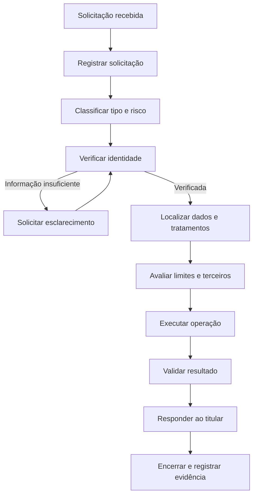
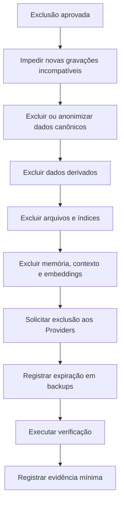

---

id: RB-PRIV-003

title: Direitos dos Titulares e Operações de Privacidade
description: Define os processos oficiais do RouteBook para receber, validar, executar, acompanhar e auditar solicitações relacionadas aos direitoserações de privacidade.

document_type: privacy
owner: Privacy

status: Draft
version: "0.1.0"

created: "2026-07-21"
last_updated: null

authors:

- RouteBook Team

tags:

- privacy
- data-protection
- data-subject-rights
- privacy-operations
- access-request
- correction
- deletion
- portability
- consent
- objection
- automated-decisions
- identity-verification
- retention
- artificial-intelligence
- governance
- diagrams
- mermaid

related_documents:

- RB-CORE-0001
- RB-CORE-0002
- RB-CORE-0003
- RB-CORE-0004
- RB-DOM-001
- RB-DOM-002
- RB-DOM-003
- RB-DOM-004
- RB-ARC-001
- RB-ARC-002
- RB-ARC-003
- RB-ARC-004
- RB-ARC-005
- RB-DATA-001
- RB-DATA-002
- RB-API-001
- RB-SEC-001
- RB-SEC-002
- RB-SEC-003
- RB-PRIV-001
- RB-PRIV-002
- RB-OBS-001
- RB-QA-001
- RB-QA-002
- RB-OPS-001
- RB-OPS-002
- RB-SRE-001
- RB-AI-001
- RB-AI-003
- RB-AI-004
- RB-AI-005
- RB-AI-006

prerequisites:

- RB-CORE-0004
- RB-DOM-001
- RB-DOM-002
- RB-DOM-003
- RB-DOM-004
- RB-ARC-001
- RB-ARC-002
- RB-ARC-003
- RB-ARC-004
- RB-ARC-005
- RB-DATA-001
- RB-DATA-002
- RB-API-001
- RB-SEC-001
- RB-SEC-002
- RB-SEC-003
- RB-PRIV-001
- RB-PRIV-002

next_documents:

- RB-GOV-001
- RB-COMP-001

ai_context:
priority: critical
index: true
---

# RouteBook — Direitos dos Titulares e Operações de Privacidade

## Parte I — Fundamentos

### 1. Propósito

Este documento define os processos oficiais do RouteBook para receber, validar, executar, acompanhar e auditar solicitações relacionadas aos direitos dos titulares de dados pessoais.

Seu objetivo é transformar os princípios estabelecidos no `RB-PRIV-001` e os registros definidos no `RB-PRIV-002` em operações executáveis, seguras e verificáveis.

O documento estabelece como o RouteBook deverá tratar solicitações relacionadas a:

* confirmação da existência de tratamento;
* acesso a dados;
* correção;
* atualização;
* exclusão;
* anonimização;
* bloqueio;
* restrição;
* oposição;
* revogação de escolhas;
* portabilidade;
* informação sobre compartilhamentos;
* revisão de operações automatizadas;
* encerramento de conta;
* tratamento de dados de terceiros;
* dados de crianças e adolescentes;
* reclamações de privacidade.

---

### 2. Relação com os documentos anteriores

O `RB-PRIV-001` define:

* princípios de privacidade;
* classificação de dados;
* minimização;
* transparência;
* retenção;
* exclusão;
* anonimização;
* privacidade de IA.

O `RB-PRIV-002` define:

* Registro de Atividades de Tratamento;
* inventário de dados;
* mapeamento de fluxos;
* Providers;
* retenção;
* avaliações de impacto;
* riscos e controles.

O `RB-PRIV-003` define:

* canais de solicitação;
* verificação de identidade;
* classificação;
* execução;
* exceções;
* comunicação;
* evidências;
* prazos;
* automação;
* métricas;
* governança operacional.

```mermaid
flowchart LR
    PrivacyPolicy["RB-PRIV-001<br/>Política e ciclo de vida"]
    ProcessingRecords["RB-PRIV-002<br/>Registros e avaliações"]
    PrivacyOperations["RB-PRIV-003<br/>Direitos e operações"]
    Intake["Recebimento"]
    Validation["Validação"]
    Execution["Execução"]
    Verification["Verificação"]
    Response["Resposta"]
    Evidence["Evidências"]

    PrivacyPolicy --> ProcessingRecords
    ProcessingRecords --> PrivacyOperations
    PrivacyOperations --> Intake
    Intake --> Validation
    Validation --> Execution
    Execution --> Verification
    Verification --> Response
    Response --> Evidence
```



---

### 3. Escopo

Este documento se aplica a solicitações relacionadas a dados tratados por:

* Identity and Access;
* Trip Management;
* Traveler Profile;
* Place Catalog;
* Trip Collection;
* Itinerary Planning;
* Mobility;
* Decision Intelligence;
* Proposal Management;
* Planning Assurance;
* Data Governance;
* Platform;
* observabilidade;
* suporte;
* operações administrativas;
* integrações;
* AI Providers;
* agentes;
* Tools;
* Context Snapshots;
* memórias;
* embeddings;
* backups.

---

### 4. Fora do escopo

Este documento não define:

* interpretação jurídica definitiva;
* prazo legal específico por jurisdição;
* estratégia de defesa judicial;
* política pública final de privacidade;
* contrato com Providers;
* procedimento de autoridade reguladora;
* política corporativa de atendimento externo.

Esses elementos deverão ser incorporados por responsáveis apropriados quando aplicáveis.

---

### 5. Princípio central

Toda solicitação deverá ser tratada de forma segura, compreensível, rastreável e proporcional ao risco, sem expor dados de terceiros ou comprometer a integridade do RouteBook.

```text
Receber
→ autenticar ou verificar
→ classificar
→ localizar dados
→ avaliar limites
→ executar
→ verificar
→ responder
→ registrar evidência
```

---

### 6. Objetivos

O processo deverá:

1. oferecer canais claros;
2. confirmar a identidade de forma proporcional;
3. evitar fraude;
4. localizar dados com precisão;
5. proteger dados de terceiros;
6. preservar integridade;
7. executar exclusões completas;
8. manter rastreabilidade;
9. cumprir prazos aplicáveis;
10. reduzir trabalho manual;
11. permitir revisão humana;
12. impedir decisões automáticas inseguras;
13. fornecer respostas compreensíveis;
14. produzir evidências auditáveis.

---

## Parte II — Princípios operacionais

### 7. Facilidade de exercício

O exercício de direitos não deverá ser desnecessariamente difícil.

O RouteBook deverá evitar:

* canais ocultos;
* formulários excessivos;
* exigência de dados desnecessários;
* etapas não justificadas;
* linguagem ambígua;
* atrasos artificiais.

---

### 8. Verificação proporcional

A verificação deverá ser proporcional ao risco da solicitação.

Uma solicitação de informação geral não deverá exigir o mesmo nível de verificação de uma exportação completa ou exclusão de conta.

---

### 9. Minimização durante o atendimento

O processo não deverá coletar mais dados do que o necessário para:

* localizar a conta;
* verificar a identidade;
* compreender a solicitação;
* executar a operação;
* produzir evidência.

---

### 10. Proteção de terceiros

Uma solicitação não concede acesso automático a dados de:

* outros participantes;
* convidados;
* viajantes;
* pessoas mencionadas;
* membros de outra Account;
* colaboradores;
* Providers.

---

### 11. Transparência

O titular deverá receber informação clara sobre:

* recebimento;
* escopo;
* andamento;
* conclusão;
* limitações;
* dados não encontrados;
* operações não executadas;
* justificativas aplicáveis.

---

### 12. Segurança prevalece

Nenhum direito deverá ser executado de modo que:

* exponha dados de terceiros;
* revele secrets;
* revele controles internos sensíveis;
* permita tomada de conta;
* comprometa investigação;
* altere estado canônico indevidamente.

---

### 13. Integridade

Correções, exclusões e restrições deverão preservar:

* invariantes;
* ownership;
* referências necessárias;
* auditoria;
* consistência;
* histórico mínimo legítimo.

---

### 14. Revisão humana

Casos ambíguos, sensíveis ou de alto impacto deverão permitir revisão humana.

---

### 15. Evidência sem conteúdo excessivo

O RouteBook deverá registrar que uma solicitação foi tratada sem manter cópias desnecessárias dos dados eliminados.

---

## Parte III — Conceitos

### 16. Solicitação de privacidade

Solicitação de privacidade é uma manifestação de uma pessoa relacionada ao tratamento de seus dados pessoais.

---

### 17. Solicitante

Solicitante é a pessoa que apresenta a solicitação.

O solicitante poderá ser:

* o próprio titular;
* representante autorizado;
* responsável legal;
* participante de uma Trip;
* pessoa não autenticada;
* terceiro sem autoridade confirmada.

---

### 18. Titular autenticado

Titular autenticado é o User que apresenta a solicitação em uma sessão válida.

---

### 19. Representante

Representante é uma pessoa autorizada a agir em nome do titular.

A representação deverá ser verificada de forma proporcional ao risco.

---

### 20. Solicitação verificável

Solicitação verificável é aquela em que existem evidências suficientes para associar o solicitante ao titular ou à autoridade alegada.

---

### 21. Escopo da solicitação

O escopo representa:

* titular;
* Account;
* Trip;
* categoria de dados;
* período;
* finalidade;
* operação solicitada.

---

### 22. Restrição

Restrição é a limitação temporária ou permanente de determinados tratamentos.

---

### 23. Oposição

Oposição é a manifestação contrária a um tratamento específico, quando aplicável.

---

### 24. Portabilidade

Portabilidade é a disponibilização de dados elegíveis em formato estruturado e seguro.

---

### 25. Revisão de operação automatizada

É a análise de uma operação automatizada que produza classificação, priorização, Recommendation, Proposal ou outro resultado relevante ao titular.

---

## Parte IV — Canais de atendimento

### 26. Canais suportados

O RouteBook poderá disponibilizar:

* área autenticada;
* formulário público;
* e-mail de privacidade;
* suporte;
* canal administrativo;
* integração com sistema de tickets.

---

### 27. Canal autenticado

O canal autenticado deverá ser preferido para:

* acesso;
* exportação;
* correção;
* exclusão;
* configurações;
* histórico de solicitações.

---

### 28. Canal não autenticado

O canal não autenticado deverá permitir o início da solicitação sem expor a existência de conta ou dados.

---

### 29. Não enumeração

A resposta inicial não deverá confirmar indevidamente:

* que um e-mail possui conta;
* que uma Trip existe;
* que uma pessoa participa de uma Account;
* que determinado dado está armazenado.

---

### 30. Acessibilidade

Os canais deverão considerar:

* linguagem compreensível;
* navegação por teclado;
* leitores de tela;
* contraste;
* instruções claras;
* alternativas de atendimento.

---

### 31. Confirmação de recebimento

O RouteBook deverá confirmar o recebimento e fornecer:

* identificador da solicitação;
* data;
* tipo inicial;
* próximo passo;
* canal de acompanhamento.

---

## Parte V — Registro da solicitação

### 32. Identificador

Cada solicitação deverá possuir identificador único.

Formato sugerido:

```text
RB-DSR-NNNNNN
```

---

### 33. Estrutura obrigatória

```text
privacyRequestId
requestType
requesterType
requesterReference
subjectReference
accountScope
tripScope
submittedAt
channel
status
verificationLevel
verificationStatus
assignedOwner
targetDate
completedAt
decision
responseReference
evidence
```

---

### 34. Estados

Estados possíveis:

* Received;
* Awaiting Verification;
* Verified;
* Under Analysis;
* Awaiting Clarification;
* In Execution;
* Partially Completed;
* Completed;
* Denied;
* Cancelled;
* Expired;
* Superseded.

---

### 35. Tipos de solicitação

Tipos iniciais:

* Confirmation;
* Access;
* Correction;
* Deletion;
* Anonymization;
* Restriction;
* Objection;
* Portability;
* Sharing Information;
* Consent Withdrawal;
* Automated Operation Review;
* Account Closure;
* Complaint;
* Other.

---

### 36. Ownership

Toda solicitação deverá possuir owner responsável por:

* acompanhar o prazo;
* coordenar módulos;
* comunicar o andamento;
* registrar decisões;
* validar conclusão.

---

### 37. Dados sensíveis no ticket

O registro não deverá copiar dados pessoais completos quando referências controladas forem suficientes.

---

## Parte VI — Fluxo geral

### 38. Processo



---

### 39. Classificação inicial

A triagem deverá identificar:

* tipo;
* titular;
* Account;
* Trip;
* sensibilidade;
* urgência;
* risco;
* necessidade de revisão;
* módulos envolvidos;
* Providers envolvidos.

---

### 40. Solicitação incompleta

Quando faltarem informações, o RouteBook deverá solicitar somente os elementos necessários para prosseguir.

---

### 41. Solicitações múltiplas

Uma mensagem poderá originar múltiplas operações vinculadas ao mesmo caso.

---

### 42. Solicitações repetidas

Solicitações repetidas deverão ser associadas ao histórico sem serem descartadas automaticamente.

---

## Parte VII — Verificação de identidade

### 43. Objetivo

A verificação deverá reduzir o risco de:

* fraude;
* tomada de conta;
* exportação indevida;
* exclusão maliciosa;
* exposição de dados;
* manipulação de perfil.

---

### 44. Níveis de verificação

O RouteBook deverá utilizar níveis proporcionais:

* Level 0 — sem verificação;
* Level 1 — controle do canal;
* Level 2 — sessão autenticada;
* Level 3 — reautenticação;
* Level 4 — verificação reforçada.

---

### 45. Level 0

Aplicável apenas a informações gerais que não revelem dados pessoais.

---

### 46. Level 1

Poderá confirmar controle sobre:

* endereço de e-mail;
* telefone;
* canal previamente registrado.

---

### 47. Level 2

Utiliza sessão autenticada válida.

---

### 48. Level 3

Exige nova autenticação ou confirmação adicional.

Aplicável a:

* exportação completa;
* exclusão de conta;
* alteração de dado crítico;
* revogação ampla;
* acesso a dados sensíveis.

---

### 49. Level 4

Poderá ser exigido em casos de:

* suspeita de fraude;
* representante;
* conta comprometida;
* dados de menor;
* conflito de identidade;
* alto risco.

---

### 50. Proibição de perguntas inseguras

A verificação não deverá utilizar exclusivamente dados facilmente descobertos.

---

### 51. Falha de verificação

A falha deverá:

* impedir a operação de risco;
* evitar confirmação de dados;
* permitir nova tentativa controlada;
* gerar evidência;
* acionar revisão quando necessário.

---

### 52. Suspeita de fraude

Deverá ser encaminhada para Security quando houver:

* múltiplas tentativas;
* origem anômala;
* inconsistência;
* sessão comprometida;
* pedido incompatível com comportamento anterior.

---

## Parte VIII — Descoberta de dados

### 53. Fonte de verdade

O `RB-PRIV-002` deverá orientar a localização de dados por:

* atividade;
* finalidade;
* módulo;
* armazenamento;
* Provider;
* categoria;
* retenção.

---

### 54. Escopo de busca

A descoberta deverá considerar:

* dados canônicos;
* dados derivados;
* projeções;
* cache;
* índices;
* eventos;
* filas;
* DLQ;
* logs;
* traces;
* arquivos;
* backups;
* Providers;
* memória de IA;
* embeddings;
* exports anteriores.

---

### 55. Identificadores de correlação

A busca poderá utilizar:

* UserId;
* AccountId;
* externalSubject;
* e-mail normalizado;
* TripId;
* requestId;
* outros identificadores controlados.

---

### 56. Dados de terceiros

Resultados deverão ser classificados antes de serem incluídos em uma resposta.

---

### 57. Dados não encontrados

A ausência de resultados deverá ser registrada sem concluir automaticamente que nenhum tratamento ocorreu.

---

### 58. Qualidade do inventário

Lacunas descobertas deverão gerar atualização do Registro de Atividades de Tratamento.

---

## Parte IX — Confirmação de tratamento

### 59. Objetivo

Permitir que o titular saiba se o RouteBook realiza tratamento relacionado a ele.

---

### 60. Resposta

A resposta poderá informar:

* existência de tratamento;
* categorias gerais;
* finalidades;
* principais destinatários;
* retenção;
* canais de exercício.

---

### 61. Proteção contra enumeração

A confirmação somente deverá ocorrer após verificação adequada.

---

### 62. Limites

Não deverão ser revelados:

* dados de terceiros;
* secrets;
* sinais de segurança;
* detalhes que permitam fraude;
* investigações em andamento.

---

## Parte X — Acesso

### 63. Escopo

O acesso poderá incluir:

* dados fornecidos;
* dados observados;
* dados inferidos;
* finalidades;
* fontes;
* compartilhamentos;
* retenção;
* histórico de escolhas;
* informações sobre IA.

---

### 64. Formato

A resposta deverá ser:

* compreensível;
* organizada;
* segura;
* proporcional;
* acompanhada de explicações quando necessário.

---

### 65. Dados técnicos

Identificadores técnicos poderão ser incluídos quando relevantes, mas deverão possuir contexto compreensível.

---

### 66. Dados inferidos

Inferências deverão indicar, quando aplicável:

* que são inferidas;
* finalidade;
* origem;
* efeito;
* possibilidade de correção.

---

### 67. Dados de outros participantes

Deverão ser:

* removidos;
* redigidos;
* agregados;
* substituídos;
* omitidos quando necessário.

---

### 68. Entrega

A entrega deverá utilizar:

* área autenticada;
* arquivo protegido;
* link temporário;
* canal validado.

---

### 69. Expiração

Links e arquivos deverão possuir expiração e acesso controlado.

---

## Parte XI — Correção

### 70. Objetivo

Permitir correção de dados inexatos, incompletos ou desatualizados.

---

### 71. Dados diretamente editáveis

Sempre que possível, o próprio User deverá poder corrigir dados na interface.

---

### 72. Dados canônicos

A correção deverá ser executada pelo módulo proprietário.

---

### 73. Dados derivados

Após a correção da fonte, avaliar:

* recomputação;
* invalidação;
* exclusão;
* reconstrução;
* atualização de Recommendations;
* atualização de Proposals;
* atualização de Planning Conflicts.

---

### 74. Histórico

Quando o histórico precisar ser preservado, a correção deverá distinguir:

* valor anterior;
* valor vigente;
* data;
* motivo;
* ator.

---

### 75. Dados de terceiros

Um User não deverá alterar dados pessoais canônicos de outra pessoa sem autoridade apropriada.

---

### 76. Discordância

Quando a correção não puder ser aplicada, a justificativa deverá ser registrada e comunicada.

---

## Parte XII — Exclusão

### 77. Objetivo

Remover ou tornar indisponíveis dados pessoais quando houver solicitação válida ou outro gatilho aplicável.

---

### 78. Escopo

A exclusão deverá considerar:

* conta;
* perfil;
* Trips;
* Activities;
* Places salvos;
* histórico;
* conteúdo;
* arquivos;
* projeções;
* cache;
* Providers;
* IA;
* backups.

---

### 79. Orquestração



---

### 80. Dependências

A ordem deverá respeitar:

* ownership;
* integridade;
* eventos;
* referências;
* jobs;
* sincronizações;
* reconstruções.

---

### 81. Alternativas à exclusão física

Quando necessário, poderão ser utilizadas:

* anonimização;
* tombstone;
* pseudonimização controlada;
* bloqueio;
* restrição;
* agregação.

---

### 82. Dados compartilhados em Trip

A exclusão deverá equilibrar:

* direitos do titular;
* integridade da Trip;
* dados dos demais participantes;
* histórico legítimo;
* necessidade de anonimização.

---

### 83. Audit Entries

Poderá ser preservada evidência mínima da ação sem manter conteúdo pessoal excessivo.

---

### 84. Providers

A conclusão deverá considerar confirmação ou evidência da solicitação enviada aos Providers aplicáveis.

---

### 85. Backups

Dados poderão permanecer temporariamente em backups dentro do ciclo de retenção, desde que:

* permaneçam inacessíveis à operação normal;
* expirem no prazo definido;
* não sejam reintroduzidos;
* sejam reaplicadas exclusões após restore.

---

### 86. Reaparecimento

A verificação deverá testar:

* rebuild;
* replay;
* restore;
* sincronização;
* reindexação;
* reprocessamento de IA.

---

## Parte XIII — Anonimização

### 87. Uso

A anonimização poderá ser utilizada quando:

* a exclusão física comprometer integridade;
* houver finalidade legítima para dados agregados;
* referências precisarem permanecer;
* estatísticas puderem ser preservadas.

---

### 88. Avaliação

A técnica deverá considerar:

* identificadores diretos;
* quase-identificadores;
* combinação de atributos;
* localização;
* datas;
* grupos pequenos;
* fontes externas.

---

### 89. Validação

A anonimização deverá possuir avaliação de risco de reidentificação.

---

### 90. Pseudonimização não equivale a anonimização

Dados pseudonimizados continuarão sujeitos aos controles de privacidade.

---

## Parte XIV — Restrição e bloqueio

### 91. Objetivo

Impedir temporariamente determinados usos sem excluir imediatamente os dados.

---

### 92. Aplicações

Poderá ser utilizada quando:

* a exatidão estiver sendo contestada;
* a solicitação estiver em análise;
* houver disputa de finalidade;
* a exclusão estiver impedida temporariamente;
* houver investigação.

---

### 93. Estado

O dado restrito deverá possuir marcação observável.

---

### 94. Efeitos

A restrição deverá interromper, conforme escopo:

* personalização;
* compartilhamento;
* envio a Provider;
* uso em IA;
* geração de inferências;
* execução de jobs;
* analytics.

---

### 95. Exceções

Operações de segurança, integridade ou preservação poderão continuar quando devidamente justificadas.

---

## Parte XV — Oposição

### 96. Escopo

A oposição deverá ser vinculada a uma finalidade ou atividade específica.

---

### 97. Avaliação

Deverá considerar:

* fundamento do tratamento;
* expectativa;
* impacto;
* necessidade;
* alternativas;
* controles;
* obrigação aplicável.

---

### 98. Resultado

A solicitação poderá resultar em:

* interrupção;
* restrição;
* manutenção justificada;
* mudança de configuração;
* exclusão de dados derivados.

---

### 99. Comunicação

A decisão deverá ser explicada em linguagem compreensível.

---

## Parte XVI — Revogação de escolhas

### 100. Escopo

Poderá incluir:

* personalização;
* localização;
* comunicações;
* analytics não essenciais;
* memória;
* uso de IA;
* compartilhamento opcional.

---

### 101. Efeito futuro

A revogação deverá interromper novos tratamentos relacionados no prazo aplicável.

---

### 102. Dados existentes

Deverá ser avaliado se dados anteriores precisam ser:

* excluídos;
* anonimizados;
* restritos;
* mantidos por finalidade distinta.

---

### 103. Registro

A operação deverá preservar:

* purposeId;
* noticeVersion;
* escolha anterior;
* nova escolha;
* data;
* origem.

---

### 104. Interface

Revogar deverá ser tão acessível quanto conceder.

---

## Parte XVII — Portabilidade

### 105. Objetivo

Disponibilizar dados elegíveis em formato estruturado e seguro.

---

### 106. Escopo inicial

Poderá incluir:

* perfil;
* preferências;
* Trips;
* Itineraries;
* Activities;
* Places salvos;
* conteúdo fornecido;
* escolhas;
* histórico aplicável.

---

### 107. Exclusões

Não deverão ser incluídos:

* secrets;
* dados de terceiros;
* controles internos;
* sinais antifraude;
* informação protegida;
* dados de outro Account.

---

### 108. Formatos

Formatos possíveis:

* JSON;
* CSV;
* arquivos organizados;
* pacote compactado.

---

### 109. Manifesto

A exportação deverá conter manifesto com:

* versão;
* data;
* categorias;
* formatos;
* arquivos;
* checksums quando aplicável.

---

### 110. Segurança

A geração deverá possuir:

* autorização reforçada;
* job idempotente;
* expiração;
* criptografia;
* acesso controlado;
* auditoria.

---

### 111. Falha parcial

A exportação não deverá ser marcada como concluída quando categorias esperadas falharem silenciosamente.

---

## Parte XVIII — Informação sobre compartilhamentos

### 112. Escopo

O titular poderá receber informação sobre:

* categorias de destinatários;
* Providers relevantes;
* finalidades;
* categorias de dados;
* transferências;
* retenção aplicável.

---

### 113. Limites

Informações que comprometam segurança ou direitos de terceiros poderão ser limitadas de forma justificada.

---

### 114. Catálogo de Providers

O `RB-PRIV-002` deverá ser utilizado como fonte para a resposta.

---

## Parte XIX — Revisão de operações automatizadas

### 115. Princípio

Recommendation não é Decision.

Itinerary Proposal não é alteração aplicada.

A existência de IA não elimina a responsabilidade do RouteBook sobre o processo.

---

### 116. Escopo

A revisão poderá abranger:

* Recommendation;
* ranking;
* classificação;
* perfil inferido;
* Planning Conflict;
* Itinerary Proposal;
* priorização;
* restrição automática;
* detecção de abuso.

---

### 117. Informações mínimas

A análise deverá identificar:

* capacidade;
* finalidade;
* dados utilizados;
* modelo ou regra;
* versão;
* resultado;
* efeito;
* possibilidade de correção;
* intervenção humana.

---

### 118. Revisão humana

Quando aplicável, a revisão deverá ser realizada por pessoa autorizada com contexto suficiente.

---

### 119. Correção

Uma conclusão incorreta poderá exigir:

* correção da fonte;
* exclusão da inferência;
* regeneração;
* invalidação;
* ajuste de perfil;
* nova Recommendation;
* nova Itinerary Proposal.

---

### 120. Limites de explicação

A resposta deverá ser compreensível sem revelar:

* secrets;
* controles antifraude;
* propriedade intelectual sensível;
* dados de terceiros;
* instruções de exploração.

---

## Parte XX — Encerramento de conta

### 121. Relação com exclusão

Encerrar conta e excluir dados são operações relacionadas, mas não necessariamente idênticas.

---

### 122. Etapas

1. verificar identidade;
2. informar efeitos;
3. verificar Trips compartilhadas;
4. cancelar sessões;
5. revogar credenciais;
6. impedir novas operações;
7. aplicar política de retenção;
8. excluir ou anonimizar dados;
9. comunicar conclusão.

---

### 123. Trips compartilhadas

Deverá ser avaliado:

* transferência de ownership;
* remoção do participante;
* anonimização do histórico;
* impacto nos demais membros;
* Activities atribuídas;
* Decisions registradas.

---

### 124. Credenciais

O encerramento deverá revogar:

* sessões;
* refresh tokens;
* Personal Access Tokens;
* chaves;
* integrações;
* acessos delegados.

---

### 125. Reativação

O comportamento de reativação deverá ser definido.

Dados eliminados não deverão reaparecer sem nova coleta legítima.

---

## Parte XXI — Representantes

### 126. Autoridade

O representante deverá demonstrar autoridade suficiente.

---

### 127. Minimização

O RouteBook deverá solicitar apenas a comprovação necessária.

---

### 128. Escopo da representação

A autoridade poderá ser limitada por:

* direito;
* período;
* Account;
* Trip;
* categoria;
* operação.

---

### 129. Comunicação

Quando seguro e apropriado, o titular poderá ser notificado sobre a atuação do representante.

---

### 130. Suspeita

Inconsistências deverão provocar revisão e possível envolvimento de Security.

---

## Parte XXII — Crianças e adolescentes

### 131. Proteção reforçada

Solicitações relacionadas a menores deverão receber tratamento proporcional ao risco.

---

### 132. Representação

A autoridade do responsável deverá ser verificada quando necessária.

---

### 133. Identidade mínima

O processo deverá evitar coleta excessiva de documentos ou dados do menor.

---

### 134. Conflito de interesses

Casos de possível conflito deverão ser encaminhados para revisão especializada.

---

### 135. Exclusão

Dados de menores deverão ser priorizados quando não houver finalidade legítima para retenção.

---

### 136. IA

A revisão deverá incluir:

* memória;
* Context Snapshots;
* inferências;
* embeddings;
* Provider;
* outputs relacionados ao menor.

---

## Parte XXIII — Solicitações de participantes não autenticados

### 137. Contexto

Uma pessoa poderá estar representada em uma Trip sem possuir conta.

---

### 138. Localização

A descoberta deverá considerar:

* referência no grupo;
* convite;
* conteúdo;
* preferências;
* restrições;
* notas;
* uploads.

---

### 139. Verificação

A verificação deverá evitar revelar detalhes da Trip antes da confirmação apropriada.

---

### 140. Correção ou exclusão

A operação deverá considerar direitos e integridade dos participantes autenticados.

---

## Parte XXIV — Limites e recusas

### 141. Princípio

Uma solicitação poderá ser limitada ou recusada quando houver justificativa legítima, documentada e revisável.

---

### 142. Motivos possíveis

Poderão incluir:

* identidade não verificada;
* ausência de autoridade;
* risco a terceiros;
* solicitação impossível de localizar;
* conflito com preservação obrigatória;
* abuso evidente;
* segurança;
* investigação em andamento;
* pedido fora do escopo aplicável.

---

### 143. Recusa parcial

Deverá ser preferida à recusa total quando parte da solicitação puder ser atendida com segurança.

---

### 144. Resposta

A comunicação deverá indicar:

* decisão;
* escopo atendido;
* escopo limitado;
* justificativa;
* alternativa disponível;
* canal de revisão.

---

### 145. Evidência

A decisão deverá possuir owner e aprovação proporcional ao risco.

---

## Parte XXV — Prazos e prioridade

### 146. Prazo aplicável

O prazo oficial deverá ser definido conforme política jurídica e contexto aplicável.

---

### 147. Controle interno

Toda solicitação deverá possuir:

* targetDate;
* alertas;
* owner;
* status;
* histórico.

---

### 148. Prioridade

Deverão receber prioridade:

* risco de segurança;
* exposição ativa;
* dados sensíveis;
* menores;
* fraude;
* exclusão urgente;
* prazo próximo;
* falha operacional.

---

### 149. Pausa justificada

Quando permitido, o prazo poderá depender de:

* esclarecimento;
* verificação;
* autoridade;
* escopo.

A pausa deverá ser registrada.

---

### 150. Atraso

Atrasos deverão gerar:

* alerta;
* escalonamento;
* comunicação;
* plano de conclusão;
* análise de causa.

---

## Parte XXVI — Comunicação

### 151. Princípios

A comunicação deverá ser:

* clara;
* factual;
* respeitosa;
* segura;
* compreensível;
* livre de jargão desnecessário.

---

### 152. Confirmação inicial

Deverá informar:

* recebimento;
* identificador;
* data;
* próximo passo;
* necessidade de verificação.

---

### 153. Pedido de esclarecimento

Deverá solicitar somente informações necessárias.

---

### 154. Atualização de andamento

Casos prolongados deverão receber atualizações proporcionais.

---

### 155. Conclusão

Deverá informar:

* operações realizadas;
* data;
* limitações;
* Providers envolvidos;
* resultado;
* canal de revisão.

---

### 156. Dados na comunicação

E-mails e mensagens não deverão conter dados sensíveis além do necessário.

---

## Parte XXVII — Automação

### 157. Candidatos

Poderão ser automatizados:

* registro;
* classificação inicial;
* busca por identificadores;
* geração de export;
* aplicação de retenção;
* exclusão de cache;
* notificação a Providers;
* verificação técnica;
* cálculo de prazo;
* comunicação de status.

---

### 158. Guardrails

A automação deverá possuir:

* autorização;
* escopo;
* idempotência;
* auditoria;
* dry-run;
* limite;
* rollback;
* evidência;
* tratamento de falha.

---

### 159. Decisões que exigem revisão

Não deverão ser totalmente automatizadas:

* recusa de alto impacto;
* conflito entre titulares;
* representação ambígua;
* dados de menores;
* risco de fraude;
* exceções;
* retenção controversa;
* revisão de operação automatizada relevante.

---

### 160. Uso de IA no atendimento

IA poderá:

* classificar;
* resumir;
* localizar referências;
* preparar respostas;
* sugerir próximos passos.

IA não poderá autonomamente:

* confirmar identidade;
* liberar export;
* excluir conta;
* negar direito;
* aceitar risco;
* compartilhar dados.

---

## Parte XXVIII — Operações sobre IA

### 161. Inventário

Solicitações deverão considerar:

* prompts;
* respostas;
* Tool Calls;
* Context Snapshots;
* memórias;
* embeddings;
* avaliações;
* traces de IA;
* Provenance.

---

### 162. Exclusão de memória

A exclusão deverá alcançar memórias associadas ao titular dentro do escopo aplicável.

---

### 163. Embeddings

A operação deverá localizar embeddings por:

* fonte;
* Account;
* Trip;
* documento;
* titular;
* namespace.

---

### 164. Regeneração

Após correção ou exclusão, avaliar:

* reindexação;
* remoção;
* recriação;
* invalidação de cache;
* reconstrução de contexto.

---

### 165. Provider

O processo deverá considerar dados mantidos pelo Provider conforme contrato e configuração.

---

### 166. Traces de IA

Traces deverão ser tratados conforme:

* finalidade;
* classificação;
* retenção;
* segurança;
* necessidade de evidência.

---

## Parte XXIX — Providers

### 167. Obrigações operacionais

O catálogo do `RB-PRIV-002` deverá indicar:

* canal de solicitação;
* prazo;
* capacidade de exclusão;
* capacidade de exportação;
* confirmação;
* limitações;
* suboperadores.

---

### 168. Solicitação ao Provider

Deverá registrar:

```text
providerRequestId
privacyRequestId
providerId
operation
scope
submittedAt
targetDate
status
completedAt
evidence
```

---

### 169. Estados

* Pending;
* Submitted;
* Acknowledged;
* In Progress;
* Completed;
* Partially Completed;
* Rejected;
* Failed;
* Escalated.

---

### 170. Falha

Falhas deverão gerar:

* retry controlado;
* escalonamento;
* análise contratual;
* comunicação;
* risco residual.

---

### 171. Confirmação

A conclusão deverá possuir evidência adequada.

---

## Parte XXX — Backups e recuperação

### 172. Princípio

A presença em backup não deverá permitir o retorno indevido de dados eliminados.

---

### 173. Registro de exclusão

Deverá existir mecanismo para reaplicar exclusões após restore.

---

### 174. Restore

Após restauração:

1. identificar ponto restaurado;
2. reaplicar tombstones;
3. reaplicar exclusões;
4. reaplicar revogações;
5. reconstruir projeções;
6. verificar ausência de reaparecimento.

---

### 175. Teste

Testes periódicos deverão validar que exclusões permanecem efetivas após restore.

---

### 176. Evidência

A evidência não deverá conter cópia integral dos dados eliminados.

---

## Parte XXXI — Qualidade e testes

### 177. Testes obrigatórios

Deverão incluir:

* solicitação válida;
* identidade inválida;
* representante;
* outro Account;
* outra Trip;
* dados de terceiros;
* exportação;
* exclusão;
* correção;
* restrição;
* Provider;
* memória;
* embedding;
* backup;
* restore.

---

### 178. Testes de autorização

Cada endpoint ou operação deverá validar:

* titular;
* representante;
* operador interno;
* agente;
* integração;
* Account;
* Trip.

---

### 179. Testes de idempotência

Repetir uma operação não deverá:

* duplicar export;
* duplicar exclusão;
* recriar dados;
* gerar inconsistência;
* notificar Provider indevidamente.

---

### 180. Testes de falha parcial

Deverão simular:

* módulo indisponível;
* Provider indisponível;
* job interrompido;
* dado não localizado;
* timeout;
* restore;
* reprocessamento.

---

### 181. Testes de segurança

Deverão cobrir:

* enumeração;
* tomada de conta;
* exportação indevida;
* link reutilizado;
* link expirado;
* acesso cross-account;
* dados em logs.

---

### 182. Testes de IA

Deverão cobrir:

* contexto residual;
* memória excluída;
* embedding antigo;
* resposta contendo dado removido;
* Tool acessando escopo inválido.

---

## Parte XXXII — Observabilidade

### 183. Indicadores

Deverão ser observados:

* solicitações recebidas;
* solicitações por tipo;
* tempo de verificação;
* tempo de execução;
* prazos;
* falhas;
* operações parciais;
* Providers atrasados;
* exclusões incompletas;
* reaparecimento.

---

### 184. Logs

Logs deverão evitar conteúdo pessoal completo.

---

### 185. Correlação

Deverão utilizar:

* privacyRequestId;
* providerRequestId;
* jobExecutionId;
* correlationId.

---

### 186. Alertas

Alertas deverão existir para:

* prazo próximo;
* prazo vencido;
* falha de exclusão;
* exportação falha;
* Provider atrasado;
* restore com inconsistência;
* acesso não autorizado.

---

### 187. Dashboard

O dashboard deverá apresentar estado operacional sem expor dados desnecessários.

---

## Parte XXXIII — Evidências e auditoria

### 188. Evidência mínima

Cada solicitação deverá possuir:

* recebimento;
* verificação;
* escopo;
* decisões;
* operações;
* validações;
* comunicação;
* conclusão.

---

### 189. Audit Entry

Ações críticas deverão gerar Audit Entry.

Exemplos:

* exportação;
* exclusão;
* anonimização;
* alteração de identidade;
* recusa;
* acesso administrativo;
* Provider notification.

---

### 190. Retenção da evidência

A retenção deverá ser definida por finalidade, risco e política aplicável.

---

### 191. Conteúdo eliminado

A evidência deverá confirmar a operação sem preservar indevidamente o conteúdo eliminado.

---

### 192. Integridade

Evidências críticas deverão ser protegidas contra alteração indevida.

---

## Parte XXXIV — Métricas

### 193. Métricas de volume

* solicitações por período;
* solicitações por tipo;
* solicitações por canal;
* solicitações por módulo;
* solicitações envolvendo IA;
* solicitações envolvendo Providers.

---

### 194. Métricas de prazo

* tempo médio de verificação;
* tempo médio de descoberta;
* tempo médio de execução;
* solicitações no prazo;
* solicitações vencidas;
* tempo de Provider.

---

### 195. Métricas de qualidade

* reaberturas;
* falhas parciais;
* dados omitidos;
* dados de terceiros expostos;
* exclusões incompletas;
* reaparecimentos;
* correções revertidas.

---

### 196. Métricas de automação

* operações automatizadas;
* intervenções manuais;
* falhas de automação;
* tempo economizado;
* falsos positivos;
* escalonamentos.

---

### 197. Métricas responsáveis

As métricas não deverão exigir coleta adicional desnecessária.

---

## Parte XXXV — Papéis e responsabilidades

### 198. Privacy

Responsável por:

* governança;
* interpretação operacional;
* casos complexos;
* comunicação;
* exceções;
* revisão;
* métricas.

---

### 199. Security

Responsável por:

* verificação de risco;
* fraude;
* incidentes;
* acesso;
* proteção de exportações;
* investigação.

---

### 200. Product

Responsável por:

* experiência;
* canais;
* clareza;
* configurações;
* impacto de exclusões;
* evolução de capacidades.

---

### 201. Data

Responsável por:

* descoberta;
* lineage;
* retenção;
* exclusão;
* anonimização;
* restore.

---

### 202. Engineering

Responsável por:

* APIs;
* jobs;
* integrações;
* controles;
* idempotência;
* evidências;
* correções.

---

### 203. Platform

Responsável por:

* infraestrutura;
* backups;
* observabilidade;
* acesso;
* exports;
* operações.

---

### 204. Artificial Intelligence

Responsável por:

* memórias;
* embeddings;
* Context Snapshots;
* Tools;
* Providers;
* traces;
* regeneração.

---

### 205. Quality Engineering

Responsável por:

* testes;
* cobertura;
* regressão;
* cenários negativos;
* validação independente.

---

### 206. Support

Responsável por:

* recebimento;
* encaminhamento;
* comunicação inicial;
* proteção de dados durante atendimento.

---

## Parte XXXVI — Exceções

### 207. Registro

Toda exceção deverá possuir:

```text
privacyOperationExceptionId
privacyRequestId
requirement
scope
justification
risk
compensatingControls
owner
approvedBy
createdAt
expiresAt
status
```

---

### 208. Expiração

Exceções deverão ser temporárias.

---

### 209. Revisão

A exceção deverá ser revista antes da conclusão da solicitação quando afetar o titular.

---

### 210. Proibições

Não poderão ser excepcionados informalmente:

* verificação de identidade;
* isolamento entre Accounts;
* proteção de export;
* auditoria de exclusão;
* dados de terceiros;
* autorização de representante;
* segurança de menores.

---

## Parte XXXVII — Anti-patterns

### 211. Solicitar documento para qualquer operação

A verificação deverá ser proporcional.

---

### 212. Responder com dump de banco

A resposta deverá ser compreensível e segura.

---

### 213. Excluir apenas o User

Dados podem existir em múltiplos módulos, derivados e Providers.

---

### 214. Ignorar dados de IA

Memórias, embeddings, contexto e traces também deverão ser avaliados.

---

### 215. Confirmar conta antes da verificação

Pode permitir enumeração.

---

### 216. Manter export sem expiração

Amplia risco de exposição.

---

### 217. Considerar Provider concluído sem evidência

A confirmação deverá ser rastreável.

---

### 218. Preservar cópia do dado excluído como prova

A evidência não deverá anular a exclusão.

---

### 219. Recusar tudo por conter dados de terceiros

Deverão ser aplicadas redação, agregação ou separação.

---

### 220. Automatizar recusas complexas

Casos de alto impacto exigem revisão.

---

### 221. Recriar dados após restore

Exclusões e revogações deverão ser reaplicadas.

---

### 222. IA decidindo autoridade

A IA não deverá confirmar identidade nem autoridade do representante.

---

## Parte XXXVIII — Modelo de maturidade

### 223. Nível 1 — Inicial

* canal definido;
* registro manual;
* verificação;
* acesso;
* correção;
* exclusão básica.

---

### 224. Nível 2 — Gerenciado

* workflows;
* owners;
* prazos;
* exportação;
* integração com Providers;
* evidências;
* testes.

---

### 225. Nível 3 — Verificável

* descoberta automatizada;
* exclusão orquestrada;
* métricas;
* testes de restore;
* IA coberta;
* lineage integrado.

---

### 226. Nível 4 — Adaptativo

* políticas como código;
* automação supervisionada;
* detecção contínua;
* validação automática;
* governança dinâmica de Providers;
* prevenção de reaparecimento.

---

## Parte XXXIX — Rastreabilidade

### 227. Cadeia


---

### 228. Matriz mínima

| Elemento    | Vinculação obrigatória    |
| ----------- | ------------------------- |
| solicitação | titular ou representante  |
| solicitação | tipo                      |
| solicitação | atividade de tratamento   |
| operação    | categoria de dados        |
| operação    | armazenamento ou Provider |
| verificação | operação                  |
| comunicação | decisão                   |
| evidência   | solicitação               |
| exceção     | requisito afetado         |

---

### 229. Identificadores

A rastreabilidade deverá preservar:

* privacyRequestId;
* processingActivityId;
* privacyImpactAssessmentId;
* providerRequestId;
* UserId;
* AccountId;
* TripId;
* jobExecutionId;
* correlationId.

---

## Parte XL — Estrutura documental

### 230. Organização sugerida

```text
docs/
└── privacy/
    ├── privacy-data-protection-and-information-lifecycle.md
    ├── records-of-processing-and-privacy-impact-assessments.md
    ├── data-subject-rights-and-privacy-operations.md
    ├── requests/
    ├── templates/
    ├── providers/
    ├── exports/
    ├── exceptions/
    └── evidence/
```

---

### 231. Template de solicitação

```text
privacyRequestId:
requestType:
requesterType:
requesterReference:
subjectReference:
scope:
channel:
submittedAt:
status:
verification:
owner:
targetDate:
operations:
decision:
response:
evidence:
```

---

### 232. Template de operação

```text
operationId:
privacyRequestId:
operationType:
module:
dataCategories:
storage:
provider:
status:
startedAt:
completedAt:
result:
verification:
evidence:
```

---

## Parte XLI — Critérios de aceite

### 233. Processo

* canais estão definidos;
* registro está definido;
* estados estão definidos;
* classificação está definida;
* fluxo está definido;
* ownership está definido.

---

### 234. Segurança

* verificação está definida;
* níveis estão definidos;
* fraude está coberta;
* terceiros estão protegidos;
* representantes estão cobertos;
* menores estão cobertos.

---

### 235. Direitos

* confirmação está definida;
* acesso está definido;
* correção está definida;
* exclusão está definida;
* anonimização está definida;
* restrição está definida;
* oposição está definida;
* revogação está definida;
* portabilidade está definida;
* revisão automatizada está definida.

---

### 236. Ciclo de vida

* descoberta está definida;
* dados derivados estão cobertos;
* Providers estão cobertos;
* backups estão cobertos;
* restore está coberto;
* reaparecimento está coberto.

---

### 237. IA

* Context Snapshots estão cobertos;
* memória está coberta;
* embeddings estão cobertos;
* Providers estão cobertos;
* traces estão cobertos;
* limites de automação estão definidos.

---

### 238. Operação

* prazos estão definidos;
* comunicação está definida;
* automação está definida;
* testes estão definidos;
* observabilidade está definida;
* evidências estão definidas;
* métricas estão definidas;
* exceções estão definidas.

---

## Parte XLII — Checklist final

### 239. Checklist documental

Antes de aprovar:

* frontmatter YAML é válido;
* ID é único;
* título está correto;
* existe apenas um H1;
* propósito está definido;
* escopo está definido;
* relação com RB-PRIV-001 está definida;
* relação com RB-PRIV-002 está definida;
* princípios estão definidos;
* conceitos estão definidos;
* canais estão definidos;
* registro está definido;
* estados estão definidos;
* tipos estão definidos;
* fluxo está definido;
* verificação de identidade está definida;
* níveis de verificação estão definidos;
* fraude está coberta;
* descoberta está definida;
* confirmação está definida;
* acesso está definido;
* correção está definida;
* exclusão está definida;
* anonimização está definida;
* restrição está definida;
* oposição está definida;
* revogação está definida;
* portabilidade está definida;
* compartilhamentos estão definidos;
* revisão automatizada está definida;
* encerramento de conta está definido;
* representantes estão definidos;
* menores estão cobertos;
* participantes não autenticados estão cobertos;
* recusas estão definidas;
* prazos estão definidos;
* comunicação está definida;
* automação está definida;
* IA está coberta;
* Providers estão cobertos;
* backups estão cobertos;
* restore está coberto;
* testes estão definidos;
* observabilidade está definida;
* evidências estão definidas;
* métricas estão definidas;
* responsabilidades estão definidas;
* exceções estão definidas;
* anti-patterns estão definidos;
* maturidade está definida;
* rastreabilidade está presente;
* diagramas Mermaid renderizam no GitHub;
* blocos Mermaid não possuem atributos adicionais;
* não existem contradições com RB-SEC-001;
* não existem contradições com RB-SEC-002;
* não existem contradições com RB-SEC-003;
* não existem contradições com RB-PRIV-001;
* não existem contradições com RB-PRIV-002;
* não existem contradições com RB-DATA-001;
* não existem contradições com RB-DATA-002;
* não existem contradições com RB-AI-001;
* não existem contradições com RB-AI-005;
* não existem contradições com RB-AI-006.

---

## Parte XLIII — Declaração final

### 240. Declaração operacional

O RouteBook deverá permitir que titulares exerçam controle sobre seus dados por meio de processos seguros, compreensíveis, rastreáveis e verificáveis.

Toda solicitação deverá demonstrar:

* quem solicitou;
* qual autoridade foi verificada;
* quais dados foram localizados;
* quais limites foram aplicados;
* quais operações foram executadas;
* como o resultado foi validado;
* como o titular foi informado;
* quais evidências foram preservadas.

Nenhuma solicitação poderá ser executada de modo que:

* exponha dados de terceiros;
* comprometa outra Account;
* altere estado canônico sem autoridade;
* preserve cópias desnecessárias;
* ignore Providers;
* ignore memória ou contexto de IA;
* permita reaparecimento após restore;
* elimine evidências obrigatórias;
* dependa exclusivamente de decisão de IA.

As operações de privacidade deverão permanecer alinhadas ao produto, ao domínio, à arquitetura, aos dados, à segurança, à inteligência artificial, à qualidade e à operação do RouteBook.
