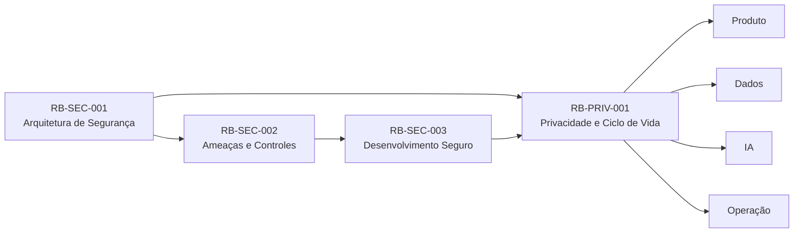
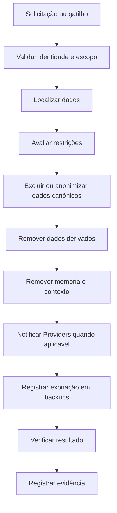
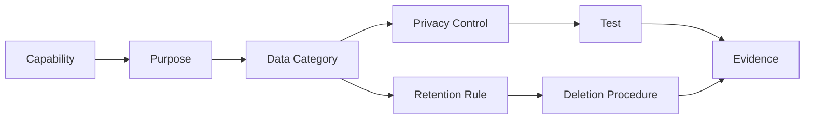

---

id: RB-PRIV-001

title: Privacidade, Proteção de Dados e Ciclo de Vida das Informações
description: Define os princípios, responsabilidades, controles e processos oficiais de privacidade, proteção de dados pessoais e cype: privacy
owner: Privacy

status: Draft
version: "0.1.0"

created: "2026-07-21"
last_updated: null

authors:

- RouteBook Team

tags:

- privacy
- data-protection
- privacy-by-design
- privacy-by-default
- personal-data
- data-lifecycle
- data-minimization
- consent
- retention
- deletion
- anonymization
- artificial-intelligence
- diagrams
- mermaid

related_documents:

- RB-CORE-0001
- RB-CORE-0002
- RB-CORE-0003
- RB-CORE-0004
- RB-PRD-001
- RB-PRD-002
- RB-PRD-003
- RB-PRD-004
- RB-PRD-005
- RB-PRD-006
- RB-PRD-007
- RB-PRD-008
- RB-DOM-001
- RB-DOM-002
- RB-DOM-003
- RB-DOM-004
- RB-ARC-001
- RB-ARC-002
- RB-ARC-003
- RB-ARC-004
- RB-ARC-005
- RB-DATA-001
- RB-DATA-002
- RB-API-001
- RB-SEC-001
- RB-SEC-002
- RB-SEC-003
- RB-OBS-001
- RB-QA-001
- RB-QA-002
- RB-OPS-001
- RB-OPS-002
- RB-SRE-001
- RB-AI-001
- RB-AI-003
- RB-AI-004
- RB-AI-005
- RB-AI-006

prerequisites:

- RB-CORE-0004
- RB-DOM-001
- RB-DOM-002
- RB-DOM-003
- RB-DOM-004
- RB-ARC-001
- RB-ARC-002
- RB-ARC-003
- RB-ARC-004
- RB-ARC-005
- RB-DATA-001
- RB-DATA-002
- RB-API-001
- RB-SEC-001
- RB-SEC-002
- RB-SEC-003

next_documents:

- RB-PRIV-002
- RB-PRIV-003

ai_context:
priority: critical
index: true
---

# RouteBook — Privacidade, Proteção de Dados e Ciclo de Vida das Informações

## Parte I — Fundamentos

### 1. Propósito

Este documento define a política arquitetural e operacional de privacidade e proteção de dados do RouteBook.

Seu objetivo é estabelecer como o produto deverá:

* identificar dados pessoais;
* classificar dados;
* limitar a coleta;
* justificar o tratamento;
* informar o Usuário;
* registrar escolhas;
* controlar compartilhamentos;
* proteger dados durante todo o ciclo de vida;
* atender solicitações dos titulares;
* governar retenção;
* executar exclusão;
* aplicar anonimização;
* limitar o uso de dados por IA;
* responder a incidentes de privacidade;
* manter rastreabilidade;
* evoluir sem ampliar tratamento de forma implícita.

Este documento deverá orientar:

* Product;
* Privacy;
* Security;
* Architecture;
* Data;
* Backend;
* Frontend;
* Platform;
* Artificial Intelligence;
* Quality Engineering;
* Operations;
* Support;
* agentes de engenharia.

---

### 2. Relação com a arquitetura de segurança

O `RB-SEC-001` define a arquitetura geral de segurança e privacidade.

O `RB-SEC-002` define ameaças e controles.

O `RB-SEC-003` define desenvolvimento seguro e gestão de vulnerabilidades.

O `RB-PRIV-001` especializa esses fundamentos para:

* dados pessoais;
* escolhas do Usuário;
* finalidades;
* minimização;
* retenção;
* compartilhamento;
* direitos;
* anonimização;
* privacidade de IA.



---

### 3. Escopo

Este documento cobre dados relacionados a:

* Users;
* Accounts;
* Trips;
* Traveler Profiles;
* preferências;
* restrições;
* composição do grupo;
* acessibilidade;
* localização;
* Accommodation;
* Itineraries;
* Activities;
* Places salvos;
* Decisions;
* Recommendations;
* Itinerary Proposals;
* Planning Conflicts;
* interações com IA;
* Context Snapshots;
* Provenance;
* logs;
* traces;
* eventos;
* uploads;
* integrações;
* suporte;
* auditoria;
* backups.

---

### 4. Fora do escopo

Este documento não constitui:

* parecer jurídico;
* política pública final de privacidade;
* aviso de cookies definitivo;
* termo de consentimento definitivo;
* contrato de processamento com fornecedores;
* inventário jurídico final de bases legais;
* política trabalhista;
* política de dados de empregados.

Esses artefatos poderão ser produzidos em documentos derivados.

---

### 5. Princípio central

O RouteBook deverá utilizar dados pessoais somente quando necessários para entregar capacidades legítimas, explícitas e compreensíveis.

```text
Necessidade
→ finalidade
→ minimização
→ transparência
→ controle
→ proteção
→ retenção limitada
→ eliminação ou anonimização
```

---

### 6. Objetivos

A estratégia deverá:

1. proteger a autonomia do Usuário;
2. reduzir coleta desnecessária;
3. evitar uso incompatível;
4. tornar finalidades compreensíveis;
5. limitar compartilhamentos;
6. governar IA;
7. garantir rastreabilidade;
8. permitir correção e exclusão;
9. reduzir exposição;
10. incorporar privacidade ao design;
11. preservar segurança;
12. apoiar evolução responsável.

---

## Parte II — Princípios de privacidade

### 7. Privacidade por design

Privacidade deverá ser considerada desde:

* requisitos;
* arquitetura;
* modelagem;
* implementação;
* testes;
* operação;
* descontinuação.

---

### 8. Privacidade por padrão

A configuração inicial deverá:

* coletar o mínimo;
* compartilhar o mínimo;
* limitar visibilidade;
* evitar exposição pública;
* evitar personalização desnecessária;
* preservar controle do Usuário.

---

### 9. Finalidade

Todo tratamento deverá possuir finalidade definida.

Dados não deverão ser reutilizados para finalidade incompatível sem nova avaliação.

---

### 10. Adequação

O tratamento deverá ser compatível com:

* natureza do produto;
* expectativa razoável;
* contexto;
* comunicação apresentada;
* controle concedido.

---

### 11. Necessidade

Somente os dados necessários deverão ser:

* coletados;
* consultados;
* persistidos;
* compartilhados;
* enviados à IA;
* registrados em logs.

---

### 12. Transparência

O Usuário deverá compreender:

* quais dados são utilizados;
* para qual finalidade;
* por quanto tempo;
* com quem podem ser compartilhados;
* como exercer controle;
* quando IA participa da capacidade.

---

### 13. Controle do Usuário

Sempre que aplicável, o Usuário deverá poder:

* consultar;
* corrigir;
* excluir;
* limitar;
* revogar escolhas;
* exportar;
* desativar personalização.

---

### 14. Segurança

Privacidade depende de:

* autenticação;
* autorização;
* isolamento;
* criptografia;
* auditoria;
* resposta a incidentes.

---

### 15. Qualidade dos dados

Dados pessoais deverão ser:

* adequados;
* relevantes;
* atualizáveis;
* corrigíveis;
* vinculados à origem.

---

### 16. Não discriminação

Escolhas de privacidade não deverão provocar tratamento injustificado ou punição indevida.

---

### 17. Responsabilização

Decisões de privacidade deverão ser documentadas e verificáveis.

---

## Parte III — Papéis e conceitos

### 18. Titular

Titular é a pessoa natural à qual os dados pessoais se referem.

No RouteBook, poderá ser:

* Usuário autenticado;
* viajante incluído em uma Trip;
* convidado;
* contato informado;
* pessoa mencionada em conteúdo.

---

### 19. Dado pessoal

Dado pessoal é uma informação relacionada a uma pessoa identificada ou identificável.

---

### 20. Dado pessoal sensível

Dados de maior risco poderão incluir informações sobre:

* saúde;
* acessibilidade;
* alimentação associada a condição médica;
* localização precisa;
* menores;
* condições individuais;
* necessidades especiais.

O tratamento deverá receber proteção reforçada.

---

### 21. Tratamento

Tratamento inclui:

* coleta;
* produção;
* recepção;
* classificação;
* utilização;
* acesso;
* reprodução;
* transmissão;
* distribuição;
* processamento;
* armazenamento;
* eliminação;
* avaliação;
* modificação;
* comunicação;
* extração.

---

### 22. Controlador

O papel de controlador deverá ser determinado conforme o contexto jurídico e operacional do RouteBook.

---

### 23. Operador

Fornecedor que trata dados segundo instruções poderá atuar como operador ou função equivalente.

---

### 24. Anonimização

Anonimização é o processo que reduz de forma efetiva a possibilidade razoável de associação a uma pessoa.

---

### 25. Pseudonimização

Pseudonimização substitui identificadores diretos por referências controladas, mas não elimina necessariamente o caráter pessoal.

---

### 26. Consentimento

Consentimento é uma manifestação válida, específica e informada quando adotada como fundamento de uma operação.

Consentimento não deverá ser utilizado como solução genérica para qualquer tratamento.

---

## Parte IV — Inventário e classificação de dados

### 27. Inventário

Todo tipo relevante de dado deverá possuir registro contendo:

```text
dataElementId
name
description
dataOwner
domainOwner
classification
subjects
purpose
source
storage
recipients
retention
deletionMethod
legalAssessment
aiUsage
```

---

### 28. Classificação

O RouteBook deverá classificar informações como:

* Public;
* Internal;
* Confidential;
* Restricted.

---

### 29. Public

Informação destinada à exposição pública.

Exemplos:

* conteúdo institucional;
* informação pública de destinos;
* documentação pública.

---

### 30. Internal

Informação operacional sem expectativa de publicação.

---

### 31. Confidential

Informação cujo acesso indevido pode causar impacto relevante.

Exemplos:

* perfil do viajante;
* Trip privada;
* preferências;
* histórico;
* informações de contato.

---

### 32. Restricted

Informação de maior risco.

Exemplos:

* tokens;
* secrets;
* localização precisa;
* informações sensíveis;
* dados de menores;
* Context Snapshot com conteúdo sensível;
* backup contendo dados pessoais.

---

### 33. Matriz inicial

| Categoria      | Exemplos                      | Classificação inicial      |
| -------------- | ----------------------------- | -------------------------- |
| identidade     | nome, e-mail, UserId          | Confidential               |
| autenticação   | token, sessão, fator          | Restricted                 |
| viagem         | datas, destino, participantes | Confidential               |
| perfil         | preferências e restrições     | Confidential               |
| acessibilidade | necessidades específicas      | Restricted                 |
| localização    | posição precisa ou histórico  | Restricted                 |
| planejamento   | Itinerary e Activities        | Confidential               |
| IA             | prompts e Context Snapshots   | Confidential ou Restricted |
| auditoria      | ações e identidade            | Confidential               |
| logs técnicos  | metadados operacionais        | Internal ou Confidential   |

---

## Parte V — Dados do RouteBook

### 34. Identity and Access

Poderão ser processados:

* nome;
* e-mail;
* identificador externo;
* AccountId;
* UserId;
* sessão;
* endereço IP;
* metadados de autenticação.

Finalidades:

* autenticar;
* autorizar;
* proteger;
* auditar;
* recuperar acesso.

---

### 35. Trip Management

Poderão ser processados:

* destino;
* datas;
* hospedagem;
* participantes;
* orçamento;
* preferências da Trip;
* organização do grupo.

Finalidades:

* criar;
* planejar;
* compartilhar;
* coordenar;
* personalizar.

---

### 36. Traveler Profile

Poderão ser processados:

* preferências;
* restrições;
* ritmo;
* interesses;
* acessibilidade;
* alimentação;
* orçamento;
* composição de grupo.

O perfil não deverá inferir atributos sensíveis sem necessidade e transparência.

---

### 37. Place Catalog e Trip Collection

Poderão ser processados:

* locais salvos;
* favoritos;
* histórico de interação;
* avaliações pessoais;
* notas.

---

### 38. Itinerary Planning

Poderão ser processados:

* Itinerary;
* Activities;
* horários;
* deslocamentos;
* decisões;
* conflitos;
* mudanças;
* justificativas.

---

### 39. Decision Intelligence

Poderão ser processados:

* contexto;
* critérios;
* Recommendation;
* resposta;
* interação;
* resultado.

---

### 40. IA e agentes

Poderão ser processados:

* prompt;
* instruções;
* Context Snapshot;
* histórico necessário;
* Tool Calls;
* saída estruturada;
* Provenance;
* métricas de avaliação.

---

## Parte VI — Finalidade e compatibilidade

### 41. Registro de finalidade

Cada tratamento deverá declarar:

```text
purposeId
name
description
dataCategories
capabilities
subjects
necessity
retention
recipients
automation
aiInvolvement
owner
```

---

### 42. Finalidades principais

Poderão incluir:

* fornecer conta;
* autenticar;
* planejar viagens;
* personalizar Recommendations;
* gerar Itinerary Proposals;
* detectar Planning Conflicts;
* salvar preferências;
* calcular deslocamentos;
* operar suporte;
* proteger a plataforma;
* melhorar confiabilidade.

---

### 43. Uso secundário

Antes de utilizar dados para nova finalidade, avaliar:

* compatibilidade;
* expectativa do Usuário;
* risco;
* sensibilidade;
* necessidade;
* transparência;
* possibilidade de oposição;
* anonimização.

---

### 44. Treinamento de modelos

Dados pessoais do RouteBook não deverão ser utilizados para treinamento de modelos de propósito geral por padrão.

Qualquer uso para treinamento deverá exigir:

* finalidade explícita;
* governança específica;
* minimização;
* avaliação de risco;
* contrato adequado;
* transparência;
* mecanismo de controle;
* aprovação formal.

---

## Parte VII — Coleta e minimização

### 45. Coleta progressiva

O RouteBook deverá solicitar dados quando se tornarem necessários.

Evitar formulários iniciais excessivos.

---

### 46. Campos opcionais

Campos não essenciais deverão ser claramente identificados como opcionais.

---

### 47. Inferências

Inferências deverão ser tratadas com cautela.

O sistema não deverá inferir atributos sensíveis apenas por conveniência de personalização.

---

### 48. Dados de terceiros

Quando um Usuário informar dados de outra pessoa, o RouteBook deverá:

* limitar a coleta;
* evitar detalhes desnecessários;
* definir finalidade;
* proteger a visibilidade;
* permitir correção ou remoção quando aplicável.

---

### 49. Localização

Localização precisa deverá:

* ser utilizada somente quando necessária;
* possuir indicação clara;
* evitar persistência prolongada por padrão;
* permitir desativação;
* não ser exposta a outros participantes sem regra explícita.

---

### 50. Conteúdo livre

Campos de texto livre deverão alertar ou reduzir a inserção de informações sensíveis desnecessárias quando viável.

---

## Parte VIII — Transparência

### 51. Camadas de informação

A transparência poderá ser apresentada em camadas:

1. aviso resumido;
2. explicação contextual;
3. política detalhada;
4. controles;
5. informações técnicas quando necessárias.

---

### 52. Transparência contextual

Informações deverão ser apresentadas próximas ao momento de coleta ou uso.

---

### 53. IA

Quando relevante, o Usuário deverá saber:

* que IA participa;
* quais dados são considerados;
* que o resultado pode exigir revisão;
* que Recommendation não é Decision;
* que Itinerary Proposal não é alteração aplicada.

---

### 54. Mudanças

Mudanças materiais de finalidade deverão ser comunicadas antes de produzir efeitos incompatíveis.

---

## Parte IX — Escolhas e consentimento

### 55. Escolhas independentes

Finalidades distintas não deverão ser agrupadas indevidamente em uma única escolha.

---

### 56. Revogação

Quando uma operação depender de consentimento, a revogação deverá ser:

* acessível;
* compreensível;
* registrada;
* aplicada;
* sem obstáculos desproporcionais.

---

### 57. Registro

O registro de escolha deverá conter:

```text
choiceId
subjectId
purposeId
status
noticeVersion
capturedAt
source
revokedAt
```

---

### 58. Configurações

Configurações de privacidade poderão controlar:

* personalização;
* localização;
* compartilhamento de Trip;
* comunicações;
* histórico;
* uso de IA;
* analytics não essenciais.

---

### 59. Dark patterns

É proibido:

* esconder opção de recusa;
* induzir aceite;
* dificultar revogação;
* utilizar linguagem enganosa;
* criar urgência artificial;
* pré-selecionar opção não essencial sem justificativa.

---

## Parte X — Compartilhamento dentro da Trip

### 60. Princípio

Participar de uma Trip não implica acesso irrestrito a todos os dados dos demais viajantes.

---

### 61. Papéis

A visibilidade deverá considerar:

* owner;
* editor;
* viewer;
* participante;
* convidado;
* recurso;
* finalidade.

---

### 62. Perfil individual

Preferências individuais sensíveis não deverão ser exibidas integralmente quando apenas o resultado agregado for necessário.

Exemplo:

Em vez de expor uma condição pessoal, a Trip poderá exibir apenas a restrição operacional necessária.

---

### 63. Decisões

Justificativas de Decisions poderão conter dados pessoais.

A visibilidade deverá ser limitada ao necessário.

---

### 64. Convites

Convites deverão evitar revelar:

* existência de conta;
* dados de participantes;
* detalhes completos da Trip;
* informações sensíveis antes da aceitação.

---

## Parte XI — Fornecedores e integrações

### 65. Avaliação

Antes de enviar dados a um Provider, avaliar:

* finalidade;
* necessidade;
* localização;
* segurança;
* retenção;
* suboperadores;
* uso para treinamento;
* exclusão;
* auditoria;
* continuidade.

---

### 66. Minimização

Cada integração deverá receber somente os dados necessários.

---

### 67. Credenciais separadas

Integrações deverão utilizar credenciais e escopos específicos.

---

### 68. Contratos

Fornecedores que processam dados pessoais deverão possuir requisitos compatíveis com a política do RouteBook.

---

### 69. Falha de Provider

Fallback não deverá ampliar compartilhamento nem reduzir proteção.

---

### 70. Catálogo

Cada integração deverá registrar:

```text
providerId
capability
dataCategories
purpose
transfer
retention
trainingUsage
securityAssessment
privacyAssessment
owner
```

---

## Parte XII — Privacidade de IA

### 71. Princípio

A IA deverá receber somente o contexto necessário para executar a capacidade autorizada.

---

### 72. Context Builder

O Context Builder deverá aplicar:

* autorização;
* seleção de escopo;
* minimização;
* classificação;
* Provenance;
* limite de tamanho;
* redaction;
* exclusão de dados desnecessários.

---

### 73. Context Snapshot

Context Snapshots deverão possuir:

* capabilityId;
* AccountId;
* TripId quando aplicável;
* categorias de dados;
* origem;
* versão;
* finalidade;
* retenção;
* classificação.

---

### 74. Prompt

Prompts não deverão incluir dados pessoais por conveniência quando referências ou agregações forem suficientes.

---

### 75. Tool Calls

Tools deverão limitar:

* dados consultados;
* recursos acessíveis;
* tempo;
* volume;
* operação;
* resposta retornada ao modelo.

---

### 76. Memória

Memória de agente deverá:

* possuir finalidade;
* ser controlável;
* ser limitada;
* possuir retenção;
* permitir exclusão;
* evitar dados sensíveis não necessários.

---

### 77. Provider

Configurações deverão evitar reutilização indevida de dados por Providers quando houver opção de controle.

---

### 78. Saídas

Saídas poderão revelar dados presentes no contexto.

Por isso, deverão ser avaliadas quanto a:

* autorização;
* exposição;
* conteúdo sensível;
* referências cross-account;
* memorização indevida.

---

### 79. Avaliação

Testes de IA deverão incluir:

* exfiltração;
* inferência sensível;
* contexto cross-account;
* recuperação de memória excluída;
* exposição por Tool;
* vazamento em logs.

---

## Parte XIII — Dados de crianças e adolescentes

### 80. Princípio

Dados de menores deverão receber proteção reforçada.

---

### 81. Minimização

O RouteBook deverá evitar coletar:

* nome completo;
* contato;
* localização individual;
* informação sensível;

quando idade aproximada ou categoria for suficiente para planejar a viagem.

---

### 82. Representação

Dados de menores poderão ser representados por atributos operacionais mínimos, como:

```text
criança de 9 anos
```

em vez de identidade completa.

---

### 83. Compartilhamento

Dados de menores não deverão ser compartilhados com Providers sem necessidade explícita.

---

### 84. IA

Contexto enviado à IA deverá reduzir identificadores e detalhes individuais de menores.

---

## Parte XIV — Retenção

### 85. Princípio

Dados não deverão ser mantidos indefinidamente por padrão.

---

### 86. Política por categoria

Cada categoria deverá possuir:

* finalidade;
* início da retenção;
* prazo;
* evento de término;
* exceção;
* método de eliminação;
* owner.

---

### 87. Matriz inicial

| Categoria          | Diretriz inicial                       |
| ------------------ | -------------------------------------- |
| conta ativa        | enquanto necessária à operação         |
| Trip ativa         | enquanto utilizada                     |
| Trip encerrada     | retenção limitada conforme necessidade |
| perfil             | enquanto ativo ou até exclusão         |
| sessões            | curta duração                          |
| logs de segurança  | prazo proporcional ao risco            |
| Context Snapshots  | menor prazo possível                   |
| backups            | janela definida e rotativa             |
| dados anonimizados | conforme finalidade válida             |

---

### 88. Retenção legal ou defensiva

Quando houver necessidade de preservação excepcional, ela deverá ser:

* documentada;
* limitada;
* protegida;
* revisada;
* removida ao término.

---

### 89. Backups

A exclusão em backups poderá seguir ciclo controlado, desde que:

* dados não retornem à operação normal;
* acesso seja restrito;
* retenção seja limitada;
* restauração preserve pedidos de exclusão.

---

## Parte XV — Exclusão

### 90. Tipos

A exclusão poderá ocorrer por:

* solicitação;
* encerramento de conta;
* término de retenção;
* remoção de Trip;
* correção operacional;
* descontinuação.

---

### 91. Orquestração



---

### 92. Dados derivados

A exclusão deverá alcançar, quando aplicável:

* cache;
* índice;
* projeção;
* arquivo;
* embedding;
* memória;
* Context Snapshot;
* export;
* cópia operacional.

---

### 93. Integridade

A exclusão não deverá produzir estado inválido.

Quando necessário, utilizar:

* anonimização;
* tombstone;
* referência neutra;
* agregação;
* remoção de conteúdo.

---

### 94. Auditoria

O RouteBook poderá preservar evidência mínima de que uma solicitação foi executada, sem manter o conteúdo eliminado.

---

### 95. Reaparecimento

Dados excluídos não deverão reaparecer após:

* rebuild;
* replay;
* restore;
* sincronização;
* reindexação.

---

## Parte XVI — Anonimização e pseudonimização

### 96. Objetivo

Anonimização poderá permitir:

* métricas;
* melhoria;
* pesquisa;
* relatórios;
* capacidade operacional;

sem manter associação razoável a uma pessoa.

---

### 97. Técnicas

Poderão incluir:

* remoção de identificadores;
* generalização;
* agregação;
* supressão;
* tokenização;
* redução de precisão;
* separação de chaves.

---

### 98. Localização

Localização poderá exigir:

* redução de precisão;
* agregação espacial;
* exclusão de pontos únicos;
* redução temporal.

---

### 99. Risco de reidentificação

A avaliação deverá considerar:

* raridade;
* combinação de atributos;
* fontes externas;
* tamanho do grupo;
* acesso disponível.

---

### 100. Pseudonimização

Dados pseudonimizados continuarão sujeitos a proteção enquanto a reidentificação for possível.

---

## Parte XVII — Direitos dos titulares

### 101. Capacidades

O RouteBook deverá preparar processos para:

* confirmação de tratamento;
* acesso;
* correção;
* exclusão;
* anonimização;
* portabilidade;
* informação sobre compartilhamento;
* revisão de escolhas;
* oposição ou limitação quando aplicável.

---

### 102. Verificação de identidade

Solicitações deverão exigir verificação proporcional ao risco.

Não deverá ser solicitada informação excessiva.

---

### 103. Escopo

A resposta deverá distinguir:

* dados da própria pessoa;
* dados compartilhados em Trip;
* dados de terceiros;
* informações protegidas;
* registros que não podem ser divulgados integralmente.

---

### 104. Formato

As respostas deverão ser:

* compreensíveis;
* estruturadas;
* seguras;
* rastreáveis.

---

### 105. Prazo

Prazos deverão ser definidos pela política jurídica aplicável e acompanhados operacionalmente.

---

### 106. Automação

A automação poderá apoiar:

* inventário;
* coleta;
* exportação;
* exclusão;
* verificação;

mas decisões excepcionais deverão permitir revisão humana.

---

## Parte XVIII — Portabilidade e exportação

### 107. Escopo da exportação

A exportação poderá incluir:

* dados de conta;
* perfil;
* Trips;
* Itineraries;
* Activities;
* Places salvos;
* preferências;
* histórico de escolhas.

---

### 108. Exclusões

Não deverão ser incluídos indevidamente:

* dados de outros titulares;
* secrets;
* controles internos;
* informações de segurança;
* conteúdo protegido de terceiros.

---

### 109. Segurança

Exports deverão possuir:

* autorização;
* expiração;
* proteção;
* auditoria;
* download controlado.

---

### 110. Formato

Preferir formatos estruturados e interoperáveis quando viável.

---

## Parte XIX — Cookies, analytics e telemetria

### 111. Classificação

Tecnologias poderão ser classificadas como:

* estritamente necessárias;
* segurança;
* preferência;
* analytics;
* experimentação;
* marketing.

---

### 112. Minimização

Analytics deverá evitar:

* conteúdo sensível;
* texto livre;
* localização precisa;
* identificadores desnecessários;
* dados de crianças.

---

### 113. Controles

Tecnologias não essenciais deverão possuir tratamento compatível com a política de escolhas aplicável.

---

### 114. Session replay

Ferramentas de reprodução de sessão somente poderão ser usadas com:

* mascaramento;
* bloqueio de campos;
* minimização;
* avaliação de risco;
* acesso restrito;
* retenção curta.

---

### 115. Telemetria técnica

Observabilidade deverá reduzir dados pessoais e aplicar redaction.

---

## Parte XX — Logs, traces e auditoria

### 116. Logs

Logs não deverão conter por padrão:

* senha;
* token;
* secret;
* documento;
* informação médica;
* localização precisa;
* prompt integral sensível;
* Context Snapshot integral.

---

### 117. Identificadores

Preferir identificadores técnicos controlados em vez de dados diretamente identificáveis.

---

### 118. Audit Entry

Audit Entries deverão registrar o necessário para responsabilização, sem copiar conteúdo completo desnecessário.

---

### 119. Acesso

Acesso a logs e auditoria deverá ser:

* restrito;
* auditado;
* proporcional;
* temporário quando emergencial.

---

### 120. Retenção

Logs de segurança, produto e debugging poderão possuir prazos diferentes.

---

## Parte XXI — Segurança e incidentes de privacidade

### 121. Incidente de privacidade

Pode incluir:

* acesso não autorizado;
* exposição;
* perda;
* alteração;
* compartilhamento indevido;
* exclusão incorreta;
* reidentificação;
* uso incompatível;
* contexto de IA cross-account.

---

### 122. Detecção

Sinais poderão incluir:

* consulta cross-account;
* export anômalo;
* volume excessivo;
* secret ou dado pessoal em log;
* Tool Call fora de escopo;
* Provider recebendo dados inesperados;
* falha de exclusão.

---

### 123. Resposta

A resposta deverá integrar:

* Security;
* Privacy;
* Operations;
* Data;
* Product;
* suporte;
* responsáveis jurídicos quando aplicável.

---

### 124. Preservação de evidências

A investigação deverá preservar evidências sem ampliar a exposição.

---

### 125. Avaliação

Deverão ser analisados:

* dados envolvidos;
* titulares;
* volume;
* sensibilidade;
* duração;
* acesso;
* impacto;
* contenção;
* obrigação de comunicação.

---

### 126. Runbooks

Incidentes relevantes deverão possuir procedimentos relacionados em `RB-OPS-001` e `RB-OPS-002`.

---

## Parte XXII — Avaliação de impacto

### 127. Gatilhos

Uma avaliação de impacto de privacidade deverá ser considerada quando houver:

* dados sensíveis;
* localização em escala;
* dados de menores;
* monitoramento sistemático;
* profiling relevante;
* nova finalidade;
* novo Provider;
* uso de IA de maior impacto;
* combinação de bases;
* risco elevado.

---

### 128. Estrutura

```text
assessmentId
title
scope
purpose
dataCategories
subjects
necessity
proportionality
risks
controls
residualRisk
owner
reviewers
decision
reviewDate
```

---

### 129. Resultado

A avaliação poderá:

* aprovar;
* aprovar com controles;
* exigir redesign;
* limitar escopo;
* impedir implementação.

---

## Parte XXIII — Privacidade no desenvolvimento

### 130. Requisitos

Capacidades que tratam dados pessoais deverão possuir requisitos explícitos.

---

### 131. Design review

A revisão deverá avaliar:

* necessidade;
* finalidade;
* coleta;
* visibilidade;
* retenção;
* exclusão;
* Providers;
* IA;
* direitos;
* riscos.

---

### 132. Code review

Deverá verificar:

* dados em logs;
* escopo de consulta;
* exposição em resposta;
* cache;
* analytics;
* tratamento de exclusão;
* Provider;
* Context Builder.

---

### 133. Testes

Deverão incluir:

* acesso cross-account;
* campos omitidos;
* exportação;
* exclusão;
* retenção;
* redaction;
* revogação;
* memória de IA;
* restore.

---

### 134. Definition of Done

Uma capacidade relevante não estará concluída sem:

* finalidade;
* classificação;
* minimização;
* transparência;
* controles;
* testes;
* retenção;
* exclusão;
* owner.

---

## Parte XXIV — Governança de mudanças

### 135. Mudança material

Mudanças materiais incluem:

* nova categoria;
* nova finalidade;
* novo compartilhamento;
* novo Provider;
* retenção maior;
* nova inferência;
* nova memória;
* maior visibilidade;
* novo uso de IA.

---

### 136. Aprovação

Mudanças materiais deverão envolver Privacy e os owners responsáveis.

---

### 137. Feature flags

Feature flags não poderão ser utilizadas para contornar avaliação de privacidade.

---

### 138. Experimentos

Experimentos deverão:

* minimizar dados;
* limitar público;
* possuir prazo;
* evitar dados sensíveis;
* possuir critério de encerramento;
* remover dados ao final quando aplicável.

---

## Parte XXV — Exceções

### 139. Registro

Exceções deverão conter:

```text
exceptionId
requirement
scope
justification
privacyRisk
compensatingControls
owner
approvedBy
createdAt
expiresAt
```

---

### 140. Expiração

Exceções deverão ser temporárias por padrão.

---

### 141. Proibições

Não deverão ser excepcionados informalmente:

* isolamento entre Accounts;
* restrição de acesso;
* proteção de secrets;
* transparência material;
* exclusão obrigatória;
* proibição de uso incompatível;
* proteção de dados de menores.

---

## Parte XXVI — Métricas

### 142. Métricas operacionais

Poderão incluir:

* solicitações recebidas;
* prazo de atendimento;
* falhas de exclusão;
* exports gerados;
* incidentes;
* exceções;
* Providers avaliados;
* capacidades com avaliação;
* dados sem retenção definida;
* controles de IA cobertos.

---

### 143. Métricas de minimização

Avaliar:

* campos removidos;
* redução de payload;
* Context Snapshots reduzidos;
* logs redigidos;
* retenção reduzida;
* Providers eliminados.

---

### 144. Métricas não devem prejudicar titulares

Não deverão ser utilizados dados pessoais desnecessários apenas para medir privacidade.

---

## Parte XXVII — Papéis e responsabilidades

### 145. Privacy

Responsável por:

* princípios;
* avaliações;
* transparência;
* direitos;
* retenção;
* exceções;
* governança.

---

### 146. Security

Responsável por:

* proteção;
* ameaças;
* controles;
* incidentes;
* acesso;
* auditoria.

---

### 147. Product

Responsável por:

* finalidade;
* necessidade;
* experiência;
* controles do Usuário;
* mudanças de produto.

---

### 148. Data

Responsável por:

* inventário;
* classificação;
* lineage;
* retenção;
* exclusão;
* anonimização.

---

### 149. Engineering

Responsável por:

* implementação;
* minimização;
* autorização;
* testes;
* correções;
* evidências.

---

### 150. Artificial Intelligence

Responsável por:

* contexto;
* memória;
* Providers;
* Tools;
* avaliação de exposição;
* exclusão de dados de IA.

---

### 151. Platform

Responsável por:

* infraestrutura;
* backups;
* logs;
* secrets;
* acessos;
* ciclo operacional.

---

### 152. Quality Engineering

Responsável por:

* testes;
* cenários negativos;
* validação de exclusão;
* cobertura;
* regressão.

---

## Parte XXVIII — Anti-patterns

### 153. Coletar para uso futuro indefinido

Dados deverão possuir necessidade atual e finalidade definida.

---

### 154. Consentimento genérico

Não deverá substituir análise de necessidade e adequação.

---

### 155. Dados de Trip visíveis a todos

Participação não implica acesso irrestrito.

---

### 156. Persistir prompt integral

Pode ampliar exposição e retenção.

---

### 157. Usar dados pessoais para treinamento por padrão

É proibido sem governança específica.

---

### 158. Remover apenas da interface

Exclusão deverá alcançar fontes e derivados aplicáveis.

---

### 159. Anonimização apenas por remoção de nome

Combinações de atributos ainda podem identificar.

---

### 160. Retenção sem prazo

É incompatível com minimização.

---

### 161. Logar conteúdo para facilitar debugging

Debugging não justifica exposição indiscriminada.

---

### 162. Dark patterns

Escolhas deverão ser livres e compreensíveis.

---

### 163. Provider como justificativa

O uso de fornecedor não transfere a responsabilidade de governança.

---

## Parte XXIX — Modelo de maturidade

### 164. Nível 1 — Inicial

* classificação básica;
* minimização;
* controle de acesso;
* política de retenção inicial;
* processo manual de direitos.

---

### 165. Nível 2 — Gerenciado

* inventário;
* finalidade;
* Privacy Review;
* automação parcial;
* catálogo de Providers;
* exclusão rastreável.

---

### 166. Nível 3 — Verificável

* lineage;
* evidências automáticas;
* testes de privacidade;
* retenção automatizada;
* métricas;
* avaliações de impacto.

---

### 167. Nível 4 — Adaptativo

* detecção contínua;
* minimização dinâmica;
* políticas como código;
* governança automatizada de IA;
* descoberta contínua de dados.

---

## Parte XXX — Rastreabilidade

### 168. Cadeia



---

### 169. Matriz mínima

| Elemento   | Vinculação                      |
| ---------- | ------------------------------- |
| capacidade | finalidade                      |
| finalidade | dados                           |
| dados      | classificação                   |
| dados      | retenção                        |
| Provider   | finalidade e categorias         |
| controle   | risco                           |
| teste      | controle                        |
| exclusão   | categoria e armazenamento       |
| IA         | capacidade, contexto e Provider |

---

## Parte XXXI — Critérios de aceite

### 170. Fundamentos

* propósito definido;
* princípios definidos;
* conceitos definidos;
* responsabilidades definidas.

---

### 171. Dados

* inventário definido;
* classificação definida;
* finalidades definidas;
* minimização definida;
* localização coberta;
* dados de menores cobertos.

---

### 172. Controle

* transparência definida;
* escolhas definidas;
* consentimento definido;
* compartilhamento definido;
* direitos definidos;
* exportação definida.

---

### 173. Ciclo de vida

* retenção definida;
* exclusão definida;
* backups cobertos;
* anonimização definida;
* dados derivados cobertos;
* restauração coberta.

---

### 174. Tecnologia

* APIs cobertas;
* IA coberta;
* Context Builder coberto;
* memória coberta;
* Providers cobertos;
* logs cobertos;
* analytics coberto.

---

### 175. Operação

* incidentes definidos;
* avaliações de impacto definidas;
* métricas definidas;
* exceções definidas;
* governança definida.

---

## Parte XXXII — Checklist final

### 176. Checklist documental

Antes de aprovar:

* frontmatter YAML é válido;
* ID é único;
* título está correto;
* existe apenas um H1;
* propósito está definido;
* escopo está definido;
* relação com RB-SEC-001 está definida;
* relação com RB-SEC-002 está definida;
* relação com RB-SEC-003 está definida;
* princípios estão definidos;
* papéis estão definidos;
* dados pessoais estão definidos;
* dados sensíveis estão definidos;
* inventário está definido;
* classificação está definida;
* finalidade está definida;
* minimização está definida;
* transparência está definida;
* escolhas estão definidas;
* consentimento está definido;
* compartilhamento em Trip está definido;
* Providers estão cobertos;
* IA está coberta;
* Context Builder está coberto;
* Context Snapshot está coberto;
* memória está coberta;
* dados de menores estão cobertos;
* retenção está definida;
* exclusão está definida;
* anonimização está definida;
* direitos estão definidos;
* portabilidade está definida;
* analytics está definido;
* logs estão definidos;
* incidentes estão definidos;
* avaliação de impacto está definida;
* desenvolvimento está definido;
* mudanças estão definidas;
* exceções estão definidas;
* métricas estão definidas;
* responsabilidades estão definidas;
* anti-patterns estão definidos;
* maturidade está definida;
* rastreabilidade está presente;
* Mermaid renderiza no GitHub;
* não existem atributos adicionais nos blocos Mermaid;
* não existem contradições com RB-SEC-001;
* não existem contradições com RB-SEC-002;
* não existem contradições com RB-SEC-003;
* não existem contradições com RB-DATA-001;
* não existem contradições com RB-DATA-002;
* não existem contradições com RB-AI-001;
* não existem contradições com RB-AI-005;
* não existem contradições com RB-AI-006.

---

## Parte XXXIII — Declaração final

### 177. Declaração de privacidade

O RouteBook deverá tratar privacidade como uma propriedade permanente do produto, da arquitetura, dos dados, da inteligência artificial e da operação.

Toda capacidade que utilize dados pessoais deverá demonstrar:

* necessidade;
* finalidade;
* minimização;
* transparência;
* proteção;
* retenção;
* controle;
* exclusão;
* rastreabilidade.

Nenhum dado deverá ser coletado, compartilhado, enviado a Provider, utilizado por agente ou mantido em memória apenas porque pode ser tecnicamente útil.

Nenhuma automação, Recommendation, Itinerary Proposal, Decision, Tool Call ou operação administrativa poderá ampliar o uso de dados além da autoridade e da finalidade existentes.

A privacidade do RouteBook deverá ser:

* explícita;
* incorporada ao design;
* aplicada por padrão;
* verificável;
* controlável;
* segura;
* rastreável;
* compatível com o ciclo de vida das informações.
