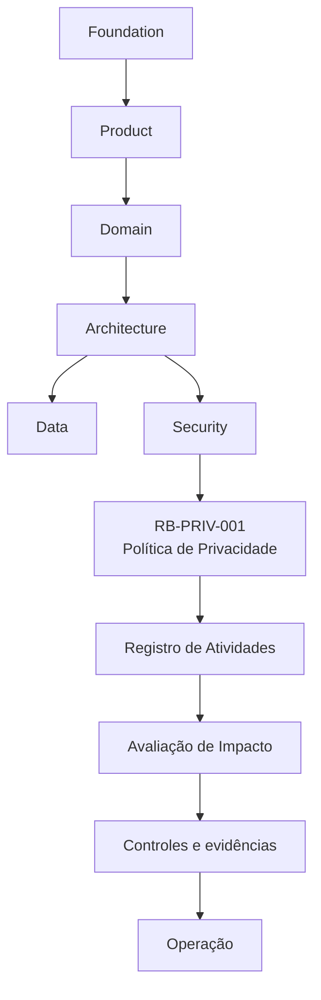
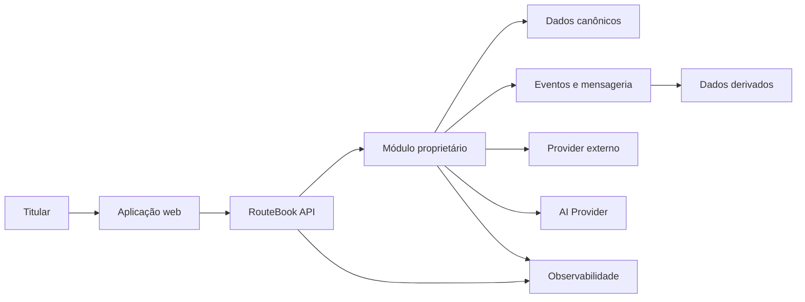
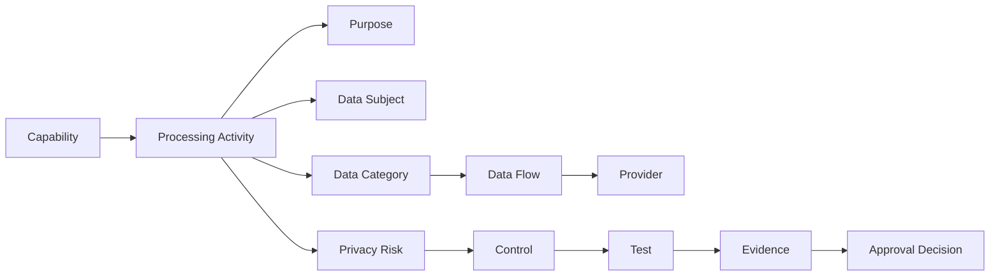

---

id: RB-PRIV-002

title: Registro de Atividades de Tratamento e Avaliações de Impacto à Privacidade
description: Define o inventário oficial das atividades de tratamento de dados do RouteBook, os critérios para avaliações de impacto à privacidade e os processos de aprovação, revisão, evidência e acompanhamento dos riscos identificados.

document_type: privacy
owner: Privacy

status: Draft
version: "0.1.0"

created: "2026-07-21"
last_updated: null

authors:

- RouteBook Team

tags:

- privacy
- data-protection
- processing-activities
- data-inventory
- data-mapping
- privacy-impact-assessment
- data-protection-impact-assessment
- data-lineage
- legal-basis
- retention
- data-sharing
- artificial-intelligence
- governance
- diagrams
- mermaid

related_documents:

- RB-CORE-0001
- RB-CORE-0002
- RB-CORE-0003
- RB-CORE-0004
- RB-PRD-001
- RB-PRD-002
- RB-PRD-003
- RB-PRD-004
- RB-PRD-005
- RB-PRD-006
- RB-PRD-007
- RB-PRD-008
- RB-DOM-001
- RB-DOM-002
- RB-DOM-003
- RB-DOM-004
- RB-ARC-001
- RB-ARC-002
- RB-ARC-003
- RB-ARC-004
- RB-ARC-005
- RB-DATA-001
- RB-DATA-002
- RB-API-001
- RB-SEC-001
- RB-SEC-002
- RB-SEC-003
- RB-PRIV-001
- RB-OBS-001
- RB-QA-001
- RB-QA-002
- RB-OPS-001
- RB-OPS-002
- RB-SRE-001
- RB-AI-001
- RB-AI-003
- RB-AI-004
- RB-AI-005
- RB-AI-006

prerequisites:

- RB-CORE-0004
- RB-DOM-001
- RB-DOM-002
- RB-DOM-003
- RB-DOM-004
- RB-ARC-001
- RB-ARC-002
- RB-ARC-003
- RB-ARC-004
- RB-ARC-005
- RB-DATA-001
- RB-DATA-002
- RB-API-001
- RB-SEC-001
- RB-SEC-002
- RB-SEC-003
- RB-PRIV-001

next_documents:

- RB-PRIV-003

ai_context:
priority: critical
index: true
---

# RouteBook — Registro de Atividades de Tratamento e Avaliações de Impacto à Privacidade

## Parte I — Fundamentos

### 1. Propósito

Este documento define os processos oficiais para registrar, analisar, aprovar, revisar e acompanhar as atividades de tratamento de dados pessoais realizadas pelo RouteBook.

Seu objetivo é transformar os princípios estabelecidos no `RB-PRIV-001` em artefatos operacionais capazes de demonstrar:

* quais dados pessoais são tratados;
* quem são os titulares;
* por que o tratamento ocorre;
* quais capacidades utilizam os dados;
* onde os dados são coletados;
* onde são armazenados;
* por quais módulos circulam;
* quais Providers recebem os dados;
* quais controles são aplicados;
* por quanto tempo os dados são mantidos;
* como os dados são excluídos;
* quais riscos de privacidade existem;
* quando uma avaliação de impacto é necessária;
* quais decisões foram tomadas;
* quais riscos residuais foram aceitos;
* quais evidências sustentam a operação.

Este documento estabelece dois artefatos centrais:

1. Registro de Atividades de Tratamento;
2. Avaliação de Impacto à Privacidade.

---

### 2. Relação com o RB-PRIV-001

O `RB-PRIV-001 — Privacidade, Proteção de Dados e Ciclo de Vida das Informações` define:

* princípios de privacidade;
* classificação de dados;
* minimização;
* transparência;
* controle do Usuário;
* retenção;
* exclusão;
* anonimização;
* direitos dos titulares;
* privacidade de IA.

O `RB-PRIV-002` define como esses princípios deverão ser documentados, avaliados e demonstrados para cada atividade de tratamento.

Este documento não redefine a política de privacidade.

Ele estabelece os registros e processos necessários para aplicá-la.

---

### 3. Objetivos

O processo deverá:

1. manter um inventário confiável dos tratamentos;
2. identificar dados pessoais em todas as capacidades;
3. mapear fluxos e dependências;
4. documentar finalidades;
5. registrar necessidade e proporcionalidade;
6. identificar Providers;
7. definir retenção e exclusão;
8. avaliar riscos aos titulares;
9. estabelecer controles;
10. impedir tratamentos sem owner;
11. impedir mudanças materiais sem revisão;
12. produzir evidências auditáveis;
13. apoiar solicitações dos titulares;
14. apoiar resposta a incidentes;
15. governar tratamentos realizados por IA.

---

### 4. Escopo

Este documento se aplica a tratamentos realizados por:

* aplicação web;
* APIs;
* módulos internos;
* banco de dados;
* cache;
* projeções;
* eventos;
* Outbox;
* Inbox;
* filas;
* jobs;
* observabilidade;
* suporte;
* operações administrativas;
* integrações;
* Providers;
* AI Providers;
* agentes;
* Tools;
* Context Builders;
* Context Snapshots;
* backups;
* ambientes de desenvolvimento e teste.

---

### 5. Fora do escopo

Este documento não constitui:

* parecer jurídico;
* política pública de privacidade;
* contrato com operador;
* cláusula contratual;
* aviso de cookies;
* resposta jurídica definitiva;
* avaliação regulatória específica de uma jurisdição.

A análise jurídica formal deverá ser incorporada quando necessária pelos responsáveis apropriados.

---

### 6. Princípio central

Nenhuma atividade de tratamento relevante deverá existir sem finalidade, owner, escopo, retenção, controles e evidências documentadas.

```text
Capacidade
→ finalidade
→ titulares
→ dados
→ fluxo
→ armazenamento
→ compartilhamento
→ retenção
→ riscos
→ controles
→ evidências
→ revisão
```

---

### 7. Autoridade documental

O registro deverá implementar e respeitar:

* Foundation;
* Product;
* Domain;
* Architecture;
* Data;
* Security;
* Privacy;
* Artificial Intelligence;
* Quality;
* Operations.



---

## Parte II — Conceitos

### 8. Atividade de tratamento

Atividade de tratamento é um conjunto organizado de operações realizadas sobre dados pessoais para cumprir uma ou mais finalidades relacionadas.

Exemplos:

* criação de conta;
* autenticação;
* criação de Trip;
* personalização de Recommendations;
* geração de Itinerary Proposal;
* compartilhamento de Trip;
* cálculo de distância;
* suporte;
* monitoramento de segurança;
* exclusão de conta.

---

### 9. Registro de Atividades de Tratamento

O Registro de Atividades de Tratamento é o inventário canônico que descreve como cada atividade utiliza dados pessoais.

Neste documento, o registro poderá ser referido como:

```text
Processing Activity Record
```

---

### 10. Avaliação de Impacto à Privacidade

A Avaliação de Impacto à Privacidade é o processo estruturado utilizado para analisar tratamentos que possam produzir risco relevante aos direitos, à autonomia, à privacidade ou à segurança dos titulares.

---

### 11. Titular

Titular é a pessoa à qual os dados pessoais se referem.

---

### 12. Categoria de titular

Categorias iniciais poderão incluir:

* User;
* participante de Trip;
* convidado;
* viajante não autenticado;
* criança ou adolescente;
* contato informado por terceiro;
* pessoa mencionada em conteúdo;
* usuário de suporte.

---

### 13. Categoria de dados

Categoria de dados agrupa elementos pessoais com finalidade ou risco semelhante.

Exemplos:

* identificação;
* contato;
* autenticação;
* localização;
* viagem;
* perfil;
* preferências;
* restrições;
* acessibilidade;
* conteúdo;
* telemetria;
* auditoria;
* IA.

---

### 14. Finalidade

Finalidade é o resultado legítimo e específico que justifica o tratamento.

---

### 15. Base ou justificativa de tratamento

É o fundamento documentado que sustenta a realização de uma atividade.

Sua classificação definitiva deverá respeitar a avaliação jurídica aplicável.

---

### 16. Fluxo de dados

Fluxo de dados representa a movimentação de informações entre:

* titular;
* cliente;
* API;
* módulo;
* armazenamento;
* evento;
* job;
* Provider;
* agente;
* operação.

---

### 17. Necessidade

Necessidade avalia se a finalidade pode ser cumprida com menos dados, menor precisão, menor retenção ou menor compartilhamento.

---

### 18. Proporcionalidade

Proporcionalidade avalia se os benefícios esperados justificam o impacto e o risco do tratamento.

---

### 19. Risco ao titular

Risco ao titular é a possibilidade de uma atividade provocar consequência adversa para uma pessoa.

---

### 20. Tratamento de alto risco

Tratamento de alto risco é aquele que, por natureza, escala, finalidade, sensibilidade ou tecnologia, pode produzir impacto relevante.

---

## Parte III — Registro canônico

### 21. Identificador

Cada atividade deverá possuir um identificador único.

Formato sugerido:

```text
RB-PA-<AREA>-NNN
```

Exemplos:

```text
RB-PA-IAM-001
RB-PA-TRIP-001
RB-PA-AI-001
RB-PA-OBS-001
```

---

### 22. Estrutura obrigatória

Cada registro deverá conter:

```text
processingActivityId
title
description
owner
domainOwner
status
version
createdAt
lastReviewedAt
reviewFrequency
capabilities
purposes
dataSubjects
dataCategories
dataElements
sources
collectionMethods
systems
storageLocations
recipients
providers
transfers
retentionRules
deletionProcedures
securityControls
privacyControls
aiInvolvement
automatedDecisions
legalAssessment
riskClassification
impactAssessment
relatedIncidents
relatedExceptions
evidence
```

---

### 23. Status

Estados possíveis:

* Draft;
* Under Review;
* Approved;
* Active;
* Suspended;
* Under Remediation;
* Deprecated;
* Archived.

---

### 24. Owner

Toda atividade deverá possuir um owner responsável por:

* manter o registro;
* garantir a finalidade;
* validar alterações;
* acompanhar controles;
* revisar riscos;
* coordenar correções;
* fornecer evidências.

---

### 25. Domain owner

O domínio proprietário dos dados deverá ser identificado.

O owner da atividade não substitui o ownership canônico dos dados.

---

### 26. Versionamento

Mudanças materiais deverão gerar nova versão do registro.

Mudanças materiais incluem:

* nova finalidade;
* nova categoria de dados;
* novo titular;
* novo Provider;
* nova retenção;
* nova operação automatizada;
* novo uso de IA;
* novo compartilhamento;
* maior precisão;
* ampliação de escala.

---

## Parte IV — Finalidades

### 27. Identificador de finalidade

Cada finalidade reutilizável deverá possuir identificador.

Formato sugerido:

```text
RB-PUR-NNN
```

---

### 28. Estrutura

```text
purposeId
name
description
expectedOutcome
capabilities
dataCategories
necessity
owner
status
```

---

### 29. Finalidade específica

A finalidade deverá ser suficientemente específica para permitir:

* compreensão;
* avaliação;
* minimização;
* definição de retenção;
* identificação de incompatibilidade.

---

### 30. Finalidades genéricas

Não utilizar isoladamente expressões como:

* melhorar o serviço;
* fins internos;
* segurança;
* personalização;
* analytics;
* experiência do usuário.

Essas expressões deverão ser detalhadas.

---

### 31. Exemplo de finalidade adequada

```text
Utilizar preferências de viagem fornecidas pelo User para ordenar
Recommendations de Places dentro de uma Trip específica.
```

---

### 32. Compatibilidade

Uma nova utilização deverá avaliar:

* relação com a finalidade original;
* contexto da coleta;
* expectativa do titular;
* natureza dos dados;
* consequências;
* controles adicionais;
* possibilidade de nova comunicação.

---

## Parte V — Inventário de dados

### 33. Elemento de dado

Cada elemento relevante deverá possuir:

```text
dataElementId
name
description
domainOwner
classification
sensitivity
source
format
storage
retention
deletion
usage
```

---

### 34. Identificadores

Identificadores internos continuam sendo dados pessoais quando puderem ser relacionados a uma pessoa.

Exemplos:

* UserId;
* AccountId;
* sessionId;
* deviceId;
* correlationId associado;
* externalSubject.

---

### 35. Dados inferidos

Dados inferidos deverão ser inventariados separadamente dos dados fornecidos.

Exemplos:

* preferência inferida;
* interesse provável;
* ritmo estimado;
* orçamento estimado;
* localização aproximada;
* perfil de comportamento.

---

### 36. Dados observados

Poderão incluir:

* cliques;
* busca;
* seleção;
* histórico;
* uso de funcionalidade;
* falhas;
* dispositivo;
* endereço IP.

---

### 37. Dados derivados

Poderão incluir:

* Recommendation;
* score;
* categoria;
* agrupamento;
* Planning Conflict;
* estimativa;
* ranking;
* contexto resumido.

---

### 38. Dados sensíveis

Deverão receber marcação explícita.

Exemplos:

* acessibilidade;
* condição de saúde informada;
* restrição ligada à saúde;
* localização precisa;
* dados de menores;
* conteúdo íntimo ou privado.

---

## Parte VI — Mapeamento de fluxos

### 39. Obrigatoriedade

Atividades que atravessem múltiplos sistemas ou Providers deverão possuir fluxo documentado.

---

### 40. Elementos

O fluxo deverá mostrar:

* origem;
* ponto de coleta;
* transformação;
* módulo proprietário;
* armazenamento;
* dados derivados;
* eventos;
* Providers;
* destino;
* exclusão.

---

### 41. Modelo geral



---

### 42. Fronteiras

Cada fluxo deverá indicar:

* fronteira pública;
* fronteira de Account;
* fronteira de Trip;
* fronteira modular;
* fronteira externa;
* fronteira privilegiada;
* fronteira de IA.

---

### 43. Transformações

Transformações deverão ser identificadas.

Exemplos:

* agregação;
* normalização;
* pseudonimização;
* anonimização;
* redução de precisão;
* enriquecimento;
* embedding;
* resumo por IA.

---

### 44. Dados em trânsito

Cada transferência deverá registrar:

* origem;
* destino;
* categorias;
* finalidade;
* protocolo;
* criptografia;
* autenticação;
* frequência;
* volume.

---

## Parte VII — Fontes e coleta

### 45. Fontes

Fontes possíveis:

* titular;
* outro participante;
* dispositivo;
* Provider;
* inferência;
* dado público;
* operação;
* suporte;
* sistema interno.

---

### 46. Coleta direta

Dados coletados diretamente deverão possuir transparência contextual quando aplicável.

---

### 47. Coleta indireta

Dados recebidos de terceiros deverão registrar:

* origem;
* confiabilidade;
* finalidade;
* autorização;
* comunicação necessária;
* mecanismo de correção.

---

### 48. Dados públicos

Disponibilidade pública não elimina a necessidade de avaliar:

* finalidade;
* necessidade;
* expectativa;
* licença;
* impacto;
* retenção.

---

### 49. Conteúdo livre

A coleta de conteúdo livre deverá considerar o risco de inclusão não intencional de:

* dados sensíveis;
* dados de terceiros;
* secrets;
* dados financeiros;
* informações de crianças.

---

## Parte VIII — Armazenamento e lineage

### 50. Armazenamentos

O registro deverá identificar:

* banco transacional;
* cache;
* índice;
* Object Storage;
* fila;
* DLQ;
* log;
* trace;
* backup;
* data store de IA;
* memória;
* Provider.

---

### 51. Fonte canônica

Cada dado deverá possuir fonte canônica definida.

---

### 52. Cópias derivadas

Cópias deverão ser registradas quando relevantes para:

* acesso;
* retenção;
* exclusão;
* portabilidade;
* incidente;
* reconstrução.

---

### 53. Data lineage

O lineage deverá permitir determinar:

* origem;
* transformações;
* destinos;
* derivados;
* Providers;
* regras de exclusão.

---

### 54. Reconstrução

Projeções reconstruídas não deverão reintroduzir dados já excluídos.

---

### 55. Restore

Restaurações deverão reaplicar:

* exclusões;
* revogações;
* bloqueios;
* políticas vigentes;
* tombstones.

---

## Parte IX — Compartilhamentos e Providers

### 56. Recipiente

Todo destinatário deverá ser classificado como:

* interno;
* participante autorizado;
* operador;
* suboperador;
* Provider independente;
* autoridade;
* público.

---

### 57. Registro de Provider

Cada Provider deverá possuir:

```text
providerId
name
capability
owner
dataCategories
subjects
purpose
processingLocation
subprocessors
retention
deletion
trainingUsage
securityAssessment
privacyAssessment
contractStatus
exitPlan
```

---

### 58. Aprovação

Nenhum Provider deverá receber dados pessoais antes da avaliação proporcional ao risco.

---

### 59. Suboperadores

Suboperadores relevantes deverão ser conhecidos ou governados contratualmente.

---

### 60. Uso para treinamento

O registro deverá declarar explicitamente se o Provider pode utilizar dados para:

* treinamento;
* melhoria;
* avaliação;
* armazenamento;
* revisão humana.

O estado desconhecido não deverá ser tratado como ausência de uso.

---

### 61. Exit plan

Providers críticos deverão possuir estratégia de:

* interrupção;
* exportação;
* exclusão;
* substituição;
* revogação de credenciais;
* validação final.

---

## Parte X — Retenção

### 62. Regra de retenção

Cada categoria deverá possuir regra documentada.

Formato:

```text
retentionRuleId
dataCategory
purpose
startEvent
duration
endEvent
exceptions
deletionMethod
owner
evidence
```

---

### 63. Eventos de início

Exemplos:

* coleta;
* criação da conta;
* encerramento da Trip;
* revogação;
* término de contrato;
* última interação;
* conclusão de incidente.

---

### 64. Eventos de término

Exemplos:

* prazo atingido;
* conta excluída;
* finalidade encerrada;
* solicitação válida;
* Provider descontinuado;
* obrigação encerrada.

---

### 65. Retenção indefinida

Não deverá ser utilizada sem justificativa formal e revisão periódica.

---

### 66. Retenção por conveniência

Facilidade técnica ou custo de exclusão não justificam retenção permanente.

---

### 67. Backups

As regras deverão documentar:

* janela;
* rotação;
* expiração;
* proteção;
* comportamento em restore;
* exclusões pendentes.

---

## Parte XI — Exclusão e anonimização

### 68. Procedimento de exclusão

Cada atividade deverá indicar como os dados serão removidos de:

* fonte canônica;
* projeções;
* cache;
* índice;
* arquivos;
* Providers;
* memória de IA;
* embeddings;
* backups.

---

### 69. Exclusão lógica

Somente deverá ser utilizada quando houver finalidade documentada para preservar o registro.

---

### 70. Tombstone

Tombstones poderão evitar reintrodução de dados por:

* replay;
* sincronização;
* restore;
* importação.

---

### 71. Anonimização

A atividade deverá documentar:

* técnica;
* atributos removidos;
* atributos generalizados;
* risco de reidentificação;
* acesso;
* validação;
* irreversibilidade esperada.

---

### 72. Pseudonimização

Deverá registrar:

* identificador substituto;
* localização da chave;
* acesso;
* separação;
* rotação;
* possibilidade de reidentificação.

---

## Parte XII — Uso de IA

### 73. Obrigatoriedade

Toda atividade com IA deverá declarar:

```text
aiCapabilityId
agentId
providerId
modelFamily
promptVersion
contextCategories
contextSources
tools
outputs
memory
retention
humanReview
```

---

### 74. Contexto

O registro deverá identificar precisamente quais categorias entram no Context Builder.

---

### 75. Context Snapshot

Deverá registrar:

* finalidade;
* escopo;
* classificação;
* retenção;
* Provider;
* Provenance;
* possibilidade de replay.

---

### 76. Prompt

O tratamento deverá diferenciar:

* prompt de sistema;
* instrução;
* conteúdo do User;
* contexto recuperado;
* resposta;
* Tool result.

---

### 77. Memória

Memória deverá ser tratada como armazenamento de dados.

O registro deverá definir:

* conteúdo permitido;
* finalidade;
* escopo;
* expiração;
* exclusão;
* acesso.

---

### 78. Embeddings

Embeddings deverão possuir:

* origem;
* finalidade;
* modelo;
* armazenamento;
* retenção;
* exclusão;
* avaliação de reversibilidade;
* escopo de Account.

---

### 79. Decisão automatizada

O registro deverá declarar se a atividade:

* apenas recomenda;
* prioriza;
* classifica;
* gera Proposal;
* aplica ação;
* produz efeito relevante.

Recommendation não é Decision.

Itinerary Proposal não é alteração aplicada.

---

### 80. Human-in-the-loop

A participação humana deverá ser descrita quando utilizada como controle.

---

## Parte XIII — Triagem para avaliação de impacto

### 81. Triagem obrigatória

Toda nova atividade de tratamento deverá passar por triagem inicial.

---

### 82. Perguntas de triagem

A triagem deverá verificar se a atividade envolve:

* dado sensível;
* localização precisa;
* crianças ou adolescentes;
* monitoramento sistemático;
* inferências;
* profiling;
* IA generativa;
* decisão automatizada;
* combinação de fontes;
* grande escala;
* novo Provider;
* compartilhamento externo;
* dados de terceiros;
* tratamento inesperado;
* retenção prolongada;
* impossibilidade de oposição;
* risco de exclusão ou discriminação.

---

### 83. Resultado

A triagem poderá resultar em:

* avaliação não necessária;
* avaliação simplificada;
* avaliação completa;
* revisão jurídica;
* redesign obrigatório;
* atividade não autorizada.

---

### 84. Registro da triagem

```text
screeningId
processingActivityId
answers
riskIndicators
decision
justification
reviewer
reviewedAt
```

---

## Parte XIV — Gatilhos de avaliação completa

### 85. Gatilhos obrigatórios

Uma avaliação completa deverá ser realizada quando houver:

* dado pessoal sensível em escala;
* dados de menores combinados com personalização;
* localização precisa ou histórica;
* monitoramento sistemático;
* inferência de atributos sensíveis;
* IA com capacidade de ação;
* compartilhamento externo de alto risco;
* novo uso incompatível;
* combinação de bases que aumente identificação;
* exposição potencial entre Accounts;
* risco elevado aos direitos;
* tratamento inovador sem controles maduros.

---

### 86. Gatilhos técnicos

Também considerar:

* novo Agent;
* nova Tool;
* memória persistente;
* novo vector store;
* novo Provider;
* upload de conteúdo;
* processamento de imagens;
* reconhecimento;
* análise comportamental;
* integração com dispositivo.

---

### 87. Gatilhos de mudança

Uma avaliação existente deverá ser reaberta quando houver:

* nova finalidade;
* novo dado;
* mudança de escala;
* mudança de modelo;
* nova Tool;
* novo Provider;
* nova região;
* retenção maior;
* incidente;
* falha de controle;
* alteração de autonomia.

---

## Parte XV — Estrutura da avaliação de impacto

### 88. Identificação

Cada avaliação deverá possuir:

```text
privacyImpactAssessmentId
title
processingActivityId
owner
reviewers
status
version
createdAt
approvedAt
reviewDate
```

---

### 89. Seções obrigatórias

A avaliação deverá conter:

1. resumo executivo;
2. descrição da atividade;
3. finalidades;
4. titulares;
5. dados;
6. fluxos;
7. Providers;
8. necessidade;
9. proporcionalidade;
10. expectativas dos titulares;
11. riscos;
12. controles;
13. risco residual;
14. consulta;
15. decisão;
16. plano de ação;
17. aprovação;
18. revisão.

---

### 90. Estados

Estados possíveis:

* Draft;
* Under Review;
* Changes Required;
* Approved;
* Approved with Conditions;
* Rejected;
* Suspended;
* Superseded;
* Archived.

---

## Parte XVI — Necessidade e proporcionalidade

### 91. Necessidade

A avaliação deverá responder:

* a finalidade é legítima e específica;
* cada categoria é necessária;
* a precisão é necessária;
* a retenção é necessária;
* o Provider é necessário;
* a memória é necessária;
* existe alternativa menos invasiva.

---

### 92. Proporcionalidade

Avaliar:

* benefício;
* impacto;
* expectativa;
* transparência;
* controle;
* vulnerabilidade dos titulares;
* reversibilidade;
* escala;
* assimetria.

---

### 93. Alternativas

A avaliação deverá considerar alternativas como:

* não coletar;
* coletar posteriormente;
* reduzir precisão;
* processar localmente;
* agregar;
* pseudonimizar;
* anonimizar;
* limitar memória;
* eliminar Provider;
* utilizar regra determinística;
* exigir confirmação.

---

### 94. Decisão de arquitetura

Quando uma alternativa menos invasiva for razoável, a escolha de opção mais intrusiva deverá ser justificada.

---

## Parte XVII — Avaliação de risco

### 95. Dimensões

Cada risco deverá considerar:

* probabilidade;
* impacto;
* escala;
* sensibilidade;
* exposição;
* vulnerabilidade do titular;
* detectabilidade;
* reversibilidade;
* duração.

---

### 96. Tipos de impacto

Considerar:

* exposição;
* perda de controle;
* discriminação;
* exclusão;
* fraude;
* risco físico;
* constrangimento;
* localização indevida;
* decisão incorreta;
* acesso cross-account;
* inferência sensível;
* uso incompatível;
* impossibilidade de exclusão.

---

### 97. Probabilidade

Escala inicial:

| Nível | Descrição          |
| ----- | ------------------ |
| 1     | improvável         |
| 2     | baixa              |
| 3     | possível           |
| 4     | provável           |
| 5     | altamente provável |

---

### 98. Impacto

| Nível | Descrição |
| ----- | --------- |
| 1     | mínimo    |
| 2     | limitado  |
| 3     | moderado  |
| 4     | alto      |
| 5     | crítico   |

---

### 99. Classificação inicial

```text
riskScore = likelihood × impact
```

| Pontuação | Classificação |
| --------: | ------------- |
|       1–4 | Low           |
|       5–9 | Moderate      |
|     10–16 | High          |
|     17–25 | Critical      |

---

### 100. Julgamento contextual

A pontuação não substitui análise.

Riscos envolvendo:

* crianças;
* localização precisa;
* dados sensíveis;
* cross-account;
* IA autônoma;
* reidentificação;
* grande escala;

poderão ser elevados independentemente do valor numérico.

---

## Parte XVIII — Controles

### 101. Categorias

Controles poderão ser:

* preventivos;
* detectivos;
* responsivos;
* corretivos;
* compensatórios;
* de recuperação.

---

### 102. Controles de minimização

Exemplos:

* remoção de campo;
* coleta progressiva;
* redução de precisão;
* agregação;
* redaction;
* escopo temporal;
* limitação de contexto.

---

### 103. Controles de acesso

Exemplos:

* autenticação;
* autorização;
* isolamento;
* menor privilégio;
* segregação;
* auditoria.

---

### 104. Controles de transparência

Exemplos:

* aviso contextual;
* explicação;
* origem;
* configuração;
* histórico;
* Provenance.

---

### 105. Controles de ciclo de vida

Exemplos:

* retenção automatizada;
* exclusão;
* tombstone;
* anonimização;
* expiração;
* reconciliação.

---

### 106. Controles de IA

Exemplos:

* Context Builder;
* allowlist de Tools;
* schema;
* confirmação;
* limite de memória;
* filtro de contexto;
* validação de referências;
* testes de exfiltração.

---

### 107. Evidência

Todo controle relevante deverá possuir:

* owner;
* implementação;
* teste;
* resultado;
* frequência;
* mecanismo de falha;
* exceção.

---

## Parte XIX — Risco residual

### 108. Reavaliação

Após os controles, cada risco deverá ser reclassificado.

---

### 109. Aceitação

Riscos residuais deverão possuir:

* owner;
* justificativa;
* aprovador;
* prazo;
* controles compensatórios;
* data de revisão.

---

### 110. Risco High

Risco residual High deverá exigir aprovação explícita e plano de redução.

---

### 111. Risco Critical

Risco residual Critical deverá impedir a operação normal, salvo decisão excepcional formal e temporária.

---

### 112. Condições

A aprovação poderá impor:

* rollout limitado;
* retenção menor;
* escopo reduzido;
* monitoramento;
* revisão humana;
* proibição de memória;
* Provider alternativo;
* teste adicional.

---

## Parte XX — Aprovação

### 113. Participantes

Conforme o risco, a aprovação poderá envolver:

* Privacy;
* Security;
* Product;
* Architecture;
* Data;
* Artificial Intelligence;
* Platform;
* responsável jurídico.

---

### 114. Segregação

O autor não deverá ser o único aprovador de avaliação de alto risco.

---

### 115. Decisões

Resultados possíveis:

* Approved;
* Approved with Conditions;
* Changes Required;
* Rejected;
* Suspended.

---

### 116. Evidência de aprovação

Deverá registrar:

* decisão;
* participantes;
* data;
* versão;
* condições;
* riscos aceitos;
* prazo de revisão.

---

## Parte XXI — Plano de ação

### 117. Item de ação

Cada ação deverá possuir:

```text
actionId
assessmentId
description
owner
priority
targetDate
status
evidence
completedAt
```

---

### 118. Estados

* Open;
* In Progress;
* Blocked;
* Ready for Verification;
* Completed;
* Accepted;
* Cancelled.

---

### 119. Bloqueio

Ações necessárias para reduzir risco Critical deverão bloquear o lançamento.

---

### 120. Acompanhamento

A aprovação condicional não encerra a avaliação enquanto as condições permanecerem abertas.

---

## Parte XXII — Revisões

### 121. Frequência

A frequência deverá considerar:

* risco;
* escala;
* sensibilidade;
* mudança tecnológica;
* incidentes;
* velocidade de evolução.

---

### 122. Revisão periódica

Sugestão inicial:

| Risco    | Frequência máxima                   |
| -------- | ----------------------------------- |
| Critical | trimestral                          |
| High     | semestral                           |
| Moderate | anual                               |
| Low      | a cada dois anos ou quando alterado |

---

### 123. Revisão extraordinária

Obrigatória após:

* incidente;
* reclamação relevante;
* mudança de finalidade;
* novo Provider;
* nova IA;
* nova Tool;
* falha de exclusão;
* exposição;
* alteração de legislação aplicável;
* mudança de arquitetura.

---

### 124. Obsolescência

Avaliações substituídas deverão ser preservadas como histórico.

---

## Parte XXIII — Integração com desenvolvimento

### 125. Definition of Ready

Uma capacidade que trate dados pessoais estará pronta para implementação quando possuir:

* finalidade;
* owner;
* categorias de dados;
* titulares;
* fluxo inicial;
* retenção proposta;
* triagem;
* requisitos;
* controles.

---

### 126. Design review

A revisão deverá validar:

* minimização;
* escopo;
* visibilidade;
* Provider;
* IA;
* armazenamento;
* exclusão;
* riscos.

---

### 127. Pull request

Mudanças relevantes deverão referenciar:

* processingActivityId;
* assessmentId quando aplicável;
* controles;
* testes;
* exceções.

---

### 128. Definition of Done

A capacidade estará concluída quando:

* registro estiver aprovado;
* avaliação estiver aprovada quando necessária;
* controles estiverem implementados;
* testes estiverem aprovados;
* retenção estiver configurada;
* exclusão estiver coberta;
* documentação estiver atualizada;
* riscos estiverem tratados.

---

### 129. Release

Não deverá avançar com:

* atividade sem owner;
* finalidade ausente;
* avaliação obrigatória incompleta;
* risco Critical não tratado;
* Provider não avaliado;
* exclusão inexistente;
* cross-account conhecido;
* controle crítico sem evidência.

---

## Parte XXIV — Integração com qualidade

### 130. Casos de teste

A avaliação deverá gerar cenários para:

* acesso;
* isolamento;
* minimização;
* transparência;
* retenção;
* exclusão;
* anonimização;
* exportação;
* Provider;
* IA;
* restore.

---

### 131. Testes negativos

Deverão cobrir:

* outro Account;
* outra Trip;
* User sem acesso;
* Provider fora de escopo;
* Tool não autorizada;
* memória excluída;
* dado expirado;
* finalidade revogada.

---

### 132. Regressão

Correções e controles deverão possuir teste de regressão quando tecnicamente possível.

---

### 133. Evidência

Resultados deverão ser vinculados ao registro ou à avaliação.

---

## Parte XXV — Integração com incidentes

### 134. Uso durante incidentes

O registro deverá permitir identificar:

* dados afetados;
* titulares;
* Providers;
* armazenamentos;
* retenção;
* owners;
* controles;
* fluxo;
* procedimentos.

---

### 135. Incidente

Um incidente deverá provocar revisão quando revelar:

* fluxo desconhecido;
* Provider não registrado;
* dado não inventariado;
* controle inexistente;
* retenção incorreta;
* risco subestimado.

---

### 136. Comunicação

A avaliação deverá fornecer informações para análise de:

* categorias;
* volume;
* sensibilidade;
* duração;
* impacto;
* titulares;
* medidas de contenção.

---

## Parte XXVI — Solicitações dos titulares

### 137. Localização de dados

O registro deverá permitir localizar dados por:

* módulo;
* armazenamento;
* Provider;
* finalidade;
* categoria;
* titular.

---

### 138. Acesso

A resposta deverá utilizar o inventário para determinar:

* quais dados existem;
* quais origens;
* quais finalidades;
* quais compartilhamentos;
* quais retenções.

---

### 139. Correção

Dados derivados deverão ser reavaliados quando a fonte for corrigida.

---

### 140. Exclusão

O registro deverá orientar:

* ordem;
* escopo;
* dependências;
* Providers;
* derivados;
* backups;
* evidência.

---

### 141. Portabilidade

O inventário deverá identificar quais dados poderão integrar exportações estruturadas.

---

## Parte XXVII — Exceções

### 142. Estrutura

```text
privacyExceptionId
processingActivityId
requirement
scope
justification
risk
controls
owner
approvedBy
createdAt
expiresAt
status
```

---

### 143. Expiração

Exceções deverão ser temporárias por padrão.

---

### 144. Renovação

Renovação deverá exigir:

* nova justificativa;
* risco atualizado;
* evidência;
* novo prazo;
* aprovação.

---

### 145. Proibições

Não deverão ser excepcionados informalmente:

* isolamento entre Accounts;
* finalidade;
* proteção de dados sensíveis;
* exclusão obrigatória;
* avaliação de alto risco;
* controle de Provider;
* autorização de Tool.

---

## Parte XXVIII — Métricas

### 146. Cobertura

Acompanhar:

* capacidades com registro;
* atividades aprovadas;
* atividades sem owner;
* atividades sem retenção;
* atividades com IA;
* Providers avaliados;
* avaliações pendentes;
* avaliações vencidas.

---

### 147. Riscos

Acompanhar:

* riscos por classificação;
* riscos residuais;
* riscos vencidos;
* riscos recorrentes;
* ações atrasadas;
* exceções abertas.

---

### 148. Ciclo de vida

Acompanhar:

* regras de retenção automatizadas;
* falhas de exclusão;
* dados sem lineage;
* Providers sem confirmação de exclusão;
* restores com reaparecimento.

---

### 149. Efetividade

Acompanhar:

* controles sem evidência;
* testes falhando;
* incidentes relacionados;
* reclamações;
* redução de dados;
* redução de retenção.

---

### 150. Métricas éticas

Métricas de privacidade não deverão exigir coleta desnecessária de novos dados pessoais.

---

## Parte XXIX — Responsabilidades

### 151. Privacy

Responsável por:

* metodologia;
* revisão;
* avaliações;
* riscos;
* exceções;
* governança;
* transparência.

---

### 152. Product

Responsável por:

* finalidade;
* necessidade;
* experiência;
* impacto;
* mudanças de escopo.

---

### 153. Domain owner

Responsável por:

* significado;
* ownership;
* integridade;
* uso permitido;
* ciclo de vida.

---

### 154. Data

Responsável por:

* inventário;
* lineage;
* retenção;
* exclusão;
* anonimização;
* localização.

---

### 155. Security

Responsável por:

* ameaças;
* controles;
* acesso;
* incidentes;
* proteção.

---

### 156. Engineering

Responsável por:

* implementação;
* documentação técnica;
* controles;
* testes;
* correções;
* evidências.

---

### 157. Artificial Intelligence

Responsável por:

* contexto;
* Provider;
* modelos;
* memória;
* Tools;
* outputs;
* avaliações.

---

### 158. Platform

Responsável por:

* infraestrutura;
* backups;
* observabilidade;
* secrets;
* acessos;
* operações.

---

### 159. Quality Engineering

Responsável por:

* cobertura;
* cenários negativos;
* regressão;
* validação independente.

---

## Parte XXX — Anti-patterns

### 160. Registro como planilha estática

O registro deverá acompanhar a evolução real do sistema.

---

### 161. Uma atividade para todo o produto

Atividades amplas demais impedem análise e governança.

---

### 162. Finalidade genérica

Finalidades vagas impedem avaliação de compatibilidade.

---

### 163. Omitir dados derivados

Inferências e outputs também podem ser pessoais.

---

### 164. Registrar apenas banco principal

Cache, logs, filas, backups, IA e Providers também deverão ser considerados.

---

### 165. Avaliação após lançamento

Tratamentos de risco deverão ser avaliados antes da operação.

---

### 166. Avaliação sem ações

Riscos identificados deverão produzir controles ou decisão explícita.

---

### 167. Aprovação sem evidência

Controles planejados não equivalem a controles implementados.

---

### 168. Copiar avaliação anterior

Avaliações deverão refletir o contexto específico da atividade.

---

### 169. Provider tratado como caixa-preta

Seu comportamento deverá ser documentado e avaliado.

---

### 170. IA sem registro de contexto

Não é possível avaliar risco sem saber quais dados o modelo recebe.

---

### 171. Risco residual implícito

Todo risco relevante deverá possuir decisão explícita.

---

## Parte XXXI — Modelo de maturidade

### 172. Nível 1 — Inicial

* inventário básico;
* owners;
* finalidades;
* retenção inicial;
* triagem manual.

---

### 173. Nível 2 — Gerenciado

* registros por atividade;
* avaliações padronizadas;
* catálogo de Providers;
* riscos;
* ações;
* revisões.

---

### 174. Nível 3 — Verificável

* lineage;
* integração com CI/CD;
* evidências automatizadas;
* políticas de retenção;
* métricas;
* cobertura de testes.

---

### 175. Nível 4 — Adaptativo

* descoberta contínua;
* detecção de mudanças;
* políticas como código;
* avaliação automatizada supervisionada;
* governança dinâmica de IA.

---

## Parte XXXII — Estrutura documental

### 176. Organização sugerida

```text
docs/
└── privacy/
    ├── privacy-data-protection-and-information-lifecycle.md
    ├── records-of-processing-and-privacy-impact-assessments.md
    ├── processing-activities/
    ├── impact-assessments/
    ├── providers/
    ├── retention/
    ├── exceptions/
    └── templates/
```

---

### 177. Template de atividade

```text
processingActivityId:
title:
description:
owner:
status:
capabilities:
purposes:
dataSubjects:
dataCategories:
sources:
systems:
providers:
retentionRules:
deletionProcedures:
controls:
risks:
assessment:
evidence:
```

---

### 178. Template de avaliação

```text
privacyImpactAssessmentId:
processingActivityId:
title:
owner:
status:
scope:
purposes:
dataSubjects:
dataCategories:
flows:
necessity:
proportionality:
risks:
controls:
residualRisks:
actions:
decision:
approvals:
reviewDate:
```

---

## Parte XXXIII — Rastreabilidade

### 179. Cadeia



---

### 180. Matriz mínima

| Elemento   | Vinculação obrigatória |
| ---------- | ---------------------- |
| capacidade | atividade              |
| atividade  | finalidade             |
| atividade  | titulares              |
| atividade  | dados                  |
| dado       | armazenamento          |
| dado       | retenção               |
| fluxo      | Provider               |
| risco      | controle               |
| controle   | teste                  |
| avaliação  | decisão                |
| ação       | owner e prazo          |

---

## Parte XXXIV — Critérios de aceite

### 181. Registro

* estrutura definida;
* identificadores definidos;
* status definidos;
* ownership definido;
* versionamento definido;
* finalidades definidas.

---

### 182. Dados

* inventário definido;
* categorias definidas;
* dados inferidos cobertos;
* lineage definido;
* armazenamentos cobertos;
* Providers cobertos.

---

### 183. Ciclo de vida

* retenção definida;
* exclusão definida;
* anonimização definida;
* pseudonimização definida;
* backups cobertos;
* restore coberto.

---

### 184. IA

* capacidades de IA cobertas;
* contexto coberto;
* prompts cobertos;
* memória coberta;
* embeddings cobertos;
* Providers cobertos;
* Human-in-the-loop coberto.

---

### 185. Avaliação

* triagem definida;
* gatilhos definidos;
* estrutura definida;
* necessidade definida;
* proporcionalidade definida;
* classificação de risco definida;
* controles definidos;
* risco residual definido;
* aprovação definida.

---

### 186. Operação

* ações definidas;
* revisões definidas;
* integração com desenvolvimento definida;
* integração com QA definida;
* integração com incidentes definida;
* direitos dos titulares cobertos;
* métricas definidas;
* exceções definidas.

---

## Parte XXXV — Checklist final

### 187. Checklist documental

Antes de aprovar:

* frontmatter YAML é válido;
* ID é único;
* título está correto;
* existe apenas um H1;
* propósito está definido;
* escopo está definido;
* relação com RB-PRIV-001 está definida;
* conceitos estão definidos;
* atividade de tratamento está definida;
* avaliação de impacto está definida;
* estrutura do registro está definida;
* ownership está definido;
* finalidades estão definidas;
* inventário está definido;
* dados inferidos estão cobertos;
* dados derivados estão cobertos;
* fluxos estão definidos;
* fronteiras estão definidas;
* fontes estão definidas;
* armazenamentos estão definidos;
* lineage está definido;
* Providers estão definidos;
* retenção está definida;
* exclusão está definida;
* anonimização está definida;
* pseudonimização está definida;
* IA está coberta;
* Context Builder está coberto;
* Context Snapshot está coberto;
* memória está coberta;
* embeddings estão cobertos;
* triagem está definida;
* gatilhos estão definidos;
* necessidade está definida;
* proporcionalidade está definida;
* riscos estão definidos;
* controles estão definidos;
* risco residual está definido;
* aprovação está definida;
* plano de ação está definido;
* revisões estão definidas;
* desenvolvimento está integrado;
* qualidade está integrada;
* incidentes estão integrados;
* solicitações dos titulares estão integradas;
* exceções estão definidas;
* métricas estão definidas;
* responsabilidades estão definidas;
* anti-patterns estão definidos;
* maturidade está definida;
* estrutura documental está definida;
* rastreabilidade está presente;
* diagramas Mermaid renderizam no GitHub;
* blocos Mermaid não possuem atributos adicionais;
* não existem contradições com RB-SEC-001;
* não existem contradições com RB-SEC-002;
* não existem contradições com RB-SEC-003;
* não existem contradições com RB-PRIV-001;
* não existem contradições com RB-DATA-001;
* não existem contradições com RB-DATA-002;
* não existem contradições com RB-AI-001;
* não existem contradições com RB-AI-005;
* não existem contradições com RB-AI-006.

---

## Parte XXXVI — Declaração final

### 188. Declaração de governança

O RouteBook deverá conhecer, documentar e governar as atividades que realizam tratamento de dados pessoais.

Nenhuma atividade relevante deverá operar sem:

* finalidade;
* owner;
* titulares identificados;
* categorias de dados;
* fluxo documentado;
* armazenamento conhecido;
* retenção definida;
* exclusão planejada;
* Providers avaliados;
* controles verificáveis;
* riscos analisados;
* evidências;
* revisão.

Tratamentos de maior risco deverão ser avaliados antes da operação e sempre que houver mudança material.

Nenhum agente, Tool, Provider, modelo, job, módulo ou operador poderá ampliar silenciosamente:

* a finalidade;
* a coleta;
* a retenção;
* o compartilhamento;
* a precisão;
* a memória;
* a autonomia;
* o acesso.

O Registro de Atividades de Tratamento e as Avaliações de Impacto deverão permanecer sincronizados com a implementação real do RouteBook e funcionar como fontes canônicas para governança, qualidade, segurança, operação e evolução do produto.
