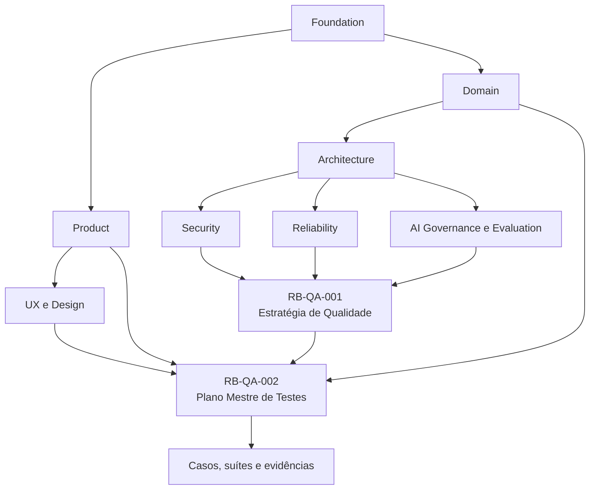
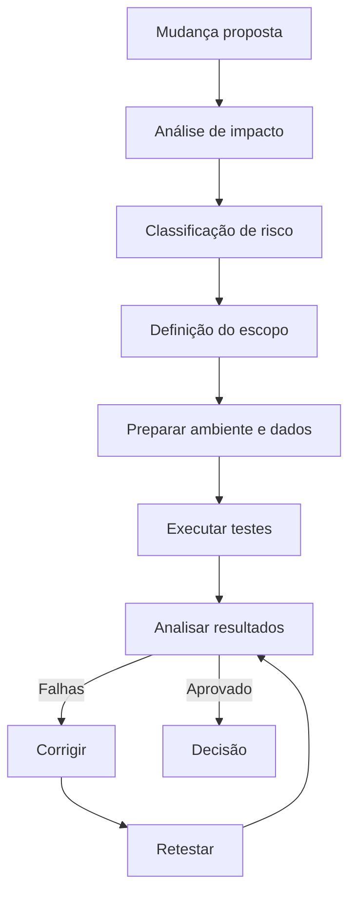

# RouteBook — Plano Mestre de Testes

## Parte I — Fundamentos

### 1. Propósito deste documento

Este documento define o Plano Mestre de Testes do RouteBook.

Seu objetivo é transformar a Estratégia de Qualidade e Testes em um plano executável, rastreável e governado para validar:

- produto;
- domínio;
- módulos;
- APIs;
- interfaces;
- dados;
- eventos;
- integrações;
- inteligência artificial;
- segurança;
- privacidade;
- acessibilidade;
- desempenho;
- confiabilidade;
- operação;
- continuidade.

O plano deverá orientar:

- Quality Engineering;
- Product;
- Design;
- Architecture;
- Backend;
- Frontend;
- Mobile, quando aplicável;
- Platform;
- Security;
- Data;
- Artificial Intelligence;
- Site Reliability Engineering;
- Support;
- agentes de engenharia;
- agentes de testes;
- agentes de avaliação.

Este documento define:

- escopo de testes;
- objetivos;
- níveis;
- tipos;
- prioridades;
- critérios de entrada;
- critérios de saída;
- ambientes;
- dados;
- automação;
- execução;
- evidências;
- defeitos;
- métricas;
- riscos;
- responsabilidades;
- governança;
- rastreabilidade;
- critérios de aprovação.

Este documento não substitui:

- a Estratégia de Qualidade e Testes;
- casos detalhados de teste;
- suítes automatizadas;
- documentação de produto;
- documentação de arquitetura;
- política de segurança;
- estratégia de avaliação de IA;
- runbooks operacionais;
- procedimentos específicos de release.

---

### 2. Autoridade documental

O Plano Mestre de Testes deverá respeitar:

- RouteBook Bible;
- requisitos de produto;
- Linguagem Ubíqua;
- Modelo de Domínio;
- Regras e Invariantes;
- Eventos e Ciclos de Vida;
- Arquitetura;
- Segurança;
- Observabilidade;
- Confiabilidade;
- Governança de IA;
- Estratégia de Avaliação de IA;
- Estratégia de Qualidade e Testes.



Nenhum teste poderá redefinir:

- comportamento de produto;
- regra de domínio;
- ownership;
- autorização;
- conceito;
- ciclo de vida;
- severidade;
- critério de negócio.

---

### 3. Princípio central

O RouteBook deverá ser testado de acordo com risco, impacto e criticidade.

```text
Requisito
→ risco
→ condição de teste
→ caso de teste
→ execução
→ evidência
→ decisão
```

---

### 4. Objetivos do plano

O plano deverá:

1. garantir cobertura dos requisitos;
2. proteger invariantes;
3. reduzir regressões;
4. antecipar falhas;
5. validar jornadas;
6. validar contratos;
7. validar dados;
8. validar segurança;
9. validar IA;
10. validar operação;
11. fornecer evidências;
12. apoiar decisões de release;
13. permitir evolução segura;
14. reduzir dependência de testes manuais repetitivos.

---

### 5. Qualidade como responsabilidade compartilhada

Quality Engineering coordena a estratégia e a evidência.

A qualidade deverá ser responsabilidade de:

- Product;
- Design;
- Engineering;
- Security;
- Data;
- Artificial Intelligence;
- Platform;
- Site Reliability Engineering;
- Support.

---

## Parte II — Escopo do plano

### 6. Escopo funcional

O plano deverá cobrir:

- Identity and Access;
- Trip Management;
- Traveler Profile;
- Place Catalog;
- Trip Collection;
- Itinerary Planning;
- Mobility;
- Decision Intelligence;
- Proposal Management;
- Planning Assurance;
- Data Governance;
- Platform.

---

### 7. Escopo de experiência

Deverá cobrir:

- onboarding;
- autenticação;
- criação de Trip;
- configuração de Travelers;
- descoberta de Places;
- organização de Collection;
- construção de Itinerary;
- visualização diária;
- Recommendations;
- Itinerary Proposals;
- Planning Conflicts;
- decisões durante a Trip;
- modos degradados;
- estados vazios;
- erros;
- acessibilidade;
- responsividade.

---

### 8. Escopo técnico

Deverá cobrir:

- frontend;
- backend;
- APIs;
- banco de dados;
- eventos;
- filas;
- jobs;
- caches;
- integrações;
- Providers;
- observabilidade;
- infraestrutura;
- deployments;
- migrations;
- backups;
- restauração;
- runtime de IA.

---

### 9. Fora do escopo inicial

Poderão permanecer fora do primeiro ciclo, desde que documentados:

- aplicações nativas não implementadas;
- operação multi-região ainda não adotada;
- autonomia AI-R3 ainda não aprovada;
- multiagente ainda não implementado;
- integrações futuras sem contrato aprovado;
- funcionalidades explicitamente classificadas como futuras.

---

### 10. Controle de escopo

Qualquer item fora do escopo deverá possuir:

- justificativa;
- risco;
- owner;
- mitigação;
- data de revisão.

---

## Parte III — Abordagem baseada em risco

### 11. Dimensões de risco

Cada requisito deverá ser avaliado por:

- impacto no Usuário;
- impacto no domínio;
- impacto financeiro;
- impacto em dados;
- impacto em segurança;
- probabilidade de falha;
- complexidade;
- frequência de uso;
- dificuldade de detecção;
- reversibilidade.

---

### 12. Classificação de risco

#### Risco crítico

Falha pode causar:

- acesso cross-account;
- perda de dados;
- corrupção;
- violação de Restriction mandatory;
- alteração indevida de Itinerary;
- aplicação de Proposal sem autorização;
- exposição de secrets;
- indisponibilidade ampla.

#### Risco alto

Falha pode causar:

- jornada principal bloqueada;
- Planning Conflict incorreto;
- Recommendation insegura;
- cálculo de mobilidade inválido;
- inconsistência entre versões;
- regressão ampla.

#### Risco moderado

Falha possui impacto limitado ou workaround.

#### Risco baixo

Falha possui impacto visual ou secundário sem risco relevante.

---

### 13. Prioridade de testes

| Risco | Prioridade | Profundidade |
|---|---|---|
| crítico | P0 | máxima |
| alto | P1 | ampliada |
| moderado | P2 | proporcional |
| baixo | P3 | essencial |

---

### 14. Cobertura mínima por risco

| Controle | P0 | P1 | P2 | P3 |
|---|---:|---:|---:|---:|
| testes unitários | obrigatório | obrigatório | recomendado | seletivo |
| testes de integração | obrigatório | obrigatório | recomendado | seletivo |
| testes de contrato | obrigatório | obrigatório | quando aplicável | quando aplicável |
| E2E | obrigatório para jornada | obrigatório para jornada | seletivo | raro |
| segurança | ampliada | obrigatória | básica | baseada em risco |
| performance | obrigatória | recomendada | seletiva | opcional |
| observabilidade | obrigatória | obrigatória | recomendada | básica |
| recuperação | obrigatória | recomendada | seletiva | opcional |

---

## Parte IV — Níveis de teste

### 15. Testes estáticos

Incluem:

- lint;
- type checking;
- análise estática;
- validação de schemas;
- validação de contratos;
- validação documental;
- scanners de segurança;
- validação de dependências.

---

### 16. Testes unitários

Deverão validar:

- regras isoladas;
- entidades;
- Value Objects;
- Policies;
- serviços de domínio;
- validators;
- transformações;
- estados;
- transições;
- error codes.

---

### 17. Testes de componente

Deverão validar:

- componentes frontend;
- hooks;
- formulários;
- estados visuais;
- componentes de domínio;
- adapters;
- handlers;
- workers.

---

### 18. Testes de integração

Deverão validar:

- banco;
- repositórios;
- filas;
- Outbox;
- Inbox;
- cache;
- Provider adapters;
- Context Builders;
- Tool Gateway;
- módulos conectados.

---

### 19. Testes de contrato

Deverão validar:

- APIs;
- eventos;
- Tools;
- Providers;
- schemas;
- consumidores;
- compatibilidade;
- versionamento.

---

### 20. Testes de sistema

Deverão validar capacidades completas em ambiente integrado.

---

### 21. Testes end-to-end

Deverão validar apenas jornadas críticas e de alto valor.

Não deverão substituir níveis inferiores.

---

### 22. Testes exploratórios

Deverão investigar:

- riscos emergentes;
- comportamento inesperado;
- inconsistências;
- usabilidade;
- integrações;
- cenários não previstos.

---

### 23. Testes em produção

Poderão incluir:

- smoke;
- synthetic monitoring;
- canary validation;
- feature flag validation;
- shadow evaluation;
- observação de métricas.

Não deverão produzir efeitos indevidos.

---

## Parte V — Tipos de teste

### 24. Testes funcionais

Validam comportamento esperado.

---

### 25. Testes de regressão

Validam que mudanças não degradaram comportamentos existentes.

---

### 26. Testes de segurança

Validam:

- autenticação;
- autorização;
- isolamento;
- secrets;
- input validation;
- dependências;
- IA;
- Tools;
- APIs;
- sessões.

---

### 27. Testes de desempenho

Validam:

- latência;
- throughput;
- concorrência;
- saturação;
- consumo;
- filas;
- banco;
- Providers;
- runtime de IA.

---

### 28. Testes de resiliência

Validam:

- timeouts;
- retries;
- circuit breakers;
- fallbacks;
- filas;
- recuperação;
- failover;
- backpressure;
- modos degradados.

---

### 29. Testes de acessibilidade

Validam:

- navegação por teclado;
- foco;
- semântica;
- contraste;
- leitores de tela;
- formulários;
- mensagens de erro;
- responsividade.

---

### 30. Testes de compatibilidade

Validam:

- navegadores;
- dispositivos;
- resoluções;
- versões;
- schemas;
- clientes;
- Providers.

---

### 31. Testes de dados

Validam:

- integridade;
- constraints;
- migrations;
- reconciliação;
- Provenance;
- Freshness;
- duplicidade;
- restauração;
- anonimização.

---

### 32. Testes de inteligência artificial

Validam:

- schemas;
- referências;
- domínio;
- segurança;
- qualidade;
- custo;
- latência;
- variabilidade;
- Tool Calls;
- Contexto;
- memória;
- fallback.

---

## Parte VI — Estratégia por módulo

### 33. Identity and Access

Cobertura mínima:

- criação de conta;
- autenticação;
- encerramento de sessão;
- expiração;
- recuperação;
- autorização;
- papéis;
- isolamento entre Accounts;
- revogação;
- rate limiting.

Falhas cross-account deverão possuir tolerância zero.

---

### 34. Trip Management

Cobertura mínima:

- criação;
- edição;
- status;
- período;
- destino;
- ownership;
- participantes;
- exclusão;
- versões;
- concorrência.

---

### 35. Traveler Profile

Cobertura mínima:

- Travelers;
- preferências;
- Restrictions;
- classificação;
- obrigatoriedade;
- privacidade;
- alterações;
- conflitos.

---

### 36. Place Catalog

Cobertura mínima:

- criação canônica;
- referências externas;
- busca;
- categorias;
- localização;
- horário;
- Freshness;
- Provenance;
- reconciliação;
- duplicidade.

---

### 37. Trip Collection

Cobertura mínima:

- salvar Place;
- remover;
- organizar;
- filtrar;
- duplicidade;
- escopo da Trip;
- autorização.

---

### 38. Itinerary Planning

Cobertura mínima:

- Trip Days;
- Activities;
- Free Periods;
- horários;
- duração;
- ordenação;
- Activity fixed;
- Free Period protected;
- versões;
- concorrência;
- conflito de período.

---

### 39. Mobility

Cobertura mínima:

- origem;
- destino;
- modo;
- distância;
- duração;
- custo;
- timeout;
- Provider;
- cache;
- Freshness;
- fallback.

---

### 40. Decision Intelligence

Cobertura mínima:

- Recommendation;
- Reasons;
- Confidence;
- validade;
- referências;
- contexto;
- expiração;
- registro posterior de Decision;
- ausência de aplicação automática.

---

### 41. Proposal Management

Cobertura mínima:

- criação de Itinerary Proposal;
- estado;
- versões;
- aceite integral;
- aceite parcial;
- rejeição;
- expiração;
- invalidação;
- conflito de versão;
- idempotência.

---

### 42. Planning Assurance

Cobertura mínima:

- detecção de Planning Conflict;
- severidade;
- evidência;
- resolução;
- ignore permitido;
- ignore proibido;
- restauração;
- invalidação;
- superseding;
- reavaliação.

---

### 43. Data Governance

Cobertura mínima:

- Provenance;
- Freshness;
- Confidence;
- reconciliação;
- classificação;
- retenção;
- anonimização;
- auditoria;
- qualidade.

---

### 44. Platform

Cobertura mínima:

- configurações;
- observabilidade;
- filas;
- jobs;
- deployments;
- backups;
- restauração;
- feature flags;
- secrets;
- quotas;
- rate limits.

---

## Parte VII — Regras e invariantes críticas

### 45. Restrictions mandatory

Deverão possuir testes para:

- recomendação;
- Proposal;
- edição manual;
- importação;
- conflito;
- IA;
- fallback.

Tolerância:

```text
zero violações não detectadas
```

---

### 46. Activity fixed

Deverá ser preservada por:

- edição automatizada;
- Proposal;
- otimização;
- importação;
- reorganização.

---

### 47. Free Period protected

Não deverá ser preenchido automaticamente.

---

### 48. Recommendation não é Decision

Testar que:

- Recommendation pode ser exibida;
- Recommendation pode expirar;
- aceite explícito gera ação autorizada;
- nenhuma Decision surge automaticamente.

---

### 49. Itinerary Proposal não é Itinerary

Testar que:

- Proposal não altera estado canônico;
- aceite é obrigatório;
- versões são verificadas;
- aplicação passa por caso de uso;
- conflitos são tratados.

---

### 50. Planning Conflict

Testar os estados:

```text
Detected
Resolved
Ignored
Invalidated
Superseded
```

---

### 51. Identificadores canônicos

Testar que:

- ItineraryProposalId identifica Proposal;
- PlanningConflictId identifica Planning Conflict;
- RecommendationId identifica Recommendation;
- ActivityId identifica Activity;
- IDs não são inventados por IA;
- IDs possuem escopo e autorização.

---

## Parte VIII — Jornadas críticas

### 52. Criação de Trip

Fluxo:

```text
autenticar
→ criar Trip
→ definir destino e período
→ adicionar Travelers
→ definir Restrictions
→ abrir Trip
```

---

### 53. Descoberta e salvamento de Place

Fluxo:

```text
abrir Trip
→ buscar Place
→ analisar detalhes
→ salvar na Collection
→ consultar distância
```

---

### 54. Construção de Itinerary

Fluxo:

```text
abrir Collection
→ selecionar Place
→ adicionar Activity
→ ajustar horário
→ validar deslocamento
→ salvar Itinerary
```

---

### 55. Recommendation

Fluxo:

```text
informar intenção
→ construir Contexto
→ gerar Recommendation
→ validar Reasons
→ selecionar opção
→ registrar ação autorizada
```

---

### 56. Itinerary Proposal

Fluxo:

```text
solicitar Proposal
→ gerar candidata
→ validar regras
→ revisar diferenças
→ aceitar integralmente ou parcialmente
→ aplicar por caso de uso
```

---

### 57. Planning Conflict

Fluxo:

```text
alterar planejamento
→ detectar Planning Conflict
→ exibir evidência
→ apresentar alternativas
→ resolver ou ignorar quando permitido
→ reavaliar
```

---

### 58. Modo degradado

Fluxo:

```text
Provider falha
→ fallback ativado
→ limitação comunicada
→ jornada manual permanece disponível
```

---

## Parte IX — Matriz de rastreabilidade

### 59. Cadeia obrigatória

```text
Documento
→ requisito
→ risco
→ condição de teste
→ caso de teste
→ automação
→ execução
→ evidência
→ defeito
→ decisão
```

---

### 60. Identificadores sugeridos

```text
RB-REQ-0001
RB-RSK-0001
RB-TC-0001
RB-TS-0001
RB-TE-0001
RB-DEF-0001
```

---

### 61. Estrutura de caso de teste

```yaml
test_case:
  test_case_id: RB-TC-0001
  title:
  module:
  requirement_ids: []
  risk_ids: []
  priority: P1
  test_level: integration
  test_type: functional
  preconditions: []
  test_data: {}
  steps: []
  expected_results: []
  automation_status: planned
  owner:
  status: active
```

---

### 62. Cobertura

A cobertura deverá ser medida por:

- requisitos;
- riscos;
- regras;
- jornadas;
- módulos;
- eventos;
- APIs;
- capacidades de IA.

---

## Parte X — Ambientes

### 63. Ambientes mínimos

- local;
- development;
- test;
- staging;
- production.

---

### 64. Ambiente local

Adequado para:

- unitários;
- componentes;
- contratos locais;
- desenvolvimento;
- testes rápidos.

---

### 65. Ambiente de test

Adequado para:

- integração;
- automação;
- dados controlados;
- filas;
- jobs;
- Providers simulados.

---

### 66. Staging

Deverá possuir proximidade suficiente com produção para:

- E2E;
- performance controlada;
- segurança;
- migrations;
- deployment;
- recuperação;
- AI pilot.

---

### 67. Produção

Permitido para:

- smoke não destrutivo;
- synthetic monitoring;
- canary;
- validação de observabilidade;
- testes controlados de resiliência aprovados.

---

### 68. Paridade

Diferenças entre staging e produção deverão ser conhecidas e documentadas.

---

### 69. Isolamento

Ambientes de teste não deverão utilizar:

- credenciais de produção;
- dados pessoais reais sem política;
- secrets compartilhados;
- filas de produção;
- Providers sem quota específica.

---

## Parte XI — Dados de teste

### 70. Princípios

Dados de teste deverão ser:

- representativos;
- controlados;
- reproduzíveis;
- isolados;
- sanitizados;
- descartáveis;
- versionados quando necessário.

---

### 71. Estratégias

- fixtures;
- factories;
- builders;
- seeds;
- snapshots;
- dados sintéticos;
- stubs;
- simuladores.

---

### 72. Personas de teste

Conjunto mínimo:

- viajante solo;
- casal;
- família com criança;
- grupo de adultos;
- pessoa com mobilidade reduzida;
- Budget limitado;
- restrição alimentar mandatory;
- ritmo leve;
- ritmo intenso.

---

### 73. Trips canônicas

Deverão existir Trips de teste para:

- fim de semana;
- sete dias;
- destino urbano;
- destino de praia;
- múltiplos Travelers;
- Itinerary cheio;
- Itinerary vazio;
- conflito;
- dados stale.

---

### 74. Dados sensíveis

Não utilizar dados reais identificáveis sem aprovação.

---

### 75. Limpeza

A execução deverá limpar ou identificar dados gerados.

---

### 76. Determinismo

Testes automatizados deverão controlar relógio, timezone, aleatoriedade e Provider sempre que necessário.

---

## Parte XII — Mocks, stubs e simuladores

### 77. Uso apropriado

Mocks deverão ser usados para:

- isolamento;
- falhas específicas;
- velocidade;
- determinismo.

---

### 78. Limitação

Mocks não deverão substituir integralmente testes reais de integração.

---

### 79. Providers externos

Deverão possuir:

- stub;
- sandbox quando disponível;
- testes de contrato;
- testes reais controlados;
- simulação de falhas.

---

### 80. IA

Deverá utilizar:

- respostas fixas para testes determinísticos;
- modelos reais para Evaluation Suites;
- simuladores de timeout;
- simuladores de schema inválido;
- simuladores de Tool Call.

---

## Parte XIII — Automação

### 81. Pirâmide pragmática

Preferência:

1. validações estáticas;
2. unitários;
3. componentes;
4. integração;
5. contratos;
6. poucos E2E críticos.

---

### 82. Critérios para automatizar

Automatizar quando o teste for:

- repetitivo;
- crítico;
- estável;
- determinístico;
- caro manualmente;
- necessário em regressão;
- executado frequentemente.

---

### 83. Critérios para não automatizar imediatamente

- requisito instável;
- exploração;
- avaliação visual subjetiva;
- cenário raro de baixo risco;
- custo de manutenção superior ao benefício.

---

### 84. Automação frontend

Deverá priorizar:

- componentes;
- formulários;
- estados;
- acessibilidade;
- integração de páginas;
- journeys críticas.

---

### 85. Automação backend

Deverá priorizar:

- domínio;
- use cases;
- APIs;
- persistência;
- eventos;
- jobs;
- segurança.

---

### 86. Automação de IA

Deverá executar:

- datasets;
- schemas;
- referências;
- regras;
- segurança;
- custo;
- latência;
- regressão.

---

### 87. Identificação de testes

Testes deverão possuir nomes que expressem:

- contexto;
- ação;
- resultado esperado.

---

### 88. Independência

Testes não deverão depender da ordem de execução.

---

### 89. Flaky tests

Testes instáveis deverão ser:

- identificados;
- classificados;
- isolados;
- corrigidos;
- acompanhados.

Não deverão ser ignorados indefinidamente.

---

## Parte XIV — Pipeline de qualidade

### 90. Fluxo geral


---

### 91. Pull request

Deverá executar, conforme impacto:

- lint;
- type check;
- unitários;
- componentes;
- integração;
- contratos;
- segurança;
- validação documental;
- AI regression.

---

### 92. Main branch

Deverá executar suite ampliada.

---

### 93. Release candidate

Deverá executar:

- regressão;
- E2E crítico;
- segurança;
- performance;
- migrations;
- smoke;
- AI Evaluation Suites aplicáveis;
- verificação de observabilidade.

---

### 94. Produção

Após deployment:

- smoke;
- health checks;
- synthetic journeys;
- dashboards;
- error rate;
- rollback readiness.

---

## Parte XV — Critérios de entrada

### 95. Entrada para testes funcionais

- requisito disponível;
- critérios de aceite definidos;
- build disponível;
- ambiente estável;
- dados disponíveis;
- dependências conhecidas.

---

### 96. Entrada para integração

- contratos definidos;
- migrations aplicadas;
- serviços disponíveis;
- filas configuradas;
- dados preparados.

---

### 97. Entrada para E2E

- níveis inferiores aprovados;
- ambiente integrado;
- jornada definida;
- dados controlados;
- observabilidade disponível.

---

### 98. Entrada para segurança

- superfície conhecida;
- threat model;
- ambiente autorizado;
- regras de engajamento;
- responsáveis.

---

### 99. Entrada para avaliação de IA

- Capability registrada;
- risco definido;
- Prompt versionado;
- schema definido;
- dataset definido;
- baseline disponível;
- Provider aprovado.

---

## Parte XVI — Critérios de saída

### 100. Saída geral

Uma fase poderá ser encerrada quando:

- casos planejados executados;
- evidências registradas;
- falhas críticas resolvidas;
- riscos aceitos formalmente;
- cobertura mínima atingida;
- regressão aprovada;
- métricas dentro dos limites.

---

### 101. Critério para P0

- zero defeitos críticos abertos;
- zero violações de segurança conhecidas;
- zero violações de invariantes;
- recuperação validada;
- observabilidade ativa;
- rollback disponível.

---

### 102. Critério para P1

- nenhum defeito alto sem decisão formal;
- jornada principal aprovada;
- regressão aprovada;
- riscos documentados.

---

### 103. Exceções

Qualquer saída com exceção deverá possuir:

- defeito;
- risco;
- owner;
- aprovador;
- mitigação;
- prazo.

---

## Parte XVII — Gestão de defeitos

### 104. Defeito

Defeito é uma divergência verificável entre comportamento observado e comportamento esperado.

---

### 105. Campos mínimos

```yaml
defect:
  defect_id: RB-DEF-0001
  title:
  severity:
  priority:
  environment:
  affected_module:
  affected_version:
  requirement_ids: []
  test_case_ids: []
  reproduction_steps: []
  expected_result:
  actual_result:
  evidence_references: []
  owner:
  status:
```

---

### 106. Severidades

#### Crítica

- perda de dados;
- acesso indevido;
- indisponibilidade ampla;
- corrupção;
- violação crítica de domínio.

#### Alta

- jornada principal bloqueada;
- regressão ampla;
- regra importante violada;
- workaround inadequado.

#### Moderada

- impacto limitado;
- workaround disponível;
- função secundária afetada.

#### Baixa

- problema visual;
- conteúdo;
- melhoria;
- impacto pequeno.

---

### 107. Prioridade

Prioridade de correção deverá considerar severidade, frequência, release e risco.

---

### 108. Ciclo de vida sugerido

```text
New
Triaged
In Progress
Ready for Retest
Verified
Closed
Reopened
Deferred
Rejected
```

---

### 109. Evidências

Podem incluir:

- logs;
- screenshots;
- vídeo;
- trace;
- payload;
- correlationId;
- eventId;
- execução automatizada;
- relatório de avaliação.

---

## Parte XVIII — Testes de API

### 110. Cobertura

- autenticação;
- autorização;
- validação;
- status codes;
- error codes;
- idempotência;
- paginação;
- filtros;
- concorrência;
- versionamento;
- rate limit.

---

### 111. Rotas críticas

Incluir:

```text
POST /trips/{tripId}/itinerary/proposals/{proposalId}/accept
POST /trips/{tripId}/conflicts/{conflictId}/ignore
POST /trips/{tripId}/activities/{activityId}/move
```

Os parâmetros contextuais deverão mapear para:

- `proposalId` → `ItineraryProposalId`;
- `conflictId` → `PlanningConflictId`;
- `activityId` → `ActivityId`.

---

### 112. Autorização

Cada rota deverá possuir casos para:

- owner;
- editor;
- viewer;
- usuário sem acesso;
- outra Account;
- recurso inexistente;
- recurso stale.

---

### 113. Erros

Deverão ser estáveis, estruturados e testados.

---

## Parte XIX — Testes de eventos e processamento assíncrono

### 114. Eventos

Validar:

- schema;
- eventId;
- aggregateId;
- versão;
- correlationId;
- causationId;
- payload;
- compatibilidade;
- duplicidade.

---

### 115. Outbox

Validar:

- persistência atômica;
- publicação;
- retry;
- idempotência;
- backlog;
- falha;
- recuperação.

---

### 116. Inbox

Validar:

- deduplicação;
- processamento único;
- replay;
- falha;
- expiração.

---

### 117. Dead-letter queue

Validar:

- roteamento;
- evidência;
- replay;
- filtro;
- segurança;
- volume;
- observabilidade.

---

### 118. Jobs

Validar:

- schedule;
- lock;
- checkpoint;
- concorrência;
- retry;
- timeout;
- retomada;
- idempotência.

---

## Parte XX — Testes de banco e migrations

### 119. Migrations

Validar:

- aplicação em banco vazio;
- aplicação incremental;
- rollback quando suportado;
- forward fix;
- compatibilidade;
- tempo;
- locks;
- dados existentes.

---

### 120. Constraints

Deverão refletir integridade aplicável.

---

### 121. Queries

Validar:

- filtros de Account;
- índices;
- paginação;
- ordenação;
- concorrência;
- desempenho.

---

### 122. Backup e restauração

Validar:

- criação;
- integridade;
- criptografia;
- retenção;
- restauração;
- RPO;
- RTO;
- verificação funcional.

---

## Parte XXI — Testes de segurança

### 123. Autenticação

- credencial válida;
- inválida;
- expirada;
- revogada;
- brute force;
- recuperação;
- sessão.

---

### 124. Autorização

- acesso permitido;
- negado;
- papéis;
- recurso de outra Account;
- IDOR;
- escalada;
- delegação.

---

### 125. Entrada

- injection;
- payload grande;
- campos extras;
- encoding;
- arquivos;
- URLs;
- headers.

---

### 126. Dependências

- vulnerabilidades;
- licenças;
- versões;
- SBOM;
- imagens;
- secrets.

---

### 127. IA

Deverá seguir RB-AI-005:

- prompt injection;
- Tool abuse;
- exfiltração;
- memory poisoning;
- denial of wallet;
- cross-account;
- output injection.

---

## Parte XXII — Testes de inteligência artificial

### 128. Capacidades iniciais

- Generate Travel Recommendation;
- Generate Itinerary Proposal;
- Explain Planning Conflict;
- Discover Places;
- Reconcile Place Data;
- Summarize Trip Context.

---

### 129. Validações determinísticas

- schema;
- referências;
- autorização;
- versões;
- regras;
- Tool allowlist;
- budgets;
- fallback.

---

### 130. Avaliações probabilísticas

- relevância;
- utilidade;
- consistência;
- factualidade;
- explicabilidade;
- variabilidade;
- qualidade percebida.

---

### 131. Golden Datasets

Deverão ser executados em:

- mudança de Prompt;
- mudança de modelo;
- mudança de Provider;
- mudança de Context Builder;
- mudança de schema;
- mudança de Tool;
- mudança de Agent.

---

### 132. Gates críticos

```text
critical_rule_violations = 0
cross_account_exposure = 0
invented_canonical_ids = 0
unauthorized_tool_execution = 0
```

---

### 133. Produção

Monitorar:

- acceptance rate;
- edit rate;
- fallback rate;
- domain rejection;
- schema rejection;
- custo;
- latência;
- incidentes.

---

## Parte XXIII — Testes de frontend

### 134. Componentes

Validar:

- estados;
- propriedades;
- eventos;
- acessibilidade;
- responsividade;
- erros;
- loading;
- vazio;
- disabled.

---

### 135. Formulários

Validar:

- required;
- formatos;
- mensagens;
- persistência;
- cancelamento;
- concorrência;
- submissão duplicada.

---

### 136. Itinerary UI

Validar:

- ordenação;
- drag and drop;
- Activity fixed;
- Free Period;
- conflitos;
- horários;
- mobile;
- teclado.

---

### 137. Estados de IA

Validar:

- gerando;
- resultado;
- parcial;
- fallback;
- erro;
- Provider indisponível;
- confirmação;
- expiração.

---

### 138. Acessibilidade

Executar:

- análise automática;
- navegação manual;
- leitor de tela;
- contraste;
- foco;
- zoom;
- redução de movimento.

---

## Parte XXIV — Testes de desempenho

### 139. Tipos

- baseline;
- load;
- stress;
- spike;
- endurance;
- scalability;
- capacity.

---

### 140. Jornadas

- login;
- abrir Trip;
- buscar Places;
- carregar Itinerary;
- salvar Activity;
- gerar Recommendation;
- gerar Itinerary Proposal;
- processar fila;
- executar job.

---

### 141. Métricas

- p50;
- p95;
- p99;
- throughput;
- erro;
- saturação;
- pool;
- fila;
- custo;
- tokens.

---

### 142. Critérios

Deverão derivar de SLOs e capacidade esperada.

---

## Parte XXV — Testes de resiliência e continuidade

### 143. Falhas a simular

- banco lento;
- banco indisponível;
- Provider indisponível;
- fila parada;
- consumer parado;
- cache indisponível;
- storage indisponível;
- Tool timeout;
- região indisponível quando aplicável.

---

### 144. Controles a validar

- timeout;
- retry;
- circuit breaker;
- fallback;
- modo degradado;
- backpressure;
- recuperação;
- alertas;
- runbooks.

---

### 145. Game days

Deverão testar:

- resposta;
- comunicação;
- acesso;
- runbooks;
- recuperação;
- RTO;
- evidências.

---

### 146. Disaster recovery

Validar:

- backup;
- restauração;
- dependências;
- prioridade;
- dados;
- comunicação;
- retorno ao serviço.

---

## Parte XXVI — Testes exploratórios

### 147. Charter

Cada sessão deverá possuir:

- objetivo;
- área;
- riscos;
- duração;
- dados;
- evidências;
- descobertas.

---

### 148. Temas sugeridos

- primeira Trip;
- grupo com Restrictions conflitantes;
- Itinerary lotado;
- Provider instável;
- dados stale;
- múltiplas Proposals;
- mobile;
- acessibilidade;
- modo offline parcial;
- erro de integração.

---

### 149. Registro

Resultados deverão gerar:

- notas;
- defeitos;
- perguntas;
- riscos;
- casos de regressão.

---

## Parte XXVII — Evidências

### 150. Evidência mínima

Cada execução relevante deverá registrar:

- suite;
- versão;
- ambiente;
- data;
- resultado;
- duração;
- falhas;
- artefatos;
- executor.

---

### 151. Evidência automatizada

Pode incluir:

- relatório;
- logs;
- screenshots;
- vídeo;
- traces;
- cobertura;
- payload sanitizado;
- relatório de segurança;
- relatório de IA.

---

### 152. Retenção

Deverá considerar:

- criticidade;
- release;
- auditoria;
- custo;
- privacidade.

---

### 153. Integridade

Evidências críticas deverão ser imutáveis ou protegidas contra alteração indevida.

---

## Parte XXVIII — Métricas

### 154. Métricas de execução

- testes planejados;
- executados;
- aprovados;
- falhos;
- bloqueados;
- não executados.

---

### 155. Métricas de defeito

- defeitos por severidade;
- escape rate;
- reopen rate;
- idade;
- tempo de correção;
- recorrência.

---

### 156. Métricas de automação

- cobertura automatizada;
- duração;
- estabilidade;
- flaky rate;
- maintenance cost;
- feedback time.

---

### 157. Métricas de cobertura

- requisito;
- risco;
- módulo;
- jornada;
- regra;
- API;
- evento;
- Capability.

---

### 158. Métricas de qualidade operacional

- incidentes pós-release;
- rollback;
- error budget;
- regressões;
- alertas;
- falhas de recuperação.

---

### 159. Uso responsável

Métricas não deverão ser usadas para avaliar produtividade individual de forma simplista.

---

## Parte XXIX — Relatórios

### 160. Relatório de ciclo

Deverá conter:

```text
Escopo
Versão
Ambientes
Casos planejados
Casos executados
Resultados
Cobertura
Defeitos
Riscos
Exceções
Métricas
Recomendação de release
```

---

### 161. Recomendação

Possíveis resultados:

```text
Approved
Approved with Conditions
Not Approved
Blocked
```

---

### 162. Approved with Conditions

Exige:

- risco conhecido;
- owner;
- mitigação;
- prazo;
- monitoramento;
- aprovador.

---

## Parte XXX — Responsabilidades

### 163. Quality Engineering

Responsável por:

- plano;
- risco;
- rastreabilidade;
- automação;
- execução;
- evidências;
- métricas;
- recomendação.

---

### 164. Product

Responsável por:

- requisitos;
- critérios de aceite;
- prioridades;
- risco de negócio;
- decisões de escopo.

---

### 165. Engineering

Responsável por:

- testes de código;
- testabilidade;
- correções;
- contratos;
- observabilidade;
- automação técnica.

---

### 166. Security

Responsável por:

- estratégia de segurança;
- testes especializados;
- findings;
- gates;
- exceções.

---

### 167. Artificial Intelligence

Responsável por:

- Evaluation Suites;
- datasets;
- modelos;
- prompts;
- qualidade probabilística;
- custos;
- regressões.

---

### 168. Platform e SRE

Responsáveis por:

- ambientes;
- performance;
- resiliência;
- observabilidade;
- deployments;
- continuidade.

---

### 169. Design

Responsável por:

- estados;
- acessibilidade;
- consistência;
- critérios visuais;
- experiência.

---

## Parte XXXI — Planejamento de execução

### 170. Ciclo por mudança



---

### 171. Seleção de regressão

Deverá considerar:

- módulos alterados;
- módulos dependentes;
- regras afetadas;
- APIs;
- eventos;
- dados;
- jornadas;
- capacidades de IA.

---

### 172. Testes impactados

Mudança em um contrato compartilhado deverá acionar consumidores.

---

## Parte XXXII — Riscos do plano

### 173. Ambientes instáveis

Mitigação:

- health checks;
- ownership;
- reservas;
- isolamento;
- monitoramento.

---

### 174. Dados inadequados

Mitigação:

- factories;
- datasets;
- seeds;
- revisão;
- versionamento.

---

### 175. Excesso de E2E

Mitigação:

- mover cobertura para níveis inferiores;
- reduzir jornadas;
- controlar dependências.

---

### 176. Flaky tests

Mitigação:

- observabilidade;
- quarantine temporária;
- owner;
- prazo;
- correção.

---

### 177. Mudanças sem documentação

Mitigação:

- gates;
- templates;
- revisão;
- rastreabilidade.

---

### 178. Dependência de Providers

Mitigação:

- stubs;
- contratos;
- sandbox;
- fallback;
- testes reais controlados.

---

### 179. Avaliação insuficiente de IA

Mitigação:

- datasets;
- thresholds;
- avaliação humana;
- segurança;
- produção monitorada.

---

## Parte XXXIII — Governança

### 180. Owner

O owner deste documento é:

```text
Quality Engineering
```

A manutenção deverá envolver:

- Product;
- Design;
- Architecture;
- Backend;
- Frontend;
- Platform;
- Security;
- Data;
- Artificial Intelligence;
- Site Reliability Engineering.

---

### 181. Revisão

Revisar quando:

- requisito mudar;
- arquitetura mudar;
- novo módulo surgir;
- nova Capability surgir;
- incidente ocorrer;
- risco mudar;
- estratégia de release mudar;
- ambiente mudar.

---

### 182. Exceções

Deverão possuir:

- escopo;
- justificativa;
- risco;
- mitigação;
- owner;
- aprovador;
- expiração.

---

### 183. Exceções proibidas

Não permitir exceção para:

- acesso cross-account conhecido;
- perda de dados conhecida;
- violação crítica de Restriction;
- aplicação automática indevida;
- secret exposto;
- falha crítica sem contenção.

---

## Parte XXXIV — Templates oficiais

### 184. Template de plano de ciclo

```yaml
test_cycle:
  test_cycle_id: RB-TE-0001
  title:
  release:
  scope:
    included: []
    excluded: []
  environments: []
  test_suites: []
  entry_criteria: []
  exit_criteria: []
  risks: []
  owners: []
  start_at:
  end_at:
  status: planned
```

---

### 185. Template de suite

```yaml
test_suite:
  test_suite_id: RB-TS-0001
  title:
  module:
  test_level:
  test_type:
  requirement_ids: []
  risk_ids: []
  test_case_ids: []
  automation_status:
  owner:
  status: active
```

---

### 186. Template de execução

```yaml
test_execution:
  test_execution_id: RB-TE-0001
  test_cycle_id:
  test_suite_id:
  environment:
  version:
  started_at:
  completed_at:
  executed_by:
  totals:
    passed: 0
    failed: 0
    blocked: 0
    skipped: 0
  evidence_references: []
  status:
```

---

### 187. Template de relatório

```yaml
test_report:
  report_id: RB-TR-0001
  test_cycle_id:
  release:
  scope_summary:
  execution_summary:
  coverage_summary:
  defect_summary:
  risk_summary:
  exceptions: []
  release_recommendation:
  approved_by: []
  generated_at:
```

---

## Parte XXXV — Estrutura documental sugerida

### 188. Organização

```text
docs/
└── quality/
    ├── quality-and-testing-strategy.md
    ├── master-test-plan.md
    ├── test-cases/
    ├── test-suites/
    ├── test-cycles/
    ├── reports/
    ├── datasets/
    ├── exploratory/
    ├── performance/
    ├── security/
    └── ai-evaluation/
```

---

### 189. Organização no código

```text
tests/
├── unit/
├── component/
├── integration/
├── contract/
├── e2e/
├── performance/
├── security/
├── resilience/
├── accessibility/
├── ai/
├── fixtures/
└── support/
```

---

## Parte XXXVI — Anti-patterns

### 190. E2E para tudo

Aumenta lentidão e instabilidade.

---

### 191. Cobertura sem risco

Percentual isolado não demonstra proteção.

---

### 192. Teste sem requisito

Reduz rastreabilidade.

---

### 193. Teste sem resultado objetivo

Dificulta decisão.

---

### 194. Automação sem owner

Leva à degradação.

---

### 195. Defeito sem evidência

Dificulta reprodução.

---

### 196. Testar somente happy path

Oculta riscos relevantes.

---

### 197. Mocks em todas as camadas

Produz falsa confiança.

---

### 198. Ambiente compartilhado sem controle

Gera interferência e flakiness.

---

### 199. Ignorar testes instáveis

Normaliza falhas.

---

### 200. Aprovação por média

Falhas críticas não podem ser diluídas.

---

### 201. Produção como primeiro ambiente real

Integrações deverão ser validadas antes.

---

### 202. Testes de IA apenas por exemplos visuais

Capacidades de IA exigem datasets, métricas e gates.

---

## Parte XXXVII — Evolução

### 203. Fase inicial

- testes unitários;
- integração;
- contratos;
- E2E crítico;
- CI;
- dados sintéticos;
- segurança básica;
- AI Evaluation Suites;
- smoke.

---

### 204. Fase intermediária

- ambientes efêmeros;
- performance contínua;
- contract testing ampliado;
- visual regression;
- accessibility gates;
- game days;
- quality dashboards.

---

### 205. Fase avançada

Somente por evidência:

- seleção automática por impacto;
- mutation testing;
- chaos engineering contínuo;
- geração assistida de testes;
- self-healing limitado;
- quality intelligence.

---

### 206. Restrições de evolução

Automação não deverá reduzir:

- revisão;
- rastreabilidade;
- clareza;
- segurança;
- controle;
- qualidade das evidências.

---

## Parte XXXVIII — Catálogo de diagramas

### 207. Diagramas desta versão

| ID conceitual | Diagrama |
|---|---|
| RB-DGM-QA-MTP-001 | Autoridade documental |
| RB-DGM-QA-MTP-002 | Pipeline de qualidade |
| RB-DGM-QA-MTP-003 | Ciclo de execução |

---

### 208. Critério de inclusão

Os diagramas representam:

- autoridade;
- pipeline;
- ciclo de execução.

Casos, suites, ciclos e relatórios foram representados por templates estruturados.

---

## Parte XXXIX — Critérios de aceite

### 209. Escopo

- módulos estão cobertos;
- jornadas estão cobertas;
- experiência está coberta;
- tecnologia está coberta;
- itens fora do escopo estão controlados.

---

### 210. Risco

- classificação está definida;
- prioridades estão definidas;
- cobertura por risco está definida;
- riscos críticos possuem tolerância adequada.

---

### 211. Estratégia

- níveis estão definidos;
- tipos estão definidos;
- automação está definida;
- ambientes estão definidos;
- dados estão definidos;
- mocks estão governados.

---

### 212. Execução

- critérios de entrada estão definidos;
- critérios de saída estão definidos;
- pipeline está definido;
- ciclos estão definidos;
- evidências estão definidas;
- relatórios estão definidos.

---

### 213. Cobertura técnica

- frontend está coberto;
- backend está coberto;
- APIs estão cobertas;
- eventos estão cobertos;
- banco está coberto;
- segurança está coberta;
- IA está coberta;
- performance está coberta;
- resiliência está coberta;
- acessibilidade está coberta.

---

### 214. Governança

- responsabilidades estão definidas;
- defeitos estão definidos;
- métricas estão definidas;
- exceções estão definidas;
- templates estão definidos;
- rastreabilidade está presente;
- evolução está definida.

---

## Parte XL — Checklist final

### 215. Checklist documental

Antes de aprovar:

- frontmatter YAML é válido;
- listas YAML utilizam hífen;
- existe apenas um H1;
- Partes utilizam H2;
- seções numeradas utilizam H3;
- propósito está definido;
- autoridade está definida;
- princípios estão definidos;
- escopo está definido;
- riscos estão definidos;
- prioridades estão definidas;
- níveis estão definidos;
- tipos estão definidos;
- módulos estão cobertos;
- invariantes estão cobertos;
- jornadas críticas estão definidas;
- rastreabilidade está definida;
- ambientes estão definidos;
- dados estão definidos;
- mocks estão definidos;
- automação está definida;
- pipeline está definido;
- critérios de entrada estão definidos;
- critérios de saída estão definidos;
- defeitos estão definidos;
- APIs estão cobertas;
- eventos estão cobertos;
- banco está coberto;
- segurança está coberta;
- IA está coberta;
- frontend está coberto;
- performance está coberta;
- resiliência está coberta;
- exploração está definida;
- evidências estão definidas;
- métricas estão definidas;
- relatórios estão definidos;
- responsabilidades estão definidas;
- riscos do plano estão definidos;
- governança está definida;
- templates estão definidos;
- estrutura documental está definida;
- anti-patterns estão definidos;
- evolução está definida;
- Mermaid renderiza no GitHub;
- os blocos não possuem atributos adicionais;
- não existem contradições com RB-CORE-0004;
- não existem contradições com RB-PRD-001;
- não existem contradições com RB-DOM-001;
- não existem contradições com RB-DOM-002;
- não existem contradições com RB-DOM-003;
- não existem contradições com RB-DOM-004;
- não existem contradições com RB-ARC-001;
- não existem contradições com RB-ARC-002;
- não existem contradições com RB-SEC-001;
- não existem contradições com RB-OBS-001;
- não existem contradições com RB-QA-001;
- não existem contradições com RB-OPS-001;
- não existem contradições com RB-SRE-001;
- não existem contradições com RB-AI-001;
- não existem contradições com RB-AI-002;
- não existem contradições com RB-AI-005;
- não existem contradições com RB-AI-006.

---

## Parte XLI — Declaração final

### 216. Declaração do Plano Mestre de Testes

O Plano Mestre de Testes do RouteBook deverá garantir que decisões de qualidade sejam baseadas em risco, evidência, rastreabilidade e comportamento observável.

Toda funcionalidade deverá:

- possuir requisito identificável;
- possuir risco;
- possuir critérios de aceite;
- possuir condições de teste;
- possuir cobertura proporcional;
- possuir evidências;
- possuir decisão de qualidade.

Toda regra crítica deverá:

- possuir testes determinísticos;
- possuir regressão;
- possuir cobertura em níveis adequados;
- possuir tolerância explícita;
- bloquear release quando violada.

Toda jornada crítica deverá:

- ser validada de forma integrada;
- preservar autorização;
- preservar dados;
- preservar regras;
- possuir observabilidade;
- possuir modo de recuperação.

Toda capacidade de IA deverá:

- possuir Evaluation Suite;
- possuir datasets;
- possuir baseline;
- possuir thresholds;
- validar Structured Outputs;
- validar referências;
- validar domínio;
- validar segurança;
- validar custo;
- validar latência;
- possuir fallback;
- possuir kill switch quando aplicável.

Nenhum release deverá ser aprovado apenas porque:

- a interface parece funcionar;
- poucos casos manuais passaram;
- a cobertura percentual é alta;
- o happy path está estável;
- o modelo de IA produziu respostas convincentes;
- não existem defeitos reportados;
- o ambiente de desenvolvimento funcionou.

Falhas críticas não poderão ser compensadas por médias positivas em outras áreas.

O RouteBook deverá tratar testes, dados, suites, execuções, relatórios e evidências como artefatos versionados, governados e integrados ao ciclo de desenvolvimento.

A qualidade deverá ser construída continuamente, desde a definição do requisito até a operação em produção.