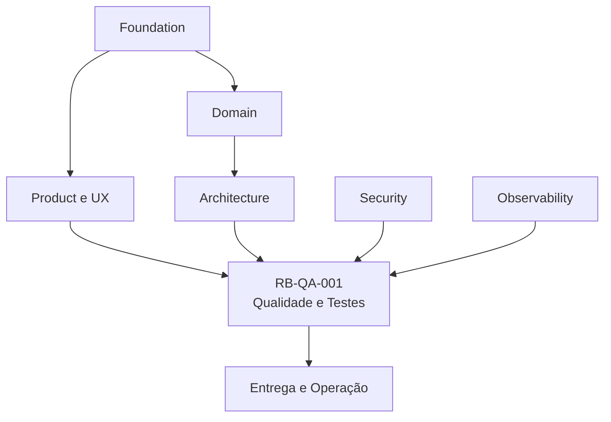
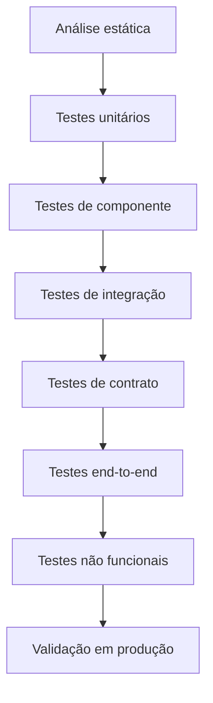
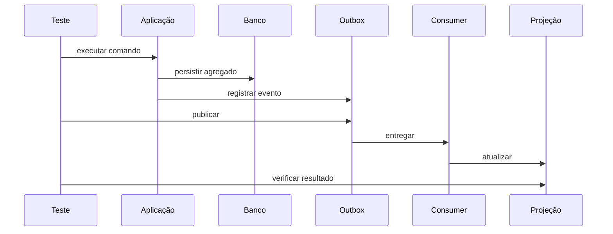

---

id: RB-QA-001

title: Estratégia de Qualidade e Testes
description: Define a estratégia oficial de qualidade e testes do RouteBook, incluindo princípios, camadas de teste, automação, validação de domínio, APIs, dados, eventos, integrações, inteligência artificial, segurança, performance, acessibilidade, CI/CD, métricas, gestão de defeitos e governança.

document_type: quality
owner: Quality Engineering

status: Draft
version: "0.1.0"

created: "2026-07-19"
last_updated: null

authors:

- RouteBook Team

tags:

- quality
- testing
- quality-engineering
- test-automation
- unit-testing
- integration-testing
- contract-testing
- end-to-end
- performance-testing
- security-testing
- ai-testing
- accessibility
- ci-cd
- observability
- diagrams
- mermaid

related_documents:

- RB-CORE-0001
- RB-CORE-0002
- RB-CORE-0003
- RB-CORE-0004
- RB-PRD-001
- RB-PRD-002
- RB-PRD-003
- RB-PRD-004
- RB-PRD-005
- RB-PRD-006
- RB-PRD-007
- RB-PRD-008
- RB-UX-001
- RB-UX-002
- RB-UX-003
- RB-UX-004
- RB-UX-005
- RB-UX-006
- RB-DS-001
- RB-DS-002
- RB-DS-003
- RB-DS-004
- RB-DOM-001
- RB-DOM-002
- RB-DOM-003
- RB-DOM-004
- RB-ARC-001
- RB-ARC-002
- RB-ARC-003
- RB-ARC-004
- RB-ARC-005
- RB-DATA-001
- RB-API-001
- RB-SEC-001
- RB-OBS-001

prerequisites:

- RB-CORE-0004
- RB-DOM-001
- RB-DOM-002
- RB-DOM-003
- RB-DOM-004
- RB-ARC-001
- RB-ARC-002
- RB-ARC-003
- RB-ARC-004
- RB-ARC-005
- RB-OBS-001

next_documents:

- RB-OPS-001
- RB-SRE-001
- RB-AI-001
- RB-QA-002

ai_context:
priority: critical
index: true
---

# RouteBook — Estratégia de Qualidade e Testes

## Parte I — Fundamentos

### 1. Propósito deste documento

Este documento define a estratégia oficial de qualidade e testes do RouteBook.

Seu objetivo é estabelecer como a qualidade deverá ser planejada, construída, validada, medida e sustentada durante todo o ciclo de vida do produto.

A estratégia deverá orientar:

* Product;
* Quality Engineering;
* Backend;
* Frontend;
* Architecture;
* Domain;
* Data;
* Platform;
* Security;
* Artificial Intelligence;
* DevOps;
* Site Reliability Engineering;
* agentes de engenharia;
* agentes de revisão;
* agentes de testes.

Este documento define:

* princípios de qualidade;
* responsabilidades;
* abordagem baseada em risco;
* estratégia de testes por camada;
* automação;
* testes de domínio;
* testes de APIs;
* testes de persistência;
* testes de eventos e processamento assíncrono;
* testes de integrações;
* testes de IA e agentes;
* testes de segurança;
* testes de performance;
* testes de acessibilidade;
* testes de resiliência;
* ambientes;
* dados de teste;
* critérios de entrada e saída;
* gates de CI/CD;
* métricas;
* gestão de defeitos;
* flaky tests;
* rastreabilidade;
* governança.

Este documento não define:

* ferramenta obrigatória de automação;
* framework definitivo;
* linguagem definitiva de testes;
* fornecedor de CI/CD;
* estrutura física final de pipelines;
* cobertura numérica universal;
* estratégia completa de release;
* processo organizacional externo ao RouteBook.

---

### 2. Autoridade documental

A estratégia de qualidade deverá derivar de:

* RouteBook Bible;
* requisitos de produto;
* experiência definida em UX;
* Design System;
* Linguagem Ubíqua;
* Modelo de Domínio;
* Regras e Invariantes;
* Eventos e Ciclos de Vida;
* arquitetura;
* segurança;
* observabilidade.



Testes não poderão redefinir:

* conceitos;
* regras;
* estados;
* ownership;
* eventos;
* severidades;
* linguagem;
* contratos.

---

### 3. Princípio central

Qualidade não deverá ser uma etapa final.

```text
Definir corretamente
→ construir com segurança
→ verificar continuamente
→ observar em produção
→ aprender
→ melhorar
```

---

### 4. Qualidade

Qualidade é o grau em que o RouteBook:

* atende à intenção do produto;
* preserva regras;
* apoia decisões;
* mantém consistência;
* protege dados;
* permanece acessível;
* apresenta desempenho adequado;
* funciona de forma confiável;
* explica limitações;
* permite operação segura.

---

### 5. Quality Engineering

Quality Engineering representa a aplicação sistemática de práticas técnicas e organizacionais para prevenir, detectar, diagnosticar e reduzir riscos de qualidade.

Não se limita à execução de testes.

---

### 6. Objetivos

A estratégia deverá:

1. prevenir defeitos;
2. detectar regressões cedo;
3. proteger regras do domínio;
4. validar contratos;
5. reduzir dependência de testes manuais repetitivos;
6. permitir entregas frequentes;
7. manter feedback rápido;
8. reduzir flaky tests;
9. validar comportamento assíncrono;
10. validar IA probabilística;
11. testar segurança;
12. testar acessibilidade;
13. validar desempenho e resiliência;
14. integrar qualidade à observabilidade;
15. permitir evolução arquitetural.

---

## Parte II — Princípios de qualidade

### 7. Qualidade por design

Requisitos, fluxos, contratos e arquitetura deverão ser desenhados para serem testáveis.

---

### 8. Shift left

Riscos deverão ser identificados antes da implementação.

Práticas incluem:

* revisão de requisitos;
* exemplos;
* critérios de aceite;
* modelagem de domínio;
* contract-first;
* threat modeling;
* análise de testabilidade.

---

### 9. Shift right

Produção também deverá fornecer evidências de qualidade por meio de:

* observabilidade;
* synthetic monitoring;
* feature flags;
* canary;
* métricas de jornada;
* feedback;
* incidentes;
* postmortems.

---

### 10. Testes baseados em risco

O esforço deverá considerar:

* impacto;
* probabilidade;
* detectabilidade;
* reversibilidade;
* criticidade;
* exposição;
* complexidade;
* dependências.

---

### 11. Automação com propósito

Automatizar quando houver valor em:

* repetição;
* regressão;
* cobertura;
* velocidade;
* precisão;
* proteção de contrato.

Não automatizar apenas para aumentar quantidade de testes.

---

### 12. Determinismo

Testes deverão ser determinísticos sempre que possível.

Dependências de:

* tempo real;
* rede externa;
* ordem;
* dados compartilhados;
* aleatoriedade;
* modelo de IA real;
* estado global

deverão ser controladas.

---

### 13. Isolamento

Cada teste deverá controlar seus dados e efeitos.

---

### 14. Pirâmide equilibrada

A maior parte da confiança deverá vir de testes rápidos e próximos ao código.

Testes end-to-end deverão permanecer focados em jornadas críticas.

---

### 15. Comportamento sobre implementação

Testes deverão validar contratos e comportamento observável.

Não deverão ficar excessivamente acoplados a detalhes internos.

---

### 16. Falha informativa

Um teste que falha deverá explicar:

* comportamento esperado;
* comportamento obtido;
* contexto;
* dados;
* componente;
* causa provável.

---

### 17. Qualidade como responsabilidade compartilhada

Produto, desenvolvimento, QA, segurança, dados, IA e operação são corresponsáveis.

---

## Parte III — Modelo de risco

### 18. Categorias de risco

* risco funcional;
* risco de domínio;
* risco de dados;
* risco de segurança;
* risco de privacidade;
* risco operacional;
* risco de desempenho;
* risco de integração;
* risco de acessibilidade;
* risco de IA;
* risco de compatibilidade;
* risco de experiência.

---

### 19. Avaliação

Cada capacidade relevante deverá considerar:

```text
Impacto × Probabilidade × Detectabilidade × Exposição
```

---

### 20. Classificação sugerida

#### Crítico

Pode causar:

* perda ou exposição de dados;
* acesso indevido;
* decisão perigosa;
* corrupção de Itinerary;
* violação de Restriction mandatory;
* falha ampla;
* irreversibilidade.

#### Alto

Pode causar:

* jornada principal indisponível;
* Proposal inválida;
* Recommendation incorreta;
* conflitos não detectados;
* perda funcional importante.

#### Médio

Pode causar:

* degradação;
* erro localizado;
* necessidade de workaround;
* inconsistência visual relevante.

#### Baixo

Impacto pequeno, reversível e localizado.

---

### 21. Uso da classificação

A classificação deverá influenciar:

* profundidade;
* quantidade;
* automação;
* revisão;
* ambientes;
* gates;
* observabilidade;
* plano de rollback.

---

### 22. Matriz inicial

| Capacidade                         | Risco          |
| ---------------------------------- | -------------- |
| autenticação e autorização         | crítico        |
| isolamento entre Accounts          | crítico        |
| alteração de Restriction mandatory | crítico        |
| aplicação de Itinerary Proposal    | crítico        |
| Ignore Planning Risk               | crítico        |
| Decision                           | alto           |
| criação de Trip                    | alto           |
| edição de Activity                 | alto           |
| Recommendation                     | alto           |
| Travel Estimate                    | médio ou alto  |
| Saved Place                        | médio          |
| filtros de Explore                 | médio          |
| conteúdo visual                    | baixo ou médio |

---

## Parte IV — Estratégia por camadas

### 23. Camadas de teste



---

### 24. Análise estática

Deverá incluir:

* compilação;
* lint;
* type checking;
* análise de dependências;
* análise de segurança;
* validação de schemas;
* validação de documentação;
* verificação de arquitetura.

---

### 25. Testes unitários

Deverão validar:

* regras;
* cálculos;
* Value Objects;
* entidades;
* agregados;
* políticas;
* validators;
* mappers;
* algoritmos;
* formatação.

Características:

* rápidos;
* isolados;
* determinísticos;
* sem infraestrutura real.

---

### 26. Testes de componente

Validam um componente ou módulo com dependências controladas.

Podem incluir:

* Application Service;
* Controller;
* repository fake;
* in-memory adapter;
* Event Handler;
* Agent Runtime.

---

### 27. Testes de integração

Validam interação real com:

* banco;
* cache;
* fila;
* storage;
* adapter;
* SDK;
* framework;
* migrations.

---

### 28. Testes de contrato

Validam compatibilidade entre:

* API e consumidores;
* módulos;
* eventos;
* schemas;
* Providers;
* ferramentas;
* Structured Outputs.

---

### 29. Testes end-to-end

Validam jornadas completas por interfaces reais.

Devem cobrir fluxos críticos com número controlado de cenários.

---

### 30. Testes não funcionais

Incluem:

* performance;
* segurança;
* acessibilidade;
* resiliência;
* compatibilidade;
* recuperação;
* usabilidade.

---

### 31. Validação em produção

Pode incluir:

* synthetic monitoring;
* smoke pós-deploy;
* canary;
* health checks;
* observação de SLIs;
* feature flags;
* shadow traffic quando seguro.

---

## Parte V — Distribuição dos testes

### 32. Estratégia

A distribuição deverá favorecer feedback rápido.

| Camada           | Volume relativo | Velocidade   |
| ---------------- | --------------: | ------------ |
| análise estática |      muito alto | muito rápida |
| unitário         |            alto | rápida       |
| componente       |            alto | rápida       |
| integração       |           médio | moderada     |
| contrato         |           médio | moderada     |
| end-to-end       |           baixo | lenta        |
| não funcional    |        seletivo | variável     |

---

### 33. Testes end-to-end

Não deverão reproduzir todas as combinações de regras.

Regras deverão ser validadas em camadas inferiores.

---

### 34. Testes manuais

Testes manuais serão usados para:

* exploração;
* experiência;
* acessibilidade assistida;
* avaliação visual;
* comportamento emergente;
* IA;
* riscos novos.

---

## Parte VI — Testes do domínio

### 35. Prioridade

Regras de domínio constituem a camada mais crítica da estratégia.

---

### 36. Agregados

Cada agregado deverá possuir testes para:

* criação válida;
* alteração válida;
* regra violada;
* transição inválida;
* evento emitido;
* versionamento;
* idempotência;
* concorrência quando aplicável.

---

### 37. Trip

Testar:

* criação;
* período válido;
* Destination;
* owner;
* Participant;
* transferência de ownership;
* cancelamento;
* arquivamento;
* exclusão;
* TripContextVersion.

---

### 38. Traveler Profile

Testar:

* criação;
* Traveler obrigatório;
* Interest;
* Restriction;
* mandatory;
* preferência;
* Budget;
* Group Profile derivado;
* minimização de dados.

---

### 39. Trip Collection

Testar:

* salvar Place;
* idempotência;
* remoção;
* nota;
* duplicidade;
* independência de Activity.

---

### 40. Itinerary

Testar:

* criação;
* Trip Day;
* Activity;
* movimento;
* Activity fixed;
* Free Period protected;
* duração;
* ordem;
* ItineraryVersion;
* estado multidimensional.

---

### 41. Recommendation

Testar:

* geração válida;
* Reasons;
* contexto;
* expiração;
* invalidação;
* supersessão;
* aceitação;
* rejeição;
* versão stale.

---

### 42. Decision

Testar:

* autoria;
* registro com Recommendation;
* registro sem Recommendation;
* delegação;
* separação de execução;
* cancelamento;
* Outcome.

---

### 43. Itinerary Proposal

Testar:

* geração;
* Proposed Activity;
* expiração;
* aceitação;
* aceite parcial;
* rejeição;
* cancelamento;
* aplicação idempotente;
* versão divergente;
* Activity fixed;
* Free Period protected.

---

### 44. Planning Conflict

Testar:

* detecção;
* equivalência;
* deduplicação;
* severidade;
* evidência;
* resolução;
* ignored;
* invalidated;
* superseded;
* proibição de ignorar error.

---

### 45. Eventos de domínio

Cada transição relevante deverá validar:

* tipo;
* aggregateId;
* aggregateVersion;
* occurredAt;
* payload;
* causalidade;
* ausência de evento em falha.

---

## Parte VII — Testes de Application

### 46. Casos de uso

Cada caso de uso deverá testar:

* happy path;
* validação de input;
* autorização;
* regra;
* dependência;
* persistência;
* eventos;
* idempotência;
* observabilidade;
* erro esperado;
* erro inesperado.

---

### 47. Commands

Commands deverão possuir testes de:

* campos obrigatórios;
* formato;
* referência;
* versão;
* actor;
* idempotency key;
* autorização.

---

### 48. Queries

Queries deverão validar:

* filtro;
* paginação;
* ordenação;
* projeção;
* isolamento;
* ausência de efeito;
* comportamento com dado stale.

---

### 49. Orquestração

Application Service não deverá reimplementar regras do domínio.

Testes deverão detectar duplicação indevida.

---

## Parte VIII — Testes de APIs

### 50. Escopo

APIs deverão ser testadas em:

* schema;
* contrato;
* autenticação;
* autorização;
* status;
* headers;
* validação;
* idempotência;
* paginação;
* erros;
* compatibilidade;
* rate limit.

---

### 51. Contratos HTTP

Validar:

* método;
* rota;
* parâmetros;
* request body;
* response body;
* media type;
* código;
* errorCode;
* correlationId;
* versionamento.

---

### 52. Erros

Testar:

* 400;
* 401;
* 403;
* 404;
* 409;
* 422;
* 429;
* 500;
* 503.

---

### 53. Autorização

Cenários obrigatórios:

* usuário autorizado;
* papel insuficiente;
* recurso de outra Account;
* recurso inexistente;
* delegação expirada;
* agente sem permissão;
* tool fora do escopo.

---

### 54. Idempotência

Operações relevantes deverão testar:

* primeira execução;
* repetição igual;
* repetição com payload diferente;
* concorrência;
* expiração da chave;
* falha intermediária;
* retomada.

---

### 55. Paginação

Testar:

* primeira página;
* próxima página;
* limite;
* cursor inválido;
* ordenação estável;
* inserções concorrentes.

---

### 56. Contract testing

Consumidores e Providers deverão validar compatibilidade sem depender exclusivamente de end-to-end.

---

## Parte IX — Testes de persistência e dados

### 57. Repositórios

Testar:

* save;
* load;
* update;
* concorrência;
* filtro;
* ordenação;
* mapping;
* transação;
* integridade;
* isolamento.

---

### 58. Migrations

Cada migration deverá possuir testes de:

* aplicação em banco vazio;
* aplicação em banco com dados;
* compatibilidade;
* rollback quando suportado;
* duração;
* constraints;
* índices;
* backfill.

---

### 59. Constraints

Testar no banco:

* unicidade;
* foreign keys;
* check constraints;
* obrigatoriedade;
* ranges;
* versões.

---

### 60. Concorrência otimista

Testar:

* versão correta;
* versão stale;
* duas atualizações;
* retry controlado;
* conflito exposto corretamente.

---

### 61. Transações

Testar atomicidade de:

* mudança de agregado;
* Outbox;
* Proposal Application;
* Ignore Planning Risk;
* Decision;
* atualização de versões.

---

### 62. Projeções

Testar:

* criação;
* atualização;
* idempotência;
* rebuild;
* eventos fora de ordem;
* duplicidade;
* atraso;
* schema version.

---

### 63. Integridade

Testes periódicos deverão detectar:

* órfãos;
* versões inconsistentes;
* status incompatível;
* referência inválida;
* Provenance ausente;
* projeção divergente.

---

### 64. Retenção

Testar:

* expiração;
* exclusão;
* anonimização;
* arquivos;
* memórias;
* backups;
* auditoria.

---

## Parte X — Eventos, filas e jobs

### 65. Outbox

Testar:

* registro na mesma transação;
* publicação;
* retry;
* falha;
* ordenação quando necessária;
* duplicidade;
* recuperação;
* métricas.

---

### 66. Inbox

Testar:

* primeiro consumo;
* duplicidade;
* consumer diferente;
* falha;
* retry;
* poison message;
* idempotência.

---

### 67. Eventos

Validar:

* schema;
* versão;
* payload;
* compatibilidade;
* eventId;
* causationId;
* correlationId;
* timestamps.

---

### 68. Consumers

Testar:

* sucesso;
* falha transitória;
* falha permanente;
* retry;
* dead-letter;
* replay;
* concorrência;
* reprocessamento.

---

### 69. Jobs

Testar:

* scheduling;
* execução;
* checkpoint;
* retry;
* lock;
* cancelamento;
* timeout;
* retomada;
* observabilidade.

---

### 70. Tempo

Jobs temporais deverão usar relógio controlado.

Não depender do relógio real.

---

### 71. Fluxo de teste assíncrono



---

## Parte XI — Testes de integrações

### 72. Estratégia

Integrações deverão ser testadas em múltiplos níveis:

* adapter unitário;
* contrato;
* sandbox;
* integração controlada;
* fallback;
* produção sintética.

---

### 73. Adapter

Testar:

* mapping;
* autenticação;
* timeout;
* erro;
* rate limit;
* retry;
* circuit breaker;
* fallback;
* sanitização;
* Provenance.

---

### 74. Providers externos

Não utilizar Provider real em todos os testes.

Preferir:

* fake;
* stub;
* mock server;
* contract test;
* sandbox.

---

### 75. Contratos

Validar:

* request;
* response;
* códigos;
* headers;
* limites;
* campos opcionais;
* mudanças de schema;
* dados desconhecidos.

---

### 76. Falhas

Cenários:

* timeout;
* 429;
* 500;
* resposta malformada;
* campo ausente;
* latência elevada;
* dado stale;
* quota esgotada;
* Provider indisponível.

---

### 77. Fallback

Validar:

* ativação;
* resultado;
* Provenance;
* observabilidade;
* custo;
* segurança;
* retorno ao Provider principal.

---

## Parte XII — Testes de IA e agentes

### 78. Princípio

Capacidades probabilísticas exigem testes estruturais, comportamentais e estatísticos.

---

### 79. Camadas

* teste de prompt;
* teste de schema;
* teste de validator;
* teste de referência;
* teste de regra;
* teste de Tool Call;
* teste de agente;
* teste de fallback;
* teste de segurança;
* avaliação humana.

---

### 80. Structured Output

Testar:

* JSON válido;
* schema;
* required;
* enums;
* limites;
* campos extras;
* referências;
* conteúdo vazio;
* reparo;
* rejeição.

---

### 81. IDs

A IA não deverá criar IDs canônicos.

Testar:

* PlaceId inventado;
* ActivityId inventado;
* RecommendationId inventado;
* ItineraryProposalId inventado;
* PlanningConflictId inventado.

---

### 82. Context Builder

Testar:

* minimização;
* autorização;
* redaction;
* ordem;
* truncamento;
* versões;
* stale data;
* snapshot;
* dados de outra Account.

---

### 83. Agentes

Testar:

* objetivo;
* limite de etapas;
* ferramentas permitidas;
* ferramenta proibida;
* loop;
* timeout;
* custo;
* delegação;
* confirmação;
* fallback.

---

### 84. Tool Calls

Testar:

* schema;
* autorização;
* argumentos;
* idempotência;
* erro;
* retry;
* resultado;
* telemetria;
* ferramenta crítica.

---

### 85. Golden Dataset

Capacidades críticas deverão possuir dataset com casos como:

* grupo com criança;
* Restriction alimentar mandatory;
* Place fechado;
* Budget limitado;
* chuva;
* Activity fixed;
* Free Period protected;
* conflito de horário;
* Travel Estimate indisponível;
* dados stale;
* Prompt Injection.

---

### 86. Avaliação determinística

Sempre que possível:

* schema válido;
* IDs válidos;
* regra respeitada;
* quantidade;
* ordenação;
* ausência de campo proibido;
* Tool Call permitida.

---

### 87. Avaliação probabilística

Poderá usar:

* múltiplas execuções;
* thresholds;
* scoring;
* avaliação humana;
* model-based evaluation;
* comparação entre versões.

---

### 88. Model-based evaluation

Não deverá ser a única validação.

---

### 89. Segurança de IA

Testar:

* prompt injection;
* tool injection;
* exfiltração;
* override de política;
* acesso cross-account;
* conteúdo malicioso externo;
* prompt leak;
* abuso de memória.

---

### 90. Fallback de IA

Testar:

* Provider indisponível;
* schema inválido;
* timeout;
* custo excedido;
* modelo alternativo;
* fallback determinístico;
* degradação comunicada.

---

### 91. Regressão de prompts

Mudança de prompt deverá executar suite de avaliação.

---

### 92. Teste de Proposal por IA

Deverá validar:

* baseItineraryVersion;
* baseTripContextVersion;
* Proposed Activities válidas;
* Activity fixed preservada;
* Free Period protected preservado;
* Restrictions;
* Planning Assurance;
* aplicação não automática.

---

## Parte XIII — Testes de segurança

### 93. Estratégia

Testes de segurança deverão combinar:

* análise estática;
* análise de dependências;
* secret scanning;
* testes de autorização;
* testes de autenticação;
* testes dinâmicos;
* threat-based testing;
* revisão manual.

---

### 94. Autenticação

Testar:

* credencial válida;
* inválida;
* expirada;
* revogada;
* ausência;
* replay;
* logout;
* refresh;
* Provider indisponível.

---

### 95. Autorização

Testar:

* owner;
* editor;
* viewer;
* agente;
* integração;
* recurso externo;
* Account diferente;
* privilege escalation;
* IDOR.

---

### 96. Input

Testar:

* injection;
* XSS;
* path traversal;
* mass assignment;
* payload excessivo;
* arquivo malicioso;
* JSON profundo;
* caracteres especiais.

---

### 97. Secrets

Pipelines deverão impedir:

* secrets no código;
* secrets em logs;
* secrets em artefatos;
* secrets em imagens;
* secrets em respostas.

---

### 98. Dependências

Testar:

* vulnerabilidades;
* licenças;
* versão obsoleta;
* pacote malicioso;
* typosquatting.

---

### 99. Segurança de APIs

Testar:

* rate limit;
* CORS;
* headers;
* cache;
* enumeração;
* brute force;
* resposta excessiva;
* error disclosure.

---

### 100. Segurança de dados

Testar:

* criptografia;
* isolamento;
* exportação;
* exclusão;
* anonimização;
* retenção;
* backup;
* restore.

---

## Parte XIV — Testes de performance

### 101. Objetivos

Validar:

* latência;
* throughput;
* saturação;
* estabilidade;
* escalabilidade;
* degradação;
* recuperação.

---

### 102. Tipos

* baseline;
* load;
* stress;
* spike;
* soak;
* scalability;
* capacity;
* failover.

---

### 103. Jornadas

Exemplos:

* listar Trips;
* abrir Trip;
* buscar Places;
* carregar Itinerary;
* salvar Place;
* editar Activity;
* gerar Recommendation;
* gerar Proposal;
* aplicar Proposal;
* processar Outbox.

---

### 104. Critérios

Cada teste deverá definir:

* carga;
* perfil;
* duração;
* ambiente;
* dados;
* SLI;
* threshold;
* resultado esperado.

---

### 105. Banco

Validar:

* consultas;
* índices;
* locks;
* pool;
* concorrência;
* migrations;
* volume;
* projection rebuild.

---

### 106. IA

Validar:

* latência;
* throughput;
* custo;
* limite;
* fila;
* timeout;
* fallback;
* concorrência.

---

### 107. Resultados

Performance tests deverão gerar:

* relatório;
* comparação;
* gargalos;
* regressões;
* recomendações;
* decisão.

---

## Parte XV — Testes de resiliência

### 108. Objetivo

Validar comportamento diante de falhas.

---

### 109. Cenários

* banco indisponível;
* cache indisponível;
* fila indisponível;
* Provider externo indisponível;
* AI Provider indisponível;
* timeout;
* alta latência;
* perda de mensagem;
* duplicidade;
* consumer parado;
* disco cheio;
* quota esgotada.

---

### 110. Verificações

* fallback;
* retry;
* circuit breaker;
* timeout;
* idempotência;
* observabilidade;
* recuperação;
* ausência de corrupção;
* comunicação ao Usuário.

---

### 111. Chaos testing

Poderá ser adotado progressivamente em ambientes controlados.

---

### 112. Recovery testing

Testar:

* restart;
* replay;
* restore;
* failover;
* rollback;
* rebuild de projeção;
* retomada de job.

---

## Parte XVI — Testes de acessibilidade

### 113. Princípio

Acessibilidade é requisito de qualidade.

---

### 114. Escopo

Testar:

* navegação por teclado;
* foco;
* semântica;
* labels;
* contraste;
* zoom;
* leitor de tela;
* mensagens de erro;
* formulários;
* modais;
* mapas;
* drag and drop;
* conteúdo dinâmico.

---

### 115. Automação

Ferramentas automáticas deverão identificar problemas comuns.

Não substituem avaliação manual.

---

### 116. Testes manuais

Deverão incluir:

* teclado;
* leitor de tela;
* zoom;
* modo de alto contraste;
* fluxo sem mouse;
* formulários;
* mensagens.

---

### 117. Componentes

O Design System deverá possuir testes de acessibilidade por componente.

---

### 118. Mapas

Funcionalidades baseadas em mapa deverão possuir alternativa acessível em lista ou estrutura equivalente.

---

## Parte XVII — Testes de frontend

### 119. Camadas

* unitários;
* componentes;
* integração;
* visuais;
* acessibilidade;
* end-to-end;
* performance.

---

### 120. Componentes

Testar:

* estado;
* eventos;
* loading;
* empty;
* error;
* disabled;
* permissões;
* conteúdo;
* acessibilidade.

---

### 121. Estado assíncrono

Testar:

* loading;
* retry;
* timeout;
* resposta stale;
* cancelamento;
* concorrência;
* optimistic update;
* rollback.

---

### 122. Visual regression

Deverá ser seletivo para:

* Design System;
* layouts críticos;
* estados principais;
* responsividade.

---

### 123. Compatibilidade

Definir matriz de:

* navegadores;
* versões;
* dispositivos;
* resoluções;
* sistemas.

---

### 124. Web Vitals

Regressões deverão ser observadas em teste e produção.

---

## Parte XVIII — Testes end-to-end

### 125. Objetivo

Validar jornadas críticas de forma integrada.

---

### 126. Jornadas iniciais

1. autenticar;
2. criar Trip;
3. definir Destination e período;
4. configurar Travelers;
5. adicionar Restrictions;
6. buscar Place;
7. salvar Place;
8. criar Activity;
9. gerar Recommendation;
10. gerar Itinerary Proposal;
11. aceitar parcialmente;
12. revisar Planning Conflict.

---

### 127. Características

Testes end-to-end deverão:

* usar dados controlados;
* ser independentes;
* evitar dependências externas reais;
* produzir evidência;
* capturar trace;
* possuir timeout adequado;
* permitir diagnóstico.

---

### 128. Seleção

Devem cobrir:

* happy paths críticos;
* autorização crítica;
* integrações principais;
* regressões de alto impacto.

---

### 129. Não utilizar para

* todas as validações;
* todas as combinações;
* regras isoladas;
* lógica de domínio;
* contratos individuais.

---

### 130. Smoke suite

Uma suite curta deverá validar saúde mínima após deployment.

---

## Parte XIX — Testes exploratórios

### 131. Objetivo

Explorar riscos, comportamento emergente e lacunas não cobertas.

---

### 132. Charter

Sessões deverão possuir:

* objetivo;
* escopo;
* risco;
* duração;
* ambiente;
* evidências;
* descobertas.

---

### 133. Áreas prioritárias

* IA;
* UX;
* mapas;
* planejamento;
* conflitos;
* dados externos;
* estados intermediários;
* interrupções;
* acessibilidade.

---

### 134. Evidência

Registrar:

* observações;
* defeitos;
* perguntas;
* riscos;
* melhorias;
* cobertura.

---

## Parte XX — Dados de teste

### 135. Princípios

Dados de teste deverão ser:

* controlados;
* reproduzíveis;
* isolados;
* minimizados;
* representativos;
* não sensíveis.

---

### 136. Dados pessoais

Produção não deverá ser copiada diretamente para ambientes de teste.

---

### 137. Factories

Factories deverão criar entidades válidas por padrão.

Permitir variações explícitas para cenários inválidos.

---

### 138. Cenários canônicos

Manter conjuntos como:

* Trip solo;
* casal;
* família com criança;
* grupo;
* Budget limitado;
* Restriction mandatory;
* mobilidade reduzida;
* Itinerary cheio;
* Itinerary livre;
* dados stale.

---

### 139. Seed

Seeds deverão possuir versão e owner.

---

### 140. Cleanup

Testes deverão limpar ou isolar dados.

---

### 141. Time zones

Dados deverão cobrir:

* fusos;
* horário de verão;
* virada de dia;
* datas limite;
* localização.

---

### 142. Locales

Testar idioma, moeda, datas e números conforme escopo.

---

## Parte XXI — Ambientes de teste

### 143. Local

Deverá permitir:

* execução rápida;
* dependências locais;
* fakes;
* feedback imediato.

---

### 144. CI

Deverá executar suites automatizadas de forma isolada e reproduzível.

---

### 145. Integration

Ambiente dedicado poderá executar:

* banco real;
* filas;
* storage;
* adapters;
* migrations.

---

### 146. Staging

Deverá representar produção quando necessário para:

* end-to-end;
* performance controlada;
* segurança;
* smoke;
* integrações;
* runbooks.

---

### 147. Produção

Somente testes seguros:

* synthetic;
* smoke não destrutivo;
* health;
* canary;
* observação.

---

### 148. Paridade

Paridade deverá ser suficiente para reproduzir riscos relevantes.

---

## Parte XXII — CI/CD e quality gates

### 149. Pipeline


---

### 150. Pull request

Deverá executar:

* lint;
* types;
* unit;
* component;
* contratos;
* análise de arquitetura;
* segurança básica;
* documentação.

---

### 151. Main branch

Deverá adicionar:

* integração;
* migrations;
* build;
* scan;
* suites ampliadas.

---

### 152. Pré-release

Poderá incluir:

* end-to-end;
* performance;
* segurança;
* acessibilidade;
* regressão de IA;
* validação visual.

---

### 153. Pós-deploy

* smoke;
* health;
* SLI;
* error rate;
* latency;
* logs;
* rollback condition.

---

### 154. Gates

Um gate deverá ser:

* claro;
* automatizado quando possível;
* proporcional ao risco;
* auditável;
* passível de exceção governada.

---

### 155. Falha de pipeline

Falhas não deverão ser ignoradas ou repetidas até passar sem diagnóstico.

---

### 156. Exceções

Exceção deverá registrar:

* justificativa;
* risco;
* owner;
* aprovação;
* prazo;
* mitigação.

---

## Parte XXIII — Critérios de entrada e saída

### 157. Entrada para desenvolvimento

Uma capacidade deverá possuir:

* objetivo;
* escopo;
* critérios de aceite;
* regras;
* riscos;
* dependências;
* contratos;
* observabilidade esperada.

---

### 158. Entrada para testes

Deverá possuir:

* build;
* ambiente;
* dados;
* critérios;
* versão;
* mudanças;
* limitações conhecidas.

---

### 159. Saída de testes

Deverá considerar:

* suites críticas aprovadas;
* riscos conhecidos;
* defeitos;
* cobertura;
* performance;
* segurança;
* acessibilidade;
* observabilidade;
* plano de rollback.

---

### 160. Definition of Done

Uma capacidade não deverá ser concluída sem:

* código revisado;
* testes adequados;
* contratos atualizados;
* documentação;
* telemetria;
* segurança;
* critérios de aceite;
* ausência de defeito bloqueador;
* migration validada quando aplicável.

---

## Parte XXIV — Gestão de defeitos

### 161. Defeito

Defeito é uma divergência entre comportamento esperado e observado.

---

### 162. Classificação

Deverá considerar:

* impacto;
* frequência;
* abrangência;
* segurança;
* dados;
* reversibilidade;
* workaround.

---

### 163. Severidade sugerida

#### Blocker

Impede validação ou uso essencial.

#### Critical

Causa risco crítico, perda de dados ou acesso indevido.

#### Major

Afeta jornada principal sem solução adequada.

#### Minor

Impacto localizado com workaround.

#### Trivial

Impacto pequeno, principalmente cosmético.

---

### 164. Prioridade

Prioridade é decisão de tratamento e não deve ser confundida com severidade.

---

### 165. Campos mínimos

```text
Título
Descrição
Ambiente
Versão
Pré-condições
Passos
Resultado atual
Resultado esperado
Evidência
Impacto
Severidade
Risco
Correlation ID
```

---

### 166. Defeito de especificação

Divergência de entendimento deverá ser resolvida com atualização da documentação canônica.

---

### 167. Escape

Defeitos encontrados em produção deverão alimentar:

* análise;
* testes;
* critérios;
* observabilidade;
* revisão de risco.

---

## Parte XXV — Flaky tests

### 168. Definição

Flaky test apresenta resultado inconsistente sem mudança relevante no sistema.

---

### 169. Causas comuns

* tempo;
* concorrência;
* rede;
* ordem;
* dados;
* dependência externa;
* animação;
* sleep fixo;
* seletores frágeis;
* aleatoriedade.

---

### 170. Política

Flaky tests deverão ser:

* identificados;
* rastreados;
* corrigidos;
* quarentenados temporariamente;
* removidos do gate apenas com controle.

---

### 171. Quarentena

Deverá possuir:

* owner;
* motivo;
* issue;
* data;
* prazo;
* impacto;
* plano de correção.

---

### 172. Retry

Retry automático não deverá ocultar instabilidade.

---

### 173. Métricas

* flaky rate;
* retries;
* duração;
* testes em quarentena;
* tempo para correção.

---

## Parte XXVI — Cobertura e métricas

### 174. Cobertura

Cobertura de código é um sinal, não objetivo isolado.

---

### 175. Métricas de qualidade

* pass rate;
* failure rate;
* flaky rate;
* duration;
* escaped defects;
* defect density;
* change failure rate;
* mean time to detect;
* mean time to repair;
* test effectiveness;
* automation coverage;
* risk coverage.

---

### 176. Cobertura de risco

Deverá indicar quais riscos possuem proteção.

---

### 177. Cobertura de domínio

Regras e invariantes críticas deverão possuir rastreabilidade para testes.

---

### 178. Cobertura de contrato

APIs, eventos e Tools deverão possuir testes de contrato.

---

### 179. Métricas de IA

* schema validity;
* domain rejection;
* tool failure;
* prompt regression;
* acceptance;
* edit rate;
* fallback.

---

### 180. Métricas de pipeline

* tempo;
* sucesso;
* falhas;
* filas;
* reexecuções;
* instabilidade;
* custo.

---

### 181. Uso

Métricas deverão apoiar decisão, não competição.

---

## Parte XXVII — Rastreabilidade

### 182. Cadeia

```text
Requisito
→ risco
→ regra
→ critério de aceite
→ teste
→ evidência
→ telemetria
```

---

### 183. Matriz de rastreabilidade

| Elemento  | Referência       |
| --------- | ---------------- |
| requisito | PRD              |
| fluxo     | UX               |
| regra     | Domain           |
| contrato  | API/Event        |
| risco     | Quality/Security |
| teste     | suite/case       |
| evidência | execução         |
| produção  | dashboard/SLI    |

---

### 184. Casos críticos

Deverão possuir rastreabilidade explícita:

* isolamento entre Accounts;
* Activity fixed;
* Free Period protected;
* Restriction mandatory;
* Apply Proposal;
* AcceptItineraryProposalPartially;
* IgnorePlanningRisk;
* Recommendation stale;
* version conflict;
* prompt injection.

---

## Parte XXVIII — Governança

### 185. Owner

O owner deste documento é:

```text
Quality Engineering
```

A manutenção deverá envolver:

* Product;
* Architecture;
* Backend;
* Frontend;
* Domain;
* Security;
* Data;
* Platform;
* Artificial Intelligence.

---

### 186. Nova capacidade

Uma nova capacidade deverá definir:

* risco;
* estratégia;
* camadas;
* dados;
* ambiente;
* automação;
* observabilidade;
* critérios de aceite;
* critérios de saída.

---

### 187. Novo teste

Deverá possuir:

* finalidade;
* risco protegido;
* owner;
* camada adequada;
* dados;
* determinismo;
* manutenção.

---

### 188. Nova suite

Deverá justificar:

* escopo;
* duração;
* ambiente;
* frequência;
* gate;
* owner;
* custo.

---

### 189. Nova ferramenta

Deverá avaliar:

* integração;
* manutenção;
* lock-in;
* segurança;
* curva de aprendizado;
* custo;
* compatibilidade.

---

### 190. Exclusão de teste

Deverá ser justificada quando remover proteção relevante.

---

### 191. Testes gerados por IA

Deverão ser revisados quanto a:

* intenção;
* cobertura;
* assertividade;
* redundância;
* acoplamento;
* segurança;
* consistência com domínio.

---

### 192. Agentes de QA

Agentes poderão:

* gerar casos;
* gerar dados;
* revisar critérios;
* identificar lacunas;
* analisar falhas;
* sugerir regressão.

Não poderão:

* redefinir regra;
* aprovar risco crítico sozinhos;
* alterar evidência;
* ignorar falha de gate sem autorização.

---

## Parte XXIX — Estrutura conceitual

### 193. Organização

```text
tests/
├── unit/
├── component/
├── integration/
├── contract/
├── e2e/
├── performance/
├── security/
├── accessibility/
├── resilience/
├── ai-evaluation/
├── fixtures/
├── factories/
└── support/
```

---

### 194. Por módulo

```text
<module>/
├── domain/
│   └── tests/
├── application/
│   └── tests/
├── infrastructure/
│   └── tests/
└── contracts/
    └── tests/
```

---

### 195. Artefatos

Poderão incluir:

* test plans;
* risk matrix;
* charters;
* datasets;
* reports;
* traces;
* screenshots;
* videos;
* accessibility reports;
* performance reports.

---

## Parte XXX — Anti-patterns

### 196. Testar apenas happy path

Fluxos críticos exigem falhas, limites e autorização.

---

### 197. End-to-end como única proteção

Torna feedback lento e diagnóstico difícil.

---

### 198. Mock excessivo

Pode produzir confiança falsa.

---

### 199. Cobertura como meta única

Alta cobertura não garante comportamento correto.

---

### 200. Teste acoplado à implementação

Quebra em refatorações sem mudança de comportamento.

---

### 201. Sleep fixo

Esperas fixas tornam testes lentos e instáveis.

---

### 202. Dados compartilhados

Causam dependência de ordem e concorrência.

---

### 203. Provider real em toda execução

Causa custo, instabilidade e falta de determinismo.

---

### 204. Retry ocultando falha

Retry não substitui correção.

---

### 205. Teste sem assertiva relevante

Execução sem verificação não produz confiança.

---

### 206. Automação sem manutenção

Suites abandonadas reduzem confiança.

---

### 207. Teste de UI para regra de domínio

Regra deverá ser protegida em camada apropriada.

---

### 208. Segurança apenas no final

Segurança deverá estar integrada ao ciclo.

---

### 209. Aprovação manual sem evidência

Decisões deverão ser rastreáveis.

---

## Parte XXXI — Evolução

### 210. Fase inicial

* análise estática;
* unit tests;
* component tests;
* integration tests;
* contract tests;
* smoke;
* end-to-end crítico;
* segurança básica;
* acessibilidade básica;
* pipeline.

---

### 211. Fase intermediária

* performance contínua;
* regressão visual;
* avaliação de IA;
* mutation testing seletivo;
* resiliência;
* synthetic monitoring;
* quality dashboards;
* test impact analysis.

---

### 212. Fase avançada

Somente por necessidade:

* chaos engineering;
* model-based testing;
* property-based testing ampliado;
* formal verification seletiva;
* predictive quality;
* autonomous test generation;
* production traffic replay anonimizado.

---

### 213. Critérios

Evolução deverá demonstrar:

* risco;
* ganho;
* custo;
* manutenção;
* owner;
* integração.

---

## Parte XXXII — Catálogo de diagramas

### 214. Diagramas desta versão

| ID conceitual | Diagrama                  |
| ------------- | ------------------------- |
| RB-DGM-QA-001 | Autoridade documental     |
| RB-DGM-QA-002 | Camadas de teste          |
| RB-DGM-QA-003 | Fluxo de teste assíncrono |
| RB-DGM-QA-004 | Pipeline de qualidade     |

---

### 215. Critério de inclusão

Os diagramas foram incluídos para representar:

* autoridade;
* distribuição de testes;
* processamento assíncrono;
* fluxo de CI/CD.

Diagramas adicionais deverão ser criados apenas quando agregarem clareza.

---

## Parte XXXIII — Critérios de aceite

### 216. Estratégia

* qualidade está definida como responsabilidade compartilhada;
* abordagem baseada em risco está definida;
* shift left está definido;
* shift right está definido;
* camadas estão definidas;
* distribuição está definida.

---

### 217. Funcional

* domínio está coberto;
* Application está coberta;
* APIs estão cobertas;
* persistência está coberta;
* eventos estão cobertos;
* jobs estão cobertos;
* integrações estão cobertas.

---

### 218. Inteligência artificial

* Structured Outputs estão cobertos;
* Context Builder está coberto;
* agentes estão cobertos;
* Tools estão cobertas;
* Prompt Injection está coberta;
* regressão de prompts está definida;
* fallback está coberto.

---

### 219. Não funcional

* segurança está definida;
* performance está definida;
* resiliência está definida;
* acessibilidade está definida;
* frontend está definido;
* compatibilidade está definida.

---

### 220. Processo

* ambientes estão definidos;
* dados estão definidos;
* CI/CD está definido;
* gates estão definidos;
* critérios de entrada estão definidos;
* critérios de saída estão definidos;
* Definition of Done está definida.

---

### 221. Governança

* gestão de defeitos está definida;
* flaky tests estão definidos;
* métricas estão definidas;
* rastreabilidade está definida;
* agentes estão governados;
* anti-patterns estão definidos.

---

### 222. Diagramas

* Mermaid renderiza no GitHub;
* diagramas usam termos oficiais;
* diagramas não possuem atributos adicionais;
* diagramas têm valor arquitetural.

---

## Parte XXXIV — Checklist final

### 223. Checklist documental

Antes de aprovar:

* frontmatter YAML é válido;
* existe apenas um H1;
* Partes utilizam H2;
* seções numeradas utilizam H3;
* propósito está definido;
* autoridade está definida;
* princípios estão definidos;
* riscos estão definidos;
* camadas estão definidas;
* testes de domínio estão definidos;
* testes de Application estão definidos;
* testes de APIs estão definidos;
* testes de dados estão definidos;
* testes de eventos estão definidos;
* testes de integrações estão definidos;
* testes de IA estão definidos;
* testes de segurança estão definidos;
* testes de performance estão definidos;
* testes de resiliência estão definidos;
* testes de acessibilidade estão definidos;
* testes de frontend estão definidos;
* testes end-to-end estão definidos;
* testes exploratórios estão definidos;
* dados de teste estão definidos;
* ambientes estão definidos;
* CI/CD está definido;
* gates estão definidos;
* critérios de entrada estão definidos;
* critérios de saída estão definidos;
* gestão de defeitos está definida;
* flaky tests estão definidos;
* cobertura está definida;
* métricas estão definidas;
* rastreabilidade está definida;
* governança está definida;
* anti-patterns estão definidos;
* evolução está definida;
* diagramas são necessários e não decorativos;
* Mermaid renderiza no GitHub;
* não existem contradições com RB-DOM-001;
* não existem contradições com RB-DOM-002;
* não existem contradições com RB-DOM-003;
* não existem contradições com RB-DOM-004;
* não existem contradições com RB-ARC-001;
* não existem contradições com RB-ARC-002;
* não existem contradições com RB-ARC-003;
* não existem contradições com RB-ARC-004;
* não existem contradições com RB-ARC-005;
* não existem contradições com RB-OBS-001.

---

## Parte XXXV — Declaração final

### 224. Declaração de qualidade

A qualidade do RouteBook deverá ser construída continuamente e demonstrada por evidências.

Toda capacidade deverá:

* possuir critérios claros;
* identificar riscos;
* respeitar o domínio;
* possuir testes adequados;
* possuir dados controlados;
* produzir feedback;
* preservar segurança;
* preservar acessibilidade;
* permitir diagnóstico;
* possuir observabilidade;
* permitir evolução.

A estratégia deverá proteger especialmente:

* isolamento entre Accounts;
* autorização;
* Restrictions mandatory;
* Activity fixed;
* Free Period protected;
* TripContextVersion;
* ItineraryVersion;
* Recommendation;
* Decision;
* Itinerary Proposal;
* Planning Conflict;
* Provenance;
* idempotência;
* processamento assíncrono;
* comportamento de IA.

Nenhum teste, mock, fixture, pipeline, agente, ferramenta ou ambiente poderá:

* redefinir regras;
* mascarar falha crítica;
* utilizar dados pessoais sem necessidade;
* ignorar autorização;
* contornar invariantes;
* substituir evidência;
* ocultar flaky tests;
* aprovar comportamento inconsistente;
* transformar cobertura em sinônimo de qualidade.

O RouteBook deverá alcançar confiança por meio da combinação de prevenção, testes automatizados, exploração, segurança, acessibilidade, performance, observabilidade e aprendizado operacional.

Qualidade não será uma etapa posterior à implementação.

Ela será parte permanente da definição, construção, entrega e operação do produto.
