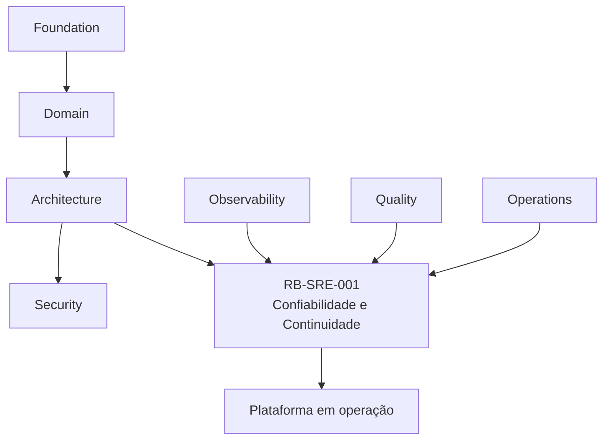
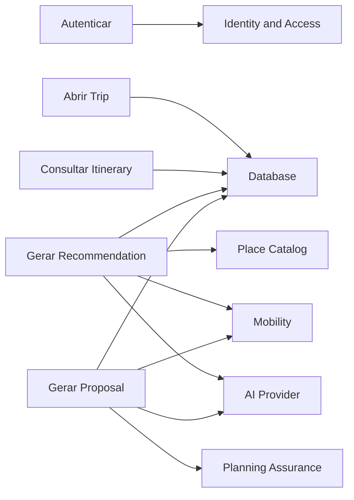
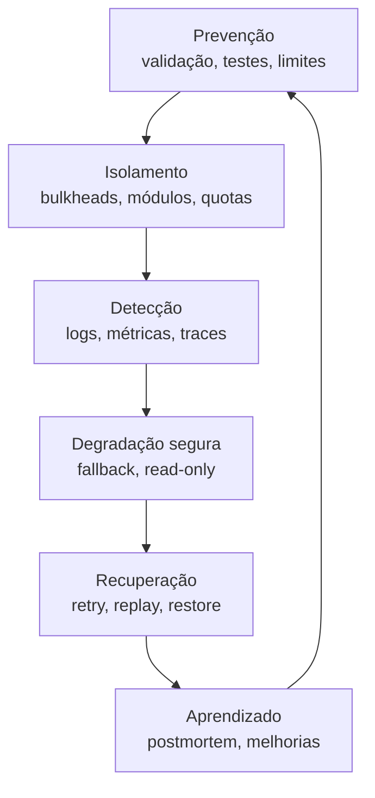
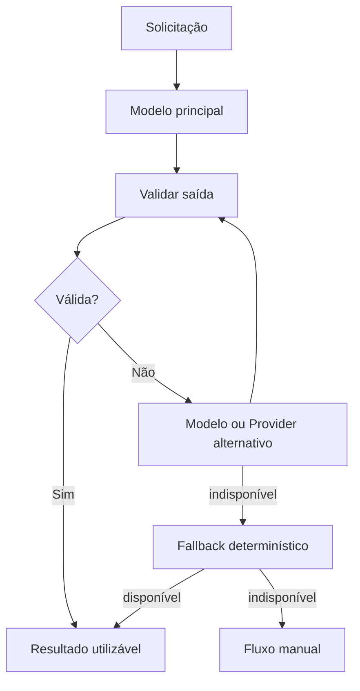

---

id: RB-SRE-001

title: Estratégia de Confiabilidade e Continuidade
description: Define a estratégia oficial de confiabilidade, resiliência e continuidade do RouteBook, incluindo criticidade, SLIs, SLOs, error budgets, tolerância a falhas, modos degradados, RPO, RTO, backups, disaster recovery, failover, capacidade, gestão de mudanças, game days e confiabilidade de inteligência artificial.

document_type: reliability
owner: Platform

status: Draft
version: "0.1.0"

created: "2026-07-19"
last_updated: null

authors:

- RouteBook Team

tags:

- reliability
- sre
- resilience
- continuity
- availability
- sli
- slo
- error-budget
- disaster-recovery
- backup
- failover
- capacity
- degraded-mode
- artificial-intelligence
- chaos-engineering
- diagrams
- mermaid

related_documents:

- RB-CORE-0001
- RB-CORE-0002
- RB-CORE-0003
- RB-CORE-0004
- RB-DOM-001
- RB-DOM-002
- RB-DOM-003
- RB-DOM-004
- RB-ARC-001
- RB-ARC-002
- RB-ARC-003
- RB-ARC-004
- RB-ARC-005
- RB-DATA-001
- RB-API-001
- RB-SEC-001
- RB-OBS-001
- RB-QA-001
- RB-OPS-001

prerequisites:

- RB-CORE-0004
- RB-ARC-001
- RB-ARC-002
- RB-ARC-003
- RB-ARC-004
- RB-ARC-005
- RB-SEC-001
- RB-OBS-001
- RB-QA-001
- RB-OPS-001

next_documents:

- RB-AI-001
- RB-QA-002
- RB-OPS-002
- RB-SRE-002

ai_context:
priority: critical
index: true
---

# RouteBook — Estratégia de Confiabilidade e Continuidade

## Parte I — Fundamentos

### 1. Propósito deste documento

Este documento define a estratégia oficial de confiabilidade, resiliência e continuidade do RouteBook.

Seu objetivo é estabelecer como o produto deverá permanecer disponível, consistente, recuperável e operacional diante de:

* falhas de aplicação;
* falhas de infraestrutura;
* falhas de banco;
* falhas de mensageria;
* falhas de jobs;
* indisponibilidade de integrações;
* indisponibilidade de Providers de inteligência artificial;
* aumento inesperado de carga;
* corrupção de dados;
* deployments defeituosos;
* perda de região;
* falhas humanas;
* incidentes de segurança;
* eventos externos;
* recuperação incompleta.

Este documento deverá orientar:

* Platform;
* Site Reliability Engineering;
* Architecture;
* Backend;
* Frontend;
* Data;
* Security;
* Artificial Intelligence;
* Quality Engineering;
* Product;
* Operations;
* agentes de engenharia;
* agentes operacionais.

Este documento define:

* princípios de confiabilidade;
* capacidades críticas;
* classificação de criticidade;
* disponibilidade funcional;
* SLIs;
* SLOs;
* error budgets;
* tolerância a falhas;
* modos degradados;
* timeouts;
* retries;
* circuit breakers;
* bulkheads;
* resiliência de dados;
* continuidade de negócio;
* RPO;
* RTO;
* backups;
* restauração;
* disaster recovery;
* failover;
* capacidade;
* escalabilidade;
* gestão de mudanças;
* freeze de releases;
* game days;
* chaos engineering;
* confiabilidade de IA;
* governança.

Este documento não define:

* fornecedor obrigatório de infraestrutura;
* topologia física definitiva;
* região definitiva de hospedagem;
* valores contratuais de SLA;
* política corporativa completa de plantão;
* arquitetura multi-região obrigatória;
* ferramenta definitiva de disaster recovery;
* dimensionamento final de produção.

---

### 2. Autoridade documental

A estratégia deverá respeitar:

* a RouteBook Bible;
* o Modelo de Domínio;
* as Regras e Invariantes;
* os Eventos e Ciclos de Vida;
* a Arquitetura;
* a Estratégia de Segurança;
* a Estratégia de Observabilidade;
* a Estratégia de Qualidade;
* os Runbooks e Procedimentos Operacionais.



Confiabilidade não poderá justificar:

* violação de regra;
* desativação de autorização;
* perda silenciosa de dados;
* alteração indevida de ownership;
* aceitação automática de risco;
* aplicação automática de Proposal;
* exposição de informações;
* substituição de estado canônico por cache ou projeção.

---

### 3. Princípio central

Confiabilidade deverá ser construída por camadas.

```text
Prevenir
→ detectar
→ isolar
→ degradar com segurança
→ recuperar
→ validar
→ aprender
```

---

### 4. Confiabilidade

Confiabilidade é a capacidade de o RouteBook executar suas funções corretamente durante um período e sob condições definidas.

Ela envolve:

* disponibilidade;
* consistência;
* integridade;
* desempenho;
* recuperabilidade;
* previsibilidade;
* segurança;
* operabilidade.

---

### 5. Resiliência

Resiliência é a capacidade de absorver, limitar e recuperar-se de falhas.

---

### 6. Continuidade

Continuidade é a capacidade de preservar ou restaurar capacidades prioritárias após interrupções relevantes.

---

### 7. Disponibilidade funcional

Disponibilidade funcional é a capacidade real de o Usuário concluir uma jornada.

Uma API respondendo não significa necessariamente que a capacidade está funcional.

---

### 8. Objetivos

A estratégia deverá:

1. proteger jornadas críticas;
2. impedir propagação de falhas;
3. preservar dados;
4. reduzir indisponibilidade;
5. permitir degradação segura;
6. controlar dependências;
7. possibilitar recuperação verificável;
8. definir prioridades;
9. estabelecer limites de risco;
10. sustentar crescimento;
11. controlar mudanças;
12. validar planos por testes;
13. tornar IA resiliente;
14. orientar investimento por evidência.

---

## Parte II — Princípios de confiabilidade

### 9. Confiabilidade por design

Capacidades críticas deverão ser desenhadas com:

* timeouts;
* idempotência;
* isolamento;
* validação;
* observabilidade;
* fallback;
* rollback;
* recuperação;
* limites.

---

### 10. Falha segura

Quando uma operação falhar, o sistema deverá preservar:

* integridade;
* autorização;
* estado anterior;
* evidências;
* possibilidade de retry;
* clareza para o Usuário.

---

### 11. Estado canônico protegido

Caches, projeções, agentes, integrações e read models não poderão substituir o módulo proprietário.

---

### 12. Isolamento de falhas

Uma falha localizada não deverá derrubar capacidades independentes.

---

### 13. Dependência explícita

Toda dependência deverá possuir:

* owner;
* criticidade;
* timeout;
* política de retry;
* fallback;
* observabilidade;
* runbook.

---

### 14. Recuperação testada

Backup, failover, replay ou rollback não deverão ser considerados confiáveis sem testes.

---

### 15. Simplicidade operacional

A solução mais simples capaz de atender ao risco deverá ser preferida.

---

### 16. Automação com proteção

Automação deverá possuir:

* escopo;
* limites;
* auditoria;
* reversibilidade;
* confirmação para ações críticas.

---

### 17. Error budget orientando mudanças

A velocidade de mudança deverá considerar a confiabilidade observada.

---

### 18. Degradação explícita

Quando a capacidade estiver reduzida, o sistema deverá comunicar:

* o que está indisponível;
* o que continua disponível;
* a validade dos dados;
* as limitações;
* as alternativas.

---

## Parte III — Criticidade

### 19. Dimensões

A criticidade deverá considerar:

* impacto no Usuário;
* impacto em dados;
* impacto de segurança;
* dependência de outras capacidades;
* reversibilidade;
* frequência de uso;
* duração tolerável;
* impacto financeiro;
* impacto reputacional.

---

### 20. Níveis

#### Tier 0 — Crítico

Falha pode causar:

* acesso indevido;
* perda de dados;
* corrupção;
* indisponibilidade ampla;
* impossibilidade de recuperação.

#### Tier 1 — Essencial

Falha bloqueia uma jornada principal.

#### Tier 2 — Importante

Falha degrada a experiência, mas existe alternativa.

#### Tier 3 — Complementar

Falha possui impacto limitado ou facilmente contornável.

---

### 21. Classificação inicial por capacidade

| Capacidade                 | Tier |
| -------------------------- | ---: |
| autenticação               |    0 |
| autorização                |    0 |
| isolamento entre Accounts  |    0 |
| persistência canônica      |    0 |
| criação e leitura de Trip  |    1 |
| Itinerary Planning         |    1 |
| Decision                   |    1 |
| aplicação de Proposal      |    1 |
| Planning Assurance         |    1 |
| Traveler Profile           |    1 |
| Trip Collection            |    2 |
| Place Catalog              |    2 |
| Mobility                   |    2 |
| Recommendation             |    2 |
| geração de Proposal por IA |    2 |
| imagens                    |    3 |
| analytics                  |    3 |

---

### 22. Classificação por módulo

| Módulo                | Criticidade predominante |
| --------------------- | ------------------------ |
| Identity and Access   | Tier 0                   |
| Trip Management       | Tier 1                   |
| Traveler Profile      | Tier 1                   |
| Place Catalog         | Tier 2                   |
| Trip Collection       | Tier 2                   |
| Itinerary Planning    | Tier 1                   |
| Mobility              | Tier 2                   |
| Decision Intelligence | Tier 1 ou 2              |
| Proposal Management   | Tier 1                   |
| Planning Assurance    | Tier 1                   |
| Data Governance       | Tier 1                   |
| Platform              | Tier 0 ou 1              |

---

### 23. Uso da criticidade

A classificação deverá influenciar:

* SLO;
* redundância;
* RPO;
* RTO;
* alertas;
* testes;
* backup;
* disaster recovery;
* revisão;
* runbook;
* investimento.

---

## Parte IV — Disponibilidade funcional

### 24. Jornadas prioritárias

Jornadas iniciais:

1. autenticar;
2. listar Trips;
3. abrir Trip;
4. consultar Traveler Profile;
5. consultar Itinerary;
6. criar ou editar Activity;
7. salvar Place;
8. registrar Decision;
9. revisar Planning Conflict;
10. aplicar Itinerary Proposal.

---

### 25. Sucesso técnico versus funcional

Exemplo:

```text
HTTP 200
≠
Recommendation válida
```

A disponibilidade funcional deverá considerar resultado utilizável.

---

### 26. Dependências por jornada



---

### 27. Capacidade essencial mínima

Em degradação severa, o RouteBook deverá priorizar:

* autenticação;
* leitura de Trips;
* leitura de Itinerary;
* edição manual;
* acesso a dados já persistidos;
* proteção de decisões e regras.

---

## Parte V — SLIs

### 28. Princípio

SLIs deverão representar a experiência e o resultado funcional.

---

### 29. Dimensões

* disponibilidade;
* latência;
* correção;
* Freshness;
* completude;
* durabilidade;
* recuperabilidade.

---

### 30. SLI de disponibilidade da API

```text
requisições válidas concluídas com sucesso técnico
÷
requisições válidas totais
```

---

### 31. SLI de disponibilidade funcional

```text
jornadas concluídas com resultado utilizável
÷
jornadas iniciadas
```

---

### 32. SLI de latência

Medido por percentis:

* p50;
* p95;
* p99.

---

### 33. SLI de publicação de eventos

```text
eventos publicados dentro da janela
÷
eventos confirmados
```

---

### 34. SLI de projeções

```text
projeções atualizadas dentro da janela
÷
eventos aplicáveis
```

---

### 35. SLI de Recommendation

```text
Recommendations válidas geradas
÷
solicitações aceitas
```

---

### 36. SLI de Itinerary Proposal

```text
Proposals válidas e revisáveis
÷
solicitações aceitas
```

---

### 37. SLI de recuperação

```text
incidentes recuperados dentro do RTO
÷
incidentes aplicáveis
```

---

### 38. SLI de backup

```text
backups válidos concluídos
÷
backups planejados
```

---

## Parte VI — SLOs

### 39. Princípio

SLO deverá ser ambicioso, realista e mensurável.

---

### 40. Objetivos iniciais

| Capacidade                                  | SLO inicial |
| ------------------------------------------- | ----------: |
| autenticação                                |      99,95% |
| leitura de Trip                             |       99,9% |
| leitura de Itinerary                        |       99,9% |
| escrita canônica                            |       99,9% |
| publicação de Outbox em até 60 s            |       99,9% |
| atualização de projeção crítica em até 60 s |       99,5% |
| Recommendation válida                       |         99% |
| Proposal válida                             |         98% |
| backup concluído na janela                  |       99,9% |

Esses valores são objetivos internos iniciais.

---

### 41. Latência inicial

| Operação              |         Objetivo |
| --------------------- | ---------------: |
| leitura simples p95   | menor que 500 ms |
| escrita principal p95 |    menor que 1 s |
| busca externa p95     |    menor que 3 s |
| Recommendation p95    |   menor que 10 s |
| Proposal p95          |   menor que 20 s |

---

### 42. Janelas

SLOs deverão especificar:

* janela móvel;
* janela mensal;
* ambiente;
* tráfego incluído;
* exclusões;
* fonte.

---

### 43. Exclusões

Poderão ser excluídos:

* tráfego inválido;
* abuso confirmado;
* manutenção planejada aprovada;
* falha integralmente externa, conforme política.

Exclusões deverão ser limitadas e transparentes.

---

### 44. Revisão

SLOs deverão ser revisados com base em:

* uso;
* maturidade;
* risco;
* incidentes;
* custo;
* expectativas.

---

## Parte VII — Error budgets

### 45. Definição

Error budget é a margem de indisponibilidade ou falha permitida pelo SLO.

---

### 46. Uso

Deverá orientar:

* ritmo de releases;
* priorização de confiabilidade;
* freeze;
* revisão arquitetural;
* investimento;
* testes.

---

### 47. Estados do budget

#### Saudável

Consumo dentro do esperado.

#### Atenção

Consumo acelerado.

#### Crítico

Risco de violar SLO.

#### Esgotado

SLO violado ou prestes a ser violado.

---

### 48. Política inicial

| Estado   | Ação                                               |
| -------- | -------------------------------------------------- |
| saudável | releases normais                                   |
| atenção  | aumentar revisão e monitoramento                   |
| crítico  | restringir mudanças de risco                       |
| esgotado | priorizar confiabilidade e aplicar freeze seletivo |

---

### 49. Burn rate

Deverá ser avaliado em múltiplas janelas:

* curta;
* média;
* longa.

---

### 50. Exceções

Mudanças urgentes de segurança ou recuperação poderão ocorrer mesmo com freeze.

---

## Parte VIII — Camadas de resiliência

### 51. Modelo



---

### 52. Prevenção

* validação;
* type safety;
* constraints;
* testes;
* revisão;
* limites;
* rate limit;
* versionamento.

---

### 53. Isolamento

* bounded contexts;
* pools separados;
* workers separados;
* filas separadas;
* quotas;
* bulkheads;
* feature flags.

---

### 54. Detecção

* SLIs;
* health checks;
* alertas;
* logs;
* traces;
* integridade;
* synthetic monitoring.

---

### 55. Degradação

* cache;
* dados stale identificados;
* edição manual;
* read-only;
* fallback determinístico;
* desativação parcial.

---

### 56. Recuperação

* retry;
* replay;
* rollback;
* failover;
* restore;
* rebuild;
* backfill.

---

## Parte IX — Timeouts

### 57. Princípio

Toda chamada remota deverá possuir timeout explícito.

---

### 58. Tipos

* connection timeout;
* request timeout;
* total operation timeout;
* idle timeout;
* job timeout.

---

### 59. Hierarquia

Timeout externo deverá ser menor que o limite da operação chamadora.

---

### 60. Cascata

Evitar timeouts desalinhados que prolonguem falhas.

---

### 61. IA

Chamadas de IA deverão possuir:

* timeout por Provider;
* timeout total do agente;
* limite de Tool Calls;
* limite de retries;
* limite de custo.

---

## Parte X — Retries

### 62. Princípio

Retry deverá ser usado apenas em falhas transitórias.

---

### 63. Condições adequadas

* timeout;
* erro temporário;
* rate limit;
* indisponibilidade transitória;
* conflito otimista controlado.

---

### 64. Condições inadequadas

Não repetir automaticamente:

* erro de validação;
* autorização negada;
* regra violada;
* payload inválido;
* operação não idempotente;
* schema incompatível.

---

### 65. Estratégia

* exponential backoff;
* jitter;
* limite;
* timeout total;
* idempotência;
* métricas.

---

### 66. Retry storm

Deverá ser evitada por:

* backoff;
* circuit breaker;
* quotas;
* limite de concorrência.

---

## Parte XI — Circuit breakers

### 67. Objetivo

Impedir chamadas contínuas a uma dependência falha.

---

### 68. Estados

* closed;
* open;
* half-open.

---

### 69. Critérios

Configuração deverá considerar:

* erro;
* timeout;
* volume;
* janela;
* tempo de recuperação;
* criticidade.

---

### 70. Observabilidade

Registrar:

* abertura;
* fechamento;
* duração;
* dependência;
* fallback;
* impacto.

---

## Parte XII — Bulkheads

### 71. Definição

Bulkhead isola recursos para impedir propagação de saturação.

---

### 72. Aplicações

* pool por integração;
* fila por workload;
* worker por job;
* limite por agente;
* quota por Account;
* conexão por módulo.

---

### 73. Priorização

Workloads críticos deverão possuir recursos protegidos.

---

## Parte XIII — Idempotência

### 74. Princípio

Toda operação suscetível a repetição deverá definir comportamento idempotente.

---

### 75. Casos

* Commands;
* Tool Calls;
* Proposal Application;
* replay;
* jobs;
* consumers;
* integrações de escrita.

---

### 76. Falha parcial

A idempotência deverá proteger reexecução após falha parcial.

---

### 77. Validação

Mesma chave com payload divergente deverá falhar.

---

## Parte XIV — Modos degradados

### 78. Princípio

O sistema deverá preservar capacidades essenciais mesmo com dependências opcionais indisponíveis.

---

### 79. Tipos

#### Read-only

Permite leitura e bloqueia escrita de risco.

#### Manual

Substitui automação por ação explícita do Usuário.

#### Cached

Utiliza dados previamente obtidos.

#### Stale

Utiliza dados possivelmente desatualizados com aviso.

#### Reduced

Desativa parte da funcionalidade.

#### Deterministic

Substitui IA por regra ou ranking simples.

---

### 80. Matriz inicial

| Falha          | Modo degradado                         |
| -------------- | -------------------------------------- |
| AI Provider    | fallback determinístico ou manual      |
| mapas          | lista textual                          |
| imagens        | placeholder                            |
| rotas          | distância aproximada identificada      |
| Place Provider | cache stale permitido                  |
| projeção       | leitura canônica seletiva              |
| fila           | persistência em Outbox até recuperação |
| Recommendation | busca e edição manual                  |
| Proposal       | edição manual do Itinerary             |

---

### 81. Limites

Modo degradado não poderá:

* violar Restriction mandatory;
* alterar Activity fixed;
* preencher Free Period protected;
* inventar confirmação;
* omitir Freshness;
* registrar Decision automaticamente.

---

### 82. Entrada e saída

Cada modo deverá definir:

* trigger;
* owner;
* duração;
* comunicação;
* critérios de saída;
* validação.

---

## Parte XV — Resiliência de dados

### 83. Princípio

A proteção de dados possui prioridade superior à disponibilidade de escrita.

---

### 84. Mecanismos

* transações;
* constraints;
* concorrência otimista;
* backups;
* replicas;
* checksums;
* auditoria;
* Outbox;
* retenção;
* integridade periódica.

---

### 85. Concorrência

Conflitos deverão resultar em erro controlado, não em sobrescrita silenciosa.

---

### 86. Corrupção

Ao detectar corrupção:

* limitar escritas;
* preservar evidências;
* identificar escopo;
* executar runbook;
* restaurar integridade.

---

### 87. Projeções

Read models poderão ser reconstruídos.

Não deverão ser tratados como única cópia de dados.

---

### 88. Outbox

Mudança canônica e evento deverão ser atômicos quando necessário.

---

## Parte XVI — Resiliência de mensageria

### 89. Garantias

A arquitetura deverá assumir possibilidade de:

* entrega duplicada;
* atraso;
* reordenação;
* falha de consumer;
* replay.

---

### 90. Consumers

Deverão ser:

* idempotentes;
* observáveis;
* limitados;
* recuperáveis;
* versionados.

---

### 91. Dead-letter

Mensagens permanentes deverão ser isoladas para análise.

---

### 92. Backpressure

Consumers deverão reduzir ritmo quando dependências estiverem saturadas.

---

### 93. Ordenação

Ordenação só deverá ser exigida quando o domínio necessitar.

---

## Parte XVII — Resiliência de jobs

### 94. Características

Jobs críticos deverão possuir:

* checkpoint;
* idempotência;
* timeout;
* lock quando necessário;
* retry;
* observabilidade;
* retomada;
* cancelamento.

---

### 95. Jobs longos

Deverão processar em lotes controlados.

---

### 96. Scheduling

Falha do scheduler não deverá causar perda silenciosa.

---

### 97. Reprocessamento

Deverá ocorrer por escopo e com validação.

---

## Parte XVIII — Resiliência de integrações

### 98. Classificação

Toda integração deverá ser classificada como:

* crítica;
* importante;
* opcional.

---

### 99. Contratos

Adapters deverão proteger o domínio contra:

* schema incompatível;
* campo ausente;
* erro de Provider;
* precisão indevida;
* dados stale.

---

### 100. Estratégias

* timeout;
* retry;
* circuit breaker;
* fallback;
* cache;
* quota;
* rate limit;
* adapter alternativo.

---

### 101. Dados externos

Dados deverão preservar:

* Data Source;
* Freshness;
* Confidence;
* Provenance;
* validade.

---

## Parte XIX — Confiabilidade de IA e agentes

### 102. Princípio

IA deverá falhar sem comprometer o domínio.

---

### 103. Riscos

* Provider indisponível;
* timeout;
* schema inválido;
* referência inventada;
* custo excessivo;
* loop;
* ferramenta proibida;
* prompt injection;
* contexto stale;
* qualidade degradada.

---

### 104. Proteções

* Structured Output;
* validators;
* Tool Registry;
* Authorization Policy;
* limite de etapas;
* orçamento;
* timeout;
* fallback;
* Provenance;
* avaliação contínua.

---

### 105. Modos degradados de IA

```text
modelo principal
→ modelo alternativo
→ Provider alternativo
→ fallback determinístico
→ fluxo manual
```

---

### 106. Estado canônico

Falha de IA não deverá:

* alterar Itinerary;
* registrar Decision;
* ignorar Planning Risk;
* remover Restriction;
* criar IDs;
* executar ferramenta crítica.

---

### 107. SLOs de IA

Deverão considerar:

* sucesso válido;
* latência;
* schema validity;
* referência válida;
* custo;
* fallback;
* tool failure.

---

### 108. Error budget de IA

Deverá ser separado por capacidade.

Uma falha de Recommendation não deverá consumir o mesmo budget de autenticação.

---

### 109. Agentes

Agent Runtime deverá impor:

* limite de passos;
* limite de tokens;
* limite de custo;
* timeout;
* allowlist de ferramentas;
* interrupção;
* auditoria.

---

### 110. Fluxo resiliente de IA



---

## Parte XX — Continuidade de negócio

### 111. Objetivo

Preservar capacidades prioritárias durante interrupções relevantes.

---

### 112. Escopo

Considerar:

* perda de região;
* perda de banco;
* perda de credenciais;
* Provider indisponível;
* corrupção;
* falha humana;
* indisponibilidade de equipe;
* incidente de segurança.

---

### 113. Priorização

Ordem inicial:

1. segurança e isolamento;
2. autenticação;
3. leitura de Trips;
4. leitura de Itinerary;
5. escrita canônica;
6. Decision;
7. Planning Assurance;
8. integrações;
9. IA;
10. recursos complementares.

---

### 114. Continuidade manual

Quando automação estiver indisponível, o sistema deverá preservar:

* consulta;
* edição manual;
* exportação controlada;
* instruções;
* suporte.

---

### 115. Dependências organizacionais

Deverão existir:

* owners;
* contatos;
* acessos;
* credenciais emergenciais;
* runbooks;
* substitutos;
* documentação.

---

## Parte XXI — RPO e RTO

### 116. Recovery Point Objective

RPO define a perda máxima aceitável de dados no tempo.

---

### 117. Recovery Time Objective

RTO define o tempo máximo desejado para restaurar uma capacidade.

---

### 118. Valores iniciais

| Capacidade               |            RPO |      RTO |
| ------------------------ | -------------: | -------: |
| identidade e autorização |      até 5 min |  até 1 h |
| dados canônicos de Trip  |     até 15 min |  até 4 h |
| Itinerary                |     até 15 min |  até 4 h |
| Decisions                |     até 15 min |  até 4 h |
| Proposals                |        até 1 h |  até 8 h |
| Planning Conflicts       |        até 1 h |  até 8 h |
| projeções                | reconstruíveis |  até 8 h |
| logs operacionais        |        até 1 h | até 24 h |
| analytics                |       até 24 h | até 72 h |

Valores deverão ser validados por capacidade e custo.

---

### 119. Dependências

RPO e RTO deverão considerar:

* backup;
* replicação;
* volume;
* automação;
* equipe;
* runbook;
* teste;
* infraestrutura.

---

### 120. Violação

Ameaça a RPO ou RTO deverá elevar a severidade operacional.

---

## Parte XXII — Backups

### 121. Escopo

Backups deverão cobrir:

* banco canônico;
* configurações críticas;
* objetos;
* schemas;
* metadados;
* secrets quando aplicável por mecanismo próprio;
* artefatos necessários à restauração.

---

### 122. Estratégia

Deverá combinar, conforme necessidade:

* snapshots;
* full backup;
* incremental;
* point-in-time recovery;
* replicação;
* versionamento de objetos.

---

### 123. Requisitos

* criptografia;
* retenção;
* isolamento;
* controle de acesso;
* checksum;
* inventário;
* teste;
* observabilidade.

---

### 124. Backup imutável

Para riscos elevados, considerar cópia imutável ou protegida contra exclusão.

---

### 125. Frequência

Deverá derivar do RPO.

---

### 126. Retenção

Deverá considerar:

* recuperação;
* segurança;
* privacidade;
* legislação;
* custo.

---

## Parte XXIII — Restauração

### 127. Princípio

Restauração deverá ser testada, documentada e validada.

---

### 128. Processo

```mermaid
flowchart TD
    Select["Selecionar backup"]
    Verify["Verificar integridade"]
    RestoreIsolated["Restaurar isoladamente"]
    ValidateData["Validar dados e schema"]
    PlanCutover["Planejar corte"]
    RestoreProduction["Restaurar capacidade"]
    ValidateJourney["Validar jornadas"]
    Monitor["Monitorar estabilidade"]

    Select --> Verify
    Verify --> RestoreIsolated
    RestoreIsolated --> ValidateData
    ValidateData --> PlanCutover
    PlanCutover --> RestoreProduction
    RestoreProduction --> ValidateJourney
    ValidateJourney --> Monitor
```



---

### 129. Validação

Deverá incluir:

* Account;
* User;
* Trip;
* Traveler Profile;
* Itinerary;
* Activity;
* Decision;
* Proposal;
* Planning Conflict;
* versões;
* constraints;
* Outbox;
* Inbox.

---

### 130. Testes

Restauração crítica deverá ser testada periodicamente.

---

## Parte XXIV — Disaster recovery

### 131. Definição

Disaster recovery trata a recuperação após falha de grande impacto.

---

### 132. Cenários

* perda da região;
* perda do banco;
* corrupção generalizada;
* credencial mestre comprometida;
* falha ampla do Provider;
* exclusão acidental;
* ransomware;
* indisponibilidade prolongada.

---

### 133. Plano

Deverá definir:

* cenário;
* trigger;
* autoridade;
* ambiente alternativo;
* dados;
* rede;
* DNS;
* secrets;
* restauração;
* validação;
* comunicação;
* retorno.

---

### 134. Estratégias possíveis

* backup and restore;
* pilot light;
* warm standby;
* active-passive;
* active-active.

---

### 135. Escolha

A estratégia deverá ser proporcional à criticidade e ao custo.

---

### 136. DR drill

Planos deverão ser testados por exercício.

---

## Parte XXV — Failover

### 137. Princípio

Failover deverá preservar integridade e evitar split-brain.

---

### 138. Tipos

* manual;
* semiautomático;
* automático.

---

### 139. Pré-condições

* destino saudável;
* dados consistentes;
* credenciais válidas;
* capacidade suficiente;
* observabilidade;
* rollback.

---

### 140. Failback

O retorno ao ambiente original deverá ser planejado separadamente.

---

### 141. Validação

* leitura;
* escrita;
* versões;
* filas;
* jobs;
* integrações;
* autenticação;
* latência.

---

## Parte XXVI — Capacidade

### 142. Objetivo

Garantir recursos suficientes antes da saturação.

---

### 143. Dimensões

* CPU;
* memória;
* conexões;
* storage;
* IOPS;
* largura de banda;
* queue depth;
* workers;
* quotas;
* tokens;
* custo.

---

### 144. Previsão

Deverá considerar:

* crescimento de Accounts;
* número de Trips;
* número de Places;
* Activities;
* eventos;
* imagens;
* chamadas externas;
* chamadas de IA.

---

### 145. Headroom

Recursos críticos deverão manter margem para:

* pico;
* failover;
* replay;
* incidentes;
* deployment.

---

### 146. Limites

Cada componente deverá documentar:

* capacidade esperada;
* limite seguro;
* limite crítico;
* comportamento de saturação.

---

### 147. Alertas preventivos

Alertas deverão ocorrer antes da exaustão.

---

## Parte XXVII — Escalabilidade

### 148. Estratégia

Escalar por evidência, não por antecipação abstrata.

---

### 149. Escala vertical

Adequada quando:

* simples;
* econômica;
* suficiente;
* temporária.

---

### 150. Escala horizontal

Adequada quando:

* workload paralelizável;
* instâncias stateless;
* crescimento sustentado;
* failover necessário.

---

### 151. Banco

Escalabilidade poderá considerar:

* índices;
* otimização;
* pool;
* replica;
* particionamento;
* arquivamento;
* banco separado.

---

### 152. Jobs

Deverão escalar por:

* partição;
* lote;
* worker;
* prioridade;
* checkpoint.

---

### 153. IA

Escalabilidade deverá considerar:

* quotas;
* fila;
* modelos;
* cache;
* batching;
* custo.

---

## Parte XXVIII — Gestão de mudanças

### 154. Princípio

Mudança é uma fonte relevante de incidentes.

---

### 155. Classificação

#### Baixo risco

* mudança isolada;
* reversível;
* sem migration;
* sem impacto crítico.

#### Médio risco

* alteração de contrato compatível;
* integração;
* feature flag;
* migration expand.

#### Alto risco

* alteração de autorização;
* migration destrutiva;
* mudança de dados;
* novo Provider crítico;
* mudança de ownership;
* failover.

---

### 156. Requisitos

Mudanças de risco deverão possuir:

* plano;
* testes;
* observabilidade;
* rollback;
* owner;
* aprovação;
* janela;
* comunicação.

---

### 157. Progressive delivery

Preferir:

* canary;
* feature flags;
* rollout gradual;
* shadow;
* dark launch.

---

### 158. Marcadores

Deployments deverão aparecer em dashboards e traces.

---

## Parte XXIX — Freeze de releases

### 159. Objetivo

Reduzir risco quando a confiabilidade estiver comprometida.

---

### 160. Triggers

* error budget esgotado;
* SEV-1 ativo;
* incidentes recorrentes;
* DR não confiável;
* backups ameaçados;
* falha de segurança crítica;
* período de alto risco.

---

### 161. Escopo

Freeze poderá ser:

* total;
* por módulo;
* por capacidade;
* por tipo de mudança.

---

### 162. Exceções

Permitidas para:

* segurança;
* mitigação;
* recuperação;
* correção de confiabilidade.

---

### 163. Saída

Exige:

* causa mitigada;
* sinais normalizados;
* plano;
* validação;
* aprovação.

---

## Parte XXX — Game days

### 164. Definição

Game day é um exercício planejado para validar pessoas, processos e tecnologia.

---

### 165. Objetivos

* testar runbooks;
* testar alertas;
* testar comunicação;
* testar failover;
* identificar lacunas;
* medir recuperação.

---

### 166. Cenários

* banco indisponível;
* fila parada;
* Provider externo indisponível;
* AI Provider indisponível;
* backup falho;
* secret exposto;
* Projection lag;
* deployment defeituoso.

---

### 167. Planejamento

Deverá definir:

* hipótese;
* escopo;
* blast radius;
* duração;
* abort criteria;
* observadores;
* métricas;
* rollback.

---

### 168. Resultado

Deverá produzir:

* evidências;
* lacunas;
* ações;
* owners;
* atualização de runbooks.

---

## Parte XXXI — Chaos engineering

### 169. Princípio

Experimentos deverão validar hipóteses de resiliência.

---

### 170. Pré-condições

* observabilidade;
* runbook;
* rollback;
* escopo;
* aprovação;
* ambiente adequado.

---

### 171. Progressão

1. ambiente local;
2. integração;
3. staging;
4. produção limitada.

---

### 172. Experimentos

* introduzir latência;
* derrubar worker;
* bloquear Provider;
* duplicar mensagem;
* atrasar fila;
* limitar quota;
* reiniciar instância.

---

### 173. Limites

Não experimentar em produção sem maturidade e proteção.

---

## Parte XXXII — Dependências humanas e operacionais

### 174. Risco de pessoa única

Capacidades críticas não deverão depender de uma única pessoa.

---

### 175. Proteções

* documentação;
* runbooks;
* treinamento;
* revisão;
* acesso compartilhado controlado;
* substitutos;
* exercícios.

---

### 176. Acessos

Acessos emergenciais deverão ser:

* limitados;
* auditados;
* testados;
* revogados quando não necessários.

---

### 177. Fornecedores

Contatos e procedimentos de escalonamento deverão estar documentados.

---

## Parte XXXIII — Testes de confiabilidade

### 178. Categorias

* load;
* stress;
* soak;
* failover;
* restore;
* replay;
* restart;
* chaos;
* recovery;
* capacity.

---

### 179. Critérios

Cada teste deverá definir:

* hipótese;
* carga;
* falha;
* resultado esperado;
* SLI;
* tempo;
* evidência;
* conclusão.

---

### 180. Testes de continuidade

Deverão incluir:

* backup;
* restore;
* failover;
* comunicação;
* runbook;
* acesso;
* RPO;
* RTO.

---

### 181. Testes de IA

* Provider indisponível;
* timeout;
* quota;
* fallback;
* schema inválido;
* Tool loop;
* custo excedido.

---

## Parte XXXIV — Métricas de confiabilidade

### 182. Métricas principais

* availability;
* functional success;
* latency;
* error rate;
* saturation;
* change failure rate;
* MTTA;
* MTTD;
* MTTR;
* incident count;
* error budget burn;
* backup success;
* restore success;
* failover time.

---

### 183. Change Failure Rate

```text
deployments que causaram incidente ou rollback
÷
deployments totais
```

---

### 184. Mean Time to Detect

Tempo entre início do impacto e detecção.

---

### 185. Mean Time to Recover

Tempo entre início do impacto e recuperação.

---

### 186. Recovery success rate

Proporção de procedimentos de recuperação concluídos com sucesso.

---

### 187. Métricas por Tier

Métricas deverão ser segmentadas por criticidade e capacidade.

---

## Parte XXXV — Governança

### 188. Owner

O owner deste documento é:

```text
Platform
```

A manutenção deverá envolver:

* Site Reliability Engineering;
* Architecture;
* Security;
* Backend;
* Data;
* Artificial Intelligence;
* Quality Engineering;
* Product;
* Operations.

---

### 189. Nova capacidade

Deverá definir:

* Tier;
* SLI;
* SLO;
* dependências;
* modo degradado;
* RPO;
* RTO;
* backup;
* runbook;
* testes.

---

### 190. Nova dependência

Deverá definir:

* criticidade;
* owner;
* timeout;
* retry;
* circuit breaker;
* fallback;
* quota;
* runbook;
* telemetria.

---

### 191. Novo SLO

Deverá possuir:

* SLI;
* janela;
* objetivo;
* fonte;
* owner;
* error budget;
* política.

---

### 192. Mudança de Tier

Exige revisão de:

* SLO;
* RPO;
* RTO;
* arquitetura;
* testes;
* runbooks;
* custo.

---

### 193. Exceções

Deverão possuir:

* justificativa;
* risco;
* owner;
* prazo;
* mitigação;
* aprovação.

---

### 194. ADR

Criar ADR para:

* multi-região;
* novo modelo de failover;
* active-active;
* mudança relevante de RPO;
* banco separado;
* Provider crítico;
* automação de recuperação;
* arquitetura de alta disponibilidade.

---

## Parte XXXVI — Estrutura documental sugerida

### 195. Organização

```text
docs/
└── reliability/
    ├── reliability-and-continuity-strategy.md
    ├── service-level-objectives.md
    ├── error-budget-policy.md
    ├── disaster-recovery-plan.md
    ├── capacity-plan.md
    ├── game-days/
    └── reliability-reviews/
```

---

### 196. Artefatos derivados

Este documento deverá originar:

* catálogo de serviços;
* SLOs detalhados;
* política de error budget;
* plano de disaster recovery;
* matriz de RPO e RTO;
* plano de capacidade;
* calendário de game days;
* reliability reviews.

---

## Parte XXXVII — Anti-patterns

### 197. Alta disponibilidade sem necessidade

Redundância excessiva aumenta custo e complexidade.

---

### 198. Retry ilimitado

Pode ampliar saturação e custo.

---

### 199. Timeout ausente

Permite bloqueio e cascata.

---

### 200. Fallback silencioso

O Usuário deverá conhecer limitações relevantes.

---

### 201. Cache como fonte canônica

Pode gerar inconsistência.

---

### 202. Backup sem restore

Não comprova recuperabilidade.

---

### 203. Failover não testado

Não deverá ser considerado confiável.

---

### 204. RTO sem runbook

Objetivo sem procedimento não é executável.

---

### 205. SLO baseado só em infraestrutura

Deve representar capacidade funcional.

---

### 206. Freeze indefinido

Deve possuir critério de saída.

---

### 207. Chaos sem hipótese

Experimento deverá responder uma pergunta.

---

### 208. Multi-região prematura

Não deverá ser adotada sem evidência.

---

### 209. Modo degradado violando regras

Disponibilidade não justifica comportamento incorreto.

---

### 210. IA como fallback de regra

IA não deverá substituir validação determinística.

---

## Parte XXXVIII — Evolução

### 211. Fase inicial

* criticidade;
* SLIs;
* SLOs;
* error budget;
* timeouts;
* retries;
* backups;
* restore;
* modos degradados;
* runbooks;
* capacidade básica.

---

### 212. Fase intermediária

* burn rate;
* failover;
* DR drills;
* game days;
* chaos controlado;
* predictive capacity;
* reliability reviews;
* progressive delivery.

---

### 213. Fase avançada

Somente por evidência:

* multi-região;
* active-active;
* auto-remediation;
* chaos contínuo;
* previsão de falhas;
* self-healing;
* continuidade geográfica.

---

### 214. Critérios de evolução

Uma evolução deverá demonstrar:

* risco real;
* impacto;
* ganho;
* custo;
* operabilidade;
* testabilidade;
* owner.

---

## Parte XXXIX — Rastreabilidade

### 215. Capacidade e proteção

| Capacidade        | Proteções principais                   |
| ----------------- | -------------------------------------- |
| autenticação      | redundância, timeout, alertas          |
| Trip              | transação, backup, concorrência        |
| Itinerary         | versionamento, backup, rollback        |
| Decision          | autoria, transação, auditoria          |
| Proposal          | isolamento, versão, idempotência       |
| Planning Conflict | evidência, regra, auditoria            |
| Recommendation    | fallback, validade, validação          |
| Outbox            | transação, retry, backlog              |
| Consumer          | Inbox, idempotência, DLQ               |
| IA                | schema, limites, fallback, Tool Policy |

---

### 216. Documento e responsabilidade

| Tema            | Documento               |
| --------------- | ----------------------- |
| arquitetura     | RB-ARC-001 a RB-ARC-005 |
| dados           | RB-DATA-001             |
| segurança       | RB-SEC-001              |
| observabilidade | RB-OBS-001              |
| qualidade       | RB-QA-001               |
| procedimentos   | RB-OPS-001              |
| confiabilidade  | RB-SRE-001              |

---

## Parte XL — Catálogo de diagramas

### 217. Diagramas desta versão

| ID conceitual  | Diagrama                 |
| -------------- | ------------------------ |
| RB-DGM-SRE-001 | Autoridade documental    |
| RB-DGM-SRE-002 | Dependências de jornadas |
| RB-DGM-SRE-003 | Camadas de resiliência   |
| RB-DGM-SRE-004 | Fluxo resiliente de IA   |
| RB-DGM-SRE-005 | Processo de restauração  |

---

### 218. Critério de inclusão

Os diagramas foram incluídos para representar:

* autoridade;
* dependências;
* camadas de proteção;
* fallback de IA;
* recuperação de dados.

---

## Parte XLI — Critérios de aceite

### 219. Fundamentos

* confiabilidade está definida;
* resiliência está definida;
* continuidade está definida;
* disponibilidade funcional está definida;
* criticidade está definida;
* capacidades críticas estão classificadas.

---

### 220. SRE

* SLIs estão definidos;
* SLOs estão definidos;
* error budgets estão definidos;
* burn rate está definido;
* freeze está definido;
* gestão de mudanças está definida.

---

### 221. Resiliência

* timeouts estão definidos;
* retries estão definidos;
* circuit breakers estão definidos;
* bulkheads estão definidos;
* idempotência está definida;
* modos degradados estão definidos.

---

### 222. Dados e processamento

* dados estão protegidos;
* Outbox está contemplada;
* Consumers estão contemplados;
* jobs estão contemplados;
* projeções estão contempladas;
* integridade está contemplada.

---

### 223. Continuidade

* RPO está definido;
* RTO está definido;
* backups estão definidos;
* restauração está definida;
* disaster recovery está definido;
* failover está definido;
* failback está contemplado.

---

### 224. Inteligência artificial

* falhas de Provider estão contempladas;
* fallback está definido;
* limites de agente estão definidos;
* custo está contemplado;
* schema inválido está contemplado;
* IA não altera estado canônico em falha.

---

### 225. Evolução

* capacidade está definida;
* escalabilidade está definida;
* game days estão definidos;
* chaos engineering está definido;
* testes de confiabilidade estão definidos;
* governança está definida.

---

### 226. Diagramas

* Mermaid renderiza no GitHub;
* diagramas usam termos oficiais;
* diagramas não possuem atributos adicionais;
* diagramas possuem valor estratégico.

---

## Parte XLII — Checklist final

### 227. Checklist documental

Antes de aprovar:

* frontmatter YAML é válido;
* existe apenas um H1;
* Partes utilizam H2;
* seções numeradas utilizam H3;
* propósito está definido;
* autoridade está definida;
* princípios estão definidos;
* criticidade está definida;
* disponibilidade funcional está definida;
* SLIs estão definidos;
* SLOs estão definidos;
* error budgets estão definidos;
* timeouts estão definidos;
* retries estão definidos;
* circuit breakers estão definidos;
* bulkheads estão definidos;
* idempotência está definida;
* modos degradados estão definidos;
* dados estão protegidos;
* mensageria está coberta;
* jobs estão cobertos;
* integrações estão cobertas;
* IA está coberta;
* continuidade está definida;
* RPO está definido;
* RTO está definido;
* backups estão definidos;
* restauração está definida;
* disaster recovery está definido;
* failover está definido;
* capacidade está definida;
* escalabilidade está definida;
* mudanças estão definidas;
* freeze está definido;
* game days estão definidos;
* chaos engineering está definido;
* dependências humanas estão definidas;
* testes estão definidos;
* métricas estão definidas;
* governança está definida;
* anti-patterns estão definidos;
* evolução está definida;
* rastreabilidade está presente;
* Mermaid renderiza no GitHub;
* não existem contradições com RB-DOM-001;
* não existem contradições com RB-DOM-002;
* não existem contradições com RB-DOM-003;
* não existem contradições com RB-DOM-004;
* não existem contradições com RB-ARC-001;
* não existem contradições com RB-ARC-002;
* não existem contradições com RB-ARC-003;
* não existem contradições com RB-ARC-004;
* não existem contradições com RB-ARC-005;
* não existem contradições com RB-SEC-001;
* não existem contradições com RB-OBS-001;
* não existem contradições com RB-QA-001;
* não existem contradições com RB-OPS-001.

---

## Parte XLIII — Declaração final

### 228. Declaração de confiabilidade e continuidade

A confiabilidade do RouteBook deverá ser construída por meio de prevenção, isolamento, detecção, degradação segura, recuperação, validação e aprendizado.

Toda capacidade crítica deverá possuir:

* classificação de criticidade;
* owner;
* SLI;
* SLO;
* error budget;
* dependências identificadas;
* timeouts;
* retries controlados;
* fallback;
* modo degradado;
* observabilidade;
* runbook;
* RPO;
* RTO;
* estratégia de recuperação;
* testes.

A continuidade deverá preservar prioritariamente:

* segurança;
* autorização;
* isolamento entre Accounts;
* dados canônicos;
* Trip;
* Itinerary;
* Decision;
* Planning Assurance;
* capacidade de leitura;
* capacidade de edição manual;
* rastreabilidade.

Nenhum mecanismo de disponibilidade, fallback, retry, failover, restore, cache, automação, agente ou Provider poderá:

* violar regra;
* contornar autorização;
* ocultar perda de dados;
* transformar dado stale em confirmado;
* transformar Recommendation em Decision;
* aplicar Proposal sem aceite;
* ignorar Planning Risk;
* substituir estado canônico;
* ampliar autonomia de IA;
* remover auditoria;
* reduzir privacidade.

O RouteBook deverá ser capaz de falhar de maneira limitada, explícita e recuperável.

Confiabilidade não será tratada como propriedade exclusiva da infraestrutura.

Ela será uma característica estrutural do produto, do domínio, da arquitetura, da qualidade e da operação.
