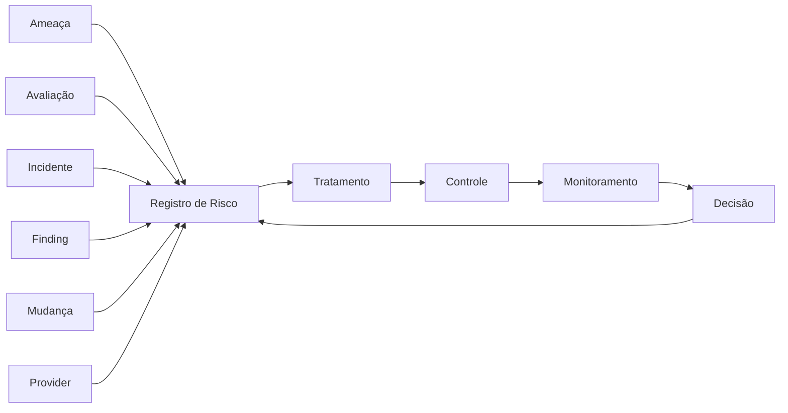
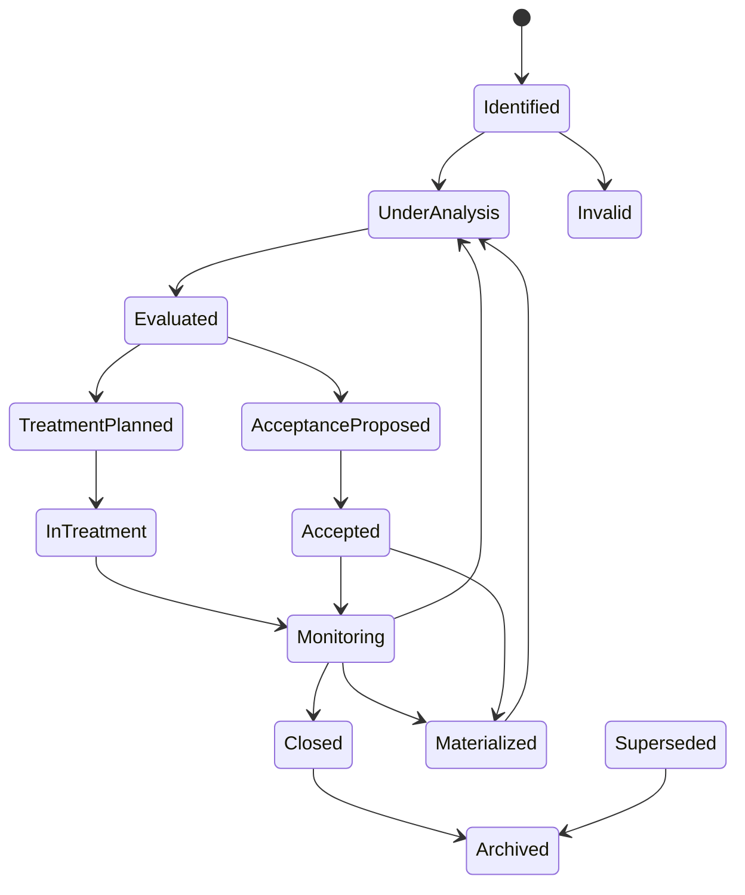
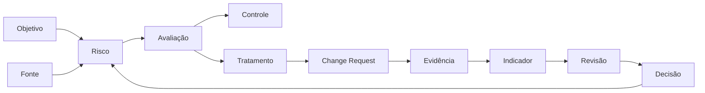

---

id: RB-RISK-001

title: Gestão Integrada de Riscos e Registro de Riscos
description: Define o sistema oficial do RouteBook para identificar, analisar, avaliar, tratar, aceitar, monitorar e comunicar riscos de produto, domínio, arquitetura, dados, segurança, privacidade, inteligência artificial, qualidade, confiabilidade, operações, Providers e conformidade.

document_type: risk
owner: Governance

status: Published
version: "0.1.0"

created: "2026-07-24"
last_updated: null

authors:

- RouteBook Team

tags:

- risk-management
- risk-register
- governance
- compliance
- product-risk
- architecture-risk
- data-risk
- security-risk
- privacy-risk
- artificial-intelligence
- operational-risk
- vendor-risk
- risk-treatment
- risk-acceptance
- diagrams
- mermaid

related_documents:

- RB-CORE-0001
- RB-CORE-0002
- RB-CORE-0003
- RB-CORE-0004
- RB-PRD-008
- RB-DOM-001
- RB-DOM-002
- RB-DOM-003
- RB-DOM-004
- RB-ARC-001
- RB-ARC-002
- RB-ARC-003
- RB-ARC-004
- RB-ARC-005
- RB-DATA-001
- RB-DATA-002
- RB-API-001
- RB-SEC-001
- RB-SEC-002
- RB-SEC-003
- RB-PRIV-001
- RB-PRIV-002
- RB-PRIV-003
- RB-OBS-001
- RB-QA-001
- RB-QA-002
- RB-OPS-001
- RB-OPS-002
- RB-SRE-001
- RB-AI-001
- RB-AI-002
- RB-AI-003
- RB-AI-004
- RB-AI-005
- RB-AI-006
- RB-COMP-001
- RB-COMP-002
- RB-COMP-003
- RB-GOV-001
- RB-GOV-002

prerequisites:

- RB-CORE-0004
- RB-PRD-008
- RB-DOM-001
- RB-DOM-002
- RB-DOM-003
- RB-DOM-004
- RB-ARC-001
- RB-ARC-002
- RB-ARC-003
- RB-ARC-004
- RB-ARC-005
- RB-DATA-001
- RB-DATA-002
- RB-SEC-001
- RB-SEC-002
- RB-SEC-003
- RB-PRIV-001
- RB-PRIV-002
- RB-PRIV-003
- RB-AI-001
- RB-AI-002
- RB-AI-005
- RB-OBS-001
- RB-QA-001
- RB-OPS-001
- RB-SRE-001
- RB-COMP-001
- RB-COMP-002
- RB-COMP-003
- RB-GOV-001
- RB-GOV-002

next_documents: []

ai_context:
priority: critical
index: true
---

# RouteBook — Gestão Integrada de Riscos e Registro de Riscos

## Parte I — Fundamentos

### 1. Propósito

Este documento define o sistema oficial de gestão integrada de riscos do RouteBook.

Seu objetivo é estabelecer como riscos deverão ser:

* identificados;
* descritos;
* classificados;
* analisados;
* avaliados;
* priorizados;
* tratados;
* aceitos;
* transferidos;
* evitados;
* monitorados;
* comunicados;
* revisados;
* encerrados.

O documento também define o Registro de Riscos do RouteBook como fonte canônica para riscos que afetem:

* produto;
* domínio;
* arquitetura;
* dados;
* APIs;
* segurança;
* privacidade;
* inteligência artificial;
* qualidade;
* confiabilidade;
* operações;
* continuidade;
* Providers;
* mudanças;
* documentação;
* conformidade.

---

### 2. Problema que este documento resolve

Riscos podem surgir em diferentes áreas e documentos.

Exemplos:

* uma ameaça identificada no `RB-SEC-002`;
* uma vulnerabilidade do `RB-SEC-003`;
* um risco de privacidade do `RB-PRIV-002`;
* um risco de IA do `RB-AI-005`;
* um achado do `RB-COMP-003`;
* uma decisão do `RB-GOV-002`;
* um incidente operacional;
* uma dependência de Provider;
* uma limitação arquitetural;
* uma dívida técnica.

Sem um sistema integrado, esses riscos podem:

* ser registrados em locais diferentes;
* receber classificações incompatíveis;
* não possuir owner;
* não possuir tratamento;
* permanecer duplicados;
* ser aceitos informalmente;
* perder prazo de revisão;
* permanecer invisíveis para outras áreas;
* ser tratados apenas após incidentes.

Este documento estabelece uma linguagem e um processo comuns.

---

### 3. Relação com os documentos anteriores

O `RB-SEC-002` identifica ameaças e controles de segurança.

O `RB-PRIV-002` identifica riscos e impactos de tratamentos de dados.

O `RB-AI-001` e o `RB-AI-005` governam riscos associados a capacidades de inteligência artificial.

O `RB-COMP-002` define controles e avaliações de efetividade.

O `RB-COMP-003` define auditorias, achados e ações corretivas.

O `RB-GOV-001` define autoridade e governança geral.

O `RB-GOV-002` define registros de decisão e mudanças.

O `RB-RISK-001` conecta esses elementos em um Registro de Riscos integrado.



---

### 4. Escopo

Este documento cobre:

* taxonomia de riscos;
* identificação;
* análise;
* avaliação;
* apetite;
* tolerância;
* criticidade;
* risco inerente;
* risco residual;
* tratamento;
* aceitação;
* indicadores;
* monitoramento;
* revisão;
* agregação;
* comunicação;
* escalonamento;
* integração documental;
* automação;
* participação de agentes de IA.

---

### 5. Fora do escopo

Este documento não define:

* parecer jurídico;
* política financeira corporativa;
* seguro empresarial;
* estratégia de investimentos;
* governança societária;
* metodologia obrigatória de norma externa;
* garantia de ausência de riscos.

---

### 6. Princípio central

Todo risco relevante deverá possuir descrição clara, owner, avaliação, tratamento, estado e data de revisão.

```text
Contexto
→ evento de risco
→ causa
→ consequência
→ análise
→ tratamento
→ controle
→ risco residual
→ monitoramento
→ revisão
```

---

## Parte II — Princípios de gestão de riscos

### 7. Risco é incerteza sobre objetivos

Risco representa o efeito da incerteza sobre um objetivo do RouteBook.

O efeito poderá ser:

* negativo;
* positivo;
* direto;
* indireto;
* imediato;
* futuro.

Este documento concentra-se principalmente em riscos que possam comprometer objetivos.

---

### 8. Base em contexto

A avaliação deverá considerar o contexto real do RouteBook.

Não deverão ser copiadas classificações genéricas sem análise de:

* produto;
* estágio;
* usuários;
* dados;
* arquitetura;
* equipe;
* exposição;
* Providers;
* autonomia de IA.

---

### 9. Separação entre risco e problema

Risco representa uma condição incerta.

Problema representa uma condição já existente.

Um problema poderá gerar novos riscos.

---

### 10. Separação entre risco e causa

A causa contribui para a ocorrência do evento.

Ela não deverá ser registrada como se fosse o próprio risco.

---

### 11. Separação entre risco e impacto

O impacto é a consequência da materialização do risco.

---

### 12. Ownership explícito

Todo risco relevante deverá possuir Risk Owner.

---

### 13. Tratamento proporcional

O esforço de tratamento deverá considerar:

* severidade;
* exposição;
* custo;
* reversibilidade;
* dependências;
* velocidade de mudança.

---

### 14. Risco residual transparente

A existência de controles não deverá ocultar risco residual.

---

### 15. Aceitação formal

Riscos relevantes não deverão ser aceitos por ausência de ação ou expiração de prazo.

---

### 16. Monitoramento contínuo

Riscos mutáveis deverão possuir indicadores ou gatilhos de revisão.

---

## Parte III — Conceitos

### 17. Risco

Risco é a possibilidade de um evento afetar um objetivo.

---

### 18. Evento de risco

É a ocorrência incerta que poderá produzir consequências.

---

### 19. Causa

É a condição que aumenta a possibilidade de ocorrência.

---

### 20. Consequência

É o efeito produzido caso o evento ocorra.

---

### 21. Probabilidade

Representa a possibilidade estimada de ocorrência.

---

### 22. Impacto

Representa a magnitude das consequências.

---

### 23. Exposição

Representa o nível de contato do ativo ou objetivo com a fonte de risco.

---

### 24. Risco inerente

É o risco existente antes da consideração dos controles.

---

### 25. Risco residual

É o risco restante após a consideração dos controles existentes.

---

### 26. Risco-alvo

É o nível de risco esperado após a conclusão do tratamento planejado.

---

### 27. Apetite a risco

É o nível e o tipo de risco que o RouteBook admite assumir para alcançar seus objetivos.

---

### 28. Tolerância a risco

É a variação aceitável em relação ao apetite definido.

---

### 29. Risk Owner

É a pessoa ou função com autoridade e responsabilidade sobre o risco.

---

### 30. Control Owner

É a pessoa ou função responsável pelo controle associado.

---

### 31. Treatment Owner

É o responsável por executar uma ação de tratamento.

---

## Parte IV — Taxonomia

### 32. Product Risk

Riscos relacionados a:

* proposta de valor;
* adoção;
* escopo;
* experiência;
* decisão incorreta;
* expectativa do usuário;
* priorização.

---

### 33. Domain Risk

Riscos relacionados a:

* linguagem;
* invariantes;
* ownership;
* ciclos de vida;
* eventos;
* ambiguidade conceitual.

---

### 34. Architecture Risk

Riscos relacionados a:

* acoplamento;
* fronteiras;
* dependências;
* escalabilidade;
* resiliência;
* manutenção;
* reversibilidade.

---

### 35. Data Risk

Riscos relacionados a:

* integridade;
* disponibilidade;
* qualidade;
* lineage;
* retenção;
* migrations;
* backup;
* restore.

---

### 36. Security Risk

Riscos relacionados a:

* confidencialidade;
* integridade;
* disponibilidade;
* autenticação;
* autorização;
* secrets;
* vulnerabilidades;
* abuso.

---

### 37. Privacy Risk

Riscos relacionados a:

* finalidade;
* minimização;
* exposição;
* retenção;
* exclusão;
* direitos;
* compartilhamento;
* reidentificação.

---

### 38. Artificial Intelligence Risk

Riscos relacionados a:

* comportamento probabilístico;
* alucinação;
* contexto;
* Tools;
* autonomia;
* Provider;
* regressão;
* custo;
* segurança;
* viés;
* explicabilidade.

---

### 39. Quality Risk

Riscos relacionados a:

* cobertura;
* regressão;
* critérios incompletos;
* flaky tests;
* dados de teste;
* validação insuficiente.

---

### 40. Reliability Risk

Riscos relacionados a:

* disponibilidade;
* saturação;
* dependências;
* recuperação;
* SLO;
* error budget;
* continuidade.

---

### 41. Operational Risk

Riscos relacionados a:

* pessoas;
* processos;
* runbooks;
* mudanças;
* incidentes;
* acessos emergenciais;
* erro operacional.

---

### 42. Provider Risk

Riscos relacionados a:

* dependência;
* indisponibilidade;
* lock-in;
* segurança;
* privacidade;
* contrato;
* custo;
* suboperadores;
* descontinuação.

---

### 43. Compliance Risk

Riscos relacionados a:

* obrigações;
* controles;
* evidências;
* auditorias;
* contratos;
* compromissos;
* documentação.

---

### 44. Documentation Risk

Riscos relacionados a:

* inconsistência;
* obsolescência;
* duplicação;
* ausência;
* referências quebradas;
* fonte canônica divergente.

---

## Parte V — Registro de Riscos

### 45. Identificador

Formato:

```text
RB-RISK-NNNNN
```

O identificador deverá ser único e não reutilizável.

---

### 46. Estrutura obrigatória

```text
riskId
title
description
category
status
source
objectives
assets
riskEvent
causes
consequences
scope
affectedModules
affectedData
affectedProviders
likelihood
impact
inherentRisk
controls
controlEffectiveness
residualRisk
riskAppetite
toleranceStatus
treatmentStrategy
treatmentPlan
targetRisk
riskOwner
treatmentOwners
indicators
triggers
dependencies
relatedFindings
relatedIncidents
relatedDecisions
relatedChanges
createdAt
lastReviewedAt
nextReviewAt
targetDate
closedAt
```

---

### 47. Título

O título deverá descrever o evento e sua consequência principal.

Exemplo:

```text
Contexto de outra Account ser utilizado por um agente,
resultando em exposição indevida de dados.
```

---

### 48. Descrição estruturada

Formato recomendado:

```text
Devido a <causa>,
pode ocorrer <evento>,
resultando em <consequência>.
```

---

### 49. Fonte

Fontes possíveis:

* Threat Assessment;
* Privacy Impact Assessment;
* AI Risk Assessment;
* Audit;
* Finding;
* Incident;
* Change Request;
* Decision Record;
* Provider Review;
* Test;
* Metric;
* User Feedback;
* Manual Identification.

---

### 50. Escopo

O risco deverá identificar claramente:

* ambientes;
* módulos;
* capacidades;
* dados;
* usuários;
* Providers;
* regiões;
* períodos.

---

## Parte VI — Estados

### 51. Estados permitidos

* Identified;
* Under Analysis;
* Evaluated;
* Treatment Planned;
* In Treatment;
* Monitoring;
* Acceptance Proposed;
* Accepted;
* Materialized;
* Closed;
* Superseded;
* Invalid;
* Archived.

---

### 52. Identified

O risco foi registrado, mas ainda não analisado completamente.

---

### 53. Under Analysis

Causas, consequências, probabilidade e impacto estão em avaliação.

---

### 54. Evaluated

A avaliação inicial foi concluída.

---

### 55. Treatment Planned

Existe plano aprovado.

---

### 56. In Treatment

As ações estão em execução.

---

### 57. Monitoring

Os controles foram implementados e o risco residual está sendo acompanhado.

---

### 58. Acceptance Proposed

Existe proposta formal de aceitação.

---

### 59. Accepted

O risco residual foi aceito por autoridade apropriada.

---

### 60. Materialized

O evento de risco ocorreu.

O estado deverá ser vinculado a incidente ou problema correspondente.

---

### 61. Closed

O risco deixou de ser aplicável ou foi reduzido conforme os critérios de encerramento.

---

### 62. Superseded

Outro risco substituiu ou consolidou o registro.

---

### 63. Invalid

O registro não representa um risco válido.

A justificativa deverá ser preservada.

---

### 64. Fluxo de estados



---

## Parte VII — Probabilidade

### 65. Rare

A ocorrência é excepcional dentro do contexto conhecido.

---

### 66. Unlikely

A ocorrência é possível, mas não esperada nas condições atuais.

---

### 67. Possible

A ocorrência pode acontecer em circunstâncias plausíveis.

---

### 68. Likely

A ocorrência é esperada em algum momento ou possui sinais relevantes.

---

### 69. Almost Certain

A ocorrência é frequente, iminente ou já apresenta padrão recorrente.

---

### 70. Evidência da probabilidade

A classificação deverá considerar:

* histórico;
* exposição;
* frequência;
* complexidade;
* facilidade de exploração;
* dependências;
* controles;
* mudanças;
* comportamento observado.

---

## Parte VIII — Impacto

### 71. Low

Impacto limitado e reversível.

---

### 72. Moderate

Impacto relevante, mas restrito a um escopo controlável.

---

### 73. High

Impacto significativo sobre usuários, dados, módulos, operação ou confiança.

---

### 74. Critical

Impacto capaz de comprometer princípios fundamentais ou continuidade.

---

### 75. Dimensões

O impacto deverá considerar:

* usuário;
* produto;
* dados;
* segurança;
* privacidade;
* IA;
* operação;
* reputação;
* contrato;
* conformidade;
* custo;
* recuperação.

---

### 76. Maior impacto prevalece

A classificação consolidada deverá considerar a dimensão de maior severidade relevante, e não apenas uma média.

---

## Parte IX — Matriz de riscos

### 77. Matriz inicial

| Probabilidade  | Impacto baixo | Impacto moderado | Impacto alto | Impacto crítico |
| -------------- | ------------: | ---------------: | -----------: | --------------: |
| Rare           |           Low |              Low |     Moderate |            High |
| Unlikely       |           Low |         Moderate |     Moderate |            High |
| Possible       |      Moderate |         Moderate |         High |        Critical |
| Likely         |      Moderate |             High |         High |        Critical |
| Almost Certain |          High |             High |     Critical |        Critical |

---

### 78. Uso da matriz

A matriz deverá orientar priorização.

Ela não deverá substituir análise contextual.

---

### 79. Elevação obrigatória

Determinadas condições deverão possuir classificação mínima Critical:

* acesso cross-account confirmado;
* bypass de autenticação;
* bypass de autorização;
* secret privilegiado exposto;
* corrupção canônica ampla;
* perda relevante de dados sem recuperação;
* Tool administrativa não autorizada;
* contexto de IA cross-account;
* exclusão sistematicamente inoperante;
* comprometimento do pipeline principal.

---

## Parte X — Risco inerente e residual

### 80. Avaliação inerente

Deverá ocorrer antes de considerar controles existentes.

---

### 81. Avaliação de controles

Deverá considerar:

* desenho;
* implementação;
* operação;
* cobertura;
* frequência;
* evidência;
* findings;
* exceções.

---

### 82. Efetividade dos controles

Classificações:

* Strong;
* Adequate;
* Partial;
* Weak;
* Ineffective;
* Not Evaluated.

---

### 83. Risco residual

Deverá refletir a efetividade real, e não apenas a existência do controle.

---

### 84. Risco-alvo

Deverá representar o nível esperado após o tratamento.

---

### 85. Falha de controle

Uma falha deverá provocar reavaliação do risco residual.

---

## Parte XI — Apetite e tolerância

### 86. Apetite conservador

O RouteBook deverá possuir apetite muito baixo para riscos que envolvam:

* isolamento entre Accounts;
* autenticação;
* autorização;
* dados sensíveis;
* integridade canônica;
* segurança de crianças;
* Tool crítica;
* autonomia irreversível de IA;
* perda de dados;
* descumprimento consciente.

---

### 87. Apetite moderado

Poderá existir para:

* experimentação controlada;
* hipóteses de produto;
* protótipos;
* ajustes reversíveis;
* otimizações;
* recursos não críticos.

---

### 88. Tolerância

A tolerância deverá ser expressa por:

* limites;
* prazos;
* métricas;
* escopo;
* volume;
* exposição;
* duração.

---

### 89. Fora da tolerância

Riscos fora da tolerância deverão gerar:

* tratamento;
* escalonamento;
* restrição;
* suspensão;
* aceitação formal, quando permitida.

---

## Parte XII — Estratégias de tratamento

### 90. Avoid

Eliminar a atividade ou condição que gera o risco.

---

### 91. Reduce

Reduzir probabilidade, impacto ou exposição.

---

### 92. Transfer

Transferir parte do impacto ou responsabilidade por mecanismo apropriado.

A transferência não elimina o ownership do RouteBook sobre seus objetivos.

---

### 93. Accept

Aceitar conscientemente o risco residual.

---

### 94. Monitor

Acompanhar o risco quando a exposição atual não justificar ação imediata.

---

### 95. Exploit

Aplicável a oportunidades positivas que o RouteBook decide aproveitar.

---

## Parte XIII — Plano de tratamento

### 96. Estrutura

```text
riskTreatmentPlanId
riskId
strategy
objective
actions
owners
controls
dependencies
milestones
resources
interimControls
targetRisk
targetDate
verificationPlan
effectivenessPlan
status
approvedBy
createdAt
completedAt
verifiedAt
```

---

### 97. Ações

Cada ação deverá possuir:

```text
riskTreatmentActionId
riskTreatmentPlanId
description
owner
priority
dependencies
targetDate
status
completionEvidence
completedAt
```

---

### 98. Controles temporários

Deverão possuir:

* owner;
* escopo;
* evidência;
* expiração;
* plano de substituição.

---

### 99. Verificação

A conclusão do plano deverá exigir evidência.

---

### 100. Efetividade

A implementação não deverá ser considerada suficiente sem avaliação do risco residual.

---

## Parte XIV — Aceitação de risco

### 101. Requisitos

Toda aceitação deverá registrar:

```text
riskAcceptanceId
riskId
scope
justification
alternatives
existingControls
compensatingControls
residualRisk
businessRationale
riskOwner
approvedBy
effectiveAt
expiresAt
reviewDate
status
```

---

### 102. Estados

* Proposed;
* Under Review;
* Approved;
* Rejected;
* Active;
* Expired;
* Revoked;
* Closed.

---

### 103. Autoridade

A autoridade deverá ser proporcional à classificação residual.

---

### 104. Aceitação temporária

Toda aceitação relevante deverá possuir:

* prazo;
* condição de revisão;
* indicadores;
* owner.

---

### 105. Riscos inelegíveis

Não deverão ser aceitos informalmente riscos que violem princípios fundamentais do RouteBook.

---

### 106. Expiração

A expiração deverá reabrir a análise caso o risco permaneça.

---

## Parte XV — Indicadores de risco

### 107. Key Risk Indicator

Um KRI é um indicador utilizado para acompanhar mudança de exposição.

---

### 108. Estrutura

```text
riskIndicatorId
riskId
title
description
source
measurement
thresholds
frequency
owner
currentValue
trend
lastMeasuredAt
status
```

---

### 109. Exemplos

* quantidade de falhas cross-account;
* vulnerabilidades Critical vencidas;
* taxa de erro de Tool;
* custo por execução de agente;
* tempo de restore;
* solicitações de exclusão incompletas;
* disponibilidade de Provider;
* consumo de error budget;
* mudanças emergenciais;
* findings recorrentes.

---

### 110. Limites

Indicadores deverão possuir:

* normal;
* warning;
* critical.

---

### 111. Gatilhos

Ultrapassar um limite deverá gerar ação definida.

---

## Parte XVI — Identificação de riscos

### 112. Fontes

Riscos poderão ser identificados por:

* discovery de produto;
* modelagem de domínio;
* arquitetura;
* threat modeling;
* privacy assessment;
* AI assessment;
* testes;
* auditoria;
* incidentes;
* métricas;
* Provider review;
* mudanças;
* usuários;
* agentes de IA.

---

### 113. Workshops

Workshops poderão ser utilizados para riscos transversais.

---

### 114. Checklists

Checklists poderão apoiar identificação, mas não substituir análise.

---

### 115. Análise de cenários

Deverá considerar:

* cenário normal;
* falha;
* abuso;
* operação degradada;
* indisponibilidade;
* recuperação;
* mudança;
* crescimento.

---

### 116. Risco emergente

Riscos emergentes deverão ser registrados mesmo quando a informação ainda for incompleta.

---

## Parte XVII — Riscos de produto e domínio

### 117. Produto

A avaliação poderá considerar:

* recomendação inadequada;
* expectativas incorretas;
* informação desatualizada;
* excesso de confiança;
* jornada confusa;
* custo não previsto;
* decisão incompatível com preferências.

---

### 118. Domínio

Deverá considerar:

* conceitos duplicados;
* eventos ambíguos;
* invariantes incompletas;
* ownership incorreto;
* identificadores genéricos;
* estados inválidos.

---

### 119. Decision Intelligence

Recommendation não deverá ser tratada como Decision.

Confundir esses conceitos constitui risco de domínio e de produto.

---

### 120. Proposal Management

`ItineraryProposal` não deverá ser aplicada silenciosamente ao estado canônico.

---

### 121. Planning Assurance

`PlanningConflict` deverá permanecer rastreável durante detecção, resolução, ignorância, invalidação ou supersessão.

---

## Parte XVIII — Riscos de arquitetura e dados

### 122. Arquitetura

Deverão ser considerados:

* acoplamento excessivo;
* dependências circulares;
* ownership inconsistente;
* ponto único de falha;
* complexidade prematura;
* irreversibilidade;
* falta de observabilidade.

---

### 123. Dados

Deverão ser considerados:

* perda;
* corrupção;
* duplicidade;
* qualidade;
* lineage incompleto;
* schema incompatível;
* backfill incorreto;
* restore inválido.

---

### 124. Fonte canônica

A existência de múltiplas fontes concorrentes deverá ser tratada como risco.

---

### 125. Eventos

Deverão ser considerados:

* replay;
* ordem;
* duplicidade;
* compatibilidade;
* consumidor desatualizado;
* evento órfão.

---

## Parte XIX — Riscos de segurança e privacidade

### 126. Segurança

O Registro de Riscos deverá referenciar ameaças do `RB-SEC-002`.

---

### 127. Vulnerabilidades

Vulnerabilidades relevantes deverão ser vinculadas ao risco correspondente quando representarem exposição contínua.

---

### 128. Privacidade

Deverão ser considerados:

* tratamento sem finalidade;
* coleta excessiva;
* retenção indefinida;
* exclusão incompleta;
* exposição de terceiros;
* reidentificação;
* Provider não autorizado.

---

### 129. Direitos dos titulares

Falhas sistêmicas de atendimento deverão gerar risco específico.

---

### 130. Backups

Deverá ser avaliado o risco de dados eliminados reaparecerem após restore.

---

## Parte XX — Riscos de inteligência artificial

### 131. Categorias

* Model Risk;
* Prompt Risk;
* Context Risk;
* Tool Risk;
* Autonomy Risk;
* Provider Risk;
* Data Risk;
* Evaluation Risk;
* Cost Risk;
* Operational Risk.

---

### 132. Context Risk

Deverá considerar:

* contexto cross-account;
* dados excessivos;
* Provenance ausente;
* contexto obsoleto;
* instrução maliciosa;
* fonte não confiável.

---

### 133. Tool Risk

Deverá considerar:

* autorização;
* escopo;
* idempotência;
* confirmação;
* efeito irreversível;
* observabilidade;
* abuso.

---

### 134. Model Risk

Deverá considerar:

* alucinação;
* regressão;
* não determinismo;
* baixa aderência ao schema;
* comportamento inesperado;
* mudança silenciosa de Provider.

---

### 135. Autonomy Risk

A elevação de autonomia deverá ser tratada como risco crítico até avaliação formal.

---

### 136. Avaliação

A ausência de avaliação suficiente deverá aumentar o risco residual.

---

## Parte XXI — Riscos operacionais e de continuidade

### 137. Operação

Deverão ser considerados:

* runbook ausente;
* acesso emergencial;
* erro de configuração;
* dependência de pessoa;
* alerta não acionável;
* mudança sem rollback.

---

### 138. Confiabilidade

Deverão ser considerados:

* SLO não definido;
* saturação;
* cascata;
* retry storm;
* indisponibilidade de Provider;
* recuperação não testada.

---

### 139. Continuidade

Deverão ser considerados:

* RTO incompatível;
* RPO incompatível;
* backup inválido;
* restore não testado;
* dependência concentrada.

---

### 140. Incidente

A materialização deverá vincular o risco ao incidente correspondente.

---

## Parte XXII — Riscos de Providers

### 141. Avaliação

Deverá considerar:

* criticidade;
* dados;
* disponibilidade;
* segurança;
* privacidade;
* localização;
* suboperadores;
* continuidade;
* lock-in;
* exit plan.

---

### 142. Dependência crítica

Deverá possuir:

* owner;
* monitoramento;
* fallback;
* runbook;
* plano de saída;
* revisão periódica.

---

### 143. Mudança do Provider

Deverá provocar revisão de riscos associados.

---

### 144. Encerramento

Deverá considerar:

* exportação;
* migração;
* exclusão;
* credenciais;
* evidências;
* continuidade.

---

## Parte XXIII — Integração com decisões e mudanças

### 145. Decision Record

Decisões de alto ou crítico impacto deverão declarar riscos relevantes.

---

### 146. ADR

ADRs deverão registrar riscos e consequências arquiteturais.

---

### 147. Change Request

Mudanças deverão referenciar `riskId` quando alterarem exposição relevante.

---

### 148. Mudança emergencial

Deverá gerar revisão dos riscos após estabilização.

---

### 149. Supersessão

Quando uma decisão substituir outra, riscos relacionados deverão ser revistos.

---

## Parte XXIV — Integração com controles e auditorias

### 150. Controles

Riscos deverão referenciar os `controlId` correspondentes.

---

### 151. Findings

Findings deverão criar ou atualizar riscos quando demonstrarem exposição relevante.

---

### 152. Efetividade

Controles `Partially Effective` ou `Ineffective` deverão provocar reavaliação.

---

### 153. Ações corretivas

CAPAs poderão compor o plano de tratamento.

---

### 154. Auditoria

O universo auditável deverá considerar riscos High e Critical.

---

## Parte XXV — Revisão

### 155. Frequência

A frequência deverá considerar:

* classificação;
* velocidade;
* indicadores;
* mudanças;
* incidentes;
* aceitação;
* tratamento.

---

### 156. Frequência mínima sugerida

| Risco residual | Revisão                 |
| -------------- | ----------------------- |
| Critical       | contínua ou mensal      |
| High           | mensal ou trimestral    |
| Moderate       | trimestral ou semestral |
| Low            | semestral ou anual      |

---

### 157. Gatilhos extraordinários

* incidente;
* finding;
* falha de controle;
* Provider alterado;
* mudança de arquitetura;
* nova obrigação;
* mudança de modelo;
* KRI crítico;
* expiração de aceitação.

---

### 158. Conteúdo da revisão

Deverá avaliar:

* contexto;
* causas;
* probabilidade;
* impacto;
* controles;
* indicadores;
* tratamento;
* risco residual;
* prazo;
* ownership.

---

## Parte XXVI — Agregação e riscos sistêmicos

### 159. Agregação

Riscos relacionados deverão ser analisados em conjunto.

---

### 160. Concentração

Deverão ser identificadas concentrações por:

* Provider;
* módulo;
* dado;
* pessoa;
* tecnologia;
* região;
* Tool;
* modelo;
* controle.

---

### 161. Risco sistêmico

Uma causa comum capaz de afetar múltiplas áreas deverá possuir risco próprio.

---

### 162. Duplicação

Registros duplicados deverão ser consolidados por supersessão, preservando histórico.

---

### 163. Dependências

O fechamento de um risco não deverá ignorar riscos dependentes.

---

## Parte XXVII — Comunicação

### 164. Relatório de riscos

Deverá apresentar:

* riscos por categoria;
* riscos por severidade;
* riscos fora da tolerância;
* tratamentos atrasados;
* aceitações ativas;
* tendências;
* controles falhos;
* riscos materializados.

---

### 165. Público

A comunicação deverá ser adaptada para:

* Product;
* Engineering;
* Governance;
* Security;
* Privacy;
* AI Governance;
* Operations;
* liderança.

---

### 166. Sensibilidade

Riscos com detalhes de exploração ou dados sensíveis deverão possuir acesso restrito.

---

### 167. Transparência

A comunicação não deverá ocultar riscos conhecidos por conveniência.

---

## Parte XXVIII — Automação e agentes de IA

### 168. Automação permitida

Poderá apoiar:

* identificação de registros vencidos;
* cálculo de matriz;
* coleta de indicadores;
* correlação com findings;
* detecção de duplicidade;
* alertas;
* relatórios;
* análise de tendência.

---

### 169. Agentes de IA

Poderão:

* sugerir riscos;
* estruturar descrições;
* identificar relações;
* comparar registros;
* propor indicadores;
* preparar relatórios;
* detectar lacunas.

---

### 170. Limites

Agentes não poderão autonomamente:

* aceitar risco;
* alterar severidade final;
* encerrar risco;
* aprovar tratamento;
* declarar controle efetivo;
* excluir histórico;
* modificar apetite.

---

### 171. Provenance

Contribuições de IA deverão registrar:

* agentId;
* versão;
* fontes;
* data;
* revisão humana;
* decisão tomada.

---

### 172. Verificação de existência

Antes de criar novo registro, o agente deverá verificar se existe risco equivalente.

---

## Parte XXIX — Métricas

### 173. Inventário

* riscos abertos;
* riscos por categoria;
* riscos por owner;
* riscos sem owner;
* riscos sem revisão;
* riscos duplicados.

---

### 174. Exposição

* riscos Critical;
* riscos High;
* riscos fora da tolerância;
* riscos aceitos;
* riscos sem controles;
* controles inefetivos.

---

### 175. Tratamento

* planos em andamento;
* ações vencidas;
* tempo de tratamento;
* risco-alvo atingido;
* tratamentos inefetivos.

---

### 176. Materialização

* riscos materializados;
* incidentes por risco;
* recorrência;
* impacto observado;
* riscos não identificados previamente.

---

### 177. Qualidade

* descrições incompletas;
* riscos sem causa;
* riscos sem consequência;
* riscos sem indicador;
* riscos sem evidência;
* revisões atrasadas.

---

### 178. Métricas responsáveis

As métricas não deverão incentivar:

* redução artificial de severidade;
* ocultação;
* fechamento prematuro;
* duplicação;
* aceitação por inércia.

---

## Parte XXX — Papéis e responsabilidades

### 179. Governance

Responsável por:

* metodologia;
* taxonomia;
* matriz;
* registro;
* relatórios;
* qualidade;
* escalonamento.

---

### 180. Risk Owner

Responsável por:

* compreender o risco;
* manter avaliação;
* coordenar tratamento;
* monitorar indicadores;
* comunicar mudanças;
* solicitar aceitação;
* revisar o registro.

---

### 181. Treatment Owner

Responsável por executar ações específicas.

---

### 182. Control Owner

Responsável por manter os controles associados.

---

### 183. Security

Responsável por riscos de segurança e ameaças.

---

### 184. Privacy

Responsável por riscos de privacidade e tratamentos.

---

### 185. Artificial Intelligence

Responsável por riscos de capacidades, agentes, modelos, contexto e Tools.

---

### 186. Product

Responsável por riscos de valor, jornada, comportamento e escopo.

---

### 187. Domain e Architecture

Responsáveis por riscos de linguagem, invariantes, fronteiras e decisões estruturais.

---

### 188. Platform e Operations

Responsáveis por riscos operacionais, confiabilidade e continuidade.

---

### 189. Quality Engineering

Responsável por apoiar validação de controles e tratamentos.

---

## Parte XXXI — Escalonamento

### 190. Gatilhos

Deverão gerar escalonamento:

* risco Critical;
* risco fora da tolerância;
* ausência de owner;
* tratamento vencido;
* controle inefetivo;
* materialização;
* KRI crítico;
* aceitação expirada;
* divergência entre owners.

---

### 191. Fluxo

1. Risk Owner;
2. area owner;
3. Governance;
4. especialistas afetados;
5. autoridade superior aplicável.

---

### 192. Registro

Decisões de escalonamento deverão ser rastreáveis.

---

### 193. Restrição

Um risco crítico não tratado poderá bloquear:

* release;
* mudança;
* Provider;
* expansão;
* autonomia;
* tratamento de dados.

---

## Parte XXXII — Anti-patterns

### 194. Registrar problema como risco

Deverá ser distinguida a condição existente da incerteza futura.

---

### 195. Descrição vaga

“Risco de segurança” não é descrição suficiente.

---

### 196. Risco sem consequência

Não permite avaliar impacto.

---

### 197. Risco sem owner

Não é governável.

---

### 198. Risco aceito por prazo vencido

A ausência de tratamento não constitui aceitação.

---

### 199. Reduzir severidade por existência de controle

A efetividade real deverá ser considerada.

---

### 200. Registrar cada vulnerabilidade como risco isolado

Vulnerabilidades relacionadas poderão ser agregadas quando representarem a mesma exposição.

---

### 201. Encerrar após implementar ação

O risco residual deverá ser reavaliado.

---

### 202. Usar IA como autoridade de aceitação

A decisão deverá permanecer humana e autorizada.

---

### 203. Apagar riscos materializados

O histórico deverá ser preservado.

---

## Parte XXXIII — Modelo de maturidade

### 204. Nível 1 — Inicial

* riscos registrados manualmente;
* owners básicos;
* análise qualitativa;
* tratamento reativo.

---

### 205. Nível 2 — Gerenciado

* taxonomia;
* matriz;
* registro canônico;
* revisões;
* indicadores;
* planos de tratamento;
* aceitações formais.

---

### 206. Nível 3 — Verificável

* integração com controles;
* integração com auditorias;
* KRIs automatizados;
* agregação;
* relatórios;
* análise de tendências.

---

### 207. Nível 4 — Adaptativo

* monitoramento contínuo;
* priorização dinâmica;
* detecção de riscos emergentes;
* análise assistida por agentes;
* atualização baseada em mudanças;
* simulação de cenários.

---

## Parte XXXIV — Estrutura documental

### 208. Organização sugerida

```text
docs/
└── risk/
    ├── integrated-risk-management-and-risk-register.md
    ├── register/
    ├── assessments/
    ├── treatments/
    ├── acceptances/
    ├── indicators/
    ├── reports/
    └── templates/
```

---

### 209. Template de risco

```text
riskId:
title:
description:
category:
status:
source:
objectives:
assets:
riskEvent:
causes:
consequences:
scope:
affectedModules:
affectedData:
affectedProviders:
likelihood:
impact:
inherentRisk:
controls:
controlEffectiveness:
residualRisk:
riskAppetite:
toleranceStatus:
treatmentStrategy:
treatmentPlan:
targetRisk:
riskOwner:
treatmentOwners:
indicators:
triggers:
dependencies:
relatedFindings:
relatedIncidents:
relatedDecisions:
relatedChanges:
createdAt:
lastReviewedAt:
nextReviewAt:
targetDate:
closedAt:
```

---

### 210. Template de tratamento

```text
riskTreatmentPlanId:
riskId:
strategy:
objective:
actions:
owners:
controls:
dependencies:
milestones:
interimControls:
targetRisk:
targetDate:
verificationPlan:
effectivenessPlan:
status:
approvedBy:
```

---

### 211. Template de aceitação

```text
riskAcceptanceId:
riskId:
scope:
justification:
alternatives:
existingControls:
compensatingControls:
residualRisk:
businessRationale:
riskOwner:
approvedBy:
effectiveAt:
expiresAt:
reviewDate:
status:
```

---

## Parte XXXV — Rastreabilidade

### 212. Cadeia canônica



---

### 213. Matriz mínima

| Elemento   | Vinculação obrigatória |
| ---------- | ---------------------- |
| risco      | objetivo               |
| risco      | causa e consequência   |
| risco      | owner                  |
| avaliação  | risco                  |
| controle   | risco                  |
| tratamento | risco                  |
| ação       | tratamento             |
| mudança    | ação, quando aplicável |
| indicador  | risco                  |
| aceitação  | risco residual         |
| revisão    | risco                  |
| incidente  | risco materializado    |

---

### 214. Identificadores

A rastreabilidade deverá preservar:

* riskId;
* riskTreatmentPlanId;
* riskTreatmentActionId;
* riskAcceptanceId;
* riskIndicatorId;
* controlId;
* findingId;
* incidentId;
* decisionRecordId;
* architectureDecisionRecordId;
* changeRequestId;
* providerId;
* agentId;
* correlationId.

---

## Parte XXXVI — Critérios de aceite

### 215. Fundamentos

* propósito definido;
* escopo definido;
* princípios definidos;
* conceitos definidos;
* taxonomia definida.

---

### 216. Registro

* identificador definido;
* estrutura definida;
* estados definidos;
* ownership definido;
* fontes definidas.

---

### 217. Avaliação

* probabilidade definida;
* impacto definido;
* matriz definida;
* risco inerente definido;
* controles definidos;
* risco residual definido;
* risco-alvo definido.

---

### 218. Governança

* apetite definido;
* tolerância definida;
* estratégias definidas;
* tratamento definido;
* aceitação definida;
* indicadores definidos;
* escalonamento definido.

---

### 219. Categorias

* produto coberto;
* domínio coberto;
* arquitetura coberta;
* dados cobertos;
* segurança coberta;
* privacidade coberta;
* IA coberta;
* qualidade coberta;
* confiabilidade coberta;
* operações cobertas;
* Providers cobertos;
* compliance coberta.

---

### 220. Integrações

* decisões integradas;
* mudanças integradas;
* controles integrados;
* auditorias integradas;
* findings integrados;
* incidentes integrados.

---

### 221. Operação

* revisão definida;
* agregação definida;
* comunicação definida;
* automação definida;
* métricas definidas;
* papéis definidos;
* maturidade definida;
* rastreabilidade definida.

---

## Parte XXXVII — Checklist final

### 222. Checklist documental

Antes de aprovar:

* frontmatter YAML é válido;
* ID é único;
* título está correto;
* existe apenas um H1;
* propósito está definido;
* relação com RB-COMP-003 está definida;
* princípios estão definidos;
* conceitos estão definidos;
* taxonomia está definida;
* registro de riscos está definido;
* estados estão definidos;
* probabilidade está definida;
* impacto está definido;
* matriz está definida;
* risco inerente está definido;
* risco residual está definido;
* apetite está definido;
* tolerância está definida;
* tratamentos estão definidos;
* plano de tratamento está definido;
* aceitação está definida;
* indicadores estão definidos;
* identificação está definida;
* riscos de produto estão cobertos;
* riscos de domínio estão cobertos;
* riscos de arquitetura estão cobertos;
* riscos de dados estão cobertos;
* riscos de segurança estão cobertos;
* riscos de privacidade estão cobertos;
* riscos de IA estão cobertos;
* riscos operacionais estão cobertos;
* riscos de continuidade estão cobertos;
* Providers estão cobertos;
* decisões estão integradas;
* mudanças estão integradas;
* controles estão integrados;
* auditorias estão integradas;
* revisão está definida;
* agregação está definida;
* comunicação está definida;
* automação está definida;
* métricas estão definidas;
* responsabilidades estão definidas;
* escalonamento está definido;
* anti-patterns estão definidos;
* maturidade está definida;
* estrutura documental está definida;
* rastreabilidade está presente;
* diagramas Mermaid renderizam no GitHub;
* blocos Mermaid não possuem atributos adicionais;
* termos canônicos estão preservados;
* não existem contradições com RB-CORE-0004;
* não existem contradições com RB-DOM-001;
* não existem contradições com RB-DOM-002;
* não existem contradições com RB-DOM-003;
* não existem contradições com RB-DOM-004;
* não existem contradições com RB-SEC-001;
* não existem contradições com RB-SEC-002;
* não existem contradições com RB-SEC-003;
* não existem contradições com RB-PRIV-001;
* não existem contradições com RB-PRIV-002;
* não existem contradições com RB-PRIV-003;
* não existem contradições com RB-AI-001;
* não existem contradições com RB-AI-005;
* não existem contradições com RB-SRE-001;
* não existem contradições com RB-COMP-001;
* não existem contradições com RB-COMP-002;
* não existem contradições com RB-COMP-003;
* não existem contradições com RB-GOV-001;
* não existem contradições com RB-GOV-002.

---

## Parte XXXVIII — Declaração final

### 223. Declaração de gestão de riscos

O RouteBook deverá tratar riscos como conhecimento operacional e decisório contínuo.

Todo risco relevante deverá permitir responder:

* qual objetivo pode ser afetado;
* qual evento pode ocorrer;
* quais causas contribuem;
* quais consequências são possíveis;
* qual é a exposição inerente;
* quais controles existem;
* quão efetivos são os controles;
* qual risco permanece;
* quem possui responsabilidade;
* qual tratamento será aplicado;
* quais indicadores serão monitorados;
* quando ocorrerá nova revisão.

Nenhum risco relevante deverá permanecer:

* sem owner;
* sem avaliação;
* sem tratamento ou aceitação;
* sem data de revisão;
* sem relação com controles;
* oculto em documentos isolados;
* aceito por simples ausência de ação.

A aceitação de risco deverá ser explícita, proporcional, temporária quando aplicável e realizada por autoridade adequada.

A implementação de controles ou ações não deverá encerrar automaticamente um risco.

O risco residual deverá ser reavaliado e monitorado.

A gestão de riscos deverá permanecer integrada ao produto, ao domínio, à arquitetura, aos dados, à segurança, à privacidade, à inteligência artificial, à qualidade, à confiabilidade, às operações, aos Providers, às mudanças, às auditorias e à governança do RouteBook.
