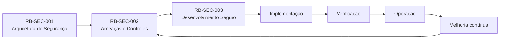
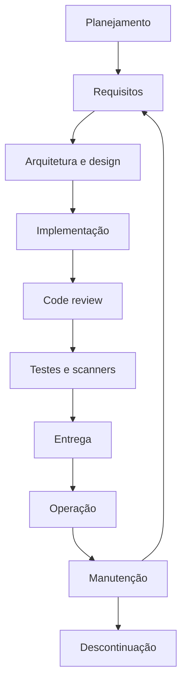
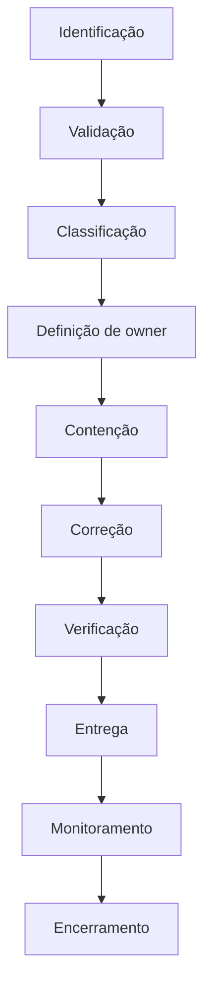
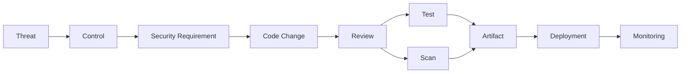

---

id: RB-SEC-003

title: Desenvolvimento Seguro e Gestão de Vulnerabilidades
description: Define o ciclo de desenvolvimento seguro do RouteBook e os processos oficiais para prevenção, identificação, classificação, tratamento e acompanhamento de vulnerabilidades.

document_type: security
owner: Security

status: Draft
version: "0.1.0"

created: "2026-07-21"
last_updated: null

authors:

- RouteBook Team

tags:

- security
- secure-development
- secure-sdlc
- vulnerability-management
- application-security
- devsecops
- security-testing
- dependency-security
- supply-chain
- incident-response
- diagrams
- mermaid

related_documents:

- RB-CORE-0001
- RB-CORE-0002
- RB-CORE-0003
- RB-CORE-0004
- RB-DOM-001
- RB-DOM-002
- RB-DOM-003
- RB-DOM-004
- RB-ARC-001
- RB-ARC-002
- RB-ARC-003
- RB-ARC-004
- RB-ARC-005
- RB-DATA-001
- RB-DATA-002
- RB-API-001
- RB-SEC-001
- RB-SEC-002
- RB-OBS-001
- RB-QA-001
- RB-QA-002
- RB-OPS-001
- RB-OPS-002
- RB-SRE-001
- RB-AI-005
- RB-AI-006

prerequisites:

- RB-CORE-0004
- RB-ARC-001
- RB-ARC-002
- RB-ARC-003
- RB-ARC-004
- RB-ARC-005
- RB-API-001
- RB-SEC-001
- RB-SEC-002
- RB-QA-001
- RB-QA-002

next_documents:

- RB-PRIV-001

ai_context:
priority: critical
index: true
---


# RouteBook — Desenvolvimento Seguro e Gestão de Vulnerabilidades

## Parte I — Fundamentos

### 1. Propósito

Este documento define o ciclo oficial de desenvolvimento seguro e o processo de gestão de vulnerabilidades do RouteBook.

Seu objetivo é garantir que segurança seja incorporada desde a definição de uma capacidade até sua operação em produção.

O documento estabelece:

* responsabilidades de segurança durante o desenvolvimento;
* atividades obrigatórias por fase;
* critérios de revisão;
* verificações automatizadas;
* requisitos de segurança para código e infraestrutura;
* classificação de vulnerabilidades;
* prazos de tratamento;
* critérios de bloqueio;
* tratamento de exceções;
* acompanhamento de riscos;
* resposta a vulnerabilidades exploradas;
* produção de evidências;
* governança de dependências e cadeia de suprimentos.

---

### 2. Relação com os documentos anteriores

O `RB-SEC-001` define a arquitetura de segurança e privacidade.

O `RB-SEC-002` define:

* ameaças;
* ativos;
* superfícies de ataque;
* riscos;
* controles;
* rastreabilidade de segurança.

O `RB-SEC-003` define como esses controles deverão ser incorporados, verificados e mantidos durante o ciclo de desenvolvimento.



---

### 3. Escopo

Este documento cobre:

* planejamento de produto;
* análise de requisitos;
* arquitetura;
* implementação;
* revisão de código;
* testes;
* CI/CD;
* deployments;
* dependências;
* containers;
* infraestrutura como código;
* APIs;
* aplicação web;
* dados;
* integrações;
* mensageria;
* jobs;
* agentes e Tools;
* observabilidade;
* vulnerabilidades;
* correções;
* exceções;
* evidências de segurança.

---

### 4. Fora do escopo

Este documento não define:

* política jurídica de privacidade;
* textos de divulgação pública;
* arquitetura detalhada de rede;
* configuração final de ferramentas;
* regras trabalhistas;
* controles físicos;
* procedimentos completos de resposta a incidentes;
* programa corporativo de bug bounty.

---

### 5. Princípio central

Segurança deverá ser construída durante o desenvolvimento, e não adicionada somente antes do deployment.

```text
Requisito seguro
→ arquitetura segura
→ implementação segura
→ verificação
→ entrega controlada
→ monitoramento
→ correção
```

---

### 6. Objetivos

O processo deverá:

1. prevenir vulnerabilidades;
2. identificar riscos antecipadamente;
3. reduzir custo de correção;
4. bloquear falhas críticas;
5. proteger a cadeia de entrega;
6. preservar rastreabilidade;
7. administrar vulnerabilidades conhecidas;
8. estabelecer prazos;
9. produzir evidências;
10. apoiar evolução contínua.

---

## Parte II — Princípios de desenvolvimento seguro

### 7. Segurança por design

Requisitos de segurança deverão ser considerados durante a definição da capacidade.

---

### 8. Segurança por padrão

Configurações iniciais deverão utilizar a opção mais segura.

---

### 9. Menor privilégio

Código, serviços, pipelines, agentes e operadores deverão utilizar apenas as permissões necessárias.

---

### 10. Negação por padrão

A ausência de autorização explícita deverá resultar em negação.

---

### 11. Validação independente

Toda entrada externa deverá ser validada pelo componente que possui autoridade sobre a operação.

---

### 12. Defesa em profundidade

Nenhum controle isolado deverá ser considerado proteção suficiente para riscos críticos.

---

### 13. Mudanças pequenas

Mudanças menores facilitam:

* revisão;
* teste;
* análise de impacto;
* rollback;
* investigação.

---

### 14. Automação verificável

Controles automatizados deverão gerar resultados rastreáveis e reproduzíveis.

---

### 15. Exceções temporárias

Exceções deverão possuir:

* justificativa;
* owner;
* risco;
* controles compensatórios;
* aprovação;
* expiração.

---

## Parte III — Secure Software Development Lifecycle

### 16. Fases

O Secure Software Development Lifecycle do RouteBook deverá abranger:

1. planejamento;
2. requisitos;
3. arquitetura;
4. implementação;
5. revisão;
6. verificação;
7. entrega;
8. operação;
9. manutenção;
10. descontinuação.



---

## Parte IV — Planejamento e requisitos

### 17. Identificação de risco

Toda nova capacidade deverá avaliar:

* ativos afetados;
* dados processados;
* atores;
* permissões;
* fronteiras;
* integrações;
* operações destrutivas;
* automação;
* uso de IA;
* impacto de falha.

---

### 18. Requisitos de segurança

Capacidades relevantes deverão declarar requisitos para:

* autenticação;
* autorização;
* isolamento;
* validação;
* auditoria;
* privacidade;
* disponibilidade;
* recuperação;
* integridade;
* confidencialidade.

---

### 19. Casos de abuso

Além do comportamento esperado, deverão ser considerados cenários de uso malicioso.

Exemplos:

* acessar Trip de outra Account;
* alterar Activity sem autorização;
* aplicar Itinerary Proposal inválida;
* invocar Tool fora do escopo;
* explorar busca para gerar custo;
* manipular conteúdo enviado à IA.

---

### 20. Critério de entrada

Uma capacidade de risco não deverá seguir para implementação sem:

* escopo;
* requisitos;
* classificação de dados;
* análise inicial de ameaças;
* owner;
* critérios de aceite de segurança.

---

## Parte V — Arquitetura e design

### 21. Security design review

A revisão de segurança deverá ser obrigatória quando houver:

* nova autenticação;
* nova autorização;
* alteração de papéis;
* dado sensível;
* upload;
* webhook;
* integração;
* Provider;
* agente;
* Tool;
* operação administrativa;
* mudança de fronteira;
* mudança de persistência.

---

### 22. Elementos da revisão

A revisão deverá analisar:

* ativos;
* fluxos de dados;
* fronteiras de confiança;
* ownership;
* políticas;
* exposição;
* dependências;
* falhas;
* recuperação;
* observabilidade.

---

### 23. Decisões arquiteturais

Decisões relevantes deverão ser registradas e vinculadas ao modelo de ameaças.

---

### 24. APIs

O design de API deverá considerar:

* autenticação;
* autorização por recurso;
* validação;
* idempotência;
* rate limiting;
* erros sanitizados;
* versionamento;
* limites de payload;
* proteção contra enumeração.

---

### 25. Dados

O design deverá definir:

* fonte canônica;
* escopo por Account;
* criptografia;
* retenção;
* auditoria;
* constraints;
* backup;
* restauração;
* exclusão.

---

### 26. IA e agentes

O design deverá definir:

* capacidade;
* agentId;
* Tools permitidas;
* contexto permitido;
* limites de custo;
* limites de etapas;
* validação de saída;
* confirmação humana;
* auditoria.

---

## Parte VI — Implementação segura

### 27. Padrões de código

O código deverá:

* validar entradas;
* utilizar tipos explícitos;
* evitar construção dinâmica insegura;
* tratar erros;
* limitar recursos;
* respeitar autorização;
* preservar idempotência;
* evitar dados sensíveis em logs.

---

### 28. Validação de entrada

A validação deverá considerar:

* tipo;
* formato;
* tamanho;
* faixa;
* enumeração;
* referência;
* propriedade;
* estado;
* autorização.

---

### 29. Codificação de saída

Conteúdo não confiável deverá ser codificado conforme o contexto de saída.

---

### 30. Queries

Queries deverão utilizar mecanismos parametrizados.

Concatenação de dados não confiáveis em comandos deverá ser proibida.

---

### 31. Autorização

A autorização deverá ocorrer no servidor e próximo da operação protegida.

---

### 32. Escopo de Account

Consultas e comandos deverão incluir explicitamente o escopo de Account quando aplicável.

---

### 33. Operações destrutivas

Deverão exigir:

* autorização reforçada;
* confirmação;
* escopo;
* auditoria;
* possibilidade de recuperação quando aplicável.

---

### 34. Erros

Erros não deverão revelar:

* stack trace;
* query;
* secret;
* configuração;
* identificadores internos desnecessários;
* dados de outra Account.

---

### 35. Logs

Logs deverão evitar:

* tokens;
* senhas;
* secrets;
* dados pessoais completos;
* conteúdo sensível;
* Context Snapshots integrais.

---

## Parte VII — Revisão de código

### 36. Obrigatoriedade

Mudanças relevantes deverão passar por revisão antes da integração.

---

### 37. Independência

O autor não deverá ser o único aprovador de uma alteração de risco.

---

### 38. Checklist de segurança

A revisão deverá verificar:

* autorização;
* isolamento;
* entrada;
* saída;
* erro;
* logging;
* segredo;
* dependência;
* concorrência;
* idempotência;
* rate limiting;
* testes negativos.

---

### 39. Mudanças de alto risco

Deverão exigir revisor com conhecimento da área.

Exemplos:

* Identity and Access;
* políticas;
* persistência;
* criptografia;
* pipelines;
* agentes;
* Tools;
* operações administrativas.

---

### 40. Evidência

A aprovação deverá permanecer registrada no pull request ou mecanismo equivalente.

---

## Parte VIII — Verificações automatizadas

### 41. Tipos de verificação

O pipeline deverá considerar:

* linting;
* type checking;
* testes;
* SAST;
* SCA;
* secret scanning;
* IaC scanning;
* container scanning;
* análise de licenças;
* validação de artefatos.

---

### 42. SAST

A análise estática deverá identificar padrões inseguros no código.

---

### 43. SCA

A análise de composição deverá identificar:

* dependências vulneráveis;
* versões afetadas;
* dependências transitivas;
* licenças incompatíveis;
* pacotes abandonados.

---

### 44. Secret scanning

Deverá ser executado:

* antes do commit quando viável;
* no pull request;
* no repositório;
* nos artefatos;
* no histórico quando necessário.

---

### 45. Infraestrutura como código

Deverá ser analisada para:

* recursos públicos;
* permissões excessivas;
* criptografia ausente;
* logging ausente;
* redes abertas;
* secrets embutidos.

---

### 46. Containers

Imagens deverão ser avaliadas quanto a:

* vulnerabilidades;
* origem;
* usuário root;
* pacotes desnecessários;
* versão;
* assinatura;
* tamanho.

---

### 47. Critérios de bloqueio

O pipeline deverá bloquear:

* secret confirmado;
* vulnerabilidade Critical explorável;
* bypass de autorização;
* acesso cross-account;
* teste crítico falhando;
* artefato sem origem confiável.

---

### 48. Resultado inconclusivo

Resultados inconclusivos deverão ser revisados, e não ignorados automaticamente.

---

## Parte IX — Testes de segurança

### 49. Categorias

Deverão incluir:

* testes de autenticação;
* testes de autorização;
* testes negativos;
* testes de abuso;
* testes de API;
* testes de frontend;
* testes de dados;
* testes de integrações;
* testes de IA;
* testes de resiliência.

---

### 50. Autorização

Cada operação protegida deverá considerar:

* owner;
* editor;
* viewer;
* outro Account;
* outra Trip;
* User sem acesso;
* agente sem delegação;
* integração sem escopo.

---

### 51. Testes de API

Deverão cobrir:

* payload inválido;
* campo adicional;
* tamanho excessivo;
* repetição;
* concorrência;
* rate limit;
* ID inexistente;
* ID não autorizado.

---

### 52. Testes de IA

Deverão cobrir:

* prompt injection;
* indirect prompt injection;
* Tool não permitida;
* contexto cross-account;
* ID inventado;
* saída fora do schema;
* loop;
* custo excessivo;
* ação sem confirmação.

---

### 53. DAST

A análise dinâmica deverá ser aplicada quando o ambiente permitir execução segura.

---

### 54. Testes manuais

Capacidades críticas poderão exigir:

* revisão manual;
* teste exploratório;
* pentest;
* red teaming.

---

## Parte X — Dependências e supply chain

### 55. Inclusão de dependência

Toda nova dependência deverá ser avaliada por:

* necessidade;
* origem;
* manutenção;
* versão;
* vulnerabilidades;
* licença;
* permissões;
* alternativas.

---

### 56. Versões

Versões deverão ser controladas por lockfile ou mecanismo equivalente.

---

### 57. Dependências transitivas

Dependências transitivas deverão ser incluídas nas verificações.

---

### 58. Atualizações

Atualizações de segurança deverão ser priorizadas conforme risco.

---

### 59. Pacote comprometido

Quando houver suspeita de comprometimento:

1. interromper atualização;
2. identificar versões;
3. verificar uso;
4. preservar evidência;
5. substituir ou remover;
6. rotacionar secrets quando necessário;
7. reemitir artefatos;
8. acionar runbook.

---

### 60. Artefatos

Artefatos deverão possuir:

* versão;
* commit;
* origem;
* checksum;
* data;
* pipeline;
* rastreabilidade.

---

## Parte XI — CI/CD seguro

### 61. Menor privilégio

Pipelines deverão possuir apenas as permissões necessárias.

---

### 62. Separação de ambientes

Credenciais e configurações deverão ser separadas por ambiente.

---

### 63. Proteção de branch

Branches protegidas deverão exigir:

* revisão;
* verificações;
* histórico íntegro;
* restrições de merge;
* bloqueio de alterações diretas.

---

### 64. Actions e extensões

Componentes de pipeline deverão utilizar versões controladas e origem confiável.

---

### 65. Secrets

Secrets deverão ser fornecidos por mecanismo seguro e nunca persistidos no repositório.

---

### 66. Deployments

Deployments de produção deverão possuir:

* autorização;
* artefato aprovado;
* observabilidade;
* rollback;
* registro;
* separação de responsabilidade quando aplicável.

---

### 67. Ambientes efêmeros

Ambientes temporários não deverão utilizar dados ou credenciais reais sem proteção apropriada.

---

## Parte XII — Gestão de vulnerabilidades

### 68. Vulnerabilidade

Vulnerabilidade é uma fraqueza que pode comprometer:

* confidencialidade;
* integridade;
* disponibilidade;
* autenticidade;
* privacidade;
* isolamento;
* rastreabilidade.

---

### 69. Fontes

Vulnerabilidades poderão ser identificadas por:

* scanner;
* teste;
* revisão;
* pentest;
* red teaming;
* dependência;
* fornecedor;
* incidente;
* pesquisador;
* Usuário;
* monitoramento.

---

### 70. Processo



---

### 71. Registro obrigatório

Cada vulnerabilidade deverá possuir:

```text
vulnerabilityId
title
description
source
affectedAssets
affectedVersions
environment
severity
exploitability
impact
owner
status
discoveredAt
targetDate
resolution
verification
residualRisk
```

---

### 72. Estados

Estados possíveis:

* Reported;
* Under Validation;
* Confirmed;
* Treatment Planned;
* In Remediation;
* Ready for Verification;
* Mitigated;
* Resolved;
* Accepted;
* Rejected;
* Duplicate.

---

### 73. Duplicidade

Relatórios duplicados deverão apontar para o registro canônico.

---

### 74. Falso positivo

Um achado somente deverá ser encerrado como falso positivo com justificativa e evidência.

---

## Parte XIII — Classificação de severidade

### 75. Dimensões

A classificação deverá considerar:

* impacto;
* explorabilidade;
* exposição;
* privilégios necessários;
* interação;
* escopo;
* dados afetados;
* disponibilidade de exploit;
* controles existentes.

---

### 76. Critical

Exemplos:

* execução remota;
* bypass completo de autenticação;
* acesso cross-account;
* secret privilegiado exposto;
* comprometimento de pipeline;
* corrupção canônica ampla;
* exfiltração relevante.

---

### 77. High

Exemplos:

* elevação de privilégio;
* acesso indevido limitado;
* injeção relevante;
* alteração não autorizada;
* indisponibilidade significativa;
* Tool Call de alto impacto sem autorização.

---

### 78. Moderate

Exemplos:

* vazamento limitado;
* abuso com pré-condições;
* proteção incompleta;
* degradação controlada;
* dependência vulnerável não exposta diretamente.

---

### 79. Low

Exemplos:

* melhoria defensiva;
* exposição mínima;
* exploração improvável;
* ausência de impacto relevante demonstrado.

---

### 80. Elevação de severidade

A severidade deverá ser elevada quando houver:

* exploração ativa;
* dados pessoais;
* cross-account;
* acesso administrativo;
* ampla exposição;
* ausência de mitigação;
* cadeia de suprimentos comprometida.

---

## Parte XIV — Prazos de tratamento

### 81. Prazos iniciais

| Severidade |               Prazo indicativo |
| ---------- | -----------------------------: |
| Critical   | correção ou mitigação imediata |
| High       |                     até 7 dias |
| Moderate   |                    até 30 dias |
| Low        |                    até 90 dias |

Os prazos deverão ser ajustados conforme exploração, exposição e impacto.

---

### 82. Critical

Uma vulnerabilidade Critical deverá provocar:

* comunicação imediata;
* owner;
* avaliação de incidente;
* contenção;
* bloqueio de release quando aplicável;
* correção prioritária;
* validação independente.

---

### 83. Prazo vencido

Vulnerabilidades vencidas deverão gerar:

* escalonamento;
* revisão de risco;
* plano atualizado;
* possível bloqueio;
* registro de exceção.

---

### 84. Mitigação temporária

Mitigação não substitui correção definitiva quando a vulnerabilidade permanecer explorável.

---

## Parte XV — Correção

### 85. Requisitos

A correção deverá:

* eliminar ou reduzir a causa;
* preservar contratos;
* incluir testes;
* evitar regressão;
* produzir evidência;
* considerar riscos relacionados.

---

### 86. Correção emergencial

Hotfix deverá preservar:

* revisão proporcional;
* testes mínimos;
* rastreabilidade;
* rollback;
* observabilidade.

---

### 87. Correção sistêmica

Quando a vulnerabilidade representar padrão recorrente, deverão ser avaliados:

* framework;
* biblioteca;
* lint rule;
* teste reutilizável;
* guideline;
* treinamento;
* controle de pipeline.

---

### 88. Verificação

A vulnerabilidade somente deverá ser encerrada após:

* reprodução original;
* aplicação da correção;
* teste negativo;
* teste de regressão;
* validação no ambiente adequado.

---

## Parte XVI — Vulnerabilidades em produção

### 89. Avaliação de incidente

Uma vulnerabilidade deverá ser tratada como possível incidente quando houver:

* evidência de exploração;
* acesso indevido;
* alteração de dados;
* indisponibilidade;
* exfiltração;
* secret utilizado;
* comportamento anômalo.

---

### 90. Contenção

Possíveis ações:

* desativar capacidade;
* bloquear rota;
* revogar secret;
* limitar tráfego;
* suspender conta;
* reverter deployment;
* retirar artefato;
* bloquear Tool.

---

### 91. Preservação de evidências

Deverão ser preservados:

* logs;
* traces;
* Audit Entries;
* versões;
* artefatos;
* dependências;
* configurações;
* correlationIds;
* identidades;
* timeline.

---

### 92. Integração com runbooks

A resposta deverá utilizar os procedimentos definidos em `RB-OPS-001` e `RB-OPS-002`.

---

## Parte XVII — Divulgação responsável

### 93. Canal

O projeto deverá manter um canal seguro para recebimento de relatos de vulnerabilidade.

---

### 94. Dados do relato

O relato deverá solicitar:

* descrição;
* componente;
* impacto;
* passos de reprodução;
* evidência;
* ambiente;
* contato opcional.

---

### 95. Proteção de informação

Detalhes de vulnerabilidades não corrigidas deverão possuir acesso restrito.

---

### 96. Comunicação externa

A divulgação deverá considerar:

* risco;
* correção disponível;
* usuários afetados;
* exposição;
* obrigações;
* orientação de atualização.

---

### 97. Crédito

Crédito ao pesquisador poderá ser concedido quando autorizado e apropriado.

---

## Parte XVIII — Exceções e riscos aceitos

### 98. Exceção

Uma exceção deverá registrar:

```text
exceptionId
control
scope
justification
risk
compensatingControls
owner
approvedBy
createdAt
expiresAt
```

---

### 99. Expiração

Toda exceção deverá possuir prazo definido.

---

### 100. Revisão

Exceções deverão ser revistas:

* antes da expiração;
* após incidente;
* após mudança relevante;
* quando surgir nova exploração.

---

### 101. Proibições

Não deverão ser aceitas informalmente exceções relacionadas a:

* isolamento entre Accounts;
* autorização crítica;
* secrets;
* integridade canônica;
* cadeia de entrega;
* Tool administrativa;
* auditoria crítica.

---

## Parte XIX — Evidências e rastreabilidade

### 102. Cadeia de evidência



---

### 103. Evidência mínima

Para controles críticos, deverão existir:

* requisito;
* implementação;
* revisão;
* teste;
* resultado;
* versão;
* ambiente;
* owner.

---

### 104. Retenção

Evidências deverão ser mantidas por período proporcional ao risco e necessidade operacional.

---

### 105. Auditabilidade

Deverá ser possível determinar:

* quem alterou;
* o que alterou;
* quando alterou;
* qual revisão ocorreu;
* quais testes passaram;
* qual artefato foi entregue.

---

## Parte XX — Métricas

### 106. Métricas do processo

Deverão ser acompanhadas:

* vulnerabilidades por severidade;
* idade média;
* tempo até validação;
* tempo até correção;
* prazo vencido;
* taxa de recorrência;
* controles sem evidência;
* dependências vulneráveis;
* secrets identificados;
* falhas bloqueadas no pipeline.

---

### 107. Cobertura

A cobertura deverá considerar:

* capacidades com threat model;
* operações com testes de autorização;
* repositórios com scanning;
* dependências monitoradas;
* imagens analisadas;
* pipelines protegidos.

---

### 108. Qualidade da correção

Deverá ser acompanhada a taxa de:

* reabertura;
* regressão;
* correção incompleta;
* vulnerabilidade recorrente.

---

### 109. Métrica não é objetivo isolado

Métricas não deverão incentivar encerramento artificial ou reclassificação indevida.

---

## Parte XXI — Papéis e responsabilidades

### 110. Security

Responsável por:

* processo;
* metodologia;
* classificação;
* revisão de riscos;
* exceções;
* coordenação de vulnerabilidades críticas;
* governança.

---

### 111. Engenharia

Responsável por:

* implementação segura;
* correções;
* testes;
* evidências;
* manutenção de dependências.

---

### 112. Architecture

Responsável por:

* decisões estruturais;
* fronteiras;
* padrões;
* revisão de mudanças relevantes.

---

### 113. Quality Engineering

Responsável por:

* testes;
* regressão;
* cenários negativos;
* cobertura;
* validação independente.

---

### 114. Platform

Responsável por:

* CI/CD;
* scanners;
* secrets;
* containers;
* infraestrutura;
* artefatos;
* controles operacionais.

---

### 115. Product

Responsável por:

* impacto;
* prioridade;
* requisitos;
* casos de abuso;
* decisões de risco de produto.

---

### 116. Artificial Intelligence

Responsável por:

* prompts;
* Context Builder;
* Tools;
* runtime;
* limites;
* avaliações;
* segurança de agentes.

---

## Parte XXII — Definition of Ready

### 117. Critérios

Uma capacidade de risco estará pronta para implementação quando possuir:

* escopo;
* owner;
* requisitos;
* dados classificados;
* ameaças identificadas;
* controles definidos;
* critérios de teste;
* dependências conhecidas.

---

## Parte XXIII — Definition of Done

### 118. Critérios

Uma capacidade de risco estará concluída quando possuir:

* implementação revisada;
* testes aprovados;
* scanners aprovados;
* autorização validada;
* observabilidade;
* documentação;
* riscos residuais registrados;
* runbook quando necessário;
* evidências vinculadas.

---

## Parte XXIV — Critérios de release

### 119. Bloqueios obrigatórios

Um release não deverá avançar com:

* vulnerabilidade Critical não mitigada;
* acesso cross-account conhecido;
* bypass de autenticação;
* bypass de autorização crítica;
* secret confirmado;
* teste crítico falhando;
* artefato não rastreável;
* pipeline comprometido.

---

### 120. Avaliação de High

Uma vulnerabilidade High deverá exigir decisão explícita antes do release.

---

### 121. Rollback

Toda mudança de risco deverá possuir estratégia de rollback ou justificativa técnica.

---

## Parte XXV — Anti-patterns

### 122. Segurança somente no final

Gera correções tardias e incompletas.

---

### 123. Scanner como único controle

Scanners não substituem análise, design, revisão ou testes.

---

### 124. Ignorar falso positivo sem evidência

Todo descarte deverá ser justificado.

---

### 125. Atualizar dependência sem teste

Uma atualização pode introduzir regressões ou novos riscos.

---

### 126. Exceção sem prazo

Transforma risco temporário em permanente.

---

### 127. Correção sem regressão

Permite reintrodução da vulnerabilidade.

---

### 128. Hotfix sem rastreabilidade

Impede auditoria e aprendizado.

---

### 129. Autor revisar sozinho mudança crítica

Reduz independência do controle.

---

### 130. Considerar ambiente interno confiável

Serviços internos também deverão ser autenticados, autorizados e validados.

---

### 131. IA corrigindo vulnerabilidade sem revisão

Código gerado ou alterado por IA deverá passar pelos mesmos controles.

---

## Parte XXVI — Modelo de maturidade

### 132. Nível 1 — Inicial

* revisão de código;
* testes básicos;
* secret scanning;
* dependências monitoradas;
* tratamento manual de vulnerabilidades.

---

### 133. Nível 2 — Gerenciado

* Secure SDLC;
* threat modeling;
* scanners no pipeline;
* prazos;
* métricas;
* critérios de release.

---

### 134. Nível 3 — Verificável

* evidências automatizadas;
* políticas como código;
* cobertura de autorização;
* validação contínua;
* pentests periódicos.

---

### 135. Nível 4 — Adaptativo

* análise baseada em mudanças;
* priorização por exposição;
* detecção contínua;
* correção automatizada supervisionada;
* prevenção sistêmica.

---

## Parte XXVII — Governança

### 136. Owner

O owner deste documento é:

```text
Security
```

---

### 137. Revisão

O documento deverá ser revisado:

* após incidente crítico;
* após alteração do pipeline;
* após mudança arquitetural relevante;
* após nova classe de vulnerabilidade;
* periodicamente.

---

### 138. Alterações

Mudanças deverão registrar:

* motivo;
* impacto;
* autor;
* aprovador;
* controles afetados;
* data.

---

### 139. Documentos derivados

Este documento poderá originar:

* checklists;
* templates;
* políticas de pipeline;
* padrões de código;
* procedimentos de triagem;
* guias de correção;
* relatórios de vulnerabilidade.

---

## Parte XXVIII — Critérios de aceite

### 140. Processo

* Secure SDLC está definido;
* fases estão definidas;
* gatilhos de revisão estão definidos;
* responsabilidades estão definidas;
* critérios de entrada e saída estão definidos.

---

### 141. Desenvolvimento

* requisitos de segurança estão definidos;
* design review está definido;
* implementação segura está definida;
* code review está definido;
* verificações automatizadas estão definidas.

---

### 142. Vulnerabilidades

* fontes estão definidas;
* registro está definido;
* estados estão definidos;
* severidades estão definidas;
* prazos estão definidos;
* correção está definida;
* verificação está definida.

---

### 143. Entrega

* CI/CD seguro está definido;
* critérios de bloqueio estão definidos;
* artefatos estão cobertos;
* rollback está coberto;
* release seguro está definido.

---

### 144. Governança

* exceções estão definidas;
* métricas estão definidas;
* evidências estão definidas;
* papéis estão definidos;
* rastreabilidade está definida.

---

## Parte XXIX — Checklist final

### 145. Checklist documental

Antes de aprovar:

* frontmatter YAML é válido;
* listas do YAML utilizam formato compatível;
* ID é único;
* título está correto;
* propósito está definido;
* escopo está definido;
* relação com RB-SEC-001 está definida;
* relação com RB-SEC-002 está definida;
* Secure SDLC está definido;
* planejamento seguro está definido;
* requisitos estão definidos;
* design review está definido;
* implementação segura está definida;
* revisão de código está definida;
* SAST está definido;
* SCA está definido;
* secret scanning está definido;
* IaC scanning está definido;
* container scanning está definido;
* testes de segurança estão definidos;
* dependências estão cobertas;
* supply chain está coberta;
* CI/CD está coberto;
* vulnerabilidades estão definidas;
* severidades estão definidas;
* prazos estão definidos;
* correção está definida;
* vulnerabilidades em produção estão cobertas;
* divulgação está definida;
* exceções estão definidas;
* evidências estão definidas;
* métricas estão definidas;
* papéis estão definidos;
* Definition of Ready está definida;
* Definition of Done está definida;
* critérios de release estão definidos;
* anti-patterns estão definidos;
* maturidade está definida;
* Mermaid renderiza no GitHub;
* não existem atributos adicionais em blocos Mermaid;
* não existem contradições com RB-SEC-001;
* não existem contradições com RB-SEC-002;
* não existem contradições com RB-QA-001;
* não existem contradições com RB-QA-002;
* não existem contradições com RB-AI-005;
* não existem contradições com RB-AI-006.

---

## Parte XXX — Declaração final

### 146. Declaração de desenvolvimento seguro

O RouteBook deverá tratar segurança como parte integral do desenvolvimento de produto e software.

Toda capacidade relevante deverá demonstrar:

* requisitos de segurança;
* análise de ameaças;
* controles;
* implementação revisada;
* testes;
* evidências;
* critérios de release;
* monitoramento;
* capacidade de correção.

Nenhuma mudança deverá ser considerada segura apenas porque:

* compila;
* passa em testes funcionais;
* utiliza uma biblioteca conhecida;
* foi gerada por IA;
* opera em rede interna;
* foi aprovada pelo autor;
* não apresentou incidente anterior.

Vulnerabilidades deverão ser:

* registradas;
* classificadas;
* priorizadas;
* corrigidas;
* verificadas;
* monitoradas;
* utilizadas como fonte de aprendizado.

O RouteBook deverá evoluir sua segurança por meio de prevenção, automação, revisão independente, rastreabilidade e melhoria contínua.
