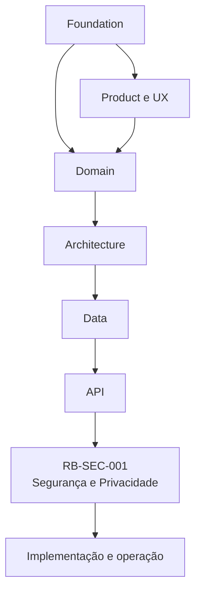
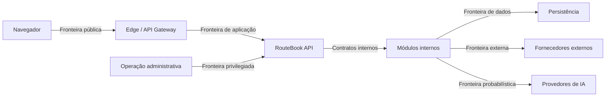
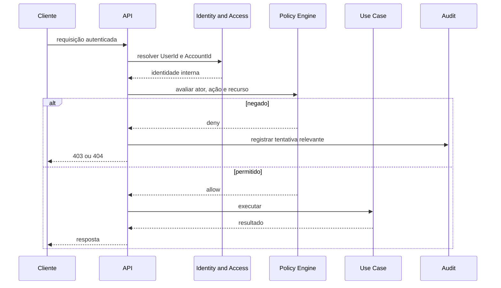
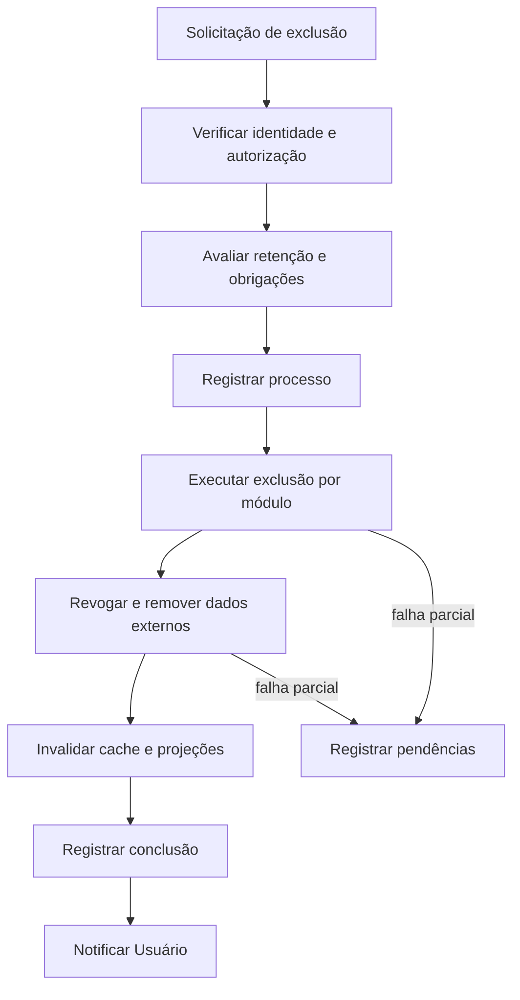
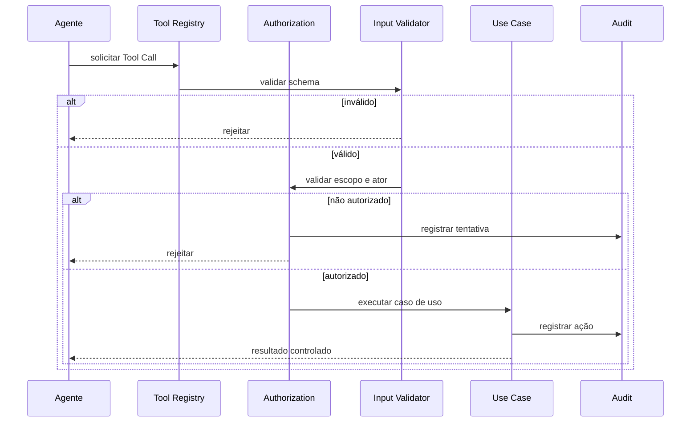
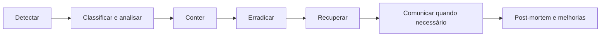

---

id: RB-SEC-001

title: Arquitetura de Segurança e Privacidade
description: Define a arquitetura oficial de segurança e privacidade do RouteBook, incluindo identidade, autenticação, autorização, proteção de dados, isolamento entre contas, segurança de APIs, integrações, IA, segredos, auditoria, gestão de vulnerabilidades, resposta a incidentes e privacidade por padrão.

document_type: security
owner: Security

status: Draft
version: "0.1.0"

created: "2026-07-18"
last_updated: null

authors:

- RouteBook Team

tags:

- security
- privacy
- authentication
- authorization
- access-control
- data-protection
- threat-modeling
- secure-development
- incident-response
- ai-security
- privacy-by-design
- diagrams
- mermaid

related_documents:

- RB-CORE-0001
- RB-CORE-0002
- RB-CORE-0003
- RB-CORE-0004
- RB-PRD-001
- RB-PRD-002
- RB-PRD-003
- RB-PRD-004
- RB-PRD-005
- RB-PRD-006
- RB-PRD-007
- RB-PRD-008
- RB-DOM-001
- RB-DOM-002
- RB-DOM-003
- RB-DOM-004
- RB-ARC-001
- RB-ARC-002
- RB-ARC-003
- RB-ARC-004
- RB-ARC-005
- RB-DATA-001
- RB-DATA-002
- RB-API-001

prerequisites:

- RB-CORE-0004
- RB-DOM-001
- RB-DOM-002
- RB-DOM-003
- RB-DOM-004
- RB-ARC-001
- RB-ARC-002
- RB-ARC-003
- RB-ARC-004
- RB-ARC-005
- RB-DATA-001
- RB-DATA-002
- RB-API-001

next_documents:

- RB-OBS-001
- RB-QA-001
- RB-SEC-002
- RB-SEC-003
- RB-PRIV-001

ai_context:
priority: critical
index: true
---

# RouteBook — Arquitetura de Segurança e Privacidade

## Parte I — Fundamentos

### 1. Propósito deste documento

Este documento define a arquitetura oficial de segurança e privacidade do RouteBook.

Seu objetivo é estabelecer:

* como identidades serão autenticadas;
* como acessos serão autorizados;
* como Accounts e Trips serão isoladas;
* como dados pessoais serão classificados;
* como dados serão minimizados;
* como credenciais e segredos serão protegidos;
* como APIs serão protegidas;
* como integrações externas serão controladas;
* como agentes e capacidades de IA serão limitados;
* como arquivos e URLs serão tratados;
* como auditoria será preservada;
* como vulnerabilidades serão gerenciadas;
* como incidentes serão detectados e tratados;
* como privacidade será incorporada ao produto;
* como exclusão, anonimização e retenção serão governadas;
* como desenvolvimento e operação deverão aplicar segurança por padrão.

Este documento deverá orientar:

* arquitetura;
* backend;
* frontend;
* infraestrutura;
* segurança;
* privacidade;
* dados;
* IA;
* QA;
* DevOps;
* observabilidade;
* produto;
* agentes de engenharia.

Este documento não define:

* fornecedor definitivo de identidade;
* ferramenta definitiva de gerenciamento de segredos;
* política jurídica completa de privacidade;
* texto final de termos de uso;
* controles comerciais definitivos;
* certificação específica;
* arquitetura física final de rede;
* plano operacional detalhado de resposta a incidentes;
* configuração exata de firewall ou nuvem.

---

### 2. Autoridade documental

A segurança deverá implementar os conceitos, limites e contratos definidos anteriormente.



A segurança não poderá redefinir:

* ownership de domínio;
* papéis oficiais da Trip;
* ciclos de vida;
* identificadores canônicos;
* Eventos de Domínio;
* significado de Recommendation;
* significado de Decision;
* significado de Planning Conflict;
* autoridade do Usuário.

---

### 3. Princípio central

O RouteBook deverá operar com:

```text
Zero Trust
+ menor privilégio
+ defesa em profundidade
+ privacidade por padrão
+ segurança por design
+ validação independente
```

Nenhum componente deverá ser considerado confiável apenas por:

* estar na rede interna;
* ser executado pelo backend;
* ser um agente de IA;
* utilizar um token válido;
* ser uma integração conhecida;
* ter sido chamado pela interface oficial.

---

### 4. Objetivos de segurança

A arquitetura deverá proteger:

1. confidencialidade;
2. integridade;
3. disponibilidade;
4. autenticidade;
5. rastreabilidade;
6. privacidade;
7. isolamento;
8. resiliência;
9. controle do Usuário;
10. continuidade operacional.

---

### 5. Princípios

#### 5.1 Negar por padrão

Acesso não concedido explicitamente deverá ser negado.

#### 5.2 Menor privilégio

Cada ator deverá possuir somente permissões necessárias.

#### 5.3 Defesa em profundidade

Controles deverão existir em múltiplas camadas.

#### 5.4 Falha segura

Falhas deverão preservar o estado mais seguro.

#### 5.5 Separação de responsabilidades

Nenhum componente deverá controlar sozinho identidade, autorização, execução e auditoria.

#### 5.6 Minimização

Somente dados necessários deverão ser coletados, processados, enviados e persistidos.

#### 5.7 Segurança verificável

Controles deverão ser testáveis, observáveis e auditáveis.

#### 5.8 Autoridade explícita

Agentes, integrações e processos automáticos não possuem autoridade implícita.

---

## Parte II — Modelo de ameaças

### 6. Ativos protegidos

Ativos principais:

* Accounts;
* Users;
* Trips;
* Traveler Profiles;
* Restrictions;
* localização;
* Accommodation;
* Itineraries;
* Decisions;
* Itinerary Proposals;
* Planning Conflicts;
* credenciais;
* tokens;
* arquivos;
* prompts;
* Context Snapshots;
* Provenance;
* audit logs;
* backups;
* contratos de API;
* infraestrutura.

---

### 7. Atores

Atores possíveis:

* User legítimo;
* owner;
* editor;
* viewer;
* agente autorizado;
* integração;
* administrador;
* operador;
* desenvolvedor;
* atacante externo;
* User malicioso;
* fornecedor comprometido;
* modelo de IA comprometido ou manipulado.

---

### 8. Superfícies de ataque

* autenticação;
* recuperação de conta;
* APIs;
* interface web;
* uploads;
* URLs externas;
* webhooks;
* integrações;
* banco;
* cache;
* filas;
* logs;
* CI/CD;
* dependências;
* secrets;
* prompts;
* ferramentas de agentes;
* infraestrutura;
* backups.

---

### 9. Categorias de ameaça

A avaliação deverá considerar:

* falsificação de identidade;
* alteração de dados;
* repúdio;
* vazamento de informação;
* indisponibilidade;
* elevação de privilégio;
* acesso horizontal;
* acesso vertical;
* injeção;
* exfiltração;
* replay;
* abuso de recursos;
* supply chain;
* prompt injection;
* tool injection;
* vazamento entre Accounts.

---

### 10. Fronteiras de confiança



Cada fronteira deverá possuir:

* autenticação;
* autorização;
* validação;
* limitação;
* observabilidade;
* proteção contra replay quando aplicável.

---

## Parte III — Identidade

### 11. Identidade interna

A identidade canônica deverá ser representada por:

```text
UserId
AccountId
```

Identidades externas deverão ser traduzidas por Identity and Access.

---

### 12. Provedor de identidade

Um provedor externo poderá realizar:

* autenticação;
* emissão de token;
* recuperação de credenciais;
* autenticação multifator;
* proteção contra ataques de credenciais.

O RouteBook continuará responsável por:

* User interno;
* Account;
* papéis;
* autorização;
* revogação interna;
* auditoria;
* isolamento.

---

### 13. External Subject

O identificador externo deverá ser persistido separadamente:

```text
provider
externalSubject
UserId
```

O `externalSubject` não deverá substituir `UserId`.

---

### 14. Ciclo de vida da identidade

Estados possíveis:

```text
invited
active
suspended
deactivated
closed
```

Mudanças deverão produzir auditoria.

---

### 15. Autenticação multifator

MFA deverá ser considerada para:

* administradores;
* operadores;
* ações de alto risco;
* Accounts sensíveis;
* alteração de credenciais;
* transferência de ownership.

---

### 16. Recuperação de conta

A recuperação deverá:

* validar identidade;
* limitar tentativas;
* evitar enumeração;
* expirar tokens;
* invalidar sessões quando necessário;
* registrar auditoria;
* notificar o User.

---

## Parte IV — Autenticação

### 17. Tokens

Tokens deverão possuir:

* emissor confiável;
* audiência;
* subject;
* expiração;
* assinatura;
* identificador;
* claims mínimos.

---

### 18. Validação de token

Toda requisição autenticada deverá validar:

1. formato;
2. assinatura;
3. emissor;
4. audiência;
5. expiração;
6. not-before;
7. subject;
8. status da identidade;
9. revogação quando aplicável.

---

### 19. Duração

Tokens de acesso deverão possuir vida curta.

Refresh tokens, quando utilizados, deverão possuir:

* rotação;
* revogação;
* armazenamento seguro;
* detecção de reutilização.

---

### 20. Cookies

Caso tokens sejam armazenados em cookies:

* `HttpOnly`;
* `Secure`;
* `SameSite`;
* proteção CSRF;
* escopo restrito;
* expiração adequada.

---

### 21. Armazenamento no cliente

Evitar armazenamento de tokens sensíveis em mecanismos acessíveis por JavaScript quando arquitetura alternativa segura estiver disponível.

---

### 22. Sessões

Sessões deverão ser revogáveis por:

* logout;
* alteração de senha;
* comprometimento;
* desativação;
* decisão administrativa;
* expiração.

---

### 23. Proteção contra credential stuffing

Deverão ser utilizados:

* rate limiting;
* detecção de anomalias;
* bloqueio progressivo;
* MFA;
* proteção do provedor de identidade;
* mensagens não enumeráveis.

---

## Parte V — Autorização

### 24. Modelo de autorização

A autorização deverá combinar:

```text
RBAC
+ ownership
+ contexto
+ atributos
+ políticas
```

---

### 25. Papéis da Trip

Papéis iniciais:

| Papel    | Capacidade geral               |
| -------- | ------------------------------ |
| `owner`  | administração completa da Trip |
| `editor` | edição de planejamento         |
| `viewer` | leitura autorizada             |

---

### 26. Papel não é suficiente

A autorização deverá considerar também:

* Account;
* Trip;
* recurso;
* ação;
* status;
* autoria;
* delegação;
* sensibilidade;
* versão;
* restrições operacionais.

---

### 27. Isolamento horizontal

Um User não poderá acessar recursos de outra Account ou Trip não autorizada.

Toda consulta deverá aplicar escopo explícito.

Exemplo conceitual:

```text
resource.accountId == authenticatedUser.accountId
AND
authenticatedUser possui acesso à Trip
```

---

### 28. Autorização vertical

Ações administrativas e críticas deverão exigir permissões adicionais.

---

### 29. Política por ação

Exemplos:

| Ação                  | Requisito mínimo             |
| --------------------- | ---------------------------- |
| visualizar Trip       | viewer                       |
| alterar Itinerary     | editor                       |
| adicionar Participant | owner                        |
| transferir ownership  | owner e confirmação          |
| excluir Trip          | owner e confirmação          |
| ignorar Planning Risk | editor autorizado e Decision |
| aplicar Proposal      | editor e versões válidas     |

---

### 30. Autorização no servidor

O frontend poderá ocultar controles, mas nunca será autoridade.

---

### 31. Fluxo de autorização



---

## Parte VI — Delegação e agentes

### 32. Princípio

Agentes não possuem autoridade própria.

---

### 33. Delegação

Uma delegação deverá registrar:

* delegatingUserId;
* agentId;
* Account;
* Trip;
* ações permitidas;
* recursos permitidos;
* duração;
* limite;
* revogação;
* confirmação necessária.

---

### 34. Actor Reference

Ações deverão registrar:

```text
actorType
actorId
delegatedByActorId
authorizationReference
```

---

### 35. Ações proibidas por padrão

Agentes gerais não deverão poder:

* excluir Account;
* excluir Trip;
* transferir ownership;
* alterar consentimento;
* ignorar Planning Conflict `error`;
* alterar Restriction mandatory;
* exportar todos os dados;
* acessar credenciais;
* alterar papéis.

---

### 36. Confirmação humana

Ações de impacto relevante deverão exigir confirmação contextual.

---

### 37. Revogação

Delegações deverão ser revogáveis imediatamente.

---

## Parte VII — Isolamento entre Accounts e Trips

### 38. Account como fronteira

Account deverá ser a principal fronteira de isolamento lógico.

---

### 39. Escopo obrigatório

Entidades relacionadas a Account deverão possuir escopo explícito ou caminho confiável até ela.

---

### 40. Consultas

Consultas deverão incluir escopo de autorização e não apenas ID do recurso.

Evitar:

```text
SELECT * FROM trips WHERE trip_id = :tripId
```

Preferir conceitualmente:

```text
SELECT * FROM trips
WHERE trip_id = :tripId
  AND account_id = :accountId
```

---

### 41. IDs opacos

IDs globalmente únicos reduzem colisão, mas não substituem autorização.

---

### 42. Cache

Chaves de cache deverão incluir Account e Trip quando aplicável.

---

### 43. Filas e eventos

Mensagens deverão incluir escopo mínimo necessário e consumidores deverão validar ownership.

---

### 44. Read models

Projeções deverão preservar Account e regras de acesso.

---

### 45. Testes de isolamento

Toda API deverá possuir testes de acesso horizontal.

---

## Parte VIII — Classificação de dados

### 46. Níveis

| Classificação  | Definição                             |
| -------------- | ------------------------------------- |
| `public`       | informação pública                    |
| `internal`     | informação operacional interna        |
| `confidential` | informação privada do produto         |
| `restricted`   | informação pessoal ou de alto impacto |

---

### 47. Exemplos

| Dado                  | Classificação              |
| --------------------- | -------------------------- |
| nome público de Place | public                     |
| categoria de Place    | public                     |
| Trip                  | confidential               |
| Itinerary             | confidential               |
| Traveler Profile      | restricted                 |
| Restriction           | restricted                 |
| localização atual     | restricted                 |
| email                 | restricted                 |
| consentimento         | restricted                 |
| tokens                | restricted                 |
| audit log             | confidential ou restricted |
| secrets               | restricted                 |

---

### 48. Tratamento por classificação

A classificação deverá definir:

* acesso;
* criptografia;
* retenção;
* logging;
* exportação;
* compartilhamento;
* anonimização;
* uso por IA.

---

### 49. Metadados

Entidades ou campos relevantes deverão possuir classificação documentada.

---

## Parte IX — Privacidade por design

### 50. Princípios

O RouteBook deverá aplicar:

* finalidade;
* adequação;
* necessidade;
* transparência;
* segurança;
* prevenção;
* não discriminação;
* prestação de contas.

---

### 51. Minimização

O produto não deverá coletar dados apenas porque podem ser úteis futuramente.

---

### 52. Finalidade

Toda categoria de dado deverá possuir finalidade documentada.

---

### 53. Dados de Travelers

Para Travelers, preferir:

* faixa etária;
* tipo de viajante;
* necessidade funcional;
* Restriction relevante.

Evitar:

* data de nascimento completa;
* documento;
* diagnóstico;
* dados pessoais excessivos.

---

### 54. Dados de menores

Dados de menores deverão:

* ser minimizados;
* utilizar faixa etária;
* evitar identificação;
* possuir acesso restrito;
* não ser enviados a fornecedores sem necessidade.

---

### 55. Localização

Localização atual deverá:

* ser coletada somente com finalidade;
* possuir consentimento quando necessário;
* possuir precisão proporcional;
* expirar;
* não gerar histórico contínuo por padrão;
* não ser registrada integralmente em logs.

---

### 56. Accommodation

Endereço da hospedagem deverá ser tratado como dado restrito.

A interface poderá exibir distância sem expor endereço completo para todos os participantes, conforme política futura.

---

### 57. Transparência

O Usuário deverá compreender:

* quais dados são utilizados;
* para qual finalidade;
* quando IA é utilizada;
* quando dados vêm de terceiros;
* quando uma estimativa é incerta;
* como excluir dados.

---

## Parte X — Consentimento

### 58. Consentimento explícito

Consentimento deverá ser utilizado quando a finalidade exigir.

---

### 59. Consentimento não é autorização universal

Um consentimento não autoriza usos incompatíveis com sua finalidade.

---

### 60. Registro

O registro deverá conter:

* consentType;
* policyVersion;
* status;
* grantedAt;
* revokedAt;
* source;
* UserId.

---

### 61. Revogação

Revogação deverá produzir efeito futuro e iniciar processos necessários.

---

### 62. Mudança de política

Mudanças materiais poderão exigir novo consentimento.

---

### 63. Evidência

O sistema deverá preservar evidência do texto e versão aceitos.

---

## Parte XI — Retenção, exclusão e anonimização

### 64. Retenção por categoria

Não deverá existir prazo único para todos os dados.

---

### 65. Política

Cada categoria deverá definir:

* finalidade;
* owner;
* prazo;
* gatilho;
* exceção;
* forma de remoção;
* impacto em backup.

---

### 66. Exclusão de Trip

A exclusão deverá coordenar:

* Trip Management;
* Traveler Profile;
* Trip Collection;
* Itinerary Planning;
* Mobility;
* Decision Intelligence;
* Proposal Management;
* Planning Assurance;
* arquivos;
* cache;
* projeções;
* integrações;
* memória de IA.

---

### 67. Exclusão de Account

Deverá possuir:

* confirmação reforçada;
* período de recuperação quando aplicável;
* verificação de obrigações;
* operação assíncrona;
* auditoria;
* notificação;
* relatório de conclusão.

---

### 68. Anonimização

Quando histórico precisar ser mantido, dados pessoais deverão ser removidos ou tornados não identificáveis.

---

### 69. Pseudonimização

Pseudonimização deverá ser tratada como proteção adicional, não como anonimização definitiva.

---

### 70. Backups

Dados excluídos poderão permanecer em backups até expiração prevista.

---

### 71. Fluxo de exclusão



---

## Parte XII — Criptografia

### 72. Em trânsito

Toda comunicação deverá utilizar TLS.

---

### 73. Em repouso

Deverão ser criptografados:

* banco;
* backups;
* Object Storage;
* volumes;
* logs sensíveis.

---

### 74. Campos sensíveis

Criptografia em nível de campo poderá ser aplicada para:

* dados pessoais de alto risco;
* tokens persistidos;
* segredos;
* dados financeiros futuros;
* informações específicas definidas por avaliação.

---

### 75. Chaves

Chaves criptográficas deverão:

* ser armazenadas em serviço apropriado;
* possuir rotação;
* possuir controle de acesso;
* ser separadas por ambiente;
* ser auditáveis.

---

### 76. Hash

Senhas, caso armazenadas pelo RouteBook, deverão utilizar algoritmo de hashing específico para senha.

Preferencialmente, autenticação deverá ser delegada a provedor especializado.

---

### 77. Assinaturas

Webhooks e eventos externos deverão utilizar assinatura quando suportado.

---

## Parte XIII — Segredos e credenciais

### 78. Segredos

Exemplos:

* chaves de API;
* credenciais de banco;
* signing keys;
* tokens;
* certificados;
* segredos de webhook;
* credenciais administrativas.

---

### 79. Armazenamento

Segredos não deverão estar:

* no código;
* no Git;
* em imagens;
* em arquivos de configuração versionados;
* em logs;
* em prompts;
* em tickets;
* em documentação pública.

---

### 80. Secret Provider

Segredos deverão ser fornecidos por mecanismo dedicado ou equivalente seguro.

---

### 81. Rotação

Deverá existir estratégia de rotação para cada segredo.

---

### 82. Escopo

Credenciais deverão possuir:

* menor privilégio;
* ambiente específico;
* capacidade específica;
* expiração quando possível.

---

### 83. Vazamento

A resposta deverá incluir:

* revogação;
* rotação;
* investigação;
* busca em logs;
* avaliação de impacto;
* atualização de controles.

---

## Parte XIV — Segurança de APIs

### 84. Autenticação obrigatória

Endpoints privados deverão exigir autenticação.

---

### 85. Autorização por recurso

A existência do recurso não deverá implicar acesso.

---

### 86. Validação de entrada

Validar:

* tamanho;
* tipo;
* formato;
* enum;
* campos desconhecidos;
* referências;
* encoding;
* conteúdo;
* limites.

---

### 87. Mass assignment

DTOs de request deverão listar explicitamente os campos permitidos.

---

### 88. Injection

Consultas deverão utilizar parâmetros.

Conteúdo deverá ser escapado conforme o destino.

---

### 89. Rate limiting

Aplicar rate limiting por:

* IP;
* User;
* Account;
* rota;
* capacidade;
* custo.

---

### 90. Idempotência

Comandos críticos deverão utilizar proteção idempotente.

---

### 91. Concorrência

Recursos versionados deverão proteger contra sobrescrita.

---

### 92. Erros

Erros não deverão expor:

* stack trace;
* SQL;
* paths internos;
* secrets;
* dados de outra Account;
* detalhes do Provider.

---

### 93. CORS

Somente origens autorizadas deverão ser permitidas.

---

### 94. CSRF

Deverá ser mitigado quando autenticação for baseada em cookies.

---

### 95. Headers

A aplicação deverá considerar:

* Content Security Policy;
* Strict Transport Security;
* X-Content-Type-Options;
* Referrer-Policy;
* Permissions-Policy;
* proteção de framing.

---

## Parte XV — Segurança da aplicação web

### 96. XSS

Mitigações:

* escaping automático;
* sanitização;
* CSP;
* restrição de HTML;
* validação de URLs;
* bibliotecas seguras.

---

### 97. Conteúdo de Places

Descrições, reviews e textos externos deverão ser tratados como não confiáveis.

---

### 98. Links externos

Links deverão:

* validar protocolo;
* evitar `javascript:`;
* utilizar proteção contra acesso ao opener;
* comunicar saída do produto quando necessário.

---

### 99. Armazenamento local

Dados sensíveis não deverão permanecer em armazenamento local sem necessidade.

---

### 100. Service Workers

Caches offline deverão respeitar:

* Account;
* logout;
* expiração;
* sensibilidade;
* limpeza.

---

### 101. Interface e autorização

Controles visuais não substituem autorização.

---

## Parte XVI — Uploads, arquivos e imagens

### 102. Validação

Uploads deverão validar:

* extensão;
* MIME;
* assinatura do arquivo;
* tamanho;
* quantidade;
* conteúdo;
* nome;
* metadados.

---

### 103. Armazenamento

Arquivos deverão ser armazenados fora do servidor de aplicação quando apropriado.

---

### 104. Nomes

O nome original não deverá ser utilizado diretamente como chave de armazenamento.

---

### 105. Malware

Arquivos deverão passar por análise quando risco e formato justificarem.

---

### 106. Imagens

Processamento de imagens deverá:

* limitar dimensões;
* remover metadados sensíveis;
* reencodar quando necessário;
* validar conteúdo;
* evitar decompression bombs.

---

### 107. Download

Downloads deverão:

* validar autorização;
* utilizar URLs temporárias;
* definir headers seguros;
* evitar execução inline de conteúdo perigoso.

---

## Parte XVII — SSRF e recursos externos

### 108. URLs fornecidas pelo Usuário

O backend não deverá buscar URLs arbitrárias sem proteção.

---

### 109. Proteções

* allowlist de protocolos;
* bloqueio de IPs privados;
* resolução DNS controlada;
* validação após redirecionamento;
* limite de resposta;
* timeout;
* limite de redirecionamentos;
* bloqueio de metadata services.

---

### 110. Imagens externas

Preferir:

* proxy seguro;
* cache controlado;
* fornecedores conhecidos;
* URLs assinadas;
* validação de conteúdo.

---

## Parte XVIII — Integrações externas

### 111. Princípio

Todo fornecedor é uma fronteira não confiável.

---

### 112. Credenciais

Credenciais deverão ser específicas por:

* Provider;
* ambiente;
* capacidade;
* escopo.

---

### 113. Payload

Enviar somente dados necessários.

---

### 114. Respostas

Respostas externas deverão passar por:

* schema;
* validação;
* ACL;
* normalização;
* limite de tamanho;
* sanitização.

---

### 115. Timeout e circuit breaker

Integrações deverão possuir controles de resiliência e segurança.

---

### 116. Logs

Não registrar payload externo integral por padrão.

---

### 117. Supply chain do Provider

A avaliação deverá considerar:

* segurança;
* privacidade;
* retenção;
* região;
* suboperadores;
* resposta a incidentes;
* disponibilidade;
* estratégia de saída.

---

## Parte XIX — Webhooks

### 118. Autenticidade

Todo webhook deverá validar assinatura ou mecanismo equivalente.

---

### 119. Replay

Deverá validar:

* timestamp;
* nonce ou eventId;
* janela de aceitação;
* deduplicação.

---

### 120. Payload

Deverá possuir limite e schema estrito.

---

### 121. Processamento

Persistir recebimento e processar de forma assíncrona quando necessário.

---

### 122. Resposta

Não revelar detalhes internos na resposta ao Provider.

---

### 123. Segredos

Segredos de webhook deverão possuir rotação.

---

## Parte XX — Segurança de IA e agentes

### 124. Princípio

Modelos de IA e conteúdos recebidos por eles deverão ser tratados como não confiáveis.

---

### 125. Prompt injection

Pode surgir em:

* mensagens do Usuário;
* descrições de Place;
* reviews;
* páginas;
* documentos;
* tool outputs;
* memória;
* integrações.

---

### 126. Separação entre instrução e dado

Conteúdo externo deverá ser delimitado e classificado como dado.

---

### 127. Tool allowlist

Cada agente deverá receber somente as ferramentas necessárias.

---

### 128. Validação independente

Tool Calls deverão passar por:

1. schema;
2. autorização;
3. escopo;
4. idempotência;
5. domínio;
6. confirmação quando necessária.

---

### 129. Exfiltração

Agentes não deverão acessar ou retornar:

* secrets;
* tokens;
* prompts internos;
* dados de outras Accounts;
* Context Snapshots não autorizados;
* arquivos restritos;
* credenciais.

---

### 130. Dados enviados à IA

Deverão ser minimizados, redigidos e classificados.

---

### 131. Retenção do Provider

A configuração deverá impedir retenção ou treinamento quando exigido pela política.

---

### 132. Saída

Saída de IA deverá passar por:

* schema;
* referência;
* segurança;
* regras;
* limites;
* Provenance.

---

### 133. Ações críticas

Agentes não poderão executar ações críticas sem autorização explícita e validação independente.

---

### 134. Fluxo seguro de ferramenta



---

## Parte XXI — Segurança de dados e persistência

### 135. Menor privilégio no banco

Papéis separados deverão ser utilizados para:

* aplicação;
* migrations;
* leitura;
* backup;
* administração.

---

### 136. Escrita cruzada

Módulos não deverão possuir permissão de escrita nos schemas de outros owners quando a infraestrutura permitir essa separação.

---

### 137. Queries

Queries deverão ser parametrizadas.

---

### 138. Backups

Backups deverão ser:

* criptografados;
* controlados;
* testados;
* isolados;
* retidos conforme política.

---

### 139. Migrations

Migrations deverão passar por revisão e pipeline.

---

### 140. Dados de produção

Acesso direto deverá ser limitado, temporário e auditado.

---

### 141. Ambientes inferiores

Dados de produção deverão ser anonimizados ou substituídos por dados sintéticos.

---

## Parte XXII — Auditoria

### 142. Objetivo

Auditoria deverá permitir reconstruir ações críticas e decisões de acesso.

---

### 143. Eventos prioritários

* login relevante;
* falha repetida de login;
* recuperação de conta;
* alteração de papel;
* transferência de ownership;
* alteração de Restriction;
* aceite de Proposal;
* Ignore Planning Risk;
* exclusão;
* exportação;
* ação administrativa;
* ação por agente;
* alteração de consentimento;
* acesso excepcional.

---

### 144. Conteúdo

Audit Entry deverá registrar:

* ator;
* delegação;
* ação;
* alvo;
* resultado;
* horário;
* origem;
* correlationId;
* Account;
* Trip quando aplicável.

---

### 145. Minimização

Auditoria não deverá armazenar payloads integrais sem necessidade.

---

### 146. Imutabilidade

Audit logs deverão ser append-only ou protegidos por mecanismo equivalente.

---

### 147. Acesso

Acesso a auditoria deverá ser restrito e auditado.

---

### 148. Retenção

Audit logs poderão possuir retenção superior a logs operacionais.

---

## Parte XXIII — Logging seguro

### 149. Dados proibidos

Não registrar:

* senhas;
* tokens;
* secrets;
* chaves;
* cookies;
* payloads de autenticação;
* prompts completos;
* coordenadas precisas sem necessidade;
* dados pessoais completos;
* dados de cartão futuros.

---

### 150. Identificadores

Preferir identificadores internos ou pseudonimizados.

---

### 151. Structured Logging

Logs deverão utilizar campos estruturados.

---

### 152. Redaction

O pipeline deverá suportar redaction automática.

---

### 153. Correlação

Logs deverão incluir correlationId e requestId.

---

## Parte XXIV — Segurança de infraestrutura

### 154. Ambientes

Ambientes deverão ser isolados.

---

### 155. Rede

A infraestrutura deverá aplicar:

* segmentação;
* regras de entrada;
* regras de saída;
* acesso mínimo;
* proteção de serviços administrativos.

---

### 156. Egress

Chamadas externas poderão ser limitadas a destinos autorizados.

---

### 157. Administração

Interfaces administrativas não deverão ficar publicamente acessíveis sem proteção reforçada.

---

### 158. Bastion e acesso temporário

Acesso privilegiado deverá ser temporário, individual e auditado.

---

### 159. Imagens e containers

Deverão:

* utilizar bases mínimas;
* evitar execução como root;
* fixar versões;
* passar por scanning;
* remover ferramentas desnecessárias.

---

### 160. Hardening

Serviços deverão desabilitar:

* portas desnecessárias;
* usuários padrão;
* protocolos obsoletos;
* configurações inseguras.

---

## Parte XXV — CI/CD e supply chain

### 161. Repositório

O repositório deverá utilizar:

* proteção de branch;
* revisão;
* histórico;
* controle de acesso;
* autenticação forte.

---

### 162. Pipeline

O pipeline deverá incluir:

* testes;
* análise estática;
* dependency scanning;
* secret scanning;
* testes de contrato;
* geração de artefato;
* assinatura ou Provenance do build quando possível.

---

### 163. Dependências

Dependências deverão ser avaliadas por:

* origem;
* manutenção;
* licença;
* vulnerabilidades;
* integridade;
* necessidade.

---

### 164. Lockfiles

Lockfiles deverão ser versionados.

---

### 165. Atualizações

Atualizações deverão ser automatizadas com revisão e testes.

---

### 166. Artefatos

Artefatos deverão ser imutáveis entre ambientes.

---

### 167. Secrets no pipeline

Segredos deverão ser injetados somente no estágio necessário.

---

## Parte XXVI — Desenvolvimento seguro

### 168. Secure by default

Novos endpoints e recursos deverão nascer protegidos.

---

### 169. Revisão de segurança

Mudanças de risco deverão passar por revisão.

---

### 170. Threat modeling

Threat modeling será obrigatório para:

* autenticação;
* autorização;
* compartilhamento;
* pagamentos futuros;
* reservas;
* upload;
* IA com ferramentas;
* integração pública;
* dados sensíveis;
* exportação;
* administração.

---

### 171. Checklist de código

A revisão deverá considerar:

* autorização;
* validação;
* injeção;
* logs;
* idempotência;
* concorrência;
* erros;
* dados sensíveis;
* dependências;
* SSRF;
* XSS;
* CSRF;
* acesso horizontal.

---

### 172. Segurança como teste

Controles deverão possuir testes automatizados.

---

## Parte XXVII — Gestão de vulnerabilidades

### 173. Fontes

Vulnerabilidades poderão ser identificadas por:

* scanning;
* testes;
* revisão;
* dependências;
* fornecedores;
* pesquisa externa;
* relatos.

---

### 174. Classificação

Cada vulnerabilidade deverá possuir:

* severidade;
* impacto;
* explorabilidade;
* escopo;
* owner;
* prazo;
* mitigação.

---

### 175. Tratamento

Opções:

* corrigir;
* mitigar;
* aceitar temporariamente;
* remover capacidade;
* substituir dependência.

---

### 176. Aceite de risco

Aceite técnico de risco deverá possuir:

* owner;
* justificativa;
* prazo;
* mitigação;
* aprovação;
* revisão.

Não se confunde com `IgnorePlanningRisk`.

---

### 177. Divulgação

Deverá existir canal futuro para relato responsável.

---

## Parte XXVIII — Disponibilidade e abuso

### 178. Rate limiting

Capacidades de alto custo deverão possuir limites.

---

### 179. Quotas

IA, mapas, rotas e uploads deverão possuir quotas por Account e capacidade quando necessário.

---

### 180. Payloads

Limites deverão existir para:

* tamanho;
* profundidade de JSON;
* coleções;
* paginação;
* upload;
* duração;
* tool calls;
* geração de IA.

---

### 181. Timeouts

Toda operação externa deverá possuir timeout.

---

### 182. Circuit breakers

Deverão evitar cascata e consumo excessivo.

---

### 183. Degradação segura

Falha de segurança ou Provider deverá resultar em:

* negação;
* resposta parcial segura;
* fallback controlado;
* ausência explícita.

Nunca em permissão ampliada.

---

## Parte XXIX — Monitoramento de segurança

### 184. Eventos monitorados

* falhas de autenticação;
* acessos negados;
* alteração de papel;
* exportações;
* exclusões;
* ações administrativas;
* anomalia de uso;
* rate limit;
* prompt injection detectada;
* tool call negada;
* webhook inválido;
* segredo utilizado indevidamente.

---

### 185. Alertas

Alertas deverão ser proporcionais ao risco.

---

### 186. Correlação

Eventos deverão ser correlacionados por:

* User;
* Account;
* IP;
* dispositivo;
* correlationId;
* sessão;
* recurso;
* agente.

---

### 187. Falsos positivos

As regras deverão ser avaliadas continuamente.

---

### 188. Logs de segurança

Deverão possuir retenção e acesso específicos.

---

## Parte XXX — Resposta a incidentes

### 189. Fases

```text
preparação
detecção
análise
contenção
erradicação
recuperação
aprendizado
```

---

### 190. Classificação

Incidentes deverão ser classificados por:

* confidencialidade;
* integridade;
* disponibilidade;
* privacidade;
* alcance;
* criticidade;
* obrigação de comunicação.

---

### 191. Contenção

Ações possíveis:

* revogar tokens;
* bloquear Account;
* desabilitar integração;
* rotacionar segredo;
* bloquear rota;
* remover versão;
* isolar componente;
* suspender agente.

---

### 192. Preservação de evidências

Logs e artefatos relevantes deverão ser preservados de forma controlada.

---

### 193. Recuperação

A recuperação deverá validar:

* integridade;
* acesso;
* dados;
* eventos;
* secrets;
* backups;
* funcionamento;
* controles.

---

### 194. Pós-incidente

Deverá produzir:

* causa;
* impacto;
* timeline;
* ações;
* prevenção;
* owners;
* prazos;
* atualização documental.

---

### 195. Fluxo de incidente



---

## Parte XXXI — Continuidade e recuperação

### 196. Backup

Backups deverão ser protegidos contra:

* acesso não autorizado;
* alteração;
* exclusão;
* ransomware;
* corrupção.

---

### 197. Restauração

Testes de restauração deverão ocorrer periodicamente.

---

### 198. RPO e RTO

Deverão ser definidos por criticidade.

---

### 199. Read models

Projeções poderão ser reconstruídas.

---

### 200. Outbox e Inbox

A recuperação deverá preservar idempotência e consistência de eventos.

---

### 201. Segredos

Planos de recuperação deverão incluir segredos e certificados.

---

## Parte XXXII — Direitos e solicitações de privacidade

### 202. Capacidades

A arquitetura deverá permitir futuramente:

* confirmação de tratamento;
* acesso;
* correção;
* portabilidade;
* exclusão;
* revogação;
* informação sobre compartilhamento;
* revisão de decisões automatizadas quando aplicável.

---

### 203. Exportação

Exportações deverão:

* exigir autenticação reforçada;
* ser auditadas;
* possuir URL temporária;
* expirar;
* conter somente dados autorizados;
* utilizar formato documentado.

---

### 204. Correção

Correções deverão respeitar ownership dos módulos.

---

### 205. Revisão de IA

O Usuário deverá poder compreender fatores relevantes de Recommendations sem exposição da cadeia interna do modelo.

---

## Parte XXXIII — Matriz de controles

### 206. Controles por camada

| Camada       | Controles principais                               |
| ------------ | -------------------------------------------------- |
| Navegador    | CSP, XSS, CSRF, armazenamento seguro               |
| Edge         | TLS, rate limiting, headers, proteção de origem    |
| API          | autenticação, autorização, validação, idempotência |
| Application  | políticas, casos de uso, auditoria                 |
| Domain       | invariantes e autoridade                           |
| Persistência | menor privilégio, constraints, criptografia        |
| Integrações  | ACL, timeout, validação, secrets                   |
| IA           | minimização, tool allowlist, output validation     |
| Operação     | monitoramento, backup, incident response           |
| CI/CD        | scanning, revisão, artefatos imutáveis             |

---

### 207. Controles por ativo

| Ativo             | Controles                           |
| ----------------- | ----------------------------------- |
| Trip              | isolamento, papéis, auditoria       |
| Traveler Profile  | acesso restrito, minimização        |
| localização       | consentimento, expiração, redaction |
| Accommodation     | classificação restrita              |
| Decision          | autoria, integridade, auditoria     |
| Proposal          | versão, autorização, idempotência   |
| Planning Conflict | política, evidência, auditoria      |
| tokens            | curta duração, revogação            |
| secrets           | Secret Provider, rotação            |
| arquivos          | validação, armazenamento seguro     |
| Context Snapshot  | minimização, criptografia, retenção |

---

## Parte XXXIV — Testes de segurança

### 208. Autenticação

Testar:

* token ausente;
* token inválido;
* token expirado;
* emissor inválido;
* audiência inválida;
* identidade suspensa;
* sessão revogada.

---

### 209. Autorização

Testar:

* owner;
* editor;
* viewer;
* outra Account;
* outra Trip;
* recurso removido;
* agente sem delegação;
* delegação expirada;
* ação crítica.

---

### 210. Isolamento

Cada endpoint deverá testar acesso horizontal.

---

### 211. API

Testar:

* mass assignment;
* injection;
* payload excessivo;
* enum inválido;
* campos desconhecidos;
* rate limit;
* idempotência;
* concorrência;
* mensagens seguras.

---

### 212. Web

Testar:

* XSS;
* CSRF;
* CSP;
* links inseguros;
* armazenamento local;
* cache após logout.

---

### 213. Upload

Testar:

* MIME divergente;
* arquivo excessivo;
* nome malicioso;
* conteúdo executável;
* imagem malformada;
* metadados.

---

### 214. SSRF

Testar:

* localhost;
* IP privado;
* metadata endpoint;
* redirecionamento;
* DNS rebinding;
* protocolo não permitido.

---

### 215. IA

Testar:

* prompt injection;
* tool injection;
* exfiltração;
* acesso entre Accounts;
* tool call crítico;
* ID inventado;
* Contexto excessivo;
* output inseguro.

---

### 216. Infraestrutura

Testar:

* permissões;
* secrets;
* portas;
* configurações;
* imagens;
* dependências;
* backup;
* restauração.

---

## Parte XXXV — Governança

### 217. Owner

O owner deste documento é:

```text
Security
```

A manutenção deverá envolver:

* Architecture;
* Backend;
* Frontend;
* Platform;
* Data;
* AI;
* Privacy;
* QA;
* DevOps;
* Product.

---

### 218. Novo recurso

Um novo recurso deverá definir:

* classificação;
* owner;
* finalidade;
* autorização;
* retenção;
* logging;
* exportação;
* exclusão;
* ameaças;
* testes.

---

### 219. Novo endpoint

Deverá passar por:

* autenticação;
* autorização;
* isolamento;
* validação;
* idempotência;
* rate limiting;
* logging;
* testes.

---

### 220. Nova integração

Deverá avaliar:

* dados enviados;
* finalidade;
* segurança;
* retenção;
* região;
* secrets;
* webhooks;
* fallback;
* saída.

---

### 221. Novo agente

Deverá definir:

* ferramentas;
* dados;
* autonomia;
* delegação;
* limites;
* logs;
* testes;
* riscos.

---

### 222. Exceções

Exceções deverão possuir:

* justificativa;
* owner;
* risco;
* mitigação;
* prazo;
* aprovação;
* plano de remoção.

---

### 223. ADR obrigatório

Criar ADR para:

* provedor de identidade;
* estratégia de sessão;
* MFA;
* criptografia de campo;
* Secret Provider;
* WAF;
* modelo de autorização;
* armazenamento de tokens;
* Posture de rede;
* acesso administrativo;
* nova categoria sensível;
* agentes com autonomia ampliada.

---

### 224. Uso por agentes de engenharia

Agentes deverão:

* negar por padrão;
* aplicar menor privilégio;
* validar autorização;
* evitar secrets;
* minimizar dados;
* gerar testes de isolamento;
* não expor stack trace;
* não registrar dados sensíveis;
* não conceder autonomia implícita;
* sugerir threat model para capacidades críticas.

---

## Parte XXXVI — Rastreabilidade

### 225. Conceitos e controles

| Conceito           | Controle                   |
| ------------------ | -------------------------- |
| Account            | isolamento lógico          |
| Trip Role          | autorização contextual     |
| User               | identidade interna         |
| External Identity  | tradução e validação       |
| Restriction        | acesso restrito            |
| Decision           | autoria e integridade      |
| Itinerary Proposal | versão e confirmação       |
| Planning Conflict  | severidade e política      |
| Data Source        | confiança e Provenance     |
| Agent              | delegação e tool allowlist |
| Context Snapshot   | minimização e retenção     |

---

### 226. Operações críticas

| Operação              | Controles mínimos                           |
| --------------------- | ------------------------------------------- |
| transferir ownership  | MFA ou confirmação reforçada, auditoria     |
| excluir Account       | autenticação reforçada, operação assíncrona |
| excluir Trip          | owner, confirmação, auditoria               |
| ignorar Planning Risk | autorização, Decision, idempotência         |
| aplicar Proposal      | versão, autorização, Planning Assurance     |
| exportar dados        | autenticação reforçada, URL temporária      |
| alterar consentimento | User autenticado, policyVersion             |
| ação administrativa   | acesso privilegiado e auditado              |

---

## Parte XXXVII — Catálogo de diagramas

### 227. Diagramas desta versão

| ID conceitual  | Diagrama                |
| -------------- | ----------------------- |
| RB-DGM-SEC-001 | Autoridade documental   |
| RB-DGM-SEC-002 | Fronteiras de confiança |
| RB-DGM-SEC-003 | Fluxo de autorização    |
| RB-DGM-SEC-004 | Processo de exclusão    |
| RB-DGM-SEC-005 | Tool Call seguro        |
| RB-DGM-SEC-006 | Resposta a incidentes   |

---

### 228. Critério de inclusão

Os diagramas foram utilizados para representar:

* autoridade;
* fronteiras de confiança;
* autorização;
* exclusão coordenada;
* segurança de agentes;
* resposta a incidentes.

Controles pontuais foram representados em tabelas e regras.

---

## Parte XXXVIII — Critérios de aceite

### 229. Identidade

* identidade interna está definida;
* identidade externa é traduzida;
* tokens são validados;
* sessões são revogáveis;
* MFA está prevista;
* recuperação é protegida.

---

### 230. Autorização

* menor privilégio está definido;
* papéis estão definidos;
* autorização contextual está definida;
* isolamento horizontal está definido;
* agentes utilizam delegação;
* ações críticas possuem proteção.

---

### 231. Privacidade

* classificação está definida;
* minimização está definida;
* finalidade está definida;
* consentimento está definido;
* localização está protegida;
* dados de menores são reduzidos;
* exclusão e anonimização estão definidas.

---

### 232. Aplicação

* APIs possuem validação;
* mass assignment é evitado;
* XSS está contemplado;
* CSRF está contemplado;
* SSRF está contemplado;
* uploads estão protegidos;
* erros são seguros.

---

### 233. IA

* prompt injection está contemplada;
* ferramentas utilizam allowlist;
* autorização é independente;
* dados são minimizados;
* saídas são validadas;
* ações críticas exigem confirmação;
* exfiltração é protegida.

---

### 234. Operação

* secrets estão protegidos;
* backups estão protegidos;
* auditoria está definida;
* logging seguro está definido;
* vulnerabilidades estão governadas;
* incidentes estão definidos;
* monitoramento está previsto.

---

### 235. Testes

* autenticação é testada;
* autorização é testada;
* isolamento é testado;
* API é testada;
* web é testada;
* upload é testado;
* SSRF é testado;
* IA é testada;
* infraestrutura é testada.

---

### 236. Diagramas

* Mermaid renderiza no GitHub;
* diagramas utilizam termos oficiais;
* diagramas representam controles reais;
* diagramas não concedem confiança implícita;
* blocos Mermaid não possuem atributos adicionais.

---

## Parte XXXIX — Checklist final

### 237. Checklist documental

Antes de aprovar:

* frontmatter YAML é válido;
* existe apenas um H1;
* Partes utilizam H2;
* seções numeradas utilizam H3;
* propósito está definido;
* princípios estão definidos;
* ameaças estão definidas;
* ativos estão definidos;
* identidade está definida;
* autenticação está definida;
* autorização está definida;
* delegação está definida;
* isolamento está definido;
* classificação está definida;
* privacidade está definida;
* consentimento está definido;
* retenção está definida;
* exclusão está definida;
* criptografia está definida;
* secrets estão definidos;
* segurança de API está definida;
* segurança web está definida;
* uploads estão definidos;
* SSRF está definido;
* integrações estão definidas;
* webhooks estão definidos;
* IA está definida;
* persistência está definida;
* auditoria está definida;
* logging está definido;
* infraestrutura está definida;
* CI/CD está definido;
* desenvolvimento seguro está definido;
* vulnerabilidades estão definidas;
* disponibilidade está definida;
* monitoramento está definido;
* resposta a incidentes está definida;
* continuidade está definida;
* direitos de privacidade estão definidos;
* testes estão definidos;
* governança está definida;
* rastreabilidade está presente;
* diagramas são necessários e não decorativos;
* Mermaid renderiza no GitHub;
* não existem contradições com RB-ARC-001;
* não existem contradições com RB-ARC-002;
* não existem contradições com RB-ARC-003;
* não existem contradições com RB-ARC-004;
* não existem contradições com RB-ARC-005;
* não existem contradições com RB-DATA-001;
* não existem contradições com RB-DATA-002;
* não existem contradições com RB-API-001.

---

## Parte XL — Declaração final

### 238. Declaração de segurança

A segurança e a privacidade do RouteBook deverão ser incorporadas a todas as capacidades do produto, e não adicionadas somente após a implementação.

Toda operação deverá:

* autenticar o ator;
* autorizar a ação;
* validar o escopo;
* aplicar menor privilégio;
* minimizar dados;
* proteger integridade;
* registrar auditoria quando necessário;
* preservar isolamento;
* falhar de forma segura;
* permitir observabilidade;
* possuir testes.

Nenhum User, agente, integração, Provider, serviço, worker, operador ou administrador deverá possuir confiança implícita.

A arquitetura deverá preservar especialmente:

* Account como fronteira de isolamento;
* UserId como identidade interna;
* Trip Role como componente de autorização;
* dados de Travelers como informação restrita;
* localização e Accommodation como dados sensíveis;
* Decision como fato atribuível;
* Itinerary Proposal como estado não aplicado;
* Planning Conflict como condição protegida;
* Context Snapshot como dado minimizado;
* agentes como atores delegados e limitados;
* secrets fora do código e dos logs.

Nenhuma interface, rota, Tool Call, webhook, evento, migration, query, integração ou agente de IA poderá contornar autenticação, autorização, ownership, isolamento, invariantes, consentimento ou controle explícito do Usuário.
