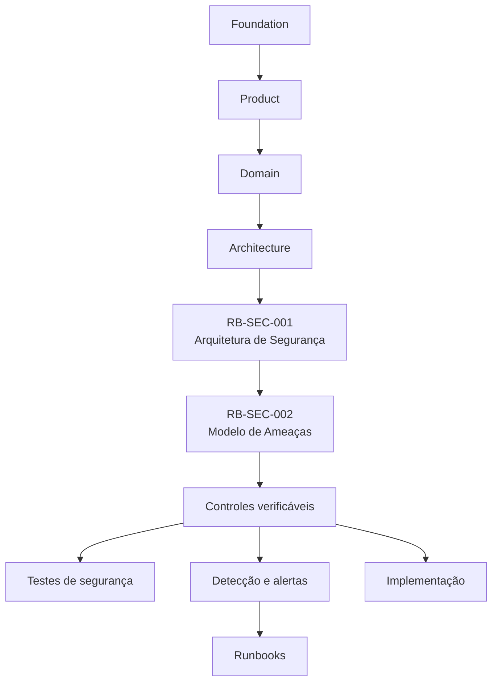
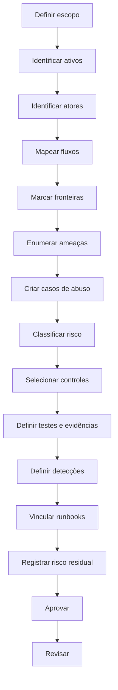
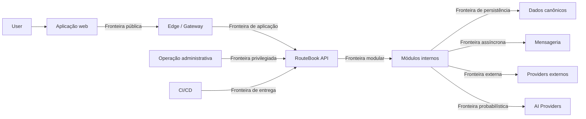
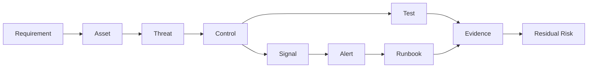

---

id: RB-SEC-002

title: Modelo de Ameaças e Controles de Segurança
description: Define o modelo oficial de ameaças do RouteBook, seu processo de análise de risco e o catálogo rastreável de controles preventivos, detectivos, responsivos e de recuperação aplicáveis às superfícies de ataque da plataforma.

document_type: security
owner: Security

status: Draft
version: "0.1.0"

created: "2026-07-21"
last_updated: null

authors:

- RouteBook Team

tags:

- security
- threat-modeling
- security-controls
- risk-assessment
- stride
- attack-surface
- authorization
- data-protection
- application-security
- ai-security
- supply-chain
- incident-response
- secure-development
- diagrams
- mermaid

related_documents:

- RB-CORE-0001
- RB-CORE-0002
- RB-CORE-0003
- RB-CORE-0004
- RB-PRD-001
- RB-PRD-002
- RB-PRD-003
- RB-PRD-004
- RB-PRD-005
- RB-PRD-006
- RB-PRD-007
- RB-PRD-008
- RB-DOM-001
- RB-DOM-002
- RB-DOM-003
- RB-DOM-004
- RB-ARC-001
- RB-ARC-002
- RB-ARC-003
- RB-ARC-004
- RB-ARC-005
- RB-DATA-001
- RB-DATA-002
- RB-API-001
- RB-SEC-001
- RB-OBS-001
- RB-QA-001
- RB-QA-002
- RB-OPS-001
- RB-OPS-002
- RB-SRE-001
- RB-AI-001
- RB-AI-003
- RB-AI-004
- RB-AI-005
- RB-AI-006

prerequisites:

- RB-CORE-0004
- RB-DOM-001
- RB-DOM-002
- RB-DOM-003
- RB-DOM-004
- RB-ARC-001
- RB-ARC-002
- RB-ARC-003
- RB-ARC-004
- RB-ARC-005
- RB-DATA-001
- RB-DATA-002
- RB-API-001
- RB-SEC-001
- RB-OBS-001
- RB-QA-001
- RB-QA-002
- RB-OPS-001
- RB-OPS-002
- RB-SRE-001
- RB-AI-005
- RB-AI-006

next_documents:

- RB-SEC-003
- RB-PRIV-001
- RB-QA-003
- RB-OPS-003
- RB-AI-007

ai_context:
priority: critical
index: true
---

# RouteBook — Modelo de Ameaças e Controles de Segurança

## Parte I — Fundamentos

### 1. Propósito

Este documento define o modelo oficial de ameaças e controles de segurança do RouteBook.

Seu objetivo é transformar a arquitetura de segurança estabelecida pelo `RB-SEC-001` em um sistema verificável para:

* identificar ameaças;
* analisar superfícies de ataque;
* avaliar riscos;
* documentar cenários de abuso;
* selecionar controles;
* definir ownership;
* vincular ameaças a requisitos;
* vincular controles a testes;
* vincular detecções a alertas;
* vincular incidentes a runbooks;
* registrar riscos residuais;
* revisar mudanças relevantes;
* apoiar decisões arquiteturais;
* orientar implementação segura.

Este documento deverá ser utilizado durante:

* definição de funcionalidades;
* elaboração de arquitetura;
* desenho de APIs;
* modelagem de dados;
* implementação;
* code review;
* planejamento de testes;
* revisão de segurança;
* preparação de deployments;
* investigação de incidentes;
* alterações em capacidades de IA;
* integração com novos fornecedores.

---

### 2. Relação com o RB-SEC-001

O `RB-SEC-001 — Arquitetura de Segurança e Privacidade` define:

* princípios de segurança;
* arquitetura de identidade;
* autenticação;
* autorização;
* isolamento;
* proteção de dados;
* segurança de APIs;
* segurança de integrações;
* segurança de IA;
* auditoria;
* privacidade por padrão.

O `RB-SEC-002` não redefine esses elementos.

Este documento define:

* como ameaças serão identificadas;
* como ameaças serão analisadas;
* como riscos serão classificados;
* quais controles deverão responder a cada ameaça;
* como controles serão verificados;
* como o risco residual será aceito ou tratado.

---

### 3. Escopo

O modelo cobre:

* aplicação web;
* APIs;
* módulos internos;
* identidade;
* autenticação;
* autorização;
* Accounts;
* Trips;
* dados canônicos;
* dados derivados;
* banco de dados;
* cache;
* eventos;
* Outbox;
* Inbox;
* filas;
* jobs;
* uploads;
* URLs externas;
* mapas;
* fornecedores externos;
* AI Providers;
* agentes;
* prompts;
* Context Snapshots;
* Tools;
* observabilidade;
* CI/CD;
* dependências;
* artefatos;
* secrets;
* backups;
* operação administrativa.

---

### 4. Fora do escopo

Este documento não define:

* configuração final de cloud;
* regras jurídicas completas de privacidade;
* termos de uso;
* política corporativa de segurança;
* controles físicos;
* contratos comerciais de fornecedores;
* implementação específica de cada controle;
* plano operacional completo de resposta a incidentes;
* política completa de retenção e eliminação.

Esses temas deverão ser cobertos por documentos especializados.

---

### 5. Autoridade documental

O modelo deverá respeitar:

1. Foundation;
2. Product;
3. Domain;
4. Architecture;
5. Data;
6. API;
7. Security Architecture;
8. AI Governance;
9. Quality;
10. Operations.



---

### 6. Princípio central

Toda capacidade relevante do RouteBook deverá possuir ameaças conhecidas, controles identificados e evidências de verificação proporcionais ao risco.

```text
Ativo
→ fluxo
→ fronteira
→ ameaça
→ impacto
→ risco
→ controle
→ teste
→ detecção
→ resposta
→ risco residual
```

---

### 7. Objetivos

O modelo deverá:

1. antecipar cenários de ataque;
2. proteger ativos críticos;
3. reduzir ambiguidades;
4. evitar controles implícitos;
5. apoiar segurança por design;
6. priorizar riscos;
7. reduzir acesso cross-account;
8. proteger estado canônico;
9. limitar agentes e integrações;
10. proteger dados pessoais;
11. fortalecer detecção;
12. produzir rastreabilidade.

---

### 8. Público

Este documento deverá orientar:

* Security;
* Product;
* Architecture;
* Backend;
* Frontend;
* Platform;
* Data;
* Artificial Intelligence;
* Quality Engineering;
* Operations;
* revisores técnicos;
* agentes de engenharia.

---

## Parte II — Conceitos

### 9. Ativo

Ativo é qualquer elemento que possua valor e necessite de proteção.

Exemplos:

* identidade;
* Account;
* Trip;
* Traveler Profile;
* restrição;
* localização;
* Accommodation;
* Itinerary;
* Activity;
* Decision;
* Recommendation;
* Itinerary Proposal;
* Planning Conflict;
* credencial;
* token;
* secret;
* evento;
* audit log;
* backup;
* Context Snapshot;
* Provenance.

---

### 10. Ameaça

Ameaça é uma circunstância capaz de comprometer um ativo.

---

### 11. Vulnerabilidade

Vulnerabilidade é uma fraqueza explorável em:

* código;
* arquitetura;
* configuração;
* processo;
* dependência;
* operação;
* controle;
* modelo de IA.

---

### 12. Vetor de ataque

Vetor de ataque é o caminho utilizado para explorar uma vulnerabilidade.

---

### 13. Superfície de ataque

Superfície de ataque é o conjunto de pontos onde um ator pode interagir com o sistema ou influenciar seu comportamento.

---

### 14. Cenário de ameaça

Um cenário de ameaça deverá representar:

```text
Ator
+ objetivo
+ vetor
+ ativo
+ condição
+ impacto
```

---

### 15. Controle de segurança

Controle é uma medida utilizada para:

* prevenir;
* reduzir;
* detectar;
* responder;
* recuperar;
* transferir;
* aceitar um risco.

---

### 16. Risco inerente

Risco inerente é o risco existente antes da aplicação dos controles.

---

### 17. Risco residual

Risco residual é o risco que permanece após os controles.

---

### 18. Blast radius

Blast radius é o escopo máximo de impacto que uma ameaça ou falha pode alcançar.

---

### 19. Fronteira de confiança

Fronteira de confiança é o ponto onde dados, autoridade ou execução atravessam contextos com níveis diferentes de confiança.

---

### 20. Abuso

Abuso é o uso intencionalmente indevido de uma capacidade que pode ocorrer mesmo sem vulnerabilidade técnica clássica.

---

## Parte III — Princípios

### 21. Negar por padrão

Toda ação sem autorização explícita deverá ser negada.

---

### 22. Menor privilégio

Usuários, processos, agentes, Tools e integrações deverão possuir somente as permissões necessárias.

---

### 23. Defesa em profundidade

Controles deverão existir em múltiplas camadas.

---

### 24. Falha segura

Quando um controle falhar, o sistema deverá preservar o estado mais seguro.

---

### 25. Autoridade no servidor

O frontend nunca deverá ser autoridade de segurança.

---

### 26. Validação independente

Dados produzidos por clientes, integrações ou IA deverão ser validados pelo RouteBook.

---

### 27. Segurança verificável

Todo controle crítico deverá possuir mecanismo de verificação.

---

### 28. Isolamento explícito

AccountId e TripId deverão fazer parte explícita das decisões de acesso.

---

### 29. Minimização

Somente dados necessários deverão ser coletados, enviados, processados e persistidos.

---

### 30. Não confiar em origem

Origem interna não implica confiança.

---

### 31. Limitar blast radius

Falhas deverão ser isoladas por:

* Account;
* Trip;
* módulo;
* processo;
* Provider;
* Tool;
* fila;
* credencial;
* ambiente.

---

### 32. Rastreabilidade

Ações críticas deverão ser auditáveis.

---

### 33. Segurança proporcional ao risco

Controles deverão ser proporcionais a:

* criticidade;
* impacto;
* probabilidade;
* exposição;
* sensibilidade;
* reversibilidade.

---

## Parte IV — Processo de Threat Modeling

### 34. Gatilhos

Threat modeling deverá ocorrer quando houver:

* nova funcionalidade;
* nova API;
* nova integração;
* novo tipo de dado;
* nova permissão;
* novo papel;
* novo Provider;
* nova Tool;
* novo agente;
* novo fluxo administrativo;
* mudança de arquitetura;
* incidente relevante;
* vulnerabilidade crítica;
* alteração de fronteira.

---

### 35. Etapas

O processo oficial deverá seguir:

1. delimitar o escopo;
2. identificar ativos;
3. identificar atores;
4. desenhar fluxos;
5. identificar fronteiras;
6. enumerar ameaças;
7. descrever cenários de abuso;
8. classificar riscos;
9. selecionar controles;
10. definir testes;
11. definir detecções;
12. vincular runbooks;
13. registrar risco residual;
14. obter aprovação;
15. revisar periodicamente.

---

### 36. Fluxo



---

### 37. Unidade de análise

A análise deverá utilizar uma unidade clara, por exemplo:

* capacidade;
* caso de uso;
* endpoint;
* módulo;
* fluxo de dados;
* integração;
* agente;
* Tool;
* job.

---

### 38. Escopo mínimo

Toda análise deverá declarar:

```text
threatModelId
title
scope
owner
reviewers
assets
actors
entryPoints
trustBoundaries
dependencies
assumptions
status
version
```

---

### 39. Premissas

Premissas deverão ser explícitas e verificáveis.

---

### 40. Evidências

O modelo poderá utilizar:

* diagramas;
* contratos;
* código;
* testes;
* logs;
* políticas;
* configurações;
* relatórios;
* incidentes.

---

## Parte V — Classificação STRIDE

### 41. Uso do STRIDE

O RouteBook utilizará STRIDE como estrutura inicial, sem limitar a análise a essas categorias.

---

### 42. Spoofing

Falsificação de identidade.

Exemplos:

* token forjado;
* sessão roubada;
* identidade externa associada incorretamente;
* agente assumindo autoridade inexistente;
* webhook sem autenticação.

---

### 43. Tampering

Alteração indevida de dados.

Exemplos:

* modificação de Trip;
* manipulação de Itinerary Proposal;
* alteração de evento;
* adulteração de cache;
* modificação de artefato;
* alteração de prompt.

---

### 44. Repudiation

Negação de uma ação sem evidência suficiente.

Exemplos:

* exclusão sem Audit Entry;
* operação administrativa sem autoria;
* Tool Call sem registro;
* alteração crítica sem correlationId.

---

### 45. Information Disclosure

Divulgação indevida de informação.

Exemplos:

* acesso cross-account;
* secret em log;
* Context Snapshot exposto;
* localização divulgada;
* erro contendo dado pessoal;
* backup público.

---

### 46. Denial of Service

Indisponibilidade ou degradação provocada.

Exemplos:

* busca custosa repetida;
* criação excessiva de jobs;
* loop de agente;
* upload volumoso;
* retry storm;
* saturação de Provider.

---

### 47. Elevation of Privilege

Obtenção indevida de autoridade.

Exemplos:

* viewer executando edição;
* editor transferindo ownership;
* agente invocando Tool administrativa;
* usuário comum acessando operação interna;
* integração expandindo escopo.

---

### 48. Categorias complementares

O modelo deverá também considerar:

* abuso de negócio;
* acesso horizontal;
* supply chain;
* exfiltração;
* replay;
* fraude;
* prompt injection;
* tool injection;
* model manipulation;
* resource exhaustion;
* confused deputy;
* cross-account leakage.

---

## Parte VI — Classificação de risco

### 49. Dimensões

Cada ameaça deverá ser avaliada por:

* probabilidade;
* impacto;
* exposição;
* detectabilidade;
* blast radius;
* reversibilidade;
* sensibilidade;
* complexidade de exploração.

---

### 50. Probabilidade

Escala inicial:

| Nível | Descrição          |
| ----- | ------------------ |
| 1     | improvável         |
| 2     | baixa              |
| 3     | possível           |
| 4     | provável           |
| 5     | altamente provável |

---

### 51. Impacto

| Nível | Descrição        |
| ----- | ---------------- |
| 1     | impacto mínimo   |
| 2     | impacto limitado |
| 3     | impacto moderado |
| 4     | impacto alto     |
| 5     | impacto crítico  |

---

### 52. Critérios de impacto

Avaliar:

* confidencialidade;
* integridade;
* disponibilidade;
* privacidade;
* autorização;
* dados;
* operação;
* custo;
* reputação.

---

### 53. Pontuação inicial

```text
riskScore = likelihood × impact
```

A pontuação não deverá substituir julgamento técnico.

---

### 54. Faixas

| Pontuação | Classificação |
| --------: | ------------- |
|       1–4 | Low           |
|       5–9 | Moderate      |
|     10–16 | High          |
|     17–25 | Critical      |

---

### 55. Elevação automática

Independentemente da pontuação, deverão ser tratados como Critical:

* acesso cross-account confirmado;
* bypass de autenticação;
* bypass de autorização crítica;
* comprometimento de secret privilegiado;
* corrupção canônica ampla;
* execução remota;
* exposição significativa de dados;
* alteração de cadeia de software;
* agente com autoridade não autorizada.

---

### 56. Risco residual

Após os controles, o risco deverá ser reavaliado.

---

### 57. Aceitação

Risco High ou Critical não poderá ser aceito informalmente.

---

## Parte VII — Registro de ameaças

### 58. Estrutura

Cada ameaça deverá possuir:

```text
threatId
title
description
category
assets
actors
entryPoints
preconditions
attackPath
impact
likelihood
inherentRisk
controls
verification
detection
runbook
residualRisk
owner
status
reviewDate
```

---

### 59. Identificador

Formato sugerido:

```text
RB-THR-<AREA>-NNN
```

Exemplos:

```text
RB-THR-IAM-001
RB-THR-API-001
RB-THR-DATA-001
RB-THR-AI-001
```

---

### 60. Estados

Estados possíveis:

* Identified;
* Under Analysis;
* Treatment Planned;
* Mitigated;
* Accepted;
* Transferred;
* Closed;
* Obsolete.

---

### 61. Ownership

Toda ameaça deverá possuir owner responsável pelo tratamento.

---

### 62. Data de revisão

Ameaças críticas deverão possuir revisão periódica definida.

---

## Parte VIII — Catálogo de controles

### 63. Estrutura

Cada controle deverá possuir:

```text
controlId
title
objective
type
scope
implementationOwner
verificationOwner
evidence
frequency
automation
relatedThreats
exceptions
status
```

---

### 64. Tipos

Controles poderão ser:

* Preventive;
* Detective;
* Responsive;
* Recovery;
* Corrective;
* Compensating.

---

### 65. Natureza

Controles poderão ser:

* técnico;
* arquitetural;
* processual;
* administrativo;
* operacional;
* contratual.

---

### 66. Identificador

Formato sugerido:

```text
RB-CTL-<AREA>-NNN
```

---

### 67. Evidência

Evidências poderão incluir:

* teste automatizado;
* configuração;
* log;
* dashboard;
* alerta;
* relatório;
* revisão;
* aprovação;
* execução de runbook;
* registro de auditoria.

---

### 68. Controle crítico

Um controle crítico deverá:

* possuir owner;
* ser verificável;
* gerar evidência;
* possuir falha observável;
* possuir tratamento de exceção;
* ser revisto periodicamente.

---

## Parte IX — Ativos e criticidade

### 69. Identidade

Ativos:

* UserId;
* AccountId;
* externalSubject;
* credenciais;
* sessões;
* tokens;
* fatores de autenticação.

Criticidade: Critical.

---

### 70. Autorização

Ativos:

* papéis;
* políticas;
* ownership;
* delegações;
* permissões;
* escopo de Account;
* escopo de Trip.

Criticidade: Critical.

---

### 71. Planejamento

Ativos:

* Trip;
* Itinerary;
* Activity;
* Decision;
* Recommendation;
* Itinerary Proposal;
* Planning Conflict.

Criticidade: High ou Critical conforme operação.

---

### 72. Perfil do viajante

Ativos:

* preferências;
* restrições;
* orçamento;
* composição do grupo;
* acessibilidade;
* localização.

Criticidade: High.

---

### 73. Plataforma

Ativos:

* secrets;
* infraestrutura;
* pipeline;
* artefatos;
* configurações;
* observabilidade;
* backups.

Criticidade: Critical.

---

### 74. Inteligência artificial

Ativos:

* prompts;
* Context Snapshots;
* Tools;
* agentes;
* saídas estruturadas;
* Provenance;
* modelos;
* políticas.

Criticidade: High.

---

## Parte X — Fronteiras de confiança

### 75. Fronteiras principais



---

### 76. Controles mínimos por fronteira

Toda fronteira deverá avaliar:

* autenticação;
* autorização;
* validação;
* criptografia;
* timeout;
* rate limit;
* logging;
* rastreabilidade;
* proteção contra replay;
* minimização;
* tratamento de erro.

---

### 77. Fronteira pública

Nunca deverá confiar em:

* parâmetros;
* headers;
* claims não validadas;
* IDs;
* arquivos;
* URLs;
* conteúdo;
* estado no cliente.

---

### 78. Fronteira modular

Módulos deverão respeitar ownership e contratos.

---

### 79. Fronteira externa

Providers deverão ser tratados como não confiáveis.

---

### 80. Fronteira probabilística

Saídas de IA deverão ser consideradas não confiáveis até validação.

---

### 81. Fronteira privilegiada

Operações administrativas deverão possuir controles reforçados.

---

## Parte XI — Identidade e autenticação

### 82. Ameaças principais

* credential stuffing;
* password spraying;
* roubo de sessão;
* token forjado;
* token reutilizado;
* recuperação de conta abusada;
* enumeração de usuários;
* vínculo incorreto de externalSubject;
* sessão não revogada;
* MFA bypass.

---

### 83. Controles preventivos

* validação completa de token;
* tokens de curta duração;
* rotação de refresh token;
* MFA em ações críticas;
* proteção do identity provider;
* cookies seguros;
* revogação;
* rate limiting;
* mensagens não enumeráveis.

---

### 84. Controles detectivos

* falhas repetidas;
* login anômalo;
* reutilização de refresh token;
* mudança incomum de origem;
* volume de recuperação;
* sessão após revogação.

---

### 85. Controles responsivos

* bloquear sessão;
* revogar token;
* suspender identidade;
* exigir nova autenticação;
* rotacionar credencial;
* acionar runbook.

---

### 86. Testes obrigatórios

* token expirado;
* emissor inválido;
* audiência inválida;
* assinatura inválida;
* identidade suspensa;
* refresh token reutilizado;
* recuperação enumerável;
* sessão revogada.

---

## Parte XII — Autorização e isolamento

### 87. Ameaças principais

* IDOR;
* acesso cross-account;
* acesso cross-trip;
* elevação vertical;
* transferência indevida de ownership;
* política ausente;
* escopo omitido;
* cache sem escopo;
* projeção vazando dados;
* Tool sem autorização.

---

### 88. Controle central

Toda operação sobre recurso protegido deverá validar:

```text
ator
+ Account
+ Trip
+ recurso
+ ação
+ papel
+ contexto
+ estado
```

---

### 89. Escopo em consultas

Consultas deverão incluir escopo de Account e Trip quando aplicável.

---

### 90. Resposta

O sistema poderá responder `404` em vez de `403` quando necessário para evitar enumeração.

---

### 91. Cache

Chaves de cache deverão incluir escopo de segurança.

---

### 92. Projeções

Read models deverão preservar isolamento.

---

### 93. Testes obrigatórios

Para cada operação protegida:

* owner permitido;
* editor permitido ou negado;
* viewer permitido ou negado;
* outro Account negado;
* outra Trip negada;
* User sem acesso negado;
* agente sem delegação negado;
* integração fora de escopo negada.

---

### 94. Ameaça crítica: cross-account

```text
threatId: RB-THR-AUTHZ-001
title: Acesso a recurso de outra Account
category: Information Disclosure / Elevation of Privilege
inherentRisk: Critical
```

Controles mínimos:

* escopo obrigatório;
* policy server-side;
* testes negativos;
* audit;
* alerta;
* revisão de repositories;
* cache partitioning;
* runbook de incidente.

---

## Parte XIII — Segurança de APIs

### 95. Ameaças principais

* injeção;
* mass assignment;
* parâmetros manipulados;
* rate abuse;
* replay;
* enumeração;
* payload excessivo;
* versão incompatível;
* CORS incorreto;
* erro detalhado;
* ausência de idempotência.

---

### 96. Validação

Toda entrada deverá possuir:

* schema;
* tipo;
* tamanho;
* formato;
* faixa;
* enum;
* regra;
* referência válida.

---

### 97. Mass assignment

DTOs de entrada deverão ser explícitos.

---

### 98. Idempotência

Operações suscetíveis a repetição deverão possuir mecanismo de idempotência.

---

### 99. Rate limiting

Deverá considerar:

* identidade;
* IP;
* Account;
* endpoint;
* custo;
* capacidade.

---

### 100. Erros

Respostas não deverão revelar:

* stack trace;
* secret;
* query;
* caminho interno;
* dado de outra Account;
* configuração.

---

### 101. CORS

Deverá utilizar allowlist explícita.

---

### 102. Testes

* payload inválido;
* campos extras;
* ID inexistente;
* ID de outro Account;
* tamanho excessivo;
* repetição;
* concorrência;
* rate limit;
* erro sanitizado.

---

## Parte XIV — Aplicação web

### 103. Ameaças principais

* XSS;
* CSRF;
* clickjacking;
* open redirect;
* DOM injection;
* token exposto;
* dependência comprometida;
* dado sensível em storage;
* cache do navegador;
* conteúdo externo inseguro.

---

### 104. Controles XSS

* escaping contextual;
* sanitização;
* evitar HTML não confiável;
* Content Security Policy;
* dependências revisadas.

---

### 105. Controles CSRF

Quando cookies autenticados forem usados:

* SameSite;
* token CSRF;
* validação de origem;
* método adequado.

---

### 106. Armazenamento local

Dados sensíveis não deverão ser persistidos no cliente sem necessidade.

---

### 107. Clickjacking

Interfaces sensíveis deverão impedir framing não autorizado.

---

### 108. URLs

Redirecionamentos deverão utilizar destinos permitidos.

---

### 109. Testes

* payload XSS;
* navegação manipulada;
* CSRF;
* framing;
* token em storage;
* dado sensível em erro;
* URL externa insegura.

---

## Parte XV — Dados e persistência

### 110. Ameaças principais

* SQL injection;
* perda;
* corrupção;
* acesso excessivo;
* backup exposto;
* migration destrutiva;
* isolamento incorreto;
* dado pessoal sem proteção;
* retenção indevida;
* replicação insegura.

---

### 111. Controles

* queries parametrizadas;
* contas de banco com menor privilégio;
* constraints;
* criptografia;
* backups;
* migrations revisadas;
* segregação;
* auditoria;
* retenção;
* restore testado.

---

### 112. Dados canônicos

Alterações deverão ocorrer somente pelo módulo proprietário.

---

### 113. Dados derivados

Projeções deverão ser reconstruíveis e não deverão substituir o estado canônico.

---

### 114. Migrations

Migrations de alto risco deverão possuir:

* revisão;
* backup;
* compatibilidade;
* rollback ou forward fix;
* teste;
* observabilidade.

---

### 115. Acesso operacional

Consultas manuais deverão ser:

* autorizadas;
* minimizadas;
* auditadas;
* temporárias;
* sanitizadas.

---

### 116. Testes

* injeção;
* constraint;
* concorrência;
* acesso por outro Account;
* migration parcial;
* restore;
* replicação;
* deleção.

---

## Parte XVI — Mensageria

### 117. Ameaças principais

* replay;
* duplicidade;
* mensagem adulterada;
* poison message;
* schema incompatível;
* consumo não autorizado;
* DLQ exposta;
* evento de outra Account;
* ordem incorreta;
* perda de evento.

---

### 118. Controles Outbox

* persistência transacional;
* identificador único;
* status;
* retries;
* observabilidade;
* publicação idempotente.

---

### 119. Controles Inbox

* deduplicação;
* EventId;
* status;
* resultado;
* retenção.

---

### 120. Replay

Replay deverá:

* preservar identidade;
* preservar correlationId;
* possuir autorização;
* possuir escopo;
* ser auditado;
* respeitar idempotência.

---

### 121. DLQ

Acesso à DLQ deverá ser restrito.

---

### 122. Schema

Consumers deverão validar versão e formato.

---

### 123. Testes

* mensagem duplicada;
* mensagem fora de ordem;
* schema inválido;
* EventId repetido;
* Account divergente;
* replay;
* consumer interrompido;
* DLQ.

---

## Parte XVII — Jobs e processamento assíncrono

### 124. Ameaças principais

* execução duplicada;
* concorrência indevida;
* job sem autorização;
* parâmetro manipulado;
* escopo amplo;
* loop;
* exaustão;
* checkpoint adulterado;
* dado cross-account.

---

### 125. Controles

* idempotência;
* lock;
* checkpoint;
* limite de lote;
* timeout;
* escopo;
* autorização;
* observabilidade;
* cancelamento;
* auditoria.

---

### 126. Jobs administrativos

Deverão exigir autorização reforçada.

---

### 127. Testes

* execução simultânea;
* retomada;
* cancelamento;
* lote parcial;
* parâmetro inválido;
* Account inválida;
* timeout;
* retry.

---

## Parte XVIII — Integrações externas

### 128. Ameaças principais

* Provider comprometido;
* credencial exposta;
* SSRF;
* resposta adulterada;
* schema alterado;
* webhook forjado;
* replay de webhook;
* indisponibilidade;
* dado excessivo enviado;
* dependência maliciosa.

---

### 129. Validação de saída

Respostas externas deverão ser tratadas como não confiáveis.

---

### 130. Webhooks

Deverão possuir:

* assinatura;
* timestamp;
* proteção contra replay;
* allowlist quando aplicável;
* idempotência;
* validação de schema.

---

### 131. SSRF

URLs fornecidas externamente deverão possuir:

* protocolo permitido;
* host validado;
* bloqueio de rede interna;
* limite de redirecionamento;
* timeout;
* tamanho máximo.

---

### 132. Credenciais

Cada integração deverá possuir credencial própria e escopo mínimo.

---

### 133. Dados enviados

Somente dados necessários deverão ser enviados.

---

### 134. Testes

* assinatura inválida;
* replay;
* host interno;
* redirecionamento;
* timeout;
* schema inesperado;
* credencial revogada;
* Provider comprometido.

---

## Parte XIX — Uploads e arquivos

### 135. Ameaças principais

* malware;
* arquivo executável;
* path traversal;
* conteúdo ativo;
* decompression bomb;
* tamanho excessivo;
* MIME falso;
* arquivo público;
* metadata sensível.

---

### 136. Controles

* allowlist de tipos;
* limite de tamanho;
* validação de conteúdo;
* nome gerado;
* storage isolado;
* scan;
* acesso autorizado;
* expiração;
* headers seguros.

---

### 137. Processamento

Arquivos não deverão ser executados no contexto da aplicação.

---

### 138. Download

Downloads deverão possuir autorização e headers adequados.

---

### 139. Testes

* MIME divergente;
* extensão dupla;
* arquivo grande;
* path traversal;
* conteúdo ativo;
* arquivo de outro Account;
* URL previsível.

---

## Parte XX — Secrets e configurações

### 140. Ameaças principais

* secret no repositório;
* secret em log;
* secret em imagem;
* secret em frontend;
* acesso excessivo;
* credencial sem rotação;
* ambiente compartilhado;
* configuração insegura.

---

### 141. Controles

* secret manager;
* scanning;
* menor privilégio;
* rotação;
* separação por ambiente;
* redaction;
* acesso auditado;
* expiração.

---

### 142. Proibições

Secrets não poderão estar em:

* código;
* documentação;
* logs;
* mensagens de erro;
* artefatos públicos;
* variáveis expostas ao navegador.

---

### 143. Rotação

Credenciais críticas deverão possuir procedimento testado.

---

### 144. Testes

* scanner;
* secret falso controlado;
* acesso negado;
* rotação;
* revogação;
* redaction.

---

## Parte XXI — Supply chain

### 145. Ameaças principais

* dependência comprometida;
* typosquatting;
* artefato adulterado;
* pipeline comprometido;
* runner malicioso;
* ação de CI vulnerável;
* pacote não fixado;
* credencial de publicação exposta.

---

### 146. Controles

* lockfiles;
* revisão de dependências;
* scanning;
* atualização;
* assinatura;
* provenance;
* branch protection;
* revisão obrigatória;
* menor privilégio no CI;
* artefatos imutáveis.

---

### 147. Dependências

Novas dependências deverão ser avaliadas por:

* necessidade;
* manutenção;
* licença;
* vulnerabilidades;
* popularidade;
* origem;
* permissões.

---

### 148. CI/CD

Pipelines deverão:

* proteger secrets;
* limitar permissões;
* fixar versões;
* gerar evidência;
* bloquear falhas críticas.

---

### 149. Artefatos

Artefatos deverão possuir:

* origem;
* versão;
* checksum;
* rastreabilidade;
* retenção.

---

### 150. Testes

* dependência vulnerável;
* pipeline sem permissão;
* artefato alterado;
* branch sem aprovação;
* secret em build.

---

## Parte XXII — Observabilidade

### 151. Ameaças principais

* secret em log;
* dado pessoal em trace;
* log injection;
* adulteração;
* remoção de evidência;
* acesso excessivo;
* retenção indevida;
* correlationId manipulada.

---

### 152. Minimização

Logs não deverão conter dados sensíveis sem justificativa.

---

### 153. Integridade

Audit logs críticos deverão possuir proteção contra alteração.

---

### 154. Acesso

Acesso a observabilidade deverá seguir menor privilégio.

---

### 155. Redaction

Campos sensíveis deverão ser mascarados.

---

### 156. Log injection

Entradas não confiáveis deverão ser codificadas.

---

### 157. Testes

* secret em log;
* quebra de linha;
* acesso não autorizado;
* retenção;
* remoção;
* trace cross-account.

---

## Parte XXIII — Operação administrativa

### 158. Ameaças principais

* abuso interno;
* conta privilegiada comprometida;
* operação destrutiva;
* acesso permanente;
* ausência de auditoria;
* comando no ambiente errado;
* replay amplo;
* restauração indevida.

---

### 159. Controles

* MFA;
* just-in-time access;
* aprovação;
* confirmação;
* dry-run;
* escopo;
* segregação;
* auditoria;
* sessão gravada quando aplicável.

---

### 160. Operações críticas

Exemplos:

* restore;
* replay;
* exclusão;
* migração;
* transferência de ownership;
* alteração de autorização;
* rotação emergencial;
* bloqueio de Account.

---

### 161. Dual control

Operações de alto risco poderão exigir dois responsáveis.

---

### 162. Acesso emergencial

Deverá ser temporário, auditado e revogado.

---

### 163. Testes

* operador sem permissão;
* ambiente incorreto;
* ausência de aprovação;
* ação fora de escopo;
* auditoria ausente;
* sessão expirada.

---

## Parte XXIV — Segurança de IA

### 164. Princípio

IA não possui autoridade implícita.

---

### 165. Ameaças principais

* prompt injection;
* indirect prompt injection;
* tool injection;
* data exfiltration;
* contexto cross-account;
* ID inventado;
* Tool Call não autorizada;
* loop;
* custo excessivo;
* modelo comprometido;
* saída manipulada;
* abuso de autonomia.

---

### 166. Conteúdo não confiável

Conteúdo de:

* páginas;
* Places;
* reviews;
* uploads;
* e-mails;
* APIs;
* Providers;

deverá ser tratado como dado, não como instrução.

---

### 167. Context Builder

Deverá aplicar:

* minimização;
* escopo;
* classificação;
* Provenance;
* autorização;
* limite de tamanho.

---

### 168. Saída estruturada

Saídas deverão ser validadas por schema.

---

### 169. IDs

A IA não deverá criar identificadores canônicos inexistentes.

Referências deverão ser verificadas antes de qualquer ação.

---

### 170. Tools

Cada Tool deverá possuir:

* allowlist;
* autorização;
* schema;
* timeout;
* limite;
* escopo;
* auditoria;
* confirmação quando necessária.

---

### 171. Separação entre recomendação e execução

Recommendation não é Decision.

Itinerary Proposal não é alteração aplicada.

A aplicação deverá exigir contratos e autoridade apropriados.

---

### 172. Limites de agente

Agentes deverão possuir:

* limite de etapas;
* limite de custo;
* timeout;
* limite de Tools;
* cancelamento;
* detecção de repetição.

---

### 173. Human-in-the-loop

Ações de alto impacto deverão exigir confirmação humana.

---

### 174. Testes

* prompt injection direto;
* prompt injection indireto;
* exfiltração;
* Tool fora da allowlist;
* ID inventado;
* outro Account;
* loop;
* custo;
* saída inválida;
* ação sem confirmação.

---

## Parte XXV — Cenários de abuso do produto

### 175. Criação excessiva de Trips

Risco:

* consumo de recursos;
* custo;
* spam;
* degradação.

Controles:

* rate limit;
* quota;
* detecção;
* bloqueio progressivo.

---

### 176. Busca automatizada abusiva

Risco:

* custo de Provider;
* scraping;
* indisponibilidade.

Controles:

* cache;
* quota;
* rate limit;
* detecção comportamental.

---

### 177. Manipulação de Recommendations

Risco:

* promoção indevida;
* conteúdo enviesado;
* resultado inseguro.

Controles:

* Provenance;
* critérios transparentes;
* validação;
* monitoramento;
* revisão.

---

### 178. Manipulação de Itinerary Proposal

Risco:

* alterações incompatíveis;
* remoção de atividade obrigatória;
* custo ou deslocamento indevido.

Controles:

* validação;
* versão;
* Planning Assurance;
* aceite explícito;
* auditoria.

---

### 179. Ignorar Planning Conflict indevidamente

Risco:

* estado inseguro;
* conflito operacional;
* perda de rastreabilidade.

Controles:

* autorização;
* Decision;
* justificativa;
* Audit Entry;
* possibilidade de restauração.

---

### 180. Convites abusivos

Risco:

* spam;
* descoberta de contas;
* acesso indevido.

Controles:

* token de uso único;
* expiração;
* rate limit;
* confirmação;
* mensagens não enumeráveis.

---

## Parte XXVI — Matriz inicial de ameaças

### 181. Identidade

| ID             | Ameaça                       | Risco    |
| -------------- | ---------------------------- | -------- |
| RB-THR-IAM-001 | roubo de sessão              | High     |
| RB-THR-IAM-002 | token forjado                | Critical |
| RB-THR-IAM-003 | recuperação de conta abusada | High     |
| RB-THR-IAM-004 | vínculo externo incorreto    | Critical |

---

### 182. Autorização

| ID               | Ameaça               | Risco    |
| ---------------- | -------------------- | -------- |
| RB-THR-AUTHZ-001 | acesso cross-account | Critical |
| RB-THR-AUTHZ-002 | acesso cross-trip    | Critical |
| RB-THR-AUTHZ-003 | elevação vertical    | Critical |
| RB-THR-AUTHZ-004 | agente sem delegação | Critical |

---

### 183. API

| ID             | Ameaça              | Risco    |
| -------------- | ------------------- | -------- |
| RB-THR-API-001 | mass assignment     | High     |
| RB-THR-API-002 | injeção             | Critical |
| RB-THR-API-003 | replay de operação  | High     |
| RB-THR-API-004 | abuso de capacidade | Moderate |

---

### 184. Dados

| ID              | Ameaça                 | Risco    |
| --------------- | ---------------------- | -------- |
| RB-THR-DATA-001 | corrupção canônica     | Critical |
| RB-THR-DATA-002 | backup exposto         | Critical |
| RB-THR-DATA-003 | migration destrutiva   | High     |
| RB-THR-DATA-004 | projeção cross-account | Critical |

---

### 185. IA

| ID            | Ameaça                   | Risco    |
| ------------- | ------------------------ | -------- |
| RB-THR-AI-001 | prompt injection         | High     |
| RB-THR-AI-002 | exfiltração de contexto  | Critical |
| RB-THR-AI-003 | Tool Call não autorizada | Critical |
| RB-THR-AI-004 | loop de agente           | High     |
| RB-THR-AI-005 | ID inventado aplicado    | Critical |

---

### 186. Plataforma

| ID              | Ameaça                     | Risco    |
| --------------- | -------------------------- | -------- |
| RB-THR-PLAT-001 | secret exposto             | Critical |
| RB-THR-PLAT-002 | pipeline comprometido      | Critical |
| RB-THR-PLAT-003 | artefato adulterado        | Critical |
| RB-THR-PLAT-004 | acesso operacional abusado | Critical |

---

## Parte XXVII — Matriz inicial de controles

### 187. Identity and Access

| ID             | Controle                       | Tipo       |
| -------------- | ------------------------------ | ---------- |
| RB-CTL-IAM-001 | validação completa de token    | Preventive |
| RB-CTL-IAM-002 | rotação de refresh token       | Preventive |
| RB-CTL-IAM-003 | detecção de anomalia de sessão | Detective  |
| RB-CTL-IAM-004 | revogação de sessão            | Responsive |

---

### 188. Authorization

| ID               | Controle                       | Tipo       |
| ---------------- | ------------------------------ | ---------- |
| RB-CTL-AUTHZ-001 | policy server-side             | Preventive |
| RB-CTL-AUTHZ-002 | escopo obrigatório por Account | Preventive |
| RB-CTL-AUTHZ-003 | testes negativos cross-account | Detective  |
| RB-CTL-AUTHZ-004 | alerta de acesso indevido      | Detective  |

---

### 189. API

| ID             | Controle          | Tipo       |
| -------------- | ----------------- | ---------- |
| RB-CTL-API-001 | schema de entrada | Preventive |
| RB-CTL-API-002 | rate limiting     | Preventive |
| RB-CTL-API-003 | idempotency key   | Preventive |
| RB-CTL-API-004 | erro sanitizado   | Preventive |

---

### 190. Data

| ID              | Controle               | Tipo       |
| --------------- | ---------------------- | ---------- |
| RB-CTL-DATA-001 | queries parametrizadas | Preventive |
| RB-CTL-DATA-002 | constraints            | Preventive |
| RB-CTL-DATA-003 | backups testados       | Recovery   |
| RB-CTL-DATA-004 | reconciliação          | Detective  |

---

### 191. AI

| ID            | Controle                   | Tipo       |
| ------------- | -------------------------- | ---------- |
| RB-CTL-AI-001 | Context Builder com escopo | Preventive |
| RB-CTL-AI-002 | saída estruturada validada | Preventive |
| RB-CTL-AI-003 | allowlist de Tools         | Preventive |
| RB-CTL-AI-004 | limite de execução         | Preventive |
| RB-CTL-AI-005 | red teaming                | Detective  |

---

### 192. Platform

| ID              | Controle                    | Tipo       |
| --------------- | --------------------------- | ---------- |
| RB-CTL-PLAT-001 | secret scanning             | Detective  |
| RB-CTL-PLAT-002 | branch protection           | Preventive |
| RB-CTL-PLAT-003 | artefato rastreável         | Preventive |
| RB-CTL-PLAT-004 | acesso emergencial auditado | Responsive |

---

## Parte XXVIII — Verificação de controles

### 193. Princípio

Controle sem evidência não deverá ser considerado implementado.

---

### 194. Métodos

* teste unitário;
* teste de integração;
* teste de contrato;
* teste E2E;
* teste de autorização;
* SAST;
* DAST;
* SCA;
* secret scanning;
* IaC scanning;
* revisão manual;
* pentest;
* red teaming;
* tabletop;
* game day.

---

### 195. Frequência

A frequência deverá ser proporcional à criticidade.

---

### 196. Controles contínuos

Devem ser continuamente avaliados quando possível:

* dependências;
* secrets;
* políticas;
* autorização;
* configuração;
* exposição;
* alertas.

---

### 197. Evidência mínima

A evidência deverá registrar:

* controle;
* versão;
* ambiente;
* execução;
* resultado;
* responsável;
* data;
* exceções.

---

### 198. Falha de controle

Deverá gerar:

* alerta;
* issue;
* bloqueio quando crítico;
* avaliação de risco;
* tratamento.

---

## Parte XXIX — Segurança no ciclo de desenvolvimento

### 199. Requisitos

Funcionalidades de risco deverão possuir requisitos de segurança explícitos.

---

### 200. Design review

Deverá ocorrer antes da implementação quando houver:

* autenticação;
* autorização;
* dado sensível;
* Provider;
* upload;
* agente;
* Tool;
* operação administrativa.

---

### 201. Code review

Deverá verificar:

* validação;
* autorização;
* escopo;
* logging;
* erro;
* secret;
* dependência;
* concorrência;
* idempotência.

---

### 202. Pipeline

Falhas críticas deverão bloquear integração ou deployment.

---

### 203. Testes de segurança

Deverão fazer parte do Plano Mestre de Testes.

---

### 204. Definition of Done

Uma capacidade de risco não estará concluída sem:

* threat model;
* controles;
* testes;
* observabilidade;
* runbook quando necessário;
* riscos residuais registrados.

---

## Parte XXX — Detecção e resposta

### 205. Princípio

Ameaças relevantes deverão possuir sinais detectáveis.

---

### 206. Fontes

* autenticação;
* autorização;
* API;
* banco;
* fila;
* jobs;
* logs;
* traces;
* AI runtime;
* CI/CD;
* Provider;
* WAF;
* secret scanner.

---

### 207. Eventos de segurança

Deverão incluir:

* falha repetida;
* acesso negado relevante;
* tentativa cross-account;
* uso privilegiado;
* replay;
* secret detectado;
* Tool negada;
* exfiltração suspeita;
* alteração de política.

---

### 208. Severidade

Alertas deverão considerar risco e contexto.

---

### 209. Runbooks

Ameaças High e Critical deverão possuir runbook ou procedimento associado.

---

### 210. Preservação de evidência

Incidentes deverão preservar:

* logs;
* traces;
* Audit Entries;
* versões;
* eventos;
* identidade;
* configuração;
* timeline.

---

## Parte XXXI — Exceções

### 211. Registro

Exceções deverão possuir:

```text
exceptionId
controlId
scope
justification
risk
compensatingControls
owner
approvedBy
createdAt
expiresAt
status
```

---

### 212. Prazo

Exceções não deverão ser permanentes por padrão.

---

### 213. Controle compensatório

Toda exceção relevante deverá avaliar controle compensatório.

---

### 214. Expiração

Exceções expiradas deverão provocar revisão ou bloqueio.

---

### 215. Proibições

Não poderão ser excepcionados informalmente:

* isolamento entre Accounts;
* validação de autorização;
* proteção de secrets;
* auditoria de ações críticas;
* validação de Tool Calls;
* integridade canônica.

---

## Parte XXXII — Aceitação de risco

### 216. Requisitos

Aceitação deverá registrar:

* ameaça;
* justificativa;
* impacto;
* probabilidade;
* controles existentes;
* alternativas;
* owner;
* aprovador;
* prazo;
* revisão.

---

### 217. Autoridade

O nível de aprovação deverá crescer conforme o risco.

---

### 218. Riscos Critical

Risco residual Critical não deverá ser aceito para operação normal sem decisão formal excepcional.

---

### 219. Riscos de privacidade

Deverão envolver Privacy.

---

### 220. Riscos de IA

Deverão envolver AI Governance e Security.

---

## Parte XXXIII — Revisão e manutenção

### 221. Revisão periódica

Modelos deverão ser revistos:

* após incidente;
* após mudança relevante;
* após nova ameaça;
* após alteração de Provider;
* após mudança de arquitetura;
* em frequência proporcional ao risco.

---

### 222. Obsolescência

Ameaças e controles obsoletos não deverão ser removidos sem histórico.

---

### 223. Versionamento

Mudanças deverão registrar:

* motivo;
* autor;
* impacto;
* ameaças alteradas;
* controles alterados;
* testes afetados.

---

### 224. Métricas

Deverão ser acompanhadas:

* ameaças abertas;
* ameaças por severidade;
* risco residual;
* controles sem evidência;
* exceções abertas;
* exceções expiradas;
* tempo de tratamento;
* reincidência;
* cobertura por capacidade.

---

## Parte XXXIV — Governança

### 225. Owner

O owner deste documento é:

```text
Security
```

---

### 226. Security

Responsável por:

* metodologia;
* revisão;
* classificação;
* governança;
* exceções;
* riscos críticos;
* evolução do catálogo.

---

### 227. Architecture

Responsável por:

* fronteiras;
* fluxos;
* dependências;
* decisões estruturais.

---

### 228. Product

Responsável por:

* impacto;
* casos de abuso;
* criticidade;
* trade-offs.

---

### 229. Engenharia

Responsável por:

* implementação;
* evidências;
* correções;
* manutenção.

---

### 230. Quality Engineering

Responsável por:

* estratégia de verificação;
* cobertura;
* testes negativos;
* regressão.

---

### 231. Platform

Responsável por:

* controles de infraestrutura;
* CI/CD;
* secrets;
* observabilidade;
* operação.

---

### 232. Artificial Intelligence

Responsável por:

* controles de agentes;
* prompts;
* Tools;
* contexto;
* modelos;
* avaliações.

---

### 233. Operations

Responsável por:

* runbooks;
* resposta;
* evidências;
* exercícios.

---

## Parte XXXV — Anti-patterns

### 234. Threat model criado após implementação

Reduz capacidade de prevenção.

---

### 235. Lista genérica sem fluxo

Ameaças deverão estar associadas a ativos e fronteiras reais.

---

### 236. STRIDE como checklist mecânico

A metodologia não deverá substituir análise contextual.

---

### 237. Controle sem owner

Não deverá ser considerado sustentável.

---

### 238. Controle sem teste

Não deverá ser considerado comprovado.

---

### 239. Risco aceito informalmente

É proibido para riscos relevantes.

---

### 240. Segurança apenas no gateway

Controles deverão existir em profundidade.

---

### 241. Confiar no frontend

É proibido como decisão de autorização.

---

### 242. Ocultar AccountId no contexto

O escopo deverá ser explícito.

---

### 243. IA como autoridade

Agentes não deverão possuir autoridade implícita.

---

### 244. Logar tudo

Pode ampliar exposição.

---

### 245. Exceção permanente

Deverá possuir expiração e revisão.

---

### 246. Testar apenas caminho permitido

Testes negativos são obrigatórios.

---

## Parte XXXVI — Modelo de maturidade

### 247. Nível 1 — Inicial

* ativos críticos identificados;
* ameaças principais registradas;
* controles arquiteturais;
* testes básicos;
* ownership.

---

### 248. Nível 2 — Gerenciado

* threat modeling em mudanças;
* catálogo de controles;
* riscos residuais;
* integração com QA;
* integração com runbooks.

---

### 249. Nível 3 — Verificável

* controles automatizados;
* métricas;
* evidências contínuas;
* red teaming;
* testes de abuso;
* revisão periódica.

---

### 250. Nível 4 — Adaptativo

* análise baseada em mudanças;
* detecção avançada;
* priorização dinâmica;
* automação de evidências;
* simulações contínuas.

---

## Parte XXXVII — Rastreabilidade

### 251. Cadeia obrigatória



---

### 252. Matriz

| Elemento       | Vinculação mínima           |
| -------------- | --------------------------- |
| ameaça         | ativo e cenário             |
| controle       | ameaça                      |
| teste          | controle                    |
| alerta         | ameaça ou falha de controle |
| runbook        | alerta ou incidente         |
| exceção        | controle                    |
| risco residual | ameaça e controles          |

---

### 253. Identificadores canônicos

A rastreabilidade deverá preservar os identificadores oficiais do domínio.

Não utilizar identificadores genéricos quando houver termo canônico.

Exemplos:

* `ItineraryProposalId`;
* `PlanningConflictId`;
* `RecommendationId`;
* `ActivityId`.

---

## Parte XXXVIII — Critérios de aceite

### 254. Fundamentos

* propósito definido;
* escopo definido;
* relação com RB-SEC-001 definida;
* conceitos definidos;
* princípios definidos.

---

### 255. Processo

* gatilhos definidos;
* etapas definidas;
* template definido;
* classificação definida;
* risco residual definido;
* aceitação definida.

---

### 256. Cobertura

* identidade coberta;
* autenticação coberta;
* autorização coberta;
* APIs cobertas;
* frontend coberto;
* dados cobertos;
* mensageria coberta;
* jobs cobertos;
* integrações cobertas;
* uploads cobertos;
* secrets cobertos;
* supply chain coberta;
* operação coberta;
* IA coberta.

---

### 257. Controles

* catálogo definido;
* tipos definidos;
* ownership definido;
* evidência definida;
* testes definidos;
* exceções definidas.

---

### 258. Operação

* detecção definida;
* alertas definidos;
* runbooks vinculados;
* evidências preservadas;
* revisão definida.

---

### 259. Rastreabilidade

* ameaça vinculada a ativo;
* controle vinculado a ameaça;
* teste vinculado a controle;
* alerta vinculado a sinal;
* runbook vinculado a incidente;
* risco residual registrado.

---

## Parte XXXIX — Checklist final

### 260. Checklist documental

Antes de aprovar:

* frontmatter YAML é válido;
* ID é único;
* existe apenas um H1;
* partes utilizam H2;
* seções numeradas utilizam H3;
* termos canônicos estão preservados;
* propósito está definido;
* escopo está definido;
* ativos estão definidos;
* atores estão definidos;
* fronteiras estão definidas;
* STRIDE está definido;
* categorias complementares estão definidas;
* classificação de risco está definida;
* risco residual está definido;
* catálogo de ameaças está definido;
* catálogo de controles está definido;
* identidade está coberta;
* autenticação está coberta;
* autorização está coberta;
* cross-account está coberto;
* API está coberta;
* frontend está coberto;
* dados estão cobertos;
* mensageria está coberta;
* jobs estão cobertos;
* integrações estão cobertas;
* uploads estão cobertos;
* secrets estão cobertos;
* supply chain está coberta;
* observabilidade está coberta;
* operação está coberta;
* IA está coberta;
* abuso de produto está coberto;
* verificação está definida;
* SDLC está definido;
* detecção está definida;
* exceções estão definidas;
* aceitação de risco está definida;
* governança está definida;
* anti-patterns estão definidos;
* maturidade está definida;
* rastreabilidade está presente;
* diagramas Mermaid renderizam no GitHub;
* não existem atributos adicionais nos blocos Mermaid;
* não existem contradições com RB-SEC-001;
* não existem contradições com RB-AI-005;
* não existem contradições com RB-AI-006;
* não existem contradições com RB-QA-002;
* não existem contradições com RB-OPS-002.

---

## Parte XL — Declaração final

### 261. Declaração de segurança

O RouteBook deverá tratar threat modeling como uma atividade contínua de produto, arquitetura, engenharia, qualidade e operação.

Toda capacidade relevante deverá demonstrar:

* quais ativos protege;
* quais atores interagem;
* quais fronteiras atravessa;
* quais ameaças enfrenta;
* quais controles aplica;
* como os controles são testados;
* como falhas são detectadas;
* como incidentes são tratados;
* qual risco permanece.

Nenhum componente, integração, agente, Tool, Provider ou operador poderá ser considerado confiável apenas por sua origem.

Nenhuma decisão de segurança poderá depender exclusivamente:

* do frontend;
* de convenção;
* de comportamento esperado;
* de prompt;
* de isolamento implícito;
* de conhecimento informal;
* de controle não testado.

A segurança do RouteBook deverá ser:

* explícita;
* proporcional ao risco;
* verificável;
* observável;
* auditável;
* recuperável;
* rastreável.

O modelo de ameaças deverá permanecer sincronizado com a evolução do produto e ser utilizado como fonte operacional para controles, testes, alertas, runbooks e decisões de risco.
