---

id: RB-UX-004

title: Wireframes
description: Define os wireframes de baixa fidelidade das principais superfícies do RouteBook, incluindo hierarquia, navegação, conteúdo, ações, estados, adaptações responsivas e referências para os arquivos visuais.

document_type: ux
owner: Experience

status: Draft
version: "0.2.0"

created: "2026-07-17"
last_updated: "2026-07-17"

authors:

- RouteBook Team

tags:

- ux
- wireframes
- low-fidelity
- interface
- mobile-first
- responsive-design
- visual-documentation
- travel-planning

related_documents:

- RB-FND-001
- RB-FND-002
- RB-FND-003
- RB-FND-004
- RB-PRD-001
- RB-PRD-002
- RB-PRD-003
- RB-PRD-004
- RB-PRD-005
- RB-PRD-006
- RB-PRD-007
- RB-PRD-008
- RB-UX-001
- RB-UX-002
- RB-UX-003

prerequisites:

- RB-FND-001
- RB-FND-002
- RB-FND-003
- RB-FND-004
- RB-PRD-001
- RB-PRD-002
- RB-PRD-003
- RB-PRD-004
- RB-PRD-005
- RB-PRD-006
- RB-PRD-007
- RB-PRD-008
- RB-UX-001
- RB-UX-002
- RB-UX-003

next_documents:

- RB-UX-005
- RB-UX-006
- RB-DS-001
- RB-DOM-001
- RB-QA-001

ai_context:
priority: high
index: true
---

# RouteBook — Wireframes

## 1. Propósito deste documento

Este documento define os wireframes de baixa fidelidade das principais superfícies do RouteBook.

Seu objetivo é transformar a Arquitetura da Informação, os Fluxos do Usuário e o Inventário de Telas em representações estruturais concretas da experiência.

Os wireframes deverão orientar:

* protótipos;
* especificações de interação;
* Design System;
* composição de páginas;
* hierarquia de conteúdo;
* responsividade;
* acessibilidade;
* implementação da interface;
* testes de usabilidade;
* testes visuais;
* testes ponta a ponta.

Os wireframes descritos neste documento representam:

* organização espacial;
* prioridade da informação;
* navegação;
* conteúdo;
* ações;
* estados;
* relações entre telas;
* adaptações entre dispositivos.

Eles não representam:

* identidade visual definitiva;
* cores finais;
* tipografia final;
* espaçamentos finais;
* fotografias definitivas;
* ilustrações;
* animações;
* acabamento visual;
* implementação técnica.

---

## 2. Relação com os documentos anteriores

A sequência da documentação de experiência é:

```text
RB-UX-001 — Arquitetura da Informação
→ define áreas, hierarquias e navegação

RB-UX-002 — Fluxos do Usuário
→ define caminhos, decisões e exceções

RB-UX-003 — Inventário de Telas
→ define superfícies e estados necessários

RB-UX-004 — Wireframes
→ representa visualmente essas superfícies

RB-UX-005 — Especificações de Interação
→ detalhará comportamentos e transições
```

Nenhum wireframe deverá introduzir funcionalidade, tela ou comportamento que não esteja rastreado aos documentos anteriores.

---

## 3. Fidelidade

Os wireframes deste documento são de baixa fidelidade.

Eles deverão validar:

* estrutura;
* compreensão;
* hierarquia;
* encontrabilidade;
* continuidade;
* densidade de informação;
* adaptação responsiva;
* acessibilidade estrutural.

Decisões de alta fidelidade deverão ser realizadas posteriormente.

---

## 4. Convenções visuais

Os wireframes textuais utilizam as seguintes representações:

```text
┌──────────────────────────────┐
│ Área ou contêiner            │
└──────────────────────────────┘

[ Ação ]       Botão ou ação

( Seleção )    Controle selecionável

[__________]   Campo de entrada

○              Item não selecionado

●              Item selecionado

⚠              Alerta

✓              Estado concluído

♡              Lugar não salvo

♥              Lugar salvo

⌖              Localização ou Mapa

⋮              Menu contextual
```

Os símbolos são apenas representações documentais.

A interface final deverá utilizar rótulos e ícones acessíveis.

---

## 5. Referências de dimensão

### Mobile

Referência principal:

```text
390 × 844 pixels
```

Faixa conceitual:

```text
360 a 430 pixels CSS
```

### Tablet

Faixa conceitual:

```text
768 a 1024 pixels CSS
```

### Desktop

Referência principal:

```text
1440 × 1024 pixels
```

Os valores não representam breakpoints técnicos definitivos.

---

## 6. Organização dos arquivos visuais

Os arquivos deverão ser armazenados em:

```text
docs/ux/assets/wireframes/
├── mobile/
├── desktop/
└── states/
```

Estrutura prevista:

```text
docs/ux/assets/wireframes/
├── mobile/
│   ├── RB-WF-MOB-001-minhas-viagens.png
│   ├── RB-WF-MOB-002-minhas-viagens-vazia.png
│   ├── RB-WF-MOB-003-criar-viagem-destino.png
│   ├── RB-WF-MOB-004-criar-viagem-datas.png
│   ├── RB-WF-MOB-005-criar-viagem-hospedagem.png
│   ├── RB-WF-MOB-006-criar-viagem-viajantes-revisao.png
│   ├── RB-WF-MOB-007-visao-geral.png
│   ├── RB-WF-MOB-008-visao-geral-durante-viagem.png
│   ├── RB-WF-MOB-009-explorar-lista.png
│   ├── RB-WF-MOB-010-filtros-exploracao.png
│   ├── RB-WF-MOB-011-explorar-sem-resultados.png
│   ├── RB-WF-MOB-012-detalhes-lugar.png
│   ├── RB-WF-MOB-013-selecionar-dia.png
│   ├── RB-WF-MOB-014-mapa-viagem.png
│   ├── RB-WF-MOB-015-mapa-indisponivel.png
│   ├── RB-WF-MOB-016-salvos.png
│   ├── RB-WF-MOB-017-salvos-vazio.png
│   ├── RB-WF-MOB-018-roteiro.png
│   ├── RB-WF-MOB-019-roteiro-vazio.png
│   ├── RB-WF-MOB-020-detalhes-atividade.png
│   ├── RB-WF-MOB-021-editar-atividade.png
│   ├── RB-WF-MOB-022-reordenar-atividade.png
│   ├── RB-WF-MOB-023-adicionar-periodo-livre.png
│   ├── RB-WF-MOB-024-gerando-proposta.png
│   ├── RB-WF-MOB-025-proposta-roteiro.png
│   ├── RB-WF-MOB-026-revisao-conflitos.png
│   ├── RB-WF-MOB-027-nenhum-conflito.png
│   ├── RB-WF-MOB-028-configuracoes.png
│   └── RB-WF-MOB-029-alterar-hospedagem.png
│
├── desktop/
│   ├── RB-WF-DESK-001-minhas-viagens.png
│   ├── RB-WF-DESK-002-criar-viagem.png
│   ├── RB-WF-DESK-003-visao-geral.png
│   ├── RB-WF-DESK-004-explorar-lista-mapa.png
│   ├── RB-WF-DESK-005-detalhes-lugar-painel.png
│   ├── RB-WF-DESK-006-mapa-viagem.png
│   ├── RB-WF-DESK-007-salvos-mapa.png
│   ├── RB-WF-DESK-008-roteiro-mapa-dia.png
│   ├── RB-WF-DESK-009-proposta-roteiro.png
│   ├── RB-WF-DESK-010-revisao-conflitos.png
│   └── RB-WF-DESK-011-configuracoes.png
│
└── states/
    ├── RB-WF-STA-001-carregamento-pagina.png
    ├── RB-WF-STA-002-falha-salvar.png
    ├── RB-WF-STA-003-dados-parciais.png
    └── RB-WF-STA-004-alteracoes-nao-salvas.png
```

---

## 7. Referências comentadas

Enquanto uma imagem ainda não existir, sua referência deverá permanecer comentada:

```markdown
### Wireframe visual

<!--

-->
```

Após o arquivo ser adicionado:

```markdown
### Wireframe visual


```

Isso evita imagens quebradas na documentação.

---

# Parte I — Navegação estrutural

## 8. Navegação principal mobile

A navegação contextual da Viagem deverá ser apresentada na parte inferior.

```text
┌────────────────────────────────┐
│                                │
│ Conteúdo da área               │
│                                │
│                                │
├────────────────────────────────┤
│ Viagem Explorar Mapa Roteiro   │
│                  Salvos        │
└────────────────────────────────┘
```

Destinos:

* Viagem;
* Explorar;
* Mapa;
* Roteiro;
* Salvos.

A área ativa deverá ser claramente identificada.

Configurações deverão permanecer em menu contextual ou cabeçalho.

---

## 9. Navegação principal desktop

```text
┌──────────────────┬────────────────────────────────────────┐
│ RouteBook        │ Viagem Pipa                            │
│                  │ 22 a 29 de agosto                      │
│ Visão Geral      ├────────────────────────────────────────┤
│ Explorar         │                                        │
│ Mapa             │ Conteúdo da área                       │
│ Roteiro          │                                        │
│ Salvos           │                                        │
│                  │                                        │
│ Configurações    │                                        │
└──────────────────┴────────────────────────────────────────┘
```

A identificação da Viagem deverá permanecer visível durante a navegação contextual.

---

# Parte II — Minhas Viagens

## 10. RB-WF-MOB-001 — Minhas Viagens

### Superfície relacionada

`RB-SCR-001 — Minhas Viagens`

### Estado

Viagens existentes.

### Wireframe textual

```text
┌────────────────────────────────┐
│ RouteBook                 Perfil│
├────────────────────────────────┤
│ Minhas viagens                 │
│                                │
│ [ + Criar viagem ]             │
│                                │
│ EM ANDAMENTO                   │
│ ┌────────────────────────────┐ │
│ │ Pipa                       │ │
│ │ 22 a 29 de agosto          │ │
│ │ Dia 3 de 8                 │ │
│ │ Próxima: Praia do Amor     │ │
│ │                   [ Abrir ]│ │
│ └────────────────────────────┘ │
│                                │
│ PRÓXIMAS                       │
│ ┌────────────────────────────┐ │
│ │ Águas de Lindóia           │ │
│ │ 9 a 12 de julho            │ │
│ │ 4 dias · roteiro parcial   │ │
│ │                   [ Abrir ]│ │
│ └────────────────────────────┘ │
└────────────────────────────────┘
```

### Wireframe visual


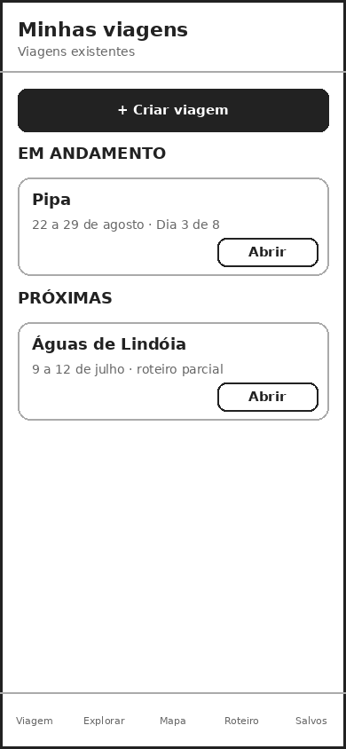


### Hierarquia

1. identificação do produto;
2. título da área;
3. ação Criar Viagem;
4. Viagem em andamento;
5. próximas Viagens;
6. Viagens concluídas.

### Ação principal

Criar Viagem.

---

## 11. RB-WF-MOB-002 — Minhas Viagens vazia

### Superfície relacionada

`RB-STA-001 — Nenhuma Viagem`

### Estado

Primeiro acesso ou ausência de Viagens.

### Wireframe textual

```text
┌────────────────────────────────┐
│ RouteBook                 Perfil│
├────────────────────────────────┤
│                                │
│        [ Ilustração ]          │
│                                │
│ Você ainda não criou           │
│ nenhuma viagem                 │
│                                │
│ Comece informando destino,     │
│ datas e hospedagem.            │
│                                │
│ [ Criar primeira viagem ]      │
│                                │
│ Como funciona                  │
│ 1. Crie a viagem               │
│ 2. Descubra lugares            │
│ 3. Monte o roteiro             │
└────────────────────────────────┘
```

### Wireframe visual


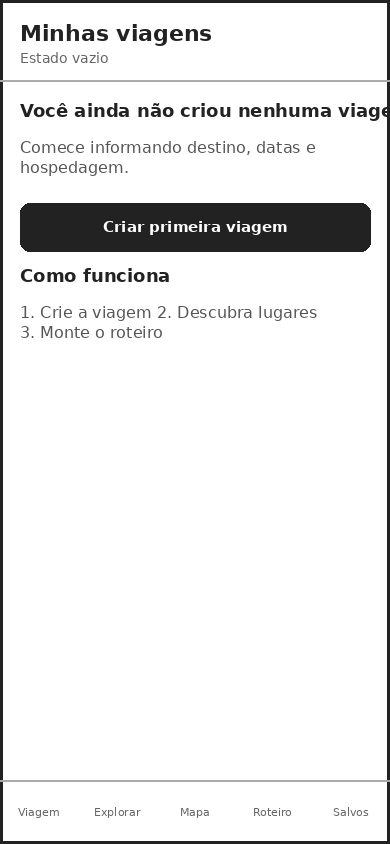


### Regra

O estado vazio deverá orientar o primeiro uso e não deverá parecer falha.

---

## 12. RB-WF-DESK-001 — Minhas Viagens

### Superfície relacionada

`RB-SCR-001 — Minhas Viagens`

### Wireframe textual

```text
┌──────────────────────────────────────────────────────────────────┐
│ RouteBook                     Minhas viagens       Perfil         │
├──────────────────────────────────────────────────────────────────┤
│ Minhas viagens                              [ + Criar viagem ]   │
│                                                                  │
│ Em andamento                                                     │
│ ┌──────────────────────────────────────────────────────────────┐ │
│ │ Pipa · 22 a 29 de agosto                                   │ │
│ │ Dia 3 de 8 · Próxima atividade: Praia do Amor              │ │
│ │ Roteiro: 12 atividades · 1 alerta                [ Abrir ]  │ │
│ └──────────────────────────────────────────────────────────────┘ │
│                                                                  │
│ Próximas                                                         │
│ ┌────────────────────────────┐ ┌────────────────────────────┐   │
│ │ Águas de Lindóia           │ │ Nova viagem                │   │
│ │ 9 a 12 de julho            │ │ Destino                    │   │
│ │ 4 dias                     │ │ A definir                  │   │
│ │ [ Abrir ]                  │ │ [ Continuar ]              │   │
│ └────────────────────────────┘ └────────────────────────────┘   │
└──────────────────────────────────────────────────────────────────┘
```

### Wireframe visual


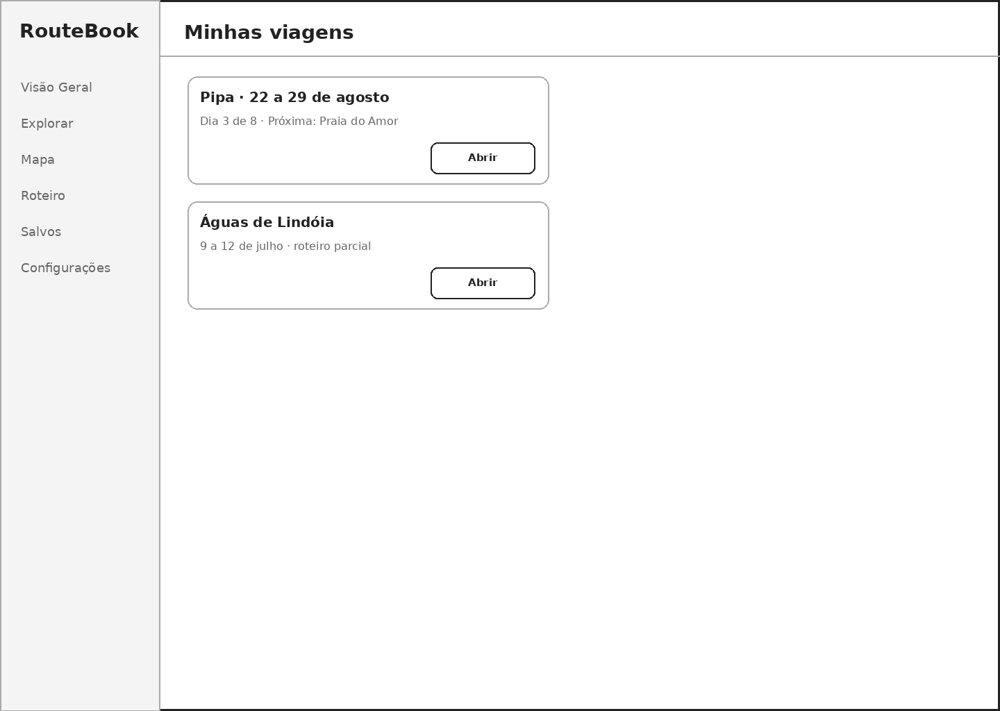


---

# Parte III — Criar Viagem

## 13. RB-WF-MOB-003 — Criar Viagem: Destino

### Superfície relacionada

`RB-FRM-001-A — Etapa Destino`

### Wireframe textual

```text
┌────────────────────────────────┐
│ ‹ Voltar       Criar viagem    │
├────────────────────────────────┤
│ Etapa 1 de 4                   │
│ ●────○────○────○               │
│                                │
│ Para onde você vai?            │
│                                │
│ [ Pesquise cidade ou destino ] │
│                                │
│ Resultados                     │
│ ○ Pipa                         │
│   Tibau do Sul, RN, Brasil     │
│                                │
│ ○ Natal                        │
│   Rio Grande do Norte, Brasil  │
│                                │
│ [ Continuar ]                  │
└────────────────────────────────┘
```

### Wireframe visual


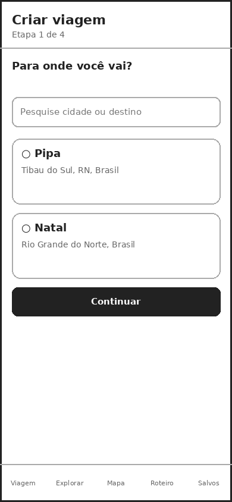


### Regra

Continuar deverá permanecer indisponível até a seleção de um Destino válido.

---

## 14. RB-WF-MOB-004 — Criar Viagem: Datas

### Superfície relacionada

`RB-FRM-001-B — Etapa Datas`

### Wireframe textual

```text
┌────────────────────────────────┐
│ ‹ Voltar       Criar viagem    │
├────────────────────────────────┤
│ Etapa 2 de 4                   │
│ ●────●────○────○               │
│                                │
│ Quando será a viagem?          │
│                                │
│ Data de início                 │
│ [ 22/08/2026                 ] │
│                                │
│ Data de término                │
│ [ 29/08/2026                 ] │
│                                │
│ Duração                        │
│ 8 dias                         │
│                                │
│ [ Continuar ]                  │
└────────────────────────────────┘
```

### Wireframe visual


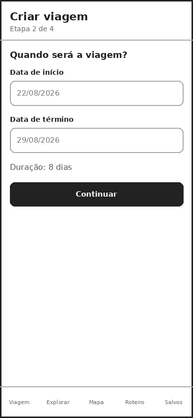


### Estado de erro

```text
│ Data de término                │
│ [ 20/08/2026                 ] │
│ ⚠ A data final deve ser igual  │
│   ou posterior à data inicial. │
```

---

## 15. RB-WF-MOB-005 — Criar Viagem: Hospedagem

### Superfície relacionada

`RB-FRM-001-C — Etapa Hospedagem`

### Wireframe textual

```text
┌────────────────────────────────┐
│ ‹ Voltar       Criar viagem    │
├────────────────────────────────┤
│ Etapa 3 de 4                   │
│ ●────●────●────○               │
│                                │
│ Onde você ficará hospedado?    │
│                                │
│ [ Pesquise hotel ou endereço ] │
│                                │
│ ○ Condomínio Solar Água        │
│   Rua das Gameleiras, Pipa     │
│                                │
│ ○ Pousada Exemplo              │
│   Avenida Baía dos Golfinhos   │
│                                │
│ Ainda não defini               │
│ [ Usar referência provisória ] │
│                                │
│ [ Continuar ]                  │
└────────────────────────────────┘
```

### Wireframe visual


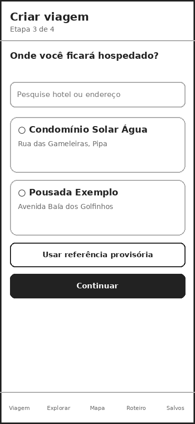


---

## 16. RB-WF-MOB-006 — Criar Viagem: Viajantes e revisão

### Superfícies relacionadas

* `RB-FRM-001-D — Etapa Viajantes`;
* `RB-FRM-001-E — Revisão da criação`.

### Wireframe textual

```text
┌────────────────────────────────┐
│ ‹ Voltar       Criar viagem    │
├────────────────────────────────┤
│ Etapa 4 de 4                   │
│ ●────●────●────●               │
│                                │
│ Quem vai viajar?               │
│                                │
│ Viajantes                      │
│ [ − ]          3          [ + ]│
│                                │
│ Resumo                         │
│ Destino: Pipa                  │
│ Período: 22 a 29 de agosto     │
│ Hospedagem: Solar Água         │
│ Viajantes: 3                   │
│                                │
│ [ Criar viagem ]               │
└────────────────────────────────┘
```

### Wireframe visual


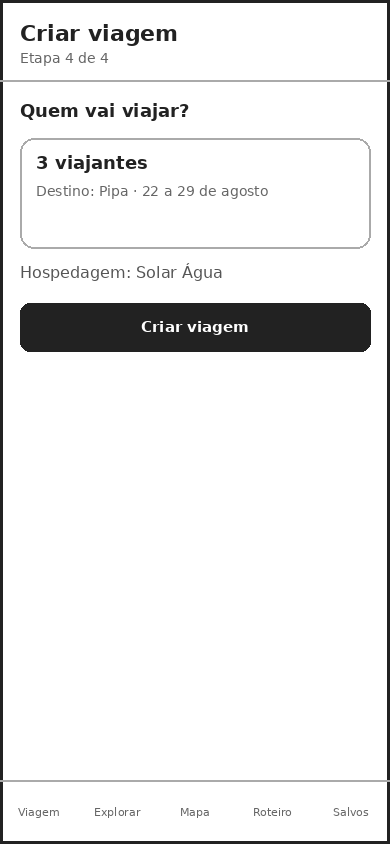


---

## 17. RB-WF-DESK-002 — Criar Viagem

### Superfície relacionada

`RB-FRM-001 — Criar Viagem`

### Wireframe textual

```text
┌──────────────────────────────────────────────────────────────────┐
│ RouteBook                                  Criar viagem          │
├──────────────────────────────────────────────────────────────────┤
│ Etapas               │ Para onde você vai?                       │
│                      │                                           │
│ ● Destino            │ [ Pesquise cidade ou destino__________ ] │
│ ○ Datas              │                                           │
│ ○ Hospedagem         │ Resultados                                │
│ ○ Viajantes          │                                           │
│                      │ ○ Pipa                                    │
│                      │   Tibau do Sul, RN, Brasil                 │
│                      │                                           │
│                      │ ○ Natal                                   │
│                      │   Rio Grande do Norte, Brasil              │
│                      │                                           │
│                      │                 [ Cancelar ] [ Continuar ] │
└──────────────────────┴───────────────────────────────────────────┘
```

### Wireframe visual


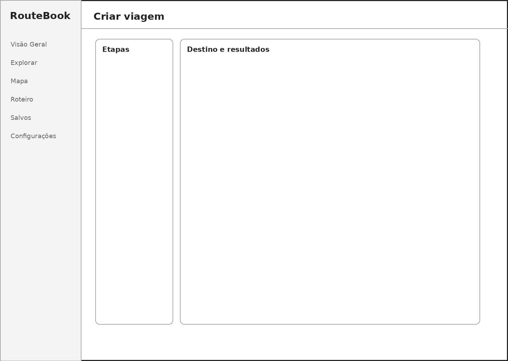


---

# Parte IV — Visão Geral

## 18. RB-WF-MOB-007 — Visão Geral da Viagem

### Superfície relacionada

`RB-SCR-002 — Visão Geral da Viagem`

### Wireframe textual

```text
┌────────────────────────────────┐
│ Pipa                     ⚙  ⋮   │
│ 22 a 29 de agosto · 3 pessoas  │
├────────────────────────────────┤
│ Próximo passo                  │
│ ┌────────────────────────────┐ │
│ │ Explore lugares para       │ │
│ │ completar seu roteiro.     │ │
│ │ [ Explorar agora ]         │ │
│ └────────────────────────────┘ │
│                                │
│ Seu roteiro                    │
│ 8 dias · 3 planejados          │
│ 12 atividades · 1 alerta       │
│ [ Ver roteiro ]                │
│                                │
│ Lugares salvos                 │
│ ┌────────────────────────────┐ │
│ │ Praia do Amor         ♥    │ │
│ │ 1,8 km · Praia             │ │
│ └────────────────────────────┘ │
│ ┌────────────────────────────┐ │
│ │ Chapadão              ♥    │ │
│ │ 2,1 km · Atração           │ │
│ └────────────────────────────┘ │
│ [ Ver todos os salvos ]        │
│                                │
│ Contexto                       │
│ Solar Água · Carro             │
│ Ritmo equilibrado              │
├────────────────────────────────┤
│ Viagem Explorar Mapa Roteiro   │
│                  Salvos        │
└────────────────────────────────┘
```

### Wireframe visual


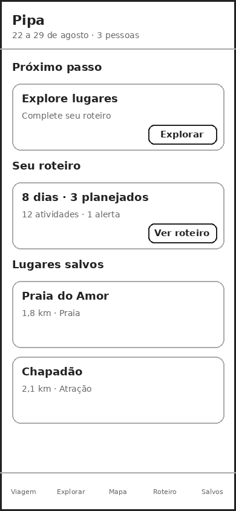


---

## 19. RB-WF-MOB-008 — Visão Geral durante a Viagem

### Superfície relacionada

`RB-SCR-002 — Visão Geral da Viagem`

### Estado

Viagem em andamento.

### Wireframe textual

```text
┌────────────────────────────────┐
│ Pipa                     ⚙  ⋮   │
│ Hoje · 24 de agosto            │
├────────────────────────────────┤
│ Próxima atividade              │
│ ┌────────────────────────────┐ │
│ │ 10:00                      │ │
│ │ Praia do Amor              │ │
│ │ 1,8 km · 7 min de carro    │ │
│ │                            │ │
│ │ [ Abrir rota ] [ Detalhes ]│ │
│ └────────────────────────────┘ │
│                                │
│ Depois                         │
│ 13:30 · Restaurante Exemplo    │
│                                │
│ ⚠ Saída recomendada às 09:45  │
│                                │
│ [ Ver dia completo ]           │
├────────────────────────────────┤
│ Viagem Explorar Mapa Roteiro   │
│                  Salvos        │
└────────────────────────────────┘
```

### Wireframe visual


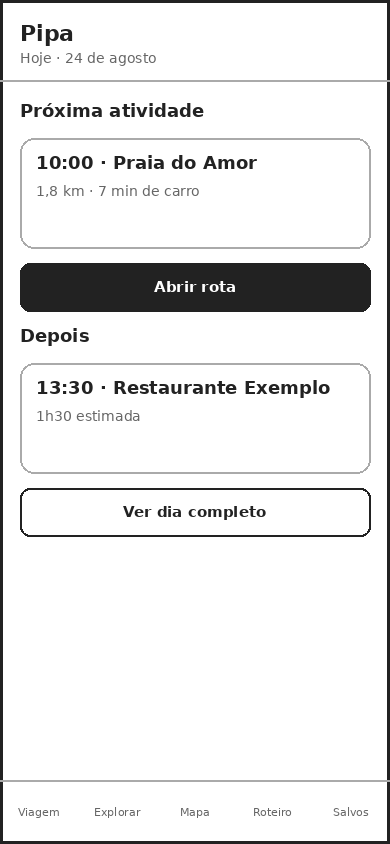


---

## 20. RB-WF-DESK-003 — Visão Geral

### Superfície relacionada

`RB-SCR-002 — Visão Geral da Viagem`

### Wireframe textual

```text
┌──────────────────┬────────────────────────────────────────────────────┐
│ RouteBook        │ Pipa                              Configurações    │
│                  │ 22 a 29 de agosto · 3 pessoas                     │
│ Visão Geral      ├────────────────────────────────────────────────────┤
│ Explorar         │ Próximo passo              Seu roteiro             │
│ Mapa             │ ┌────────────────────────┐ ┌─────────────────────┐│
│ Roteiro          │ │ Explore lugares para   │ │ 8 dias             ││
│ Salvos           │ │ completar o roteiro.   │ │ 3 planejados       ││
│                  │ │ [ Explorar agora ]     │ │ 1 alerta           ││
│ Configurações    │ └────────────────────────┘ │ [ Ver roteiro ]     ││
│                  │                            └─────────────────────┘│
│                  │                                                    │
│                  │ Lugares salvos                                     │
│                  │ ┌────────────────┐ ┌────────────────┐             │
│                  │ │ Praia do Amor  │ │ Chapadão       │             │
│                  │ │ 1,8 km         │ │ 2,1 km         │             │
│                  │ └────────────────┘ └────────────────┘             │
│                  │                                                    │
│                  │ Contexto                                           │
│                  │ Solar Água · Carro · Ritmo equilibrado             │
└──────────────────┴────────────────────────────────────────────────────┘
```

### Wireframe visual


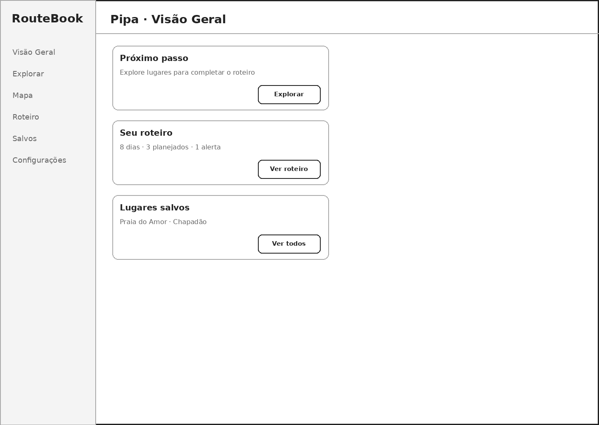


---

# Parte V — Explorar

## 21. RB-WF-MOB-009 — Explorar em lista

### Superfície relacionada

`RB-SCR-003 — Explorar`

### Wireframe textual

```text
┌────────────────────────────────┐
│ Explorar                       │
│ Pipa                           │
├────────────────────────────────┤
│ [ Pesquisar lugares_________ ] │
│                                │
│ Praias Restaurantes Bares  ›   │
│                                │
│ [ Filtros 2 ]  [ Relevância ▼ ]│
│                                │
│ 42 lugares                     │
│                                │
│ ┌────────────────────────────┐ │
│ │ [ Fotografia ]             │ │
│ │ Praia do Amor         ♡    │ │
│ │ Praia · 1,8 km             │ │
│ │ Avaliação 4,8 · Gratuito   │ │
│ │ Próxima da hospedagem      │ │
│ │ [ Adicionar ao roteiro ]   │ │
│ └────────────────────────────┘ │
│                                │
│ ┌────────────────────────────┐ │
│ │ [ Fotografia ]             │ │
│ │ Praia do Madeiro      ♥    │ │
│ │ Praia · 7,2 km             │ │
│ │ Avaliação 4,9 · Gratuito   │ │
│ └────────────────────────────┘ │
│                                │
│ [ Ver no mapa ]                │
├────────────────────────────────┤
│ Viagem Explorar Mapa Roteiro   │
│                  Salvos        │
└────────────────────────────────┘
```

### Wireframe visual


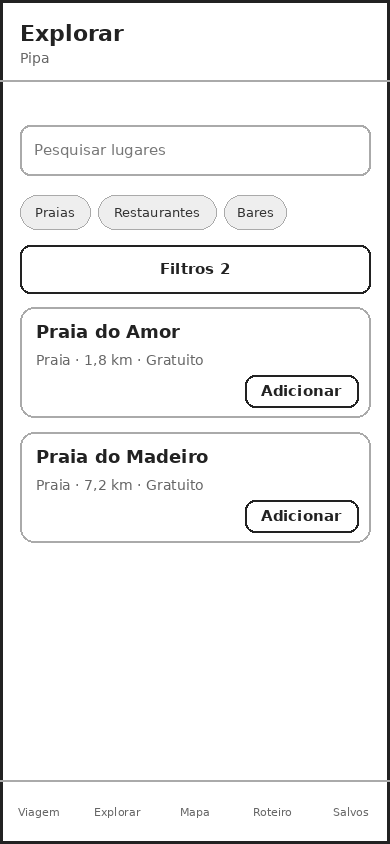


---

## 22. RB-WF-MOB-010 — Filtros de Exploração

### Superfície relacionada

`RB-SHT-002 — Filtros de Exploração`

### Wireframe textual

```text
┌────────────────────────────────┐
│          Filtros          ×    │
├────────────────────────────────┤
│ Categoria                      │
│ ☑ Praias                       │
│ ☐ Restaurantes                 │
│ ☐ Bares                        │
│ ☐ Passeios                     │
│                                │
│ Distância da hospedagem        │
│ ○ Até 2 km                     │
│ ● Até 5 km                     │
│ ○ Até 10 km                    │
│ ○ Qualquer distância           │
│                                │
│ Faixa de preço                 │
│ ☑ Gratuito                     │
│ ☑ Econômico                    │
│ ☐ Moderado                     │
│ ☐ Elevado                      │
│                                │
│ [ Limpar tudo ] [ Aplicar 18 ] │
└────────────────────────────────┘
```

### Wireframe visual


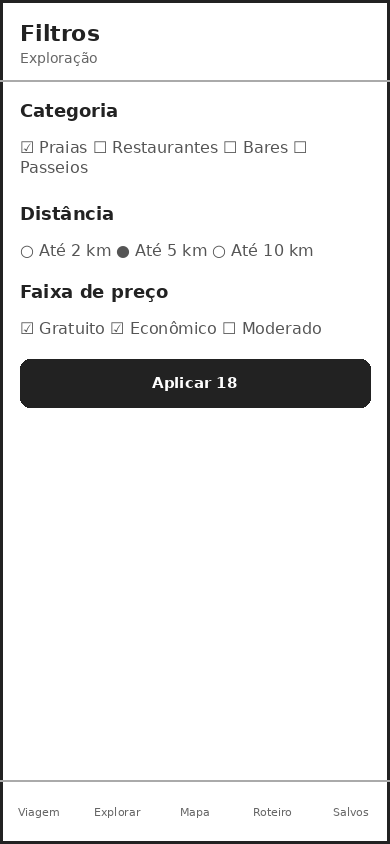


---

## 23. RB-WF-MOB-011 — Explorar sem resultados

### Superfície relacionada

`RB-STA-005 — Nenhum resultado em Explorar`

### Wireframe textual

```text
┌────────────────────────────────┐
│ Explorar                       │
├────────────────────────────────┤
│ [ Pesquisar lugares_________ ] │
│ [ Praias ] [ Até 2 km ]        │
│                                │
│       Nenhum lugar encontrado  │
│                                │
│ Não encontramos opções com     │
│ esses filtros.                 │
│                                │
│ [ Ampliar distância ]          │
│ [ Limpar filtros ]             │
│                                │
│ [ Ver outra região no mapa ]   │
├────────────────────────────────┤
│ Viagem Explorar Mapa Roteiro   │
│                  Salvos        │
└────────────────────────────────┘
```

### Wireframe visual


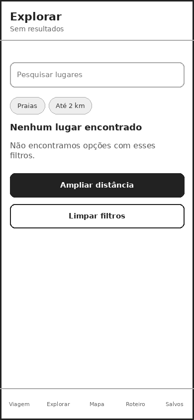


---

## 24. RB-WF-DESK-004 — Explorar com lista e Mapa

### Superfície relacionada

`RB-SCR-003 — Explorar`

### Wireframe textual

```text
┌──────────────────┬────────────────────────────────────────────────────┐
│ RouteBook        │ Explorar · Pipa                                    │
│ Visão Geral      ├────────────────────────────────────────────────────┤
│ Explorar         │ [ Pesquisar lugares____________________________ ] │
│ Mapa             │ Praias Restaurantes Bares Passeios                │
│ Roteiro          │ [ Filtros 2 ] [ Relevância ▼ ]                    │
│ Salvos           ├─────────────────────────┬──────────────────────────┤
│                  │ 42 lugares              │ MAPA                     │
│ Configurações    │                         │                          │
│                  │ ┌─────────────────────┐ │       ○  ○               │
│                  │ │ Praia do Amor   ♡  │ │   ⌂      ○               │
│                  │ │ Praia · 1,8 km     │ │          ○               │
│                  │ │ Gratuito           │ │                          │
│                  │ │ [ Ver detalhes ]   │ │                          │
│                  │ └─────────────────────┘ │                          │
│                  │                         │                          │
│                  │ ┌─────────────────────┐ │                          │
│                  │ │ Praia do Madeiro ♥ │ │                          │
│                  │ │ Praia · 7,2 km     │ │                          │
│                  │ └─────────────────────┘ │                          │
└──────────────────┴─────────────────────────┴──────────────────────────┘
```

### Wireframe visual


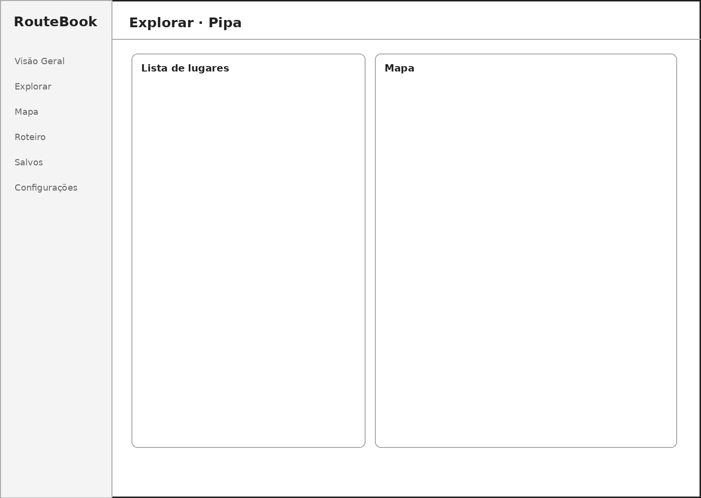


---

# Parte VI — Detalhes do Lugar

## 25. RB-WF-MOB-012 — Detalhes do Lugar

### Superfície relacionada

`RB-SCR-004 — Detalhes do Lugar`

### Wireframe textual

```text
┌────────────────────────────────┐
│ ‹ Voltar                  ♡  ⋮  │
├────────────────────────────────┤
│ [       Fotografia           ] │
│ [ Foto 1 ] [ Foto 2 ] [ +4 ]  │
│                                │
│ Praia do Amor                  │
│ Praia · Avaliação 4,8          │
│                                │
│ 1,8 km da hospedagem           │
│ 7 min de carro                 │
│                                │
│ Gratuito                       │
│ Melhor período: manhã          │
│                                │
│ Por que combina com a viagem   │
│ Próxima da hospedagem e        │
│ compatível com seu interesse   │
│ por praias.                    │
│                                │
│ Sobre                          │
│ Descrição resumida do local... │
│                                │
│ Localização                    │
│ Rua ou região                  │
│ [ Ver no mapa ]                │
│                                │
│ Dados atualizados em ...       │
├────────────────────────────────┤
│ [ Salvar ] [ Adicionar roteiro]│
└────────────────────────────────┘
```

### Wireframe visual


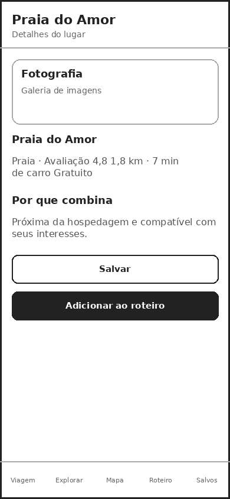


---

## 26. RB-WF-MOB-013 — Selecionar Dia

### Superfície relacionada

`RB-SHT-001 — Selecionar Dia`

### Wireframe textual

```text
┌────────────────────────────────┐
│ Adicionar ao roteiro      ×    │
├────────────────────────────────┤
│ Praia do Amor                  │
│                                │
│ Selecione o dia                │
│                                │
│ ○ Sáb, 22 ago                  │
│   1 atividade                  │
│                                │
│ ● Dom, 23 ago       Sugerido   │
│   2 atividades · mesma região  │
│                                │
│ ○ Seg, 24 ago                  │
│   Dia livre                    │
│                                │
│ ○ Ter, 25 ago             ⚠    │
│   Dia intenso                  │
│                                │
│ [ Continuar ]                  │
└────────────────────────────────┘
```

### Wireframe visual


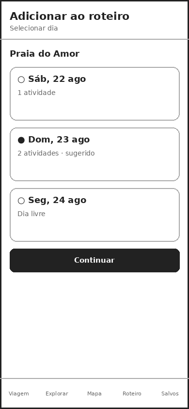


---

## 27. RB-WF-DESK-005 — Detalhes do Lugar em painel

### Superfície relacionada

`RB-SCR-004 — Detalhes do Lugar`

### Wireframe textual

```text
┌──────────────────┬──────────────────────────┬─────────────────────────┐
│ Navegação        │ Explorar                 │ Detalhes                │
│                  │                          │                         │
│                  │ Lista de lugares         │ [ Fotografia ]          │
│                  │                          │                         │
│                  │ Praia do Amor            │ Praia do Amor      ♡   │
│                  │ Praia do Madeiro         │ Praia · 4,8             │
│                  │ Chapadão                 │                         │
│                  │                          │ 1,8 km · 7 min           │
│                  │                          │ Gratuito                 │
│                  │                          │                         │
│                  │                          │ Justificativa            │
│                  │                          │ Próxima da hospedagem... │
│                  │                          │                         │
│                  │                          │ [ Ver no mapa ]          │
│                  │                          │ [ Salvar ]               │
│                  │                          │ [ Adicionar ao roteiro ] │
└──────────────────┴──────────────────────────┴─────────────────────────┘
```

### Wireframe visual


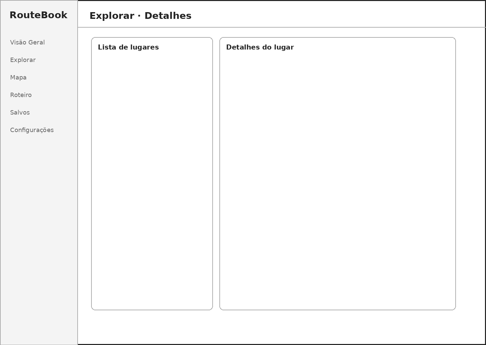


---

# Parte VII — Mapa

## 28. RB-WF-MOB-014 — Mapa da Viagem

### Superfície relacionada

`RB-SCR-005 — Mapa da Viagem`

### Wireframe textual

```text
┌────────────────────────────────┐
│ Mapa                    Filtros │
│ [ Todos ▼ ]                    │
├────────────────────────────────┤
│                                │
│             ○                  │
│                                │
│      ♥           ○             │
│             ⌂                  │
│                                │
│                      ●         │
│                                │
│                                │
│ ┌────────────────────────────┐ │
│ │ Praia do Amor             │ │
│ │ Praia · 1,8 km            │ │
│ │ Gratuito                  │ │
│ │ [ Detalhes ] [ Salvar ]   │ │
│ └────────────────────────────┘ │
├────────────────────────────────┤
│ Viagem Explorar Mapa Roteiro   │
│                  Salvos        │
└────────────────────────────────┘
```

### Wireframe visual


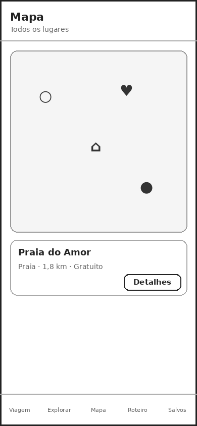


### Representações

* `⌂`: Hospedagem;
* `○`: Lugar;
* `♥`: Lugar salvo;
* `●`: Lugar selecionado.

A diferenciação não deverá depender apenas de cor.

---

## 29. RB-WF-MOB-015 — Mapa indisponível

### Superfície relacionada

`RB-STA-008 — Mapa indisponível`

### Wireframe textual

```text
┌────────────────────────────────┐
│ Mapa                           │
├────────────────────────────────┤
│                                │
│ O mapa está indisponível       │
│ neste momento.                 │
│                                │
│ Você ainda pode consultar os   │
│ lugares em lista.              │
│                                │
│ [ Tentar novamente ]           │
│ [ Ver lista de lugares ]       │
│                                │
│ Lugares próximos               │
│ Praia do Amor · 1,8 km         │
│ Chapadão · 2,1 km              │
├────────────────────────────────┤
│ Viagem Explorar Mapa Roteiro   │
│                  Salvos        │
└────────────────────────────────┘
```

### Wireframe visual


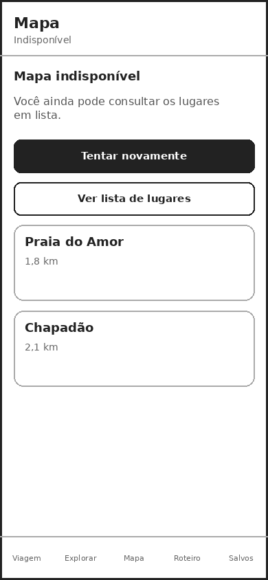


---

## 30. RB-WF-DESK-006 — Mapa da Viagem

### Superfície relacionada

`RB-SCR-005 — Mapa da Viagem`

### Wireframe textual

```text
┌──────────────────┬────────────────────────────────────────────────────┐
│ RouteBook        │ Mapa da Viagem                    [ Todos ▼ ]     │
│ Visão Geral      ├───────────────────────────────────────┬────────────┤
│ Explorar         │                                       │ Lugares    │
│ Mapa             │                 ○                     │            │
│ Roteiro          │                                       │ Praia do   │
│ Salvos           │       ♥             ○                 │ Amor       │
│                  │               ⌂                       │ 1,8 km     │
│ Configurações    │                         ●             │ Gratuito   │
│                  │                                       │            │
│                  │                                       │ [Detalhes] │
│                  │                                       │ [Salvar]   │
│                  │                                       │ [Adicionar]│
└──────────────────┴───────────────────────────────────────┴────────────┘
```

### Wireframe visual


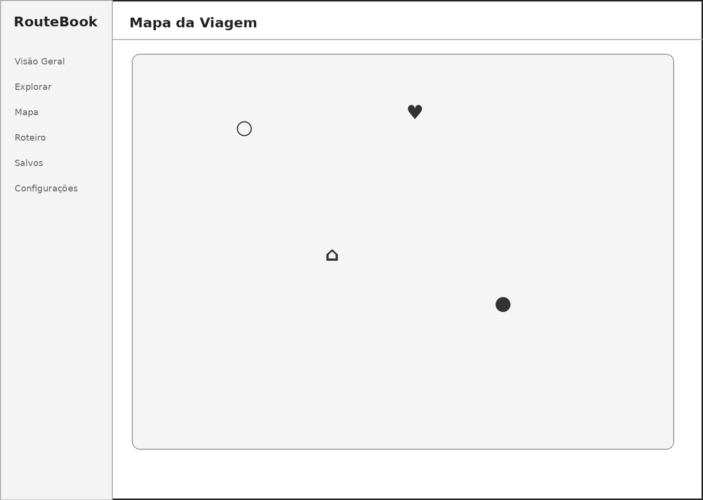


---

# Parte VIII — Salvos

## 31. RB-WF-MOB-016 — Salvos

### Superfície relacionada

`RB-SCR-006 — Salvos`

### Wireframe textual

```text
┌────────────────────────────────┐
│ Salvos                         │
├────────────────────────────────┤
│ 8 lugares                      │
│ [ Categoria ▼ ] [ Não planejado]│
│                                │
│ ┌────────────────────────────┐ │
│ │ Praia do Amor         ♥    │ │
│ │ Praia · 1,8 km             │ │
│ │ Não planejado              │ │
│ │ [ Adicionar ao roteiro ]   │ │
│ └────────────────────────────┘ │
│                                │
│ ┌────────────────────────────┐ │
│ │ Chapadão              ♥ ✓  │ │
│ │ Atração · 2,1 km           │ │
│ │ Planejado para 24 ago      │ │
│ │ [ Ver no roteiro ]         │ │
│ └────────────────────────────┘ │
│                                │
│ [ Ver todos no mapa ]          │
├────────────────────────────────┤
│ Viagem Explorar Mapa Roteiro   │
│                  Salvos        │
└────────────────────────────────┘
```

### Wireframe visual


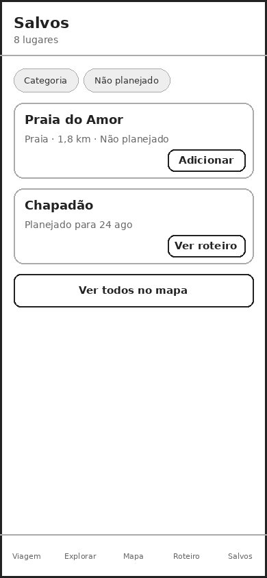


---

## 32. RB-WF-MOB-017 — Salvos vazio

### Superfície relacionada

`RB-STA-010 — Nenhum Lugar salvo`

### Wireframe textual

```text
┌────────────────────────────────┐
│ Salvos                         │
├────────────────────────────────┤
│                                │
│        Nenhum lugar salvo      │
│                                │
│ Salve praias, restaurantes e   │
│ passeios para avaliar depois.  │
│                                │
│ [ Explorar lugares ]           │
│                                │
│ Sugestões                      │
│ [ Praias ] [ Restaurantes ]    │
│ [ Passeios ]                   │
├────────────────────────────────┤
│ Viagem Explorar Mapa Roteiro   │
│                  Salvos        │
└────────────────────────────────┘
```

### Wireframe visual


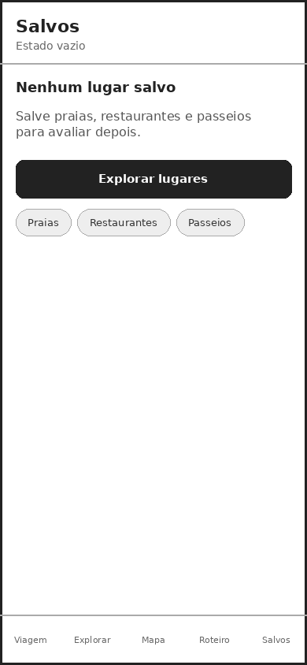


---

## 33. RB-WF-DESK-007 — Salvos com Mapa

### Superfície relacionada

`RB-SCR-006 — Salvos`

### Wireframe textual

```text
┌──────────────────┬─────────────────────────┬──────────────────────────┐
│ Navegação        │ Salvos · 8 lugares      │ MAPA                     │
│                  │                         │                          │
│                  │ [ Categoria ▼ ]         │      ♥                   │
│                  │ [ Não planejados ]      │             ♥            │
│                  │                         │   ⌂          ✓            │
│                  │ Praia do Amor           │                          │
│                  │ 1,8 km                  │                          │
│                  │ [ Adicionar ]           │                          │
│                  │                         │                          │
│                  │ Chapadão                │                          │
│                  │ Planejado · 24 ago      │                          │
│                  │ [ Ver roteiro ]         │                          │
└──────────────────┴─────────────────────────┴──────────────────────────┘
```

### Wireframe visual


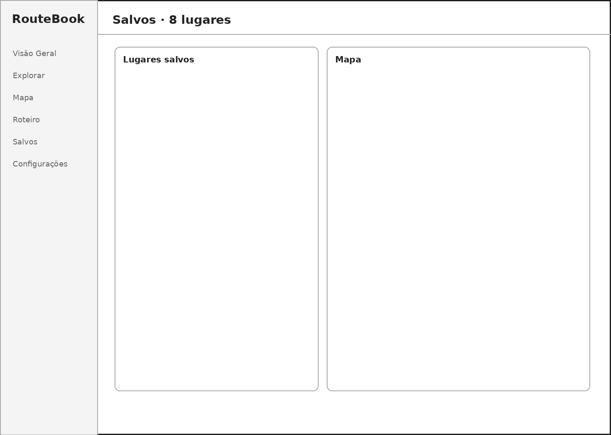


---

# Parte IX — Roteiro

## 34. RB-WF-MOB-018 — Roteiro

### Superfície relacionada

`RB-SCR-007 — Roteiro`

### Wireframe textual

```text
┌────────────────────────────────┐
│ Roteiro               Revisar  │
├────────────────────────────────┤
│ ‹  22  23  [24]  25  26  ›    │
│                 Hoje           │
│                                │
│ Segunda, 24 de agosto          │
│ 3 atividades · 1 alerta        │
│                                │
│ ┌────────────────────────────┐ │
│ │ 09:00                      │ │
│ │ Café da manhã             ⋮│ │
│ │ 1h                         │ │
│ └────────────────────────────┘ │
│       1,2 km · 5 min de carro  │
│ ┌────────────────────────────┐ │
│ │ 10:30                 ⚠    │ │
│ │ Praia do Amor            ⋮ │ │
│ │ 3h                         │ │
│ └────────────────────────────┘ │
│       2,4 km · 8 min de carro  │
│ ┌────────────────────────────┐ │
│ │ 14:30                      │ │
│ │ Restaurante Exemplo      ⋮ │ │
│ │ 1h30                       │ │
│ └────────────────────────────┘ │
│                                │
│ [ + Adicionar atividade ]      │
│ [ + Período livre ]            │
├────────────────────────────────┤
│ Viagem Explorar Mapa Roteiro   │
│                  Salvos        │
└────────────────────────────────┘
```

### Wireframe visual


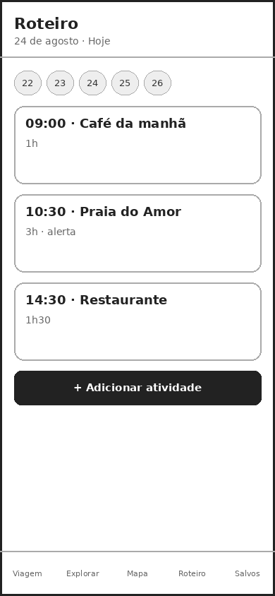


---

## 35. RB-WF-MOB-019 — Roteiro vazio

### Superfície relacionada

`RB-STA-012 — Dia vazio`

### Wireframe textual

```text
┌────────────────────────────────┐
│ Roteiro                        │
├────────────────────────────────┤
│ ‹  22  [23]  24  25  26  ›    │
│                                │
│ Domingo, 23 de agosto          │
│                                │
│      Este dia está livre       │
│                                │
│ Você pode planejar uma         │
│ atividade ou manter o dia      │
│ sem compromissos.              │
│                                │
│ [ Explorar lugares ]           │
│ [ Adicionar dos Salvos ]       │
│ [ Criar atividade ]            │
│ [ Manter dia livre ]           │
├────────────────────────────────┤
│ Viagem Explorar Mapa Roteiro   │
│                  Salvos        │
└────────────────────────────────┘
```

### Wireframe visual


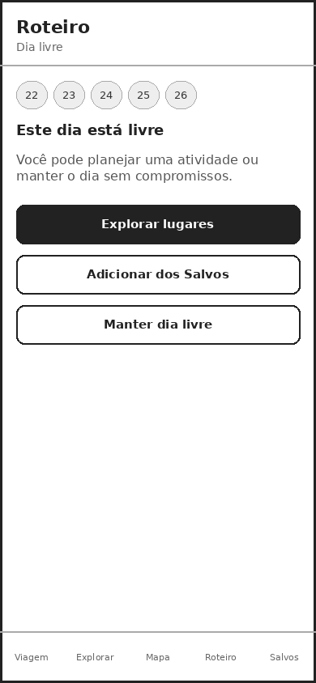


---

## 36. RB-WF-MOB-020 — Detalhes da Atividade

### Superfície relacionada

`RB-PNL-002 — Detalhes da Atividade`

### Wireframe textual

```text
┌────────────────────────────────┐
│ ‹ Voltar       Atividade   ⋮   │
├────────────────────────────────┤
│ Praia do Amor                  │
│ Segunda, 24 de agosto          │
│                                │
│ Horário                        │
│ 10:30                          │
│                                │
│ Duração                        │
│ 3 horas                        │
│                                │
│ Localização                    │
│ 1,8 km da hospedagem           │
│                                │
│ Deslocamento anterior          │
│ 1,2 km · 5 min de carro        │
│                                │
│ ⚠ Intervalo curto para chegar  │
│                                │
│ [ Abrir detalhes do lugar ]    │
│ [ Abrir rota ]                 │
│                                │
│ [ Editar atividade ]           │
└────────────────────────────────┘
```

### Wireframe visual


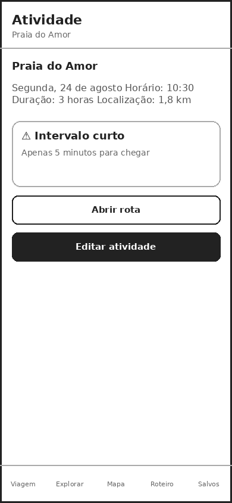


---

## 37. RB-WF-MOB-021 — Editar Atividade

### Superfície relacionada

`RB-FRM-002 — Editar Atividade`

### Wireframe textual

```text
┌────────────────────────────────┐
│ × Cancelar      Editar         │
├────────────────────────────────┤
│ Praia do Amor                  │
│                                │
│ Dia                            │
│ [ 24 de agosto             ▼ ] │
│                                │
│ Horário                        │
│ [ 10:30                      ] │
│                                │
│ Duração                        │
│ [ 3 horas                   ▼ ]│
│                                │
│ Observações                    │
│ [____________________________] │
│ [____________________________] │
│                                │
│ ⚠ O intervalo anterior ficará │
│   com apenas 5 minutos.        │
│                                │
│ [ Salvar alterações ]          │
└────────────────────────────────┘
```

### Wireframe visual


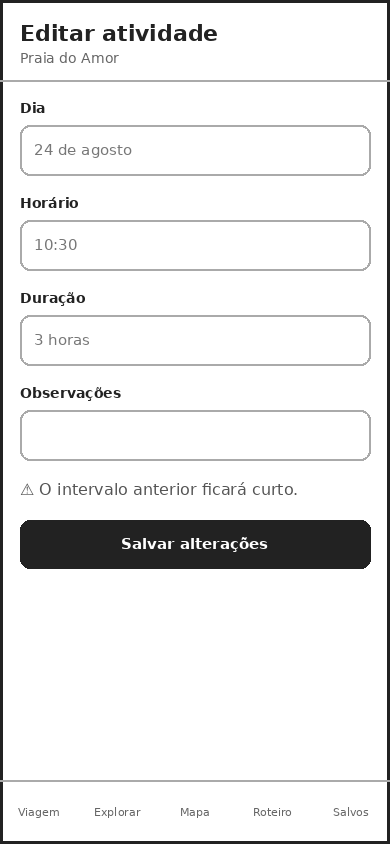


---

## 38. RB-WF-MOB-022 — Reordenar Atividade

### Superfície relacionada

`RB-SHT-007 — Reordenar Atividade`

### Wireframe textual

```text
┌────────────────────────────────┐
│ Mover atividade           ×    │
├────────────────────────────────┤
│ Praia do Amor                  │
│                                │
│ Posição atual: 2               │
│                                │
│ [ Mover para cima ]            │
│ [ Mover para baixo ]           │
│ [ Mover para o início ]        │
│ [ Selecionar posição ]         │
└────────────────────────────────┘
```

### Wireframe visual


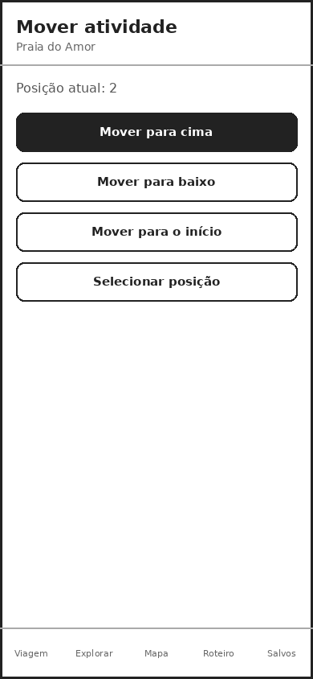


### Regra

Esta superfície deverá existir como alternativa ao gesto de arrastar.

---

## 39. RB-WF-DESK-008 — Roteiro com Mapa do Dia

### Superfície relacionada

`RB-SCR-007 — Roteiro`

### Wireframe textual

```text
┌──────────────────┬──────────────┬────────────────────────┬────────────┐
│ Navegação        │ Dias         │ Segunda, 24 de agosto │ MAPA       │
│                  │              │                        │            │
│                  │ 22 sáb       │ 09:00 Café             │   ○        │
│                  │ 23 dom       │                        │            │
│                  │ 24 seg  ⚠    │ 1,2 km · 5 min         │      ○     │
│                  │ 25 ter       │                        │            │
│                  │ 26 qua       │ 10:30 Praia do Amor ⚠ │            │
│                  │              │                        │  ⌂         │
│                  │              │ 2,4 km · 8 min         │            │
│                  │              │                        │       ○    │
│                  │              │ 14:30 Restaurante      │            │
│                  │              │                        │            │
│                  │              │ [ + Atividade ]        │            │
│                  │              │ [ Revisar roteiro ]    │            │
└──────────────────┴──────────────┴────────────────────────┴────────────┘
```

### Wireframe visual


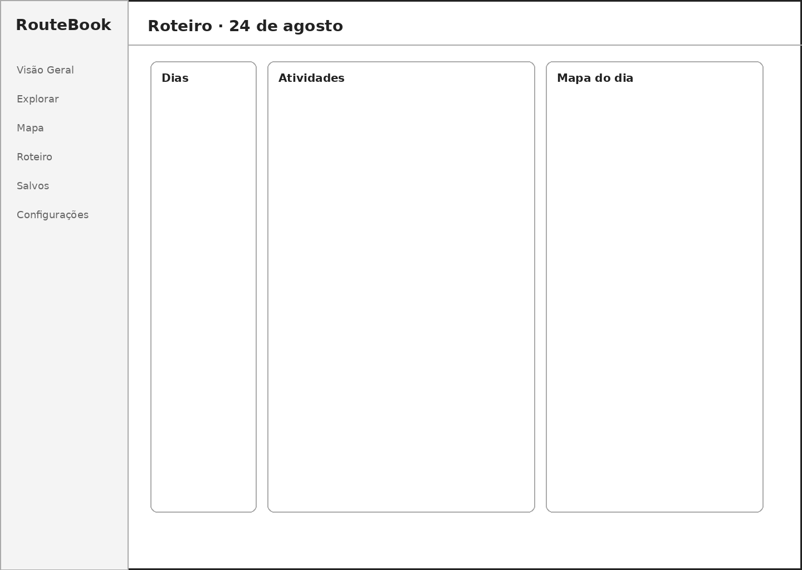


---

# Parte X — Período livre

## 40. RB-WF-MOB-023 — Adicionar Período livre

### Superfície relacionada

`RB-FRM-003 — Adicionar Período livre`

### Wireframe textual

```text
┌────────────────────────────────┐
│ × Cancelar    Período livre    │
├────────────────────────────────┤
│ Dia                            │
│ [ 24 de agosto             ▼ ] │
│                                │
│ Início opcional                │
│ [ 16:00                      ] │
│                                │
│ Duração                        │
│ [ 2 horas                   ▼ ]│
│                                │
│ Observação                     │
│ [ Descanso na hospedagem     ] │
│                                │
│ ☑ Não preencher automaticamente│
│                                │
│ [ Adicionar período livre ]    │
└────────────────────────────────┘
```

### Wireframe visual


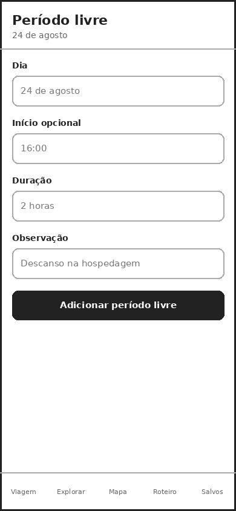


---

# Parte XI — Proposta de Roteiro

## 41. RB-WF-MOB-024 — Gerando proposta

### Superfície relacionada

`RB-STA-013 — Gerando proposta`

### Wireframe textual

```text
┌────────────────────────────────┐
│ Gerar proposta                 │
├────────────────────────────────┤
│                                │
│        Organizando roteiro     │
│                                │
│ ✓ Analisando seus lugares      │
│ ✓ Agrupando por proximidade    │
│ • Verificando horários         │
│ ○ Distribuindo pelos dias      │
│                                │
│ Seu roteiro atual está         │
│ preservado.                    │
│                                │
│ [ Cancelar ]                   │
└────────────────────────────────┘
```

### Wireframe visual


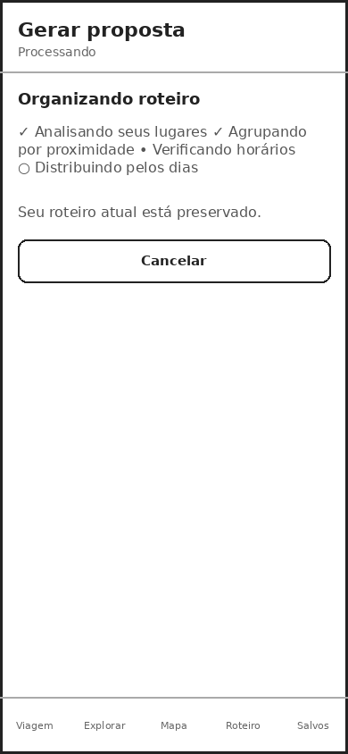


---

## 42. RB-WF-MOB-025 — Proposta de Roteiro

### Superfície relacionada

`RB-SCR-009 — Proposta de Roteiro`

### Wireframe textual

```text
┌────────────────────────────────┐
│ ‹ Voltar      Proposta         │
├────────────────────────────────┤
│ Criada com base em             │
│ proximidade, ritmo e Salvos.   │
│                                │
│ ⚠ 2 horários não confirmados   │
│                                │
│ Dia 1 · 22 de agosto           │
│ ┌────────────────────────────┐ │
│ │ 10:00 Praia do Amor       │ │
│ │ 14:00 Restaurante Exemplo │ │
│ └────────────────────────────┘ │
│                                │
│ Dia 2 · 23 de agosto           │
│ ┌────────────────────────────┐ │
│ │ 09:30 Praia do Madeiro    │ │
│ │ 15:00 Centro de Pipa      │ │
│ └────────────────────────────┘ │
│                                │
│ [ Editar proposta ]            │
│ [ Aceitar proposta ]           │
│ [ Descartar ]                  │
└────────────────────────────────┘
```

### Wireframe visual


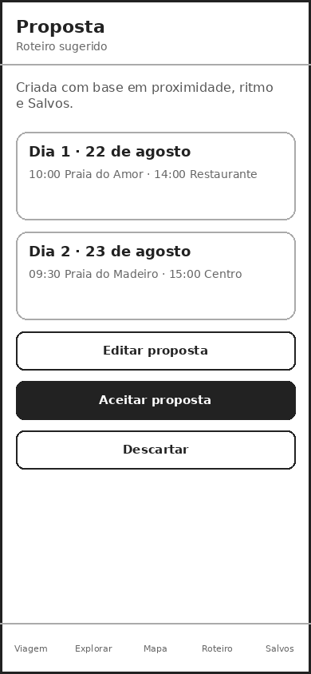


---

## 43. RB-WF-DESK-009 — Proposta de Roteiro

### Superfície relacionada

`RB-SCR-009 — Proposta de Roteiro`

### Wireframe textual

```text
┌──────────────────┬────────────────────────────────────────────────────┐
│ Navegação        │ Proposta de Roteiro                               │
│                  │ Base: proximidade, ritmo e Lugares salvos         │
│                  ├────────────────────────────────────────────────────┤
│                  │ ⚠ 2 horários não confirmados                      │
│                  │                                                    │
│                  │ Dia 1                    Dia 2                      │
│                  │ ┌─────────────────────┐  ┌─────────────────────┐   │
│                  │ │ 10:00 Praia Amor   │  │ 09:30 Madeiro       │   │
│                  │ │ 14:00 Restaurante  │  │ 15:00 Centro        │   │
│                  │ └─────────────────────┘  └─────────────────────┘   │
│                  │                                                    │
│                  │ [ Descartar ] [ Editar ] [ Aceitar proposta ]     │
└──────────────────┴────────────────────────────────────────────────────┘
```

### Wireframe visual


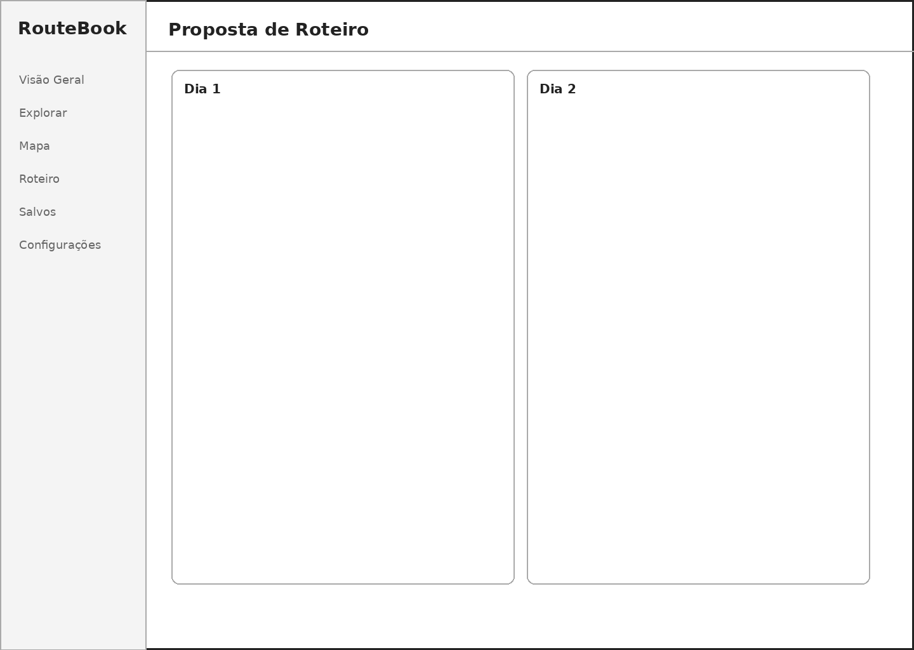


---

# Parte XII — Revisão de Conflitos

## 44. RB-WF-MOB-026 — Revisão de Conflitos

### Superfície relacionada

`RB-SCR-010 — Revisão de Conflitos`

### Wireframe textual

```text
┌────────────────────────────────┐
│ ‹ Roteiro       Revisão        │
├────────────────────────────────┤
│ 3 alertas                      │
│ [ Todos ] [ Erros ] [ Riscos ] │
│                                │
│ ⚠ RISCO                        │
│ Intervalo curto                │
│ 24 ago · Praia do Amor         │
│ Apenas 5 minutos entre as      │
│ atividades.                    │
│ [ Corrigir ] [ Ignorar ]       │
│                                │
│ ⚠ RISCO                        │
│ Dia intenso                    │
│ 25 ago · 6 atividades          │
│ [ Ver dia ]                    │
│                                │
│ ℹ SUGESTÃO                     │
│ Lugares distantes              │
│ 26 ago                         │
│ [ Reorganizar ]                │
└────────────────────────────────┘
```

### Wireframe visual


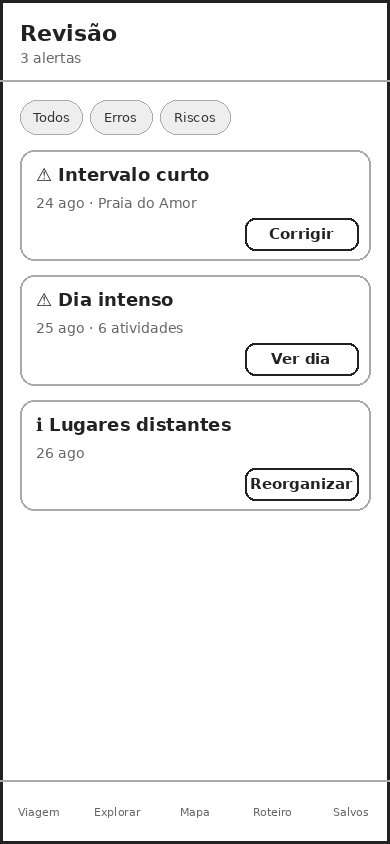


---

## 45. RB-WF-MOB-027 — Nenhum conflito conhecido

### Superfície relacionada

`RB-STA-015 — Nenhum alerta conhecido`

### Wireframe textual

```text
┌────────────────────────────────┐
│ ‹ Roteiro       Revisão        │
├────────────────────────────────┤
│                                │
│              ✓                 │
│                                │
│ Nenhum conflito conhecido      │
│ foi identificado               │
│                                │
│ A análise considera apenas os  │
│ dados disponíveis atualmente.  │
│                                │
│ [ Voltar ao roteiro ]          │
└────────────────────────────────┘
```

### Wireframe visual


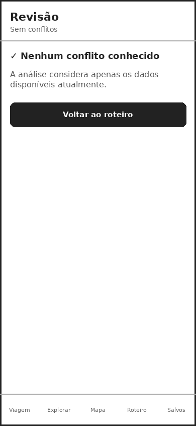


---

## 46. RB-WF-DESK-010 — Revisão de Conflitos

### Superfície relacionada

`RB-SCR-010 — Revisão de Conflitos`

### Wireframe textual

```text
┌──────────────────┬──────────────────────┬─────────────────────────────┐
│ Navegação        │ Alertas              │ Detalhes                    │
│                  │                      │                             │
│                  │ Todos 3              │ Intervalo curto             │
│                  │ Erros 0              │ 24 de agosto                │
│                  │ Riscos 2             │                             │
│                  │ Sugestões 1          │ Apenas 5 minutos entre      │
│                  │                      │ Café da manhã e Praia do    │
│                  │ ⚠ Intervalo curto    │ Amor.                       │
│                  │ ⚠ Dia intenso        │                             │
│                  │ ℹ Lugares distantes  │ [ Editar horário ]          │
│                  │                      │ [ Mover atividade ]         │
│                  │                      │ [ Ignorar risco ]           │
└──────────────────┴──────────────────────┴─────────────────────────────┘
```

### Wireframe visual


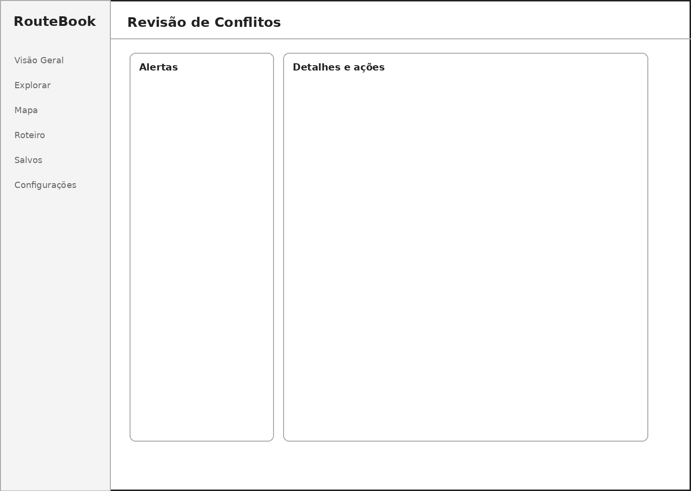


---

# Parte XIII — Configurações da Viagem

## 47. RB-WF-MOB-028 — Configurações

### Superfície relacionada

`RB-SCR-008 — Configurações da Viagem`

### Wireframe textual

```text
┌────────────────────────────────┐
│ ‹ Viagem      Configurações    │
├────────────────────────────────┤
│ Informações gerais             │
│ Pipa · 22 a 29 de agosto     › │
│                                │
│ Hospedagem                     │
│ Condomínio Solar Água        › │
│                                │
│ Viajantes                      │
│ 3 pessoas                    › │
│                                │
│ Interesses                     │
│ Praias, gastronomia          › │
│                                │
│ Orçamento                      │
│ Moderado                     › │
│                                │
│ Transporte                     │
│ Carro                         › │
│                                │
│ Ritmo                          │
│ Equilibrado                  › │
│                                │
│ Restrições                     │
│ Nenhuma informada            › │
│                                │
│ Ações da viagem                │
│ [ Excluir viagem ]             │
└────────────────────────────────┘
```

### Wireframe visual


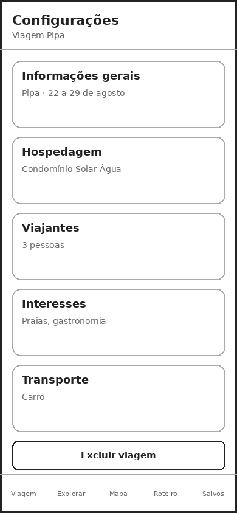


---

## 48. RB-WF-MOB-029 — Alterar Hospedagem

### Superfície relacionada

`RB-FRM-006 — Editar Hospedagem`

### Wireframe textual

```text
┌────────────────────────────────┐
│ × Cancelar    Hospedagem       │
├────────────────────────────────┤
│ Atual                          │
│ Condomínio Solar Água          │
│                                │
│ [ Pesquisar nova hospedagem_ ] │
│                                │
│ Resultados                     │
│ ○ Pousada Exemplo              │
│ ○ Hotel Exemplo                │
│                                │
│ ⚠ Alterar a hospedagem         │
│ recalculará distâncias,        │
│ deslocamentos e recomendações. │
│                                │
│ [ Salvar alteração ]           │
└────────────────────────────────┘
```

### Wireframe visual


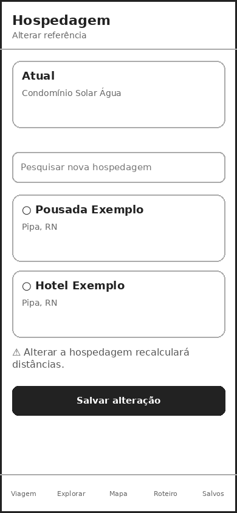


---

## 49. RB-WF-DESK-011 — Configurações

### Superfície relacionada

`RB-SCR-008 — Configurações da Viagem`

### Wireframe textual

```text
┌──────────────────┬──────────────────────┬─────────────────────────────┐
│ Navegação        │ Configurações        │ Informações gerais          │
│                  │                      │                             │
│                  │ Informações gerais   │ Nome                        │
│                  │ Hospedagem           │ [ Pipa__________________ ] │
│                  │ Viajantes            │                             │
│                  │ Interesses           │ Destino                     │
│                  │ Orçamento            │ [ Pipa, RN______________ ] │
│                  │ Transporte           │                             │
│                  │ Ritmo                │ Período                     │
│                  │ Restrições           │ [22/08] a [29/08]          │
│                  │                      │                             │
│                  │ Excluir viagem       │              [ Salvar ]     │
└──────────────────┴──────────────────────┴─────────────────────────────┘
```

### Wireframe visual


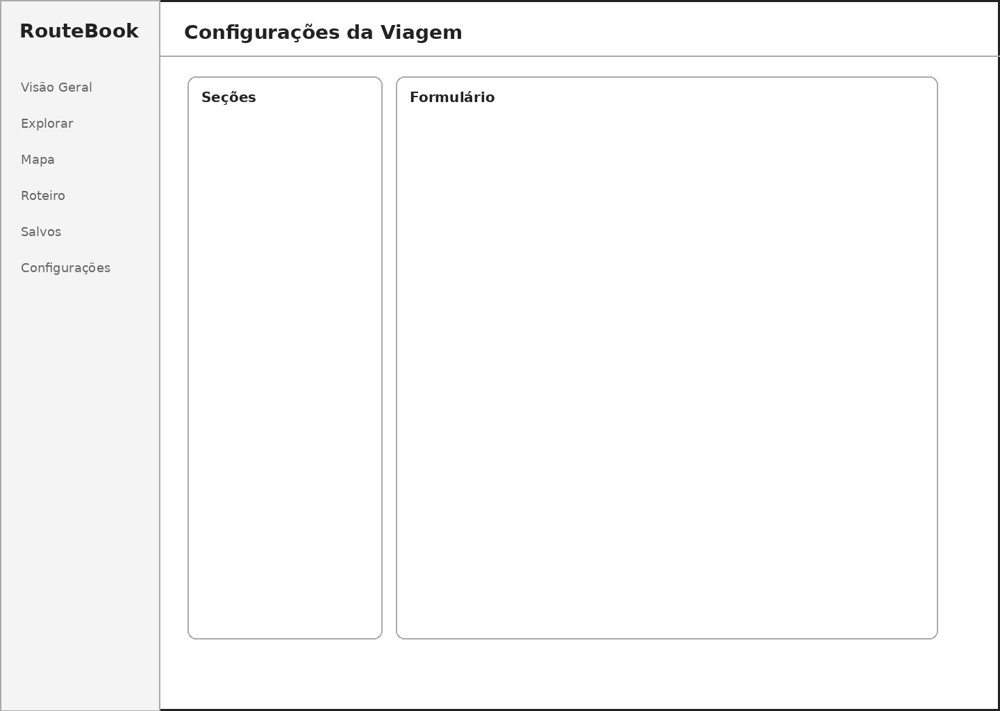


---

# Parte XIV — Estados transversais

## 50. RB-WF-STA-001 — Carregamento de página

### Superfície relacionada

`RB-STA-017 — Carregamento de página`

### Wireframe textual

```text
┌────────────────────────────────┐
│ Título da área                 │
├────────────────────────────────┤
│ [██████████████████████████]   │
│                                │
│ [██████████]                   │
│ [██████████████████]           │
│                                │
│ [████████████████████████]     │
│ [████████████████████████]     │
└────────────────────────────────┘
```

### Wireframe visual


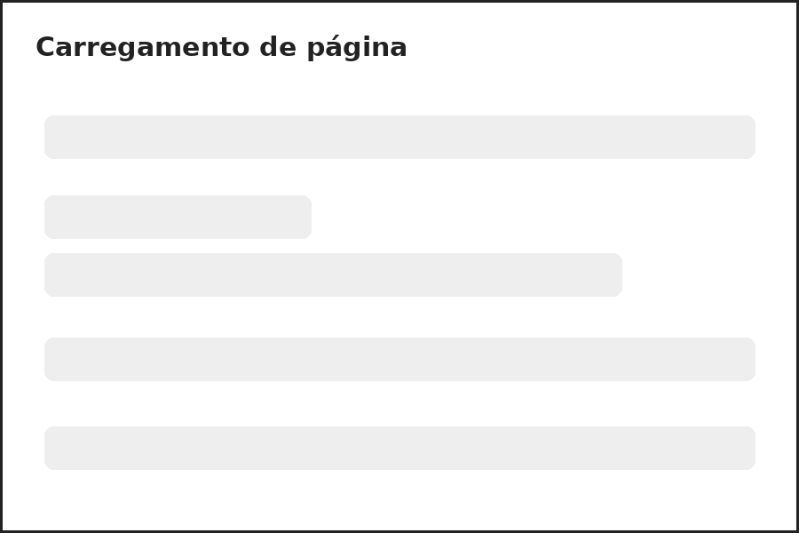


### Regra

O carregamento deverá preservar a estrutura aproximada da tela.

---

## 51. RB-WF-STA-002 — Falha ao salvar

### Superfície relacionada

`RB-STA-021 — Falha ao salvar`

### Wireframe textual

```text
┌────────────────────────────────┐
│ ⚠ Alteração não salva          │
│                                │
│ Não foi possível salvar sua    │
│ alteração.                     │
│                                │
│ [ Tentar novamente ]           │
│ [ Revisar alteração ]          │
└────────────────────────────────┘
```

### Wireframe visual


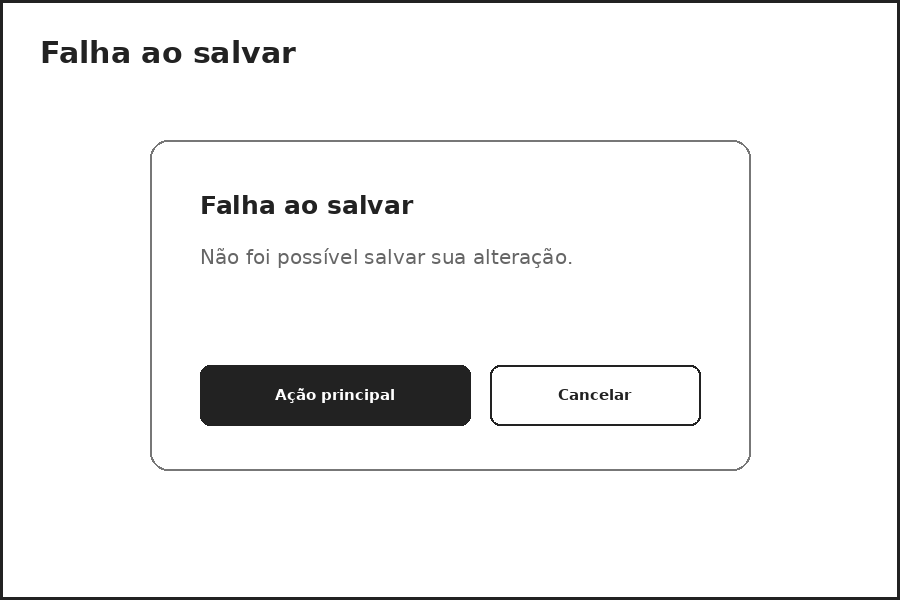


---

## 52. RB-WF-STA-003 — Dados parciais

### Superfície relacionada

`RB-STA-022 — Conteúdo parcial`

### Wireframe textual

```text
┌────────────────────────────────┐
│ Conteúdo principal             │
│                                │
│ ⚠ Algumas informações estão    │
│ temporariamente indisponíveis. │
│                                │
│ Horário: não disponível        │
│ Preço: estimativa              │
│                                │
│ [ Tentar atualizar ]           │
└────────────────────────────────┘
```

### Wireframe visual


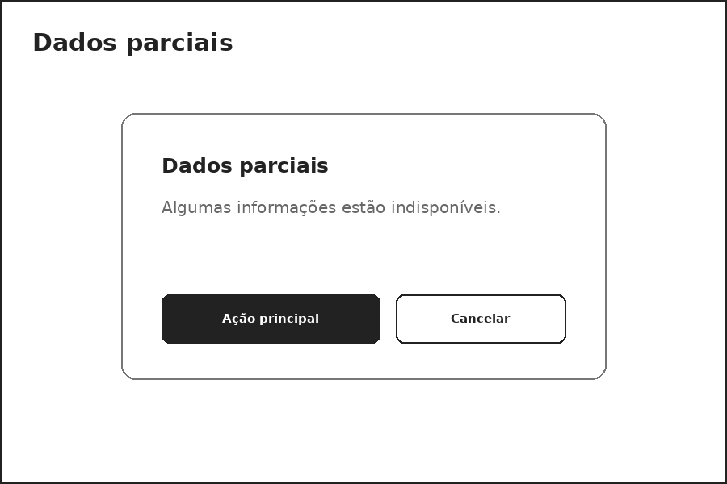


---

## 53. RB-WF-STA-004 — Alterações não salvas

### Superfície relacionada

`RB-MDL-008 — Alterações não salvas`

### Wireframe textual

```text
┌────────────────────────────────┐
│ Descartar alterações?          │
│                                │
│ As alterações feitas nesta     │
│ tela ainda não foram salvas.   │
│                                │
│ [ Continuar editando ]         │
│ [ Descartar ]                  │
└────────────────────────────────┘
```

### Wireframe visual

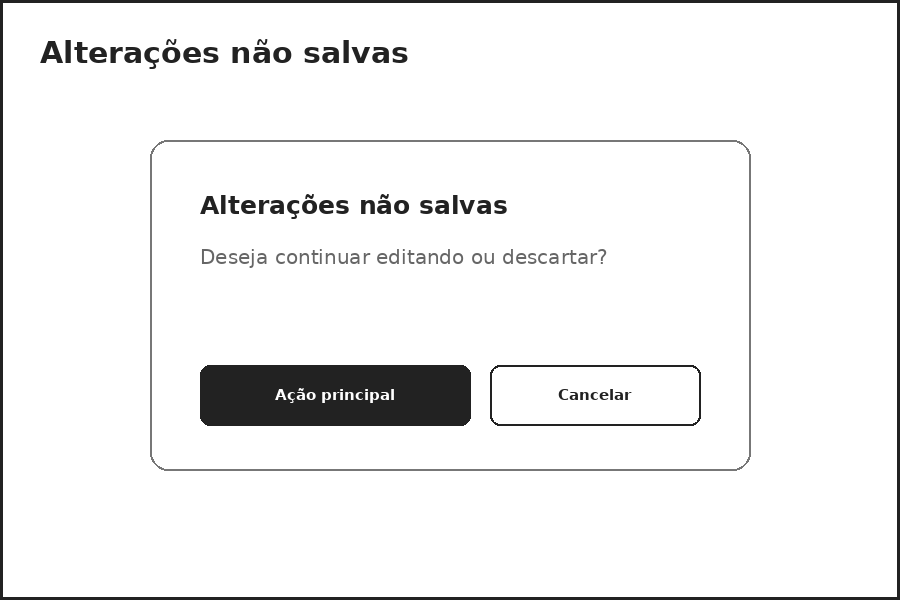

---

# Parte XV — Hierarquia das ações

## 54. Ações primárias

Ações primárias deverão representar o objetivo central da superfície.

| Superfície        | Ação primária             |
| ----------------- | ------------------------- |
| Criar Viagem      | Continuar ou Criar Viagem |
| Detalhes do Lugar | Adicionar ao Roteiro      |
| Filtros           | Aplicar                   |
| Editar Atividade  | Salvar alterações         |
| Proposta          | Aceitar proposta          |
| Configurações     | Salvar                    |

Uma superfície não deverá possuir várias ações com o mesmo peso sem necessidade.

---

## 55. Ações secundárias

Exemplos:

* Salvar Lugar;
* Ver no Mapa;
* Abrir Detalhes;
* Editar;
* Limpar filtros;
* Gerar novamente;
* Tentar novamente.

---

## 56. Ações destrutivas

Exemplos:

* excluir Viagem;
* remover Atividade;
* descartar proposta;
* descartar alterações.

Essas ações deverão possuir:

* rótulo claro;
* impacto compreensível;
* confirmação quando necessária;
* hierarquia visual inferior às ações construtivas.

---

# Parte XVI — Comportamento responsivo

## 57. Explorar

### Mobile

```text
Lista ou Mapa
```

### Desktop

```text
Lista + Mapa + Detalhes contextuais
```

---

## 58. Roteiro

### Mobile

```text
Seletor de Dia
→ lista de Atividades
→ Mapa acessado separadamente
```

### Desktop

```text
Dias
+ Atividades
+ Mapa do Dia
```

---

## 59. Detalhes

### Mobile

Página completa.

### Desktop

Página ou painel lateral.

---

## 60. Filtros

### Mobile

Bottom sheet.

### Desktop

Painel lateral, drawer ou seção persistente.

---

## 61. Navegação

### Mobile

Navegação inferior com cinco áreas.

### Desktop

Navegação lateral com acesso às áreas e Configurações.

---

## 62. Princípio de adaptação

A versão mobile não deverá ser uma simples redução do desktop.

A adaptação deverá considerar:

* prioridade de conteúdo;
* redução de simultaneidade;
* uso de páginas completas;
* bottom sheets;
* ações fixas;
* navegação por etapas;
* interação por toque.

---

# Parte XVII — Acessibilidade

## 63. Ordem do conteúdo

Os wireframes deverão permitir uma ordem semântica coerente.

Exemplo para Explorar:

```text
Título
→ Pesquisa
→ Categorias
→ Filtros
→ Resultados
→ Detalhes
→ Mapa complementar
```

---

## 64. Foco

Superfícies sobrepostas deverão:

* receber foco ao abrir;
* restringir foco quando apropriado;
* devolver foco ao elemento de origem ao fechar.

---

## 65. Alternativa ao Mapa

Toda tela com Mapa deverá possuir:

* lista equivalente;
* rótulos;
* Distâncias textuais;
* ações acessíveis;
* possibilidade de continuar sem o Mapa.

---

## 66. Alternativa ao arrastar

A reordenação deverá possuir:

* mover para cima;
* mover para baixo;
* mover para o início;
* selecionar posição.

---

## 67. Informação não dependente de cor

Estados não deverão depender exclusivamente de:

* cor;
* ícones;
* posição;
* animação.

Um estado deverá possuir texto, rótulo ou indicação semântica equivalente.

---

## 68. Alvos de toque

Controles móveis deverão possuir área de toque adequada.

A proximidade entre ações destrutivas e ações principais deverá ser evitada.

---

# Parte XVIII — Requisitos dos arquivos visuais

## 69. Formato

O formato inicial será:

```text
PNG
```

Versões editáveis poderão ser mantidas futuramente em:

* SVG;
* Figma;
* ferramenta equivalente;
* HTML;
* componentes de protótipo.

O PNG deverá permanecer disponível para exibição no GitHub.

---

## 70. Nome dos arquivos

O nome deverá seguir o padrão:

```text
<ID>-<descricao-curta>.png
```

Exemplo:

```text
RB-WF-MOB-009-explorar-lista.png
```

Não deverão ser utilizados nomes como:

```text
wireframe-final.png
wireframe-final-2.png
wireframe-novo.png
```

---

## 71. Conteúdo dos arquivos

Cada imagem deverá:

* corresponder ao wireframe textual;
* utilizar baixa fidelidade;
* evitar identidade visual final;
* manter textos legíveis;
* representar o dispositivo correto;
* preservar hierarquia;
* preservar ações;
* possuir contraste suficiente;
* não depender apenas de cor;
* evitar fotografias realistas;
* utilizar fundo neutro;
* evitar elementos decorativos desnecessários.

---

## 72. Relação com o texto

A imagem visual deverá permanecer diretamente abaixo do wireframe textual correspondente.

Ela não deverá substituir o wireframe textual.

O texto continuará sendo necessário para:

* indexação;
* acessibilidade;
* pesquisa;
* interpretação por agentes de IA;
* rastreabilidade;
* versionamento de conteúdo.

---

## 73. Versionamento

Quando um wireframe visual sofrer alteração:

* o arquivo deverá manter o nome canônico;
* a nova versão substituirá o conteúdo do arquivo;
* o histórico anterior permanecerá no Git;
* o documento deverá registrar alterações significativas;
* identificadores não deverão ser recriados sem necessidade.

---

# Parte XIX — Validação dos wireframes

## 74. Objetivos de validação

Os wireframes deverão ser testados para verificar:

* compreensão da navegação;
* clareza das ações;
* diferença entre Salvos e Roteiro;
* compreensão do Mapa;
* construção do Roteiro;
* percepção de alertas;
* funcionamento móvel;
* adequação da densidade de informação;
* continuidade entre telas.

---

## 75. Tarefas prioritárias

1. Criar uma Viagem.
2. Encontrar uma praia.
3. Salvar o Lugar.
4. Adicionar o Lugar ao Roteiro.
5. Escolher um Dia.
6. Mover uma Atividade.
7. Consultar a Distância.
8. Abrir rota.
9. Revisar um conflito.
10. Retomar o planejamento.

---

## 76. Perguntas de validação

* O usuário identifica onde está?
* Sabe qual é a ação principal?
* Entende a diferença entre Salvar e Adicionar ao Roteiro?
* Consegue retornar sem perder contexto?
* Entende o estado dos Dias?
* Percebe quando um dado é estimado?
* Consegue utilizar a interface sem o Mapa?
* Entende quando existe risco ou erro?
* Consegue concluir as tarefas no celular?
* A quantidade de conteúdo está adequada?

---

## 77. Critérios de revisão

Um wireframe deverá ser revisado quando:

* a ação principal não estiver clara;
* o usuário não encontrar a navegação;
* houver excesso de conteúdo;
* a estrutura mobile apenas reproduzir o desktop;
* estados obrigatórios estiverem ausentes;
* o retorno perder contexto;
* a interação depender exclusivamente do Mapa;
* não existir alternativa ao arrastar;
* existir comportamento sem rastreabilidade.

---

# Parte XX — Rastreabilidade

## 78. Matriz de wireframes e superfícies

| Wireframes                                    | Tela ou superfície                    |
| --------------------------------------------- | ------------------------------------- |
| RB-WF-MOB-001, RB-WF-MOB-002, RB-WF-DESK-001  | RB-SCR-001                            |
| RB-WF-MOB-003 a RB-WF-MOB-006, RB-WF-DESK-002 | RB-FRM-001                            |
| RB-WF-MOB-007, RB-WF-MOB-008, RB-WF-DESK-003  | RB-SCR-002                            |
| RB-WF-MOB-009 a RB-WF-MOB-011, RB-WF-DESK-004 | RB-SCR-003                            |
| RB-WF-MOB-012, RB-WF-MOB-013, RB-WF-DESK-005  | RB-SCR-004 e RB-SHT-001               |
| RB-WF-MOB-014, RB-WF-MOB-015, RB-WF-DESK-006  | RB-SCR-005                            |
| RB-WF-MOB-016, RB-WF-MOB-017, RB-WF-DESK-007  | RB-SCR-006                            |
| RB-WF-MOB-018 a RB-WF-MOB-023, RB-WF-DESK-008 | RB-SCR-007 e superfícies de Atividade |
| RB-WF-MOB-024, RB-WF-MOB-025, RB-WF-DESK-009  | RB-SCR-009                            |
| RB-WF-MOB-026, RB-WF-MOB-027, RB-WF-DESK-010  | RB-SCR-010                            |
| RB-WF-MOB-028, RB-WF-MOB-029, RB-WF-DESK-011  | RB-SCR-008                            |
| RB-WF-STA-001 a RB-WF-STA-004                 | Estados transversais                  |

---

## 79. Matriz de wireframes e fluxos

| Fluxo     | Wireframes principais                         |
| --------- | --------------------------------------------- |
| RB-UF-001 | RB-WF-MOB-003 a RB-WF-MOB-006, RB-WF-DESK-002 |
| RB-UF-002 | RB-WF-MOB-001, RB-WF-MOB-007, RB-WF-DESK-001  |
| RB-UF-003 | RB-WF-MOB-028, RB-WF-MOB-029, RB-WF-DESK-011  |
| RB-UF-004 | RB-WF-MOB-009, RB-WF-DESK-004                 |
| RB-UF-006 | RB-WF-MOB-010, RB-WF-MOB-011                  |
| RB-UF-007 | RB-WF-MOB-012, RB-WF-DESK-005                 |
| RB-UF-008 | RB-WF-MOB-009, RB-WF-MOB-012                  |
| RB-UF-009 | RB-WF-MOB-016, RB-WF-MOB-017                  |
| RB-UF-010 | RB-WF-MOB-013                                 |
| RB-UF-011 | RB-WF-MOB-018, RB-WF-MOB-019, RB-WF-DESK-008  |
| RB-UF-012 | RB-WF-MOB-020, RB-WF-MOB-021                  |
| RB-UF-013 | RB-WF-MOB-022                                 |
| RB-UF-016 | RB-WF-MOB-023                                 |
| RB-UF-017 | RB-WF-MOB-014, RB-WF-MOB-015, RB-WF-DESK-006  |
| RB-UF-020 | RB-WF-MOB-024, RB-WF-MOB-025, RB-WF-DESK-009  |
| RB-UF-021 | RB-WF-MOB-026, RB-WF-MOB-027, RB-WF-DESK-010  |
| RB-UF-022 | RB-WF-MOB-008                                 |

---

# Parte XXI — Priorização da produção visual

## 80. Lote 1 — Núcleo mobile

Criar primeiro:

1. `RB-WF-MOB-001-minhas-viagens.png`;
2. `RB-WF-MOB-003-criar-viagem-destino.png`;
3. `RB-WF-MOB-007-visao-geral.png`;
4. `RB-WF-MOB-009-explorar-lista.png`;
5. `RB-WF-MOB-012-detalhes-lugar.png`;
6. `RB-WF-MOB-014-mapa-viagem.png`;
7. `RB-WF-MOB-016-salvos.png`;
8. `RB-WF-MOB-018-roteiro.png`.

---

## 81. Lote 2 — Fluxos mobile complementares

1. criação de Viagem restante;
2. filtros;
3. estados vazios;
4. seleção de Dia;
5. edição de Atividade;
6. Período livre;
7. proposta;
8. revisão;
9. Configurações.

---

## 82. Lote 3 — Desktop

1. Minhas Viagens;
2. Visão Geral;
3. Explorar;
4. Detalhes;
5. Mapa;
6. Salvos;
7. Roteiro;
8. proposta;
9. revisão;
10. Configurações.

---

## 83. Lote 4 — Estados transversais

1. carregamento;
2. falha ao salvar;
3. dados parciais;
4. alterações não salvas.

---

# Parte XXII — Governança

## 84. Inclusão de novo wireframe

Um novo wireframe deverá ser criado quando:

* existir uma superfície validada no Inventário;
* uma variação alterar significativamente a hierarquia;
* o comportamento mobile e desktop for estruturalmente diferente;
* um teste revelar necessidade de nova composição;
* uma etapa ainda não estiver representada;
* um estado alterar a decisão do usuário.

---

## 85. Alteração de wireframe

Uma alteração deverá considerar:

* Arquitetura da Informação;
* Fluxos do Usuário;
* Inventário de Telas;
* Requisitos;
* acessibilidade;
* responsividade;
* rastreabilidade.

---

## 86. Aprovação

A aprovação de um wireframe significa aprovação de:

* estrutura;
* hierarquia;
* conteúdo;
* ações;
* estados;
* navegação;
* adaptação responsiva.

Ela não significa aprovação de:

* cores;
* tipografia;
* ícones finais;
* fotografias;
* identidade visual;
* acabamento.

---

## 87. Uso por agentes de IA

Agentes que transformem os wireframes em protótipos ou código deverão:

* preservar os identificadores;
* seguir a hierarquia definida;
* não remover estados obrigatórios;
* manter alternativas acessíveis;
* respeitar as diferenças entre mobile e desktop;
* não introduzir novas áreas sem documentação;
* manter a Viagem como contexto central;
* preservar a relação entre Explorar, Mapa, Salvos e Roteiro;
* utilizar os arquivos visuais apenas como complemento da especificação textual.

---

## 88. Checklist de revisão

Antes de aprovar este documento, verificar:

* todas as telas prioritárias possuem wireframes textuais;
* todos os wireframes possuem referência visual preparada;
* os nomes dos arquivos são únicos;
* os caminhos dos arquivos estão corretos;
* mobile está contemplado;
* desktop está contemplado;
* estados transversais estão contemplados;
* a navegação está representada;
* as ações principais estão claras;
* Salvos e Roteiro estão diferenciados;
* o Mapa possui alternativa;
* a criação da Viagem está representada;
* o Roteiro vazio está representado;
* erros estão representados;
* carregamento está representado;
* proposta e revisão estão representadas;
* Configurações estão representadas;
* acessibilidade está contemplada;
* responsividade está contemplada;
* os wireframes estão rastreados às telas e fluxos;
* o nível de fidelidade permanece adequado.

---

## 89. Declaração final

Os wireframes do RouteBook transformam a estrutura documental do produto em uma representação concreta da experiência.

Eles definem como o usuário deverá visualizar e utilizar:

* suas Viagens;
* a criação de uma Viagem;
* a Visão Geral;
* a Descoberta;
* os Detalhes dos Lugares;
* o Mapa;
* os Salvos;
* o Roteiro;
* as propostas;
* os alertas;
* as Configurações.

Cada wireframe textual possui uma referência preparada para seu respectivo arquivo visual.

A documentação deverá manter ambas as representações:

* textual, para rastreabilidade, acessibilidade e interpretação;
* visual, para validação espacial e comunicação da interface.

Os wireframes deverão ser validados antes da definição visual de alta fidelidade e antes da implementação final das superfícies.
