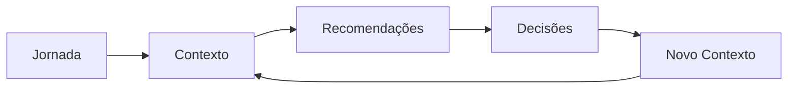
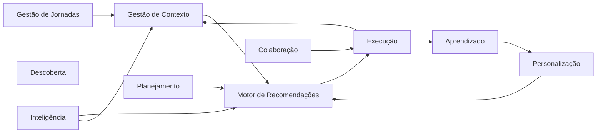
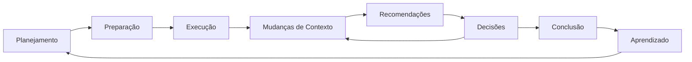

---

# Escopo do Produto

## Finalidade do Produto

O RouteBook existe para apoiar pessoas durante jornadas, auxiliando-as na tomada de decisões por meio da interpretação contínua do contexto.

O produto não substitui o usuário na tomada de decisão.

Da mesma forma, não substitui serviços especializados como aplicativos de navegação, plataformas de reservas ou sistemas de pagamento.

Seu papel é atuar como uma camada inteligente de contexto, capaz de consolidar informações provenientes de diferentes fontes, compreender os objetivos da jornada e apresentar recomendações que aumentem a probabilidade de melhores decisões.

---

## Escopo Funcional

Em alto nível, o RouteBook possui cinco grandes responsabilidades.

### 1. Compreender a Jornada

O produto deve ser capaz de compreender:

- destino;
- duração;
- participantes;
- objetivos;
- restrições;
- preferências;
- contexto operacional.

Essa compreensão constitui a base para todas as recomendações produzidas pelo sistema.

---

### 2. Compreender o Contexto

O RouteBook deve interpretar continuamente fatores capazes de influenciar a jornada, incluindo, mas não se limitando a:

- localização;
- horário;
- clima;
- mobilidade;
- disponibilidade de serviços;
- eventos locais;
- orçamento;
- preferências do usuário;
- histórico da jornada.

O contexto deve ser tratado como uma entidade dinâmica, sujeita a alterações durante toda a execução da jornada.

---

### 3. Apoiar Decisões

A principal responsabilidade do produto consiste em apoiar decisões.

Isso significa que o sistema deverá identificar momentos relevantes da jornada e apresentar recomendações contextualizadas capazes de auxiliar o usuário na escolha da melhor ação possível.

Essas recomendações podem envolver:

- alterações de rota;
- mudanças de cronograma;
- reorganização de atividades;
- descoberta de oportunidades;
- prevenção de riscos;
- otimização de tempo;
- otimização financeira;
- melhoria da experiência.

O RouteBook não impõe decisões.

A decisão final permanece sempre sob responsabilidade do usuário.

---

### 4. Aprender com as Jornadas

Cada jornada representa uma oportunidade de aprendizado.

O produto deverá utilizar informações provenientes das jornadas anteriores para compreender padrões de comportamento, preferências e objetivos recorrentes, respeitando as políticas de privacidade e consentimento definidas pelo projeto.

Esse aprendizado deve contribuir para recomendações futuras mais relevantes.

---

### 5. Evoluir Durante a Jornada

A jornada não deve ser tratada como um plano estático.

À medida que novas informações surgem, o RouteBook deverá reavaliar continuamente o contexto e adaptar suas recomendações sempre que houver benefício para o usuário.

Esse comportamento diferencia o produto de ferramentas tradicionais de planejamento.

---

# Objetivos Estratégicos do Produto

Todos os objetivos definidos nesta seção derivam do propósito central estabelecido pela RouteBook Bible.

---

## Objetivo Principal

Aumentar a qualidade das decisões tomadas pelo usuário ao longo de toda a jornada.

Este objetivo representa o principal indicador de sucesso do produto.

Todas as funcionalidades futuras deverão demonstrar contribuição direta ou indireta para esse resultado.

---

## Objetivos Secundários

Além do objetivo principal, o produto busca:

- reduzir a carga cognitiva durante a jornada;
- diminuir o tempo necessário para tomada de decisões;
- aumentar a confiança do usuário em suas escolhas;
- reduzir desperdícios de tempo e recursos;
- aumentar a personalização das recomendações;
- tornar jornadas complexas mais previsíveis;
- facilitar adaptações diante de mudanças inesperadas.

---

## Objetivos de Longo Prazo

No longo prazo, espera-se que o RouteBook seja reconhecido como um assistente inteligente de jornadas, capaz de acompanhar o usuário continuamente e oferecer suporte contextual em diferentes cenários.

Isso inclui jornadas:

- turísticas;
- corporativas;
- urbanas;
- recorrentes;
- ocasionais;
- individuais;
- colaborativas.

A expansão para novos domínios deverá preservar o mesmo princípio fundamental definido pela Foundation.

---

# O Que o Produto Não É

Para evitar ambiguidades, é importante estabelecer explicitamente os limites conceituais do RouteBook.

O RouteBook não é:

- um aplicativo de mapas;
- uma OTA (Online Travel Agency);
- uma plataforma de reservas;
- um marketplace;
- uma rede social;
- um catálogo turístico;
- um sistema de checklists;
- um planejador estático;
- um aplicativo de transporte.

Embora possa integrar-se a esses serviços, sua responsabilidade permanece exclusivamente relacionada ao apoio à tomada de decisão.

---

# Pilares do Produto

Toda evolução do RouteBook deverá respeitar os seguintes pilares.

## Apoio à Decisão

Toda funcionalidade deve contribuir para decisões melhores.

Caso esse vínculo não exista, sua inclusão deverá ser reavaliada.

---

## Contexto em Primeiro Lugar

Informações isoladas possuem pouco valor.

O produto deve interpretar relações entre informações antes de produzir recomendações.

---

## Personalização

Cada jornada é única.

As recomendações devem considerar objetivos, preferências, restrições e histórico do usuário.

---

## Adaptação Contínua

Mudanças fazem parte de qualquer jornada.

O produto deve adaptar suas recomendações sempre que houver alterações relevantes no contexto.

---

## Transparência

Sempre que possível, recomendações devem ser acompanhadas de justificativas compreensíveis para o usuário.

A confiança no produto depende da clareza sobre os fatores considerados em cada recomendação.

---

## Evolução Contínua

O produto deverá evoluir continuamente por meio da observação das jornadas realizadas, incorporando novos aprendizados sem comprometer a previsibilidade e a consistência da experiência.

---

# Modelo Conceitual do Produto

## Introdução

O RouteBook foi concebido a partir da premissa de que jornadas são sistemas dinâmicos, compostos por eventos, decisões e mudanças contínuas de contexto.

Para cumprir seu propósito de transformar contexto em decisões melhores, o produto organiza seu domínio em quatro conceitos fundamentais:

- Jornada
- Contexto
- Decisão
- Recomendação

Esses conceitos formam o núcleo do comportamento do produto e devem ser utilizados de maneira consistente em toda a documentação do projeto.

---

# Jornada

## Definição

Uma jornada representa um período delimitado de tempo durante o qual um usuário busca atingir um ou mais objetivos.

Uma jornada possui início, evolução e encerramento, sendo continuamente influenciada por fatores internos e externos.

A jornada é a unidade central do produto.

Todo comportamento do RouteBook acontece em função de uma jornada.

---

## Características

Uma jornada pode possuir:

- um ou mais participantes;
- um ou mais destinos;
- múltiplas atividades;
- restrições de tempo;
- restrições financeiras;
- objetivos específicos;
- preferências individuais;
- eventos inesperados;
- mudanças de prioridade.

Não existe uma jornada "padrão".

Cada jornada deve ser compreendida como única.

---

## Exemplos

### Exemplo 1

Uma família viaja para Gramado durante cinco dias.

Os objetivos incluem descanso, gastronomia e atividades infantis.

Durante a viagem ocorre uma frente fria.

O contexto muda.

As recomendações também deverão mudar.

---

### Exemplo 2

Um profissional viaja para São Paulo para participar de reuniões.

Um congestionamento inesperado altera o tempo estimado de deslocamento.

O RouteBook identifica o impacto e sugere reorganizar a agenda.

---

# Contexto

## Definição

Contexto representa o conjunto de informações que descrevem o estado atual da jornada.

O contexto é dinâmico.

Ele pode mudar continuamente.

Uma alteração de contexto pode tornar uma decisão anterior inadequada.

Por esse motivo, o contexto deve ser constantemente reavaliado.

---

## Componentes do Contexto

O contexto pode incluir informações relacionadas a:

### Usuário

- preferências;
- objetivos;
- restrições;
- orçamento;
- histórico.

### Jornada

- localização;
- cronograma;
- atividades;
- participantes.

### Ambiente

- clima;
- trânsito;
- eventos;
- disponibilidade;
- horários;
- funcionamento.

### Serviços Externos

- reservas;
- transporte;
- atrações;
- preços;
- filas;
- avaliações.

Esta lista não é exaustiva.

Novos componentes poderão ser incorporados sem alterar a definição de contexto.

---

# Decisão

## Definição

Uma decisão corresponde à escolha realizada pelo usuário durante a jornada.

Embora o RouteBook forneça recomendações, a responsabilidade pela decisão permanece sempre com o usuário.

Esse princípio garante que o produto atue como suporte, e não como substituto da autonomia humana.

---

## Natureza das Decisões

As decisões podem possuir diferentes níveis de impacto.

### Estratégicas

Influenciam a jornada como um todo.

Exemplos:

- alterar o destino;
- reduzir a duração da viagem;
- modificar o orçamento.

---

### Táticas

Afetam partes específicas da jornada.

Exemplos:

- trocar uma atividade;
- reorganizar horários;
- modificar uma sequência de visitas.

---

### Operacionais

Relacionam-se às escolhas imediatas.

Exemplos:

- escolher um restaurante;
- alterar uma rota;
- decidir fazer uma pausa;
- antecipar uma visita.

---

# Recomendação

## Definição

Uma recomendação representa uma sugestão produzida pelo RouteBook a partir da interpretação do contexto.

Seu objetivo é apoiar a tomada de decisão.

Uma recomendação nunca deve existir sem uma justificativa contextual.

---

## Características

Uma recomendação deve ser:

- relevante;
- contextual;
- compreensível;
- justificável;
- acionável;
- proporcional ao impacto esperado.

---

## Exemplo

Em vez de apenas informar:

> "Existe chuva prevista."

O RouteBook poderá recomendar:

> "Antecipe a visita ao parque para o período da manhã, reduzindo a probabilidade de interrupção da atividade devido à previsão de chuva intensa após as 14h."

A diferença está na transformação da informação em apoio concreto à decisão.

---

# Relação Entre os Conceitos

Os quatro conceitos centrais do produto possuem uma relação contínua.

A jornada estabelece o objetivo.

O contexto descreve a situação atual.

As recomendações são produzidas a partir da interpretação desse contexto.

O usuário avalia essas recomendações e toma decisões.

As decisões modificam a jornada.

Como consequência, um novo contexto é formado.

Esse ciclo permanece ativo durante toda a duração da jornada.

---

---

# Princípios do Modelo Conceitual

Todo comportamento do produto deverá respeitar os seguintes princípios:

1. Toda recomendação depende de contexto.

2. Todo contexto pertence a uma jornada.

3. Toda decisão pertence ao usuário.

4. O contexto pode mudar a qualquer momento.

5. Recomendações devem evoluir conforme o contexto evolui.

6. O aprendizado do produto jamais elimina a autonomia do usuário.

7. O objetivo do produto não é decidir, mas melhorar a qualidade das decisões.

---

# Capacidades do Produto

## Visão Geral

O RouteBook organiza suas responsabilidades em um conjunto de capacidades de negócio.

Uma capacidade representa um conjunto de comportamentos que o produto deve oferecer para cumprir seu propósito.

Capacidades descrevem **o que o produto é capaz de fazer**, e não **como será implementado**.

Elas constituem a principal visão funcional de alto nível do RouteBook e servem como base para os documentos detalhados da Epic Product.

---

# Mapa de Capacidades

Em alto nível, o RouteBook é composto pelas seguintes capacidades:

1. Gestão de Jornadas
2. Gestão de Contexto
3. Motor de Recomendações
4. Planejamento Inteligente
5. Execução da Jornada
6. Descoberta de Experiências
7. Personalização
8. Colaboração
9. Aprendizado Contínuo
10. Inteligência do Produto

Essas capacidades são independentes do desenho da interface e da arquitetura técnica.

---

# 1. Gestão de Jornadas

Esta capacidade é responsável por representar digitalmente a jornada do usuário.

Inclui responsabilidades como:

- criação de jornadas;
- organização temporal;
- organização geográfica;
- participantes;
- objetivos;
- restrições;
- evolução da jornada.

Toda funcionalidade do produto está associada a uma jornada.

---

## Resultados Esperados

Ao final desta capacidade, o produto deve compreender claramente:

- qual jornada está sendo executada;
- quais são seus objetivos;
- quais restrições existem;
- quais eventos fazem parte dela.

---

# 2. Gestão de Contexto

Responsável por compreender continuamente o estado atual da jornada.

O contexto representa a principal fonte de inteligência do produto.

Inclui informações relacionadas a:

- localização;
- tempo;
- clima;
- mobilidade;
- disponibilidade;
- orçamento;
- preferências;
- comportamento anterior;
- eventos externos.

---

## Responsabilidade

Transformar dados isolados em uma representação coerente do momento atual da jornada.

---

# 3. Motor de Recomendações

Representa o núcleo de valor do RouteBook.

Sua responsabilidade consiste em transformar contexto em recomendações úteis para apoiar decisões.

O motor deve considerar:

- objetivos;
- preferências;
- restrições;
- contexto;
- impacto esperado;
- histórico.

O documento específico do Recommendation Engine detalhará seu comportamento.

---

# 4. Planejamento Inteligente

Embora o foco do RouteBook seja apoiar decisões durante a jornada, o planejamento constitui uma etapa importante.

Esta capacidade deverá permitir que o usuário:

- organize ideias;
- estruture objetivos;
- monte roteiros;
- estabeleça prioridades;
- prepare alternativas.

O planejamento deve permanecer flexível.

Planos nunca devem ser tratados como definitivos.

---

# 5. Execução da Jornada

Durante a jornada, o RouteBook acompanha continuamente sua evolução.

Esta capacidade envolve:

- acompanhamento;
- monitoramento;
- adaptação;
- reorganização;
- apoio imediato à decisão.

É nesta etapa que o produto entrega a maior parte do seu valor.

---

# 6. Descoberta de Experiências

O RouteBook deve auxiliar o usuário a descobrir oportunidades relevantes ao contexto.

Exemplos incluem:

- atrações;
- restaurantes;
- eventos;
- experiências;
- atividades;
- locais de interesse.

A descoberta deve priorizar relevância em vez de quantidade.

O objetivo não é listar opções, mas apresentar oportunidades compatíveis com a jornada.

---

# 7. Personalização

O produto deverá adaptar seu comportamento conforme aprende sobre o usuário.

A personalização poderá considerar:

- preferências;
- hábitos;
- histórico;
- perfil da jornada;
- padrões de decisão;
- objetivos recorrentes.

A personalização nunca deve reduzir a transparência das recomendações.

---

# 8. Colaboração

Muitas jornadas são compartilhadas.

Esta capacidade contempla comportamentos relacionados à participação de múltiplos usuários.

Exemplos:

- planejamento conjunto;
- compartilhamento;
- consenso;
- divisão de responsabilidades;
- decisões coletivas.

Os detalhes serão definidos em documentos específicos.

---

# 9. Aprendizado Contínuo

Cada jornada produz conhecimento.

O produto deverá utilizar esse conhecimento para melhorar futuras recomendações.

Esse aprendizado poderá ocorrer em diferentes níveis:

- individual;
- coletivo;
- contextual;
- comportamental.

Sempre respeitando as políticas de privacidade e consentimento.

---

# 10. Inteligência do Produto

Esta capacidade representa a evolução contínua do RouteBook.

Ela coordena a utilização de modelos inteligentes para:

- interpretar contexto;
- identificar padrões;
- prever necessidades;
- antecipar mudanças;
- reduzir incertezas;
- aumentar a qualidade das recomendações.

A inteligência do produto não substitui o usuário.

Ela amplia sua capacidade de tomar decisões.

---

# Relação Entre as Capacidades

As capacidades do RouteBook não operam de forma isolada.

Cada uma contribui para um fluxo contínuo de geração de valor.

---

# Observações

As capacidades descritas neste documento representam apenas a visão funcional de alto nível.

Cada capacidade será detalhada em documentos específicos da Epic Product, incluindo:

- Product Requirements Document (PRD)
- Functional Requirements
- Business Rules
- User Journey
- Personas
- Success Metrics
- Roadmap

O objetivo desta seção é estabelecer uma visão sistêmica do produto antes da especificação detalhada de cada domínio.

---

# Ecossistema do Produto

## Visão Geral

O RouteBook não opera de forma isolada.

Ele faz parte de um ecossistema composto por usuários, serviços digitais, provedores de informação e parceiros que, em conjunto, influenciam a experiência da jornada.

O papel do RouteBook não é substituir esses serviços, mas atuar como uma camada de inteligência capaz de interpretar informações provenientes de diferentes origens e transformá-las em recomendações contextualizadas.

Essa posição é fundamental para compreender os limites e as responsabilidades do produto.

---

# Atores do Ecossistema

O ecossistema do RouteBook pode ser dividido em cinco grandes grupos.

## Usuários

Representam o principal beneficiário do produto.

São responsáveis por:

- definir objetivos;
- iniciar jornadas;
- tomar decisões;
- avaliar recomendações;
- fornecer feedback;
- compartilhar experiências.

Todo o comportamento do produto deve ser orientado às necessidades do usuário.

---

## Serviços de Contexto

São responsáveis por fornecer informações necessárias para compreender o estado atual da jornada.

Exemplos incluem:

- previsão do tempo;
- mapas;
- trânsito;
- mobilidade;
- localização;
- eventos locais;
- funcionamento de estabelecimentos;
- disponibilidade de serviços.

Esses serviços enriquecem o contexto, mas não determinam as recomendações de forma isolada.

---

## Serviços Especializados

Executam ações específicas durante a jornada.

Entre os exemplos estão:

- plataformas de reserva;
- companhias aéreas;
- hotéis;
- restaurantes;
- aplicativos de transporte;
- venda de ingressos;
- seguros de viagem.

O RouteBook pode utilizar informações desses serviços ou direcionar o usuário até eles quando necessário, preservando sua responsabilidade como plataforma de apoio à decisão.

---

## Parceiros

São organizações que ampliam o ecossistema do RouteBook por meio de integrações, conteúdos ou serviços complementares.

Parcerias podem contribuir para enriquecer recomendações, ampliar a cobertura do produto e melhorar a experiência da jornada.

A existência de parceiros não altera a responsabilidade do RouteBook pela qualidade das recomendações apresentadas ao usuário.

---

## Inteligência Artificial

A Inteligência Artificial é tratada como um componente estratégico do produto.

Sua responsabilidade consiste em interpretar informações, identificar padrões, sintetizar contexto e apoiar a geração de recomendações.

A IA não constitui um usuário do sistema nem uma autoridade decisória.

Ela atua exclusivamente como mecanismo de apoio à tomada de decisão.

---

# Posicionamento no Ecossistema

O RouteBook ocupa uma posição intermediária entre a informação e a ação.

Ele não produz todas as informações necessárias para uma jornada.

Também não executa todas as ações decorrentes das decisões do usuário.

Seu papel consiste em reduzir a distância entre esses dois extremos.

---

# Ciclo de Vida da Jornada

Independentemente do tipo de jornada, o comportamento do produto pode ser organizado em três grandes momentos.

## Antes da Jornada

Nesta etapa o usuário ainda está planejando.

Os principais objetivos do produto são:

- compreender intenções;
- organizar informações;
- estruturar objetivos;
- reduzir incertezas;
- preparar alternativas.

O planejamento deve permanecer flexível.

---

## Durante a Jornada

Esta representa a fase de maior geração de valor.

O produto acompanha continuamente a evolução do contexto.

Sempre que necessário, produz novas recomendações para apoiar decisões.

Mudanças inesperadas são tratadas como parte natural da jornada.

---

## Após a Jornada

O encerramento da jornada não representa o fim do relacionamento com o usuário.

Nesta etapa o produto pode:

- consolidar aprendizados;
- registrar experiências;
- identificar padrões;
- atualizar preferências;
- melhorar futuras recomendações.

O conhecimento adquirido torna-se parte da inteligência do produto.

---

# Fluxo Conceitual da Jornada

---

# Beneficiários do Produto

Embora o usuário seja o principal beneficiário, outros participantes também obtêm valor por meio do ecossistema.

| Beneficiário | Valor Gerado |
|--------------|--------------|
| Usuário | Melhores decisões durante a jornada |
| Grupo de viagem | Melhor coordenação e colaboração |
| Empresas parceiras | Usuários mais bem informados e preparados |
| Prestadores de serviço | Redução de fricção na experiência |
| Ecossistema RouteBook | Aprendizado contínuo e evolução das recomendações |

---

# Limites do Ecossistema

O Product Overview estabelece os seguintes limites:

O RouteBook:

- não substitui provedores especializados;
- não garante disponibilidade de serviços externos;
- não controla informações fornecidas por terceiros;
- não executa reservas em nome do usuário por definição deste documento;
- não toma decisões automaticamente.

Esses limites deverão ser respeitados por toda a documentação subsequente da Epic Product.

---

# Perfis de Usuários

## Visão Geral

O RouteBook foi concebido para atender diferentes perfis de usuários que compartilham uma característica comum: todos precisam tomar decisões durante uma jornada.

Embora as necessidades variem conforme o contexto, o produto mantém um objetivo único: oferecer recomendações contextualizadas que aumentem a qualidade das decisões.

Os perfis apresentados nesta seção possuem caráter conceitual.

A modelagem detalhada será realizada no documento **Personas (RB-PROD-000X)**.

---

## Viajante de Lazer

Usuários que realizam jornadas motivadas por turismo, descanso, lazer ou experiências pessoais.

Necessidades comuns:

- organizar roteiros;
- descobrir experiências;
- adaptar planos durante a viagem;
- otimizar tempo;
- reduzir incertezas.

---

## Viajante Corporativo

Usuários cuja jornada está relacionada a compromissos profissionais.

Necessidades comuns:

- otimização de agenda;
- pontualidade;
- gestão de deslocamentos;
- reorganização rápida diante de imprevistos;
- redução de riscos operacionais.

---

## Morador Local

Usuários que utilizam o produto em jornadas recorrentes dentro de sua própria cidade.

Exemplos:

- lazer aos finais de semana;
- eventos;
- gastronomia;
- atividades culturais;
- deslocamentos planejados.

---

## Grupos

Jornadas compartilhadas por duas ou mais pessoas.

As decisões passam a considerar objetivos coletivos, preferências conflitantes e coordenação entre participantes.

---

## Organizadores

Usuários responsáveis por estruturar jornadas para terceiros.

Exemplos:

- líderes de grupos;
- organizadores de eventos;
- agências;
- anfitriões.

O foco permanece na tomada de decisão, e não na gestão operacional.

---

# Dentro do Escopo

O Product Overview estabelece que fazem parte do escopo do RouteBook:

## Gestão da Jornada

- criação;
- organização;
- evolução;
- adaptação.

---

## Gestão de Contexto

- interpretação contínua;
- consolidação de informações;
- atualização dinâmica.

---

## Apoio à Decisão

- recomendações;
- alternativas;
- justificativas;
- alertas contextuais.

---

## Planejamento Inteligente

- organização;
- preparação;
- simulação de alternativas.

---

## Descoberta

- experiências;
- oportunidades;
- sugestões relevantes.

---

## Personalização

- preferências;
- histórico;
- padrões de comportamento.

---

## Colaboração

- jornadas compartilhadas;
- decisões em grupo;
- coordenação entre participantes.

---

## Aprendizado

- evolução contínua;
- melhoria das recomendações;
- adaptação ao usuário.

---

# Fora do Escopo

As capacidades abaixo não fazem parte do propósito central definido para o RouteBook.

Sua eventual implementação somente poderá ocorrer caso contribua diretamente para a missão do produto.

Por padrão, consideram-se fora do escopo:

- rede social generalista;
- plataforma de reservas;
- aplicativo de navegação;
- marketplace;
- sistema financeiro;
- sistema de pagamentos;
- aplicativo de mensagens;
- plataforma de entretenimento;
- armazenamento irrestrito de arquivos;
- editor de documentos;
- sistema de CRM;
- ERP de viagens.

Esses serviços poderão integrar-se ao RouteBook, mas não constituem sua responsabilidade principal.

---

# Princípios de Evolução do Produto

Toda evolução do RouteBook deverá respeitar os princípios estabelecidos pela Foundation e pelos documentos da Epic Product.

Uma nova funcionalidade somente deverá ser incorporada quando responder positivamente às seguintes perguntas:

## 1. Contribui para melhores decisões?

Caso não exista relação direta ou indireta com a tomada de decisão, a funcionalidade deverá ser reavaliada.

---

## 2. Melhora a compreensão do contexto?

A funcionalidade amplia a capacidade do produto de interpretar a jornada?

---

## 3. Reduz carga cognitiva?

O usuário passa a decidir com menos esforço?

---

## 4. Gera valor contínuo?

O benefício permanece ao longo da jornada ou limita-se a um momento isolado?

---

## 5. Mantém coerência com a RouteBook Bible?

Nenhuma evolução poderá contradizer os princípios estabelecidos pela Foundation.

---

## 6. Pode ser explicada ao usuário?

Caso uma recomendação ou comportamento não possa ser explicado de maneira clara, sua adoção deverá ser cuidadosamente avaliada.

A confiança é parte essencial da proposta de valor do produto.

---

# Critérios para Inclusão de Novas Capacidades

Uma nova capacidade somente deverá ser criada quando:

- representar um domínio de negócio próprio;
- possuir responsabilidades claramente delimitadas;
- gerar valor recorrente;
- ser independente de interface;
- possuir potencial de evolução ao longo do tempo;
- justificar documentação específica.

Caso contrário, o comportamento deverá ser tratado como parte de uma capacidade existente.

---

# Relação com a Documentação da Epic Product

O Product Overview atua como documento de entrada da Epic Product.

Sua função é contextualizar o produto antes da leitura dos documentos especializados.

Os documentos subsequentes aprofundam aspectos específicos do produto.

| Documento | Objetivo |
|-----------|----------|
| Product Overview | Visão geral do produto |
| Product Principles | Princípios de produto |
| Product Requirements Document | Especificação do produto |
| Personas | Perfis detalhados de usuários |
| User Journey | Jornada completa do usuário |
| User Stories | Necessidades do usuário em formato de histórias |
| Functional Requirements | Comportamentos funcionais esperados |
| Business Rules | Regras de domínio |
| Success Metrics | Medição de valor do produto |
| KPIs | Indicadores operacionais |
| Roadmap | Evolução planejada do produto |

O Product Overview não substitui nenhum desses documentos.

Seu papel é estabelecer o contexto comum que permitirá sua correta interpretação.

---

# Glossário

## Capacidade

Representa um conjunto de responsabilidades de negócio que descrevem o que o produto é capaz de realizar.

Capacidades são independentes de interface, arquitetura ou tecnologia e servem como base para a organização funcional do produto.

---

## Contexto

Conjunto de informações que descrevem o estado atual de uma jornada em um determinado momento.

O contexto é dinâmico e influencia continuamente as recomendações produzidas pelo RouteBook.

---

## Decisão

Escolha realizada pelo usuário durante a jornada.

O RouteBook apoia o processo decisório, mas a responsabilidade final pela decisão permanece sempre com o usuário.

---

## Evento

Qualquer ocorrência capaz de modificar o contexto da jornada.

Exemplos incluem alterações climáticas, mudanças de horário, indisponibilidade de serviços, congestionamentos, cancelamentos ou novas oportunidades.

---

## Jornada

Período delimitado no qual um usuário busca atingir um ou mais objetivos.

A jornada constitui a unidade central do domínio do RouteBook.

---

## Objetivo

Resultado que o usuário pretende alcançar por meio da jornada.

Objetivos orientam o comportamento do produto e influenciam diretamente a geração de recomendações.

---

## Participante

Pessoa envolvida em uma jornada.

Uma jornada pode possuir um ou múltiplos participantes, cada um com preferências, restrições e objetivos próprios.

---

## Recomendação

Sugestão produzida pelo RouteBook com base na interpretação do contexto.

Toda recomendação deve ser relevante, justificável e orientada à tomada de decisão.

---

## Restrição

Condição que limita as possibilidades da jornada.

Exemplos incluem orçamento, tempo disponível, acessibilidade, horários de funcionamento ou preferências específicas.

---

# Critérios de Sucesso do Documento

Este documento será considerado adequado quando atender simultaneamente aos seguintes critérios:

- apresentar uma visão completa do produto em alto nível;
- manter alinhamento integral com a documentação da Epic Foundation;
- evitar detalhamento excessivo de funcionalidades específicas;
- fornecer contexto suficiente para compreensão dos documentos especializados da Epic Product;
- utilizar terminologia consistente em todo o projeto;
- eliminar ambiguidades sobre propósito, escopo e posicionamento do produto.

---

# Referências

## Foundation

Este documento depende diretamente dos seguintes artefatos da Epic Foundation:

- RB-CORE-0001 — README
- RB-CORE-0002 — Project Charter
- RB-CORE-0003 — Vision
- RB-CORE-0004 — RouteBook Bible

Os conceitos definidos nesses documentos possuem precedência sobre qualquer interpretação realizada na Epic Product.

---

## Documentos Derivados

Este Product Overview fornece contexto para os seguintes documentos:

- Product Principles
- Product Requirements Document (PRD)
- Personas
- User Journey
- User Stories
- Functional Requirements
- Non-Functional Requirements
- Business Rules
- Success Metrics
- KPIs
- Roadmap

Todos esses documentos devem preservar consistência terminológica e conceitual com o Product Overview.

---

# Evolução do Documento

O Product Overview é um documento vivo.

Sua evolução deverá refletir mudanças relevantes na estratégia do produto, preservando a compatibilidade com a Foundation e evitando redefinições desnecessárias de conceitos já estabelecidos.

Alterações neste documento devem ocorrer apenas quando impactarem a visão geral do produto.

Mudanças específicas de comportamento, requisitos ou regras de negócio devem ser registradas nos documentos especializados correspondentes.

---

# Checklist de Consistência

Antes da aprovação de uma nova versão deste documento, recomenda-se validar os seguintes pontos:

- [ ] O propósito do produto permanece consistente com a RouteBook Bible.
- [ ] O escopo continua claramente delimitado.
- [ ] Nenhuma funcionalidade foi descrita em nível de implementação.
- [ ] Os conceitos de Jornada, Contexto, Decisão e Recomendação permanecem consistentes.
- [ ] As capacidades do produto continuam representando responsabilidades de negócio.
- [ ] O ecossistema permanece coerente com o posicionamento do RouteBook.
- [ ] Os limites do produto continuam explícitos.
- [ ] As referências cruzadas estão atualizadas.
- [ ] A terminologia permanece padronizada.
- [ ] O documento continua adequado para servir como porta de entrada da Epic Product.

---

# Considerações Finais

O Product Overview estabelece a visão de alto nível do RouteBook sob a perspectiva de produto.

Ele conecta a estratégia definida na Epic Foundation às especificações detalhadas que compõem a Epic Product, oferecendo uma base comum para Product Managers, UX Designers, Arquitetos, Desenvolvedores e Agentes de IA.

Ao definir propósito, escopo, capacidades, limites, ecossistema e princípios do produto, este documento reduz ambiguidades e orienta a evolução consistente do RouteBook.

Todos os documentos subsequentes da Epic Product devem ser interpretados à luz desta visão geral, preservando o compromisso central do projeto:

> **Transformar contexto em decisões melhores.**